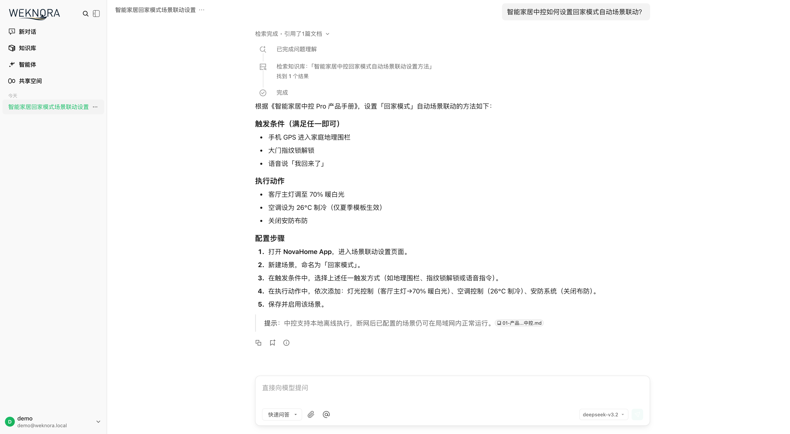
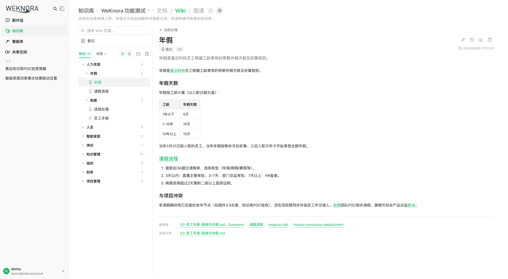
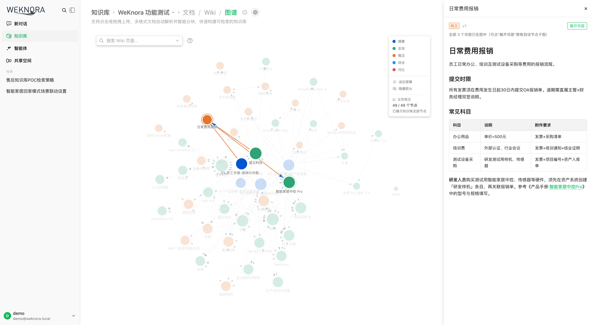
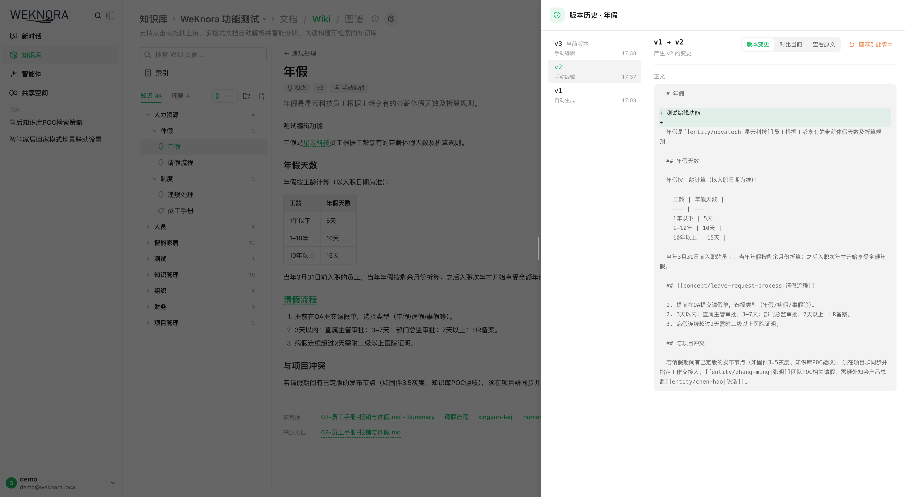
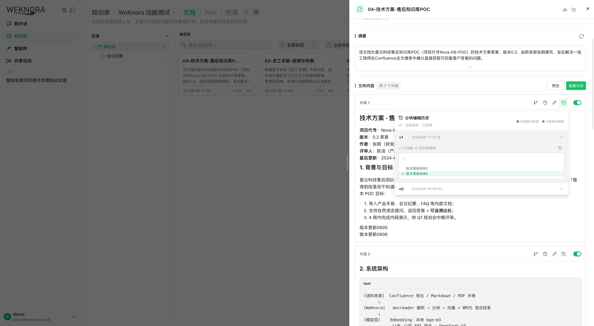
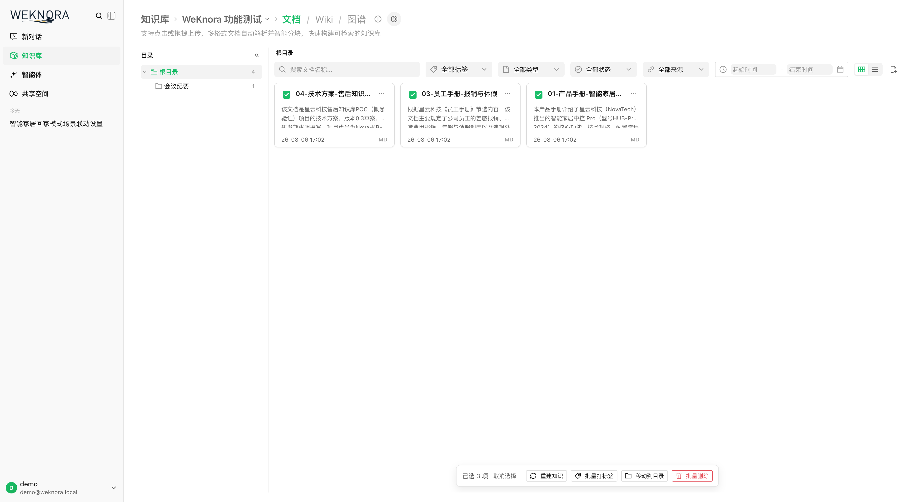
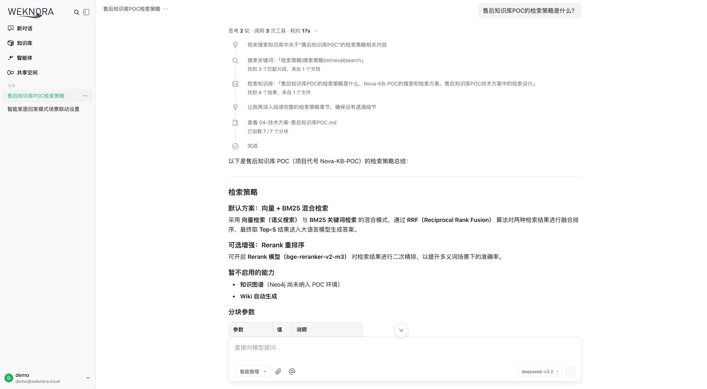
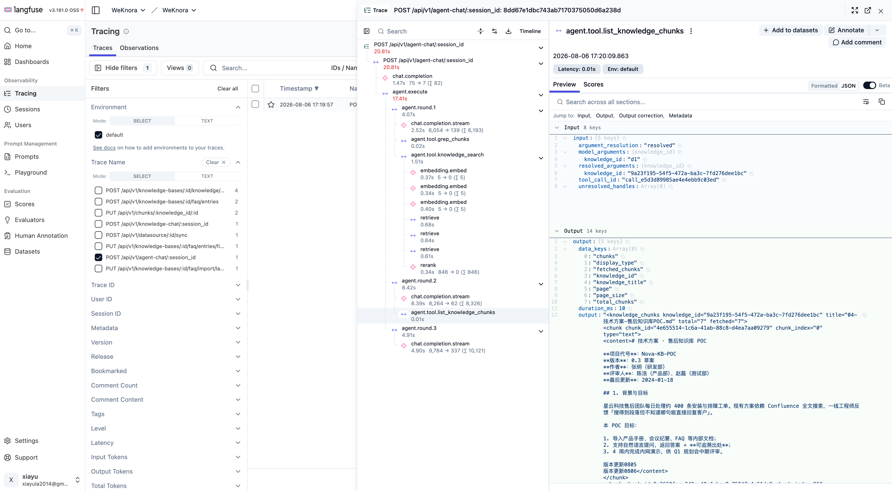
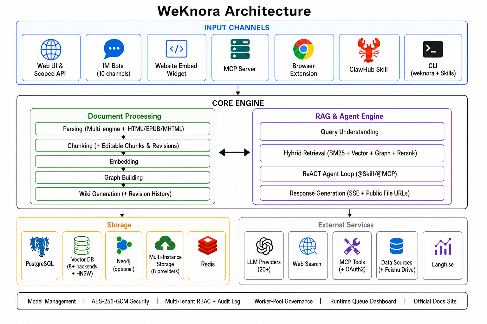

<p align="center">
  <picture>
    
  </picture>
</p>

<p align="center">
    <a href="https://github.com/magicyuan876/yuheng/blob/main/LICENSE">
        
    </a>
    <a href="./CHANGELOG.md">
        
    </a>
</p>

<p align="center">
| <b>English</b> | <a href="./README_CN.md"><b>简体中文</b></a> | <a href="./README_JA.md"><b>日本語</b></a> | <a href="./README_KO.md"><b>한국어</b></a> |
</p>

<p align="center">
  <h4 align="center">

  [Overview](#-overview) • [Architecture](#-architecture) • [Key Features](#-key-features) • [Getting Started](#-getting-started) • [API Reference](#-api-reference) • [Developer Guide](#-developer-guide)
  
  </h4>
</p>

# 💡 Yuheng — Turn Documents into Living Knowledge with RAG, Agents and Auto-Wiki

## 📌 Overview

**Yuheng** is an open-source, LLM-powered knowledge framework built for enterprise-grade document understanding, semantic retrieval, and autonomous reasoning.

It is organized around three core capabilities: **RAG-based Quick Q&A** for everyday lookups, a **ReAct Agent** that autonomously orchestrates retrieval, MCP tools and web search to handle complex multi-step tasks, and a brand-new **Wiki Mode** in which agents distill raw documents into a self-maintaining, interlinked markdown knowledge base with an interactive knowledge graph, complete with manual editing, revision history and one-click rollback. Knowledge curation is equally hands-on: a **tree-structured folder view** preserves the directory layout of uploads, and **chunk editing with revision history** lets retrieval chunks be edited, diffed and reverted like documents. Combined with multi-source ingestion (Feishu wiki / Feishu Drive / Notion / Yuque / RSS, and growing), **website embed widgets** for publishing agents to external sites, **scoped API keys with a principal model** for programmatic integrations, **multi-instance storage backends** per workspace for flexible data placement, 20+ LLM provider integrations, full Langfuse observability plus a **runtime task-queue dashboard with worker-pool governance**, **enterprise-ready multi-workspace RBAC** (4-tier role matrix + per-resource ownership + per-workspace audit log), and a fully self-hostable modular architecture, Yuheng turns scattered documents into a queryable, reasoning-capable, continuously evolving knowledge asset.

The framework supports auto-syncing knowledge from Feishu, Notion, and Yuque (more data sources coming soon), handles 10+ document formats including PDF, Word, images, and Excel, and can serve Q&A directly through IM channels like WeCom, Feishu, Slack, and Telegram. It is compatible with major LLM providers including OpenAI, DeepSeek, Qwen (Alibaba Cloud), Zhipu, Hunyuan, Gemini, MiniMax, NVIDIA, and Ollama. Its fully modular design allows swapping LLMs, vector databases, and storage backends, with support for local and private cloud deployment ensuring complete data sovereignty. Yuheng also integrates with **Langfuse** for comprehensive observability into agent reasoning, token usage, and pipeline tracing.


## 📱 Interface Showcase

<table>
  <tr>
    <td colspan="2" align="center"><b>💬 Intelligent Q&A Conversation</b><br/></td>
  </tr>
  <tr>
    <td width="50%" align="center"><b>📖 Wiki Browser</b><br/></td>
    <td width="50%" align="center"><b>🕸️ Wiki Knowledge Graph</b><br/></td>
  </tr>
  <tr>
    <td width="50%" align="center"><b>🕘 Wiki Page Revision History & Rollback</b><br/></td>
    <td width="50%" align="center"><b>✂️ Chunk Editing & Revision History</b><br/></td>
  </tr>
  <tr>
    <td width="50%" align="center"><b>📁 Folder Tree & Batch Operations</b><br/></td>
    <td width="50%" align="center"><b>🤖 Agent Mode · Tool Call Process</b><br/></td>
  </tr>
  <tr>
    <td colspan="2" align="center"><b>🔭 Observability · Langfuse Tracing</b><br/></td>
  </tr>
</table>

## 🏗️ Architecture



Fully modular pipeline from document parsing, vectorization, and retrieval to LLM inference — every component is swappable and extensible. Supports local / private cloud deployment with full data sovereignty and a zero-barrier Web UI for quick onboarding.

## 🧩 Feature Overview

**Intelligent Conversation**

| Capability | Details |
|------------|---------|
| Intelligent Reasoning | ReACT progressive multi-step reasoning, autonomously orchestrating knowledge retrieval, MCP tools, and web search |
| Quick Q&A | RAG-based Q&A over knowledge bases for fast and accurate answers |
| Wiki Mode | Agent-driven auto-generation of structured, interlinked markdown Wiki pages from raw documents; in-browser manual editing, page revision history, line-level diff and one-click rollback |
| Tool Calling | Built-in tools, MCP tools (incl. OAuth2 remote services, mid-conversation OAuth), web search; `@Skill / @MCP` mentions to scope the agent runtime per turn |
| Conversation Strategy | Online Prompt editing, retrieval threshold tuning, multi-turn context awareness, per-agent citation output toggle |
| Suggested Questions | Auto-generated question suggestions and after-answer follow-ups based on knowledge base content |
| Temporary Attachments | Session-scoped image / document uploads with async parsing for one-off Q&A, with a combined image + attachment limit |
| Citations & RAG Progress | Inline citation popovers and a references drawer (web / KB source distinction), shared markdown rendering, and stage-by-stage RAG pipeline progress in chat |
| Session Management | Filter and group sidebar sessions by source (Web / IM / Embed), with inline session-title rename |

**Knowledge Management**

| Capability | Details |
|------------|---------|
| Knowledge Base Types | FAQ / Document / Wiki with folder import, URL import, multi-tag management, and online entry |
| Folder Tree | Folder uploads keep their original directory structure, with a sidebar tree for browsing, folder rename, and re-filing documents into another folder |
| Chunk Editing & Revisions | Edit retrieval chunks directly in the UI with per-version snapshots, diff and one-click rollback, and automatic reindexing after an edit; generated questions can be added, edited, deleted and regenerated; custom document metadata supported |
| Per-Upload Process Config | Override parser, chunking, multimodal (VLM / ASR), graph extraction, and question generation per upload batch via upload-confirm dialog or `process_config` API; reparse with new settings |
| Batch Reparse | Re-queue parsing for multiple documents at once with optional per-batch `process_config` |
| Data Source Import | Auto-sync from Feishu wiki / Feishu Drive / Lark / Notion / Yuque / RSS feeds (more data sources coming soon); incremental and full sync |
| Document Formats | PDF / Word / Txt / Markdown / HTML / EPUB / MHTML / Images / CSV / Excel / PPT / JSON |
| Retrieval Strategies | BM25 sparse / Dense retrieval / GraphRAG / parent-child chunking / HNSW-accelerated pgvector (1024-dim) / multi-dimensional indexing |
| Batch Selection & Tagging | Marquee drag-select multiple documents in the KB list for batch reparse and batch tagging (common tags pre-selected) |
| E2E Testing | Full-pipeline visualization with recall hit rate, BLEU / ROUGE metric evaluation |

**Integrations & Extensions**

| Capability | Details |
|------------|---------|
| LLMs | OpenAI / Azure OpenAI / Anthropic (Claude) / DeepSeek / Qwen (Alibaba Cloud) / Zhipu / Hunyuan / Doubao (Volcengine) / Gemini / MiniMax / NVIDIA / Novita AI / SiliconFlow / OpenRouter / Requesty / Ollama |
| Embeddings | Ollama / BGE / GTE / Zhipu / OpenAI-compatible APIs |
| Vector DBs | PostgreSQL (pgvector) / Elasticsearch / OpenSearch / Milvus / Weaviate / Qdrant / Apache Doris / Tencent VectorDB |
| Object Storage | Local / MinIO / AWS S3 (IAM Role / IRSA default credential chain) / Volcengine TOS / Alibaba Cloud OSS / Kingsoft Cloud KS3 / Huawei Cloud OBS; **multiple storage instances per workspace** with per-KB binding and a default instance |
| IM Channels | WeCom / Feishu / Lark (Feishu International) / QQBot / Slack / Telegram / DingTalk / Mattermost / WeChat / Yunzhijia |
| Website Embed | Publish agents via embed widget with domain allowlists, rate limits, and secure-mode token exchange |
| Web Search | DuckDuckGo / Bing / Google / Tavily / Baidu / Ollama / SearXNG / Keenable / Zhipu AI |
| API Integration | Scoped API keys (capability-level grants + per-KB restriction + throttled last-used tracking) with an API integration playground; MCP OAuth and embed sessions isolated per principal; `resource_urls=public` returns directly loadable file/image URLs, removing the second authenticated proxy call |
| MCP Server | Official PyPI package `yuheng-mcp` with 29 tools over stdio / SSE / HTTP transports |

**Platform**

| Capability | Details |
|------------|---------|
| Deployment | Local / Docker / Kubernetes (Helm) with private and offline support |
| UI | Web UI / RESTful API / CLI (`yuheng`) / Chrome Extension / Website Embed Widget / WeChat Mini Program |
| Access Control | Workspace RBAC with 4-tier role matrix (Owner / Admin / Contributor / Viewer), per-KB resource ownership, per-workspace audit log, invite-only workspaces, tenantless provisioning & gated self-service workspace creation, admin password reset (session revocation), cross-workspace superuser, scoped API keys |
| Security | AES-256-GCM at-rest encryption for API keys and MCP / data-source credentials with graceful key rotation; gRPC TLS + Token between app and docreader; Redis TLS; SSRF-safe HTTP client (data sources, URL import, redirect chains); secret redaction in responses; sandbox isolation for agent skills |
| Observability | Integrated Langfuse (sole tracing backend) for ReAct loops, token tracking, tool calls, and pipeline tracing; built-in Langfuse-style document parsing trace timeline with stage-by-stage progress; system-admin runtime task-queue dashboard (queue depth, per-model concurrency, failed-task inspection & manual retry) |
| Task Management | MQ async tasks with per-stage worker-pool governance (core / post-process / enrichment / maintenance + elastic shared pool, plus an independent Wiki pool) and per-model background concurrency governors; automatic database migration on version upgrade |
| Model Management | Centralized config, declarative built-in models via YAML, per-knowledge-base model selection, per-model thinking-mode and embedding-dimension overrides, interactive model test debugger, multi-workspace built-in model sharing, and centrally-managed shared infrastructure |

## 📱 WeChat Mini Program

The [Yuheng Mini Program](./miniprogram/README.md) provides a lightweight mobile client for configuring Yuheng API access, selecting knowledge bases, importing URLs, and asking knowledge chat from WeChat.


## 🐋 DeepSeek Harness Plugin

[**`@magicyuan876/dsh-yuheng`**](./packages/dsh-yuheng/README.md) is the official [DeepSeek Harness](https://github.com/deepseek-ai/deepseek-harness) (`dsh`) plugin. The harness ships no retrieval, embedding or knowledge-base capability of its own, so the plugin gives a coding agent your documents: `dsh plugin --profile web add @magicyuan876/dsh-yuheng`, point it at a deployment, and four read-only tools appear in the agent's tool set.

- **`yuheng_search`** — hybrid retrieval returning source passages verbatim, each with a reusable `knowledge_id`
- **`yuheng_read_document`** — one document's passages reassembled in order, with paging
- **`yuheng_ask`** — Yuheng's own composed answer with citations, over the RAG or the ReAct pipeline
- **`yuheng_list_knowledge_bases`** — knowledge base names and ids, so the agent can scope its own search

## ⌨️ Command-Line Interface

`yuheng` is the official CLI for driving the API from a terminal or an AI
agent. It is **agent-first**: every command emits a stable JSON envelope by
default (with typed error codes mapped to exit codes), and `--format text`
renders for humans. It also serves a curated MCP tool surface
(`yuheng mcp serve`) and ships bundled Agent Skills.

```bash
yuheng profile add prod --host https://kb.example.com --use
yuheng auth login
yuheng kb list
yuheng link --kb my-knowledge-base    # bind the current directory
yuheng doc upload notes.md
yuheng chat "summarise the design doc"
```

For headless / CI use, set `YUHENG_API_KEY` + `YUHENG_HOST` and skip
`auth login` entirely — no credentials written to disk.

See [`cli/README.md`](./cli/README.md) for install + 5-minute quickstart and
[`cli/AGENTS.md`](./cli/AGENTS.md) for the operational contract AI agents rely on.

## 🚀 Getting Started

### 🛠 Prerequisites

- [Docker](https://www.docker.com/) & [Docker Compose](https://docs.docker.com/compose/)
- [Git](https://git-scm.com/)

### 📦 Installation & Launch

```bash
git clone https://github.com/magicyuan876/yuheng.git
cd yuheng
cp .env.example .env   # Edit .env as needed, see comments in the file
docker compose pull     # Pull the latest images
docker compose up -d    # Start core services
```

Once started, visit **http://localhost** to get started.

> To use a local Ollama model, run `ollama serve > /dev/null 2>&1 &` first.

### 🔄 Upgrading

If you already have Yuheng running and downloaded a newer release:

```bash
# Set YUHENG_VERSION in .env to the target release (e.g. 0.7.0), or keep latest
docker compose pull     # Pull images matching YUHENG_VERSION
docker compose up -d    # Recreate containers with new images
```

> `docker compose up -d` alone reuses locally cached images and may leave the UI version out of sync with the release you downloaded.

### 🔧 Optional Services (Docker Compose Profiles)

Add `--profile` flags to enable additional components. Multiple profiles can be combined:

| Profile | Description | Command |
|---------|-------------|---------|
| _(default)_ | Core services | `docker compose pull && docker compose up -d` |
| `full` | All features | `docker compose --profile full pull && docker compose --profile full up -d` |
| `neo4j` | Knowledge Graph (Neo4j) | `docker compose --profile neo4j pull && docker compose --profile neo4j up -d` |
| `minio` | Object Storage (MinIO) | `docker compose --profile minio pull && docker compose --profile minio up -d` |
| `langfuse` | Tracing (Langfuse) | `docker compose --profile langfuse pull && docker compose --profile langfuse up -d` |

Combine profiles: `docker compose --profile neo4j --profile minio pull && docker compose --profile neo4j --profile minio up -d`

Stop services: `docker compose down`

### 🌐 Service URLs

| Service | URL |
|---------|-----|
| Web UI | `http://localhost` |
| Backend API | `http://localhost:8080` |
| Langfuse Tracing | `http://localhost:3000` |

## MCP Server

Please refer to the [MCP Configuration Guide](./mcp-server/MCP_CONFIG.md) for the necessary setup.

## 📘 API Reference

**Official product documentation**: [`website-docs/`](./website-docs/README.md) — the complete documentation set organized as Getting Started → Architecture → Features → API → Clients → Development, covering ~360 API endpoints, ~150 environment variables, and 9 extension points. The directory is also a VitePress site: run `cd website-docs && npm install && npm run dev` to preview locally, or deploy it standalone with the `Dockerfile` inside.

Troubleshooting FAQ: [Troubleshooting FAQ](./docs/QA.md)

Detailed API documentation is available at: [API Docs](./docs/api/README.md)

Product plans and upcoming features: [Roadmap](./docs/ROADMAP.md)

## 🧭 Developer Guide

### ⚡ Fast Development Mode (Recommended)

If you need to frequently modify code, **you don't need to rebuild Docker images every time**! Use fast development mode:

```bash
# Start infrastructure
make dev-start

# Start backend (new terminal)
make dev-app

# Start frontend (new terminal)
make dev-frontend
```

**Development Advantages:**
- ✅ Frontend modifications auto hot-reload (no restart needed)
- ✅ Backend modifications quick restart (5-10 seconds, supports Air hot-reload)
- ✅ No need to rebuild Docker images
- ✅ Support IDE breakpoint debugging

**Detailed Documentation:** [Development Environment Quick Start](./docs/开发指南.md)


## 🤝 Contributing

Welcome to submit [Issues](https://github.com/magicyuan876/yuheng/issues) or Pull Requests.

**Process:** Fork → Create branch → Commit changes → Open PR

**Standards:** Format code with `gofmt`, follow [Conventional Commits](https://www.conventionalcommits.org/) (`feat:` / `fix:` / `docs:` / `test:` / `refactor:`)

### Validation

For a focused PR, validate the changed scope first:

```bash
git fetch origin main
git diff --check origin/main...HEAD
golangci-lint run --new-from-rev=origin/main ./...
go test ./path/to/changed/package -count=1
```

Run `gofmt` on changed Go files before committing. For frontend changes, run the relevant tests from `frontend/` and use `npm run type-check` when the change affects TypeScript or Vue components.

The full maintainer gate remains:

```bash
make fmt
make lint
make test
```

`make fmt` formats the entire Go repository, so run it only with a clean worktree and review the resulting diff. Some full-suite tests require local infrastructure or service configuration. If a full check fails for an unrelated baseline or environment reason, include the exact command and failure in the PR while still providing passing targeted tests for your change.

## 🔒 Security Notice

**Important:** Starting from v0.1.3, Yuheng includes login authentication functionality to enhance system security. For production deployments, we strongly recommend:

- Deploy Yuheng services in internal/private network environments rather than public internet
- Avoid exposing the service directly to public networks to prevent potential information leakage
- Configure proper firewall rules and access controls for your deployment environment
- Regularly update to the latest version for security patches and improvements

## 👥 Contributors

Thanks to these excellent contributors:

[](https://github.com/magicyuan876/yuheng/graphs/contributors)

## 🙏 Attribution

Yuheng incorporates third-party open-source software, including a substantial
amount of code from an upstream project distributed under the MIT License. The
copyright notices and license terms that must accompany every copy are kept in:

- [`LICENSE`](./LICENSE) — the license text and the original copyright notices, unchanged.
- [`NOTICE`](./NOTICE) — the copyright lines that must travel with any redistribution.
- [`THIRD_PARTY_NOTICES.md`](./THIRD_PARTY_NOTICES.md) and [`licenses/`](./licenses/) —
  per-dependency license texts and the audit behind them.

Yuheng is an independent project. It is not affiliated with, endorsed by, or
supported by the authors of the software it incorporates. Bug reports and support
requests belong in [this repository's issues](https://github.com/magicyuan876/Yuheng/issues).

## 📄 License

Yuheng is released under the [MIT License](./LICENSE). You are free to use, modify
and distribute the code, provided the copyright and permission notices travel with
it. See [`NOTICE`](./NOTICE) for the exact lines to reproduce.

## 📈 Project Statistics

<a href="https://www.star-history.com/#magicyuan876/yuheng&type=date&legend=top-left">
 <picture>
   <source media="(prefers-color-scheme: dark)" srcset="https://api.star-history.com/svg?repos=magicyuan876/yuheng&type=date&theme=dark&legend=top-left" />
   <source media="(prefers-color-scheme: light)" srcset="https://api.star-history.com/svg?repos=magicyuan876/yuheng&type=date&legend=top-left" />
   
 </picture>
</a>
