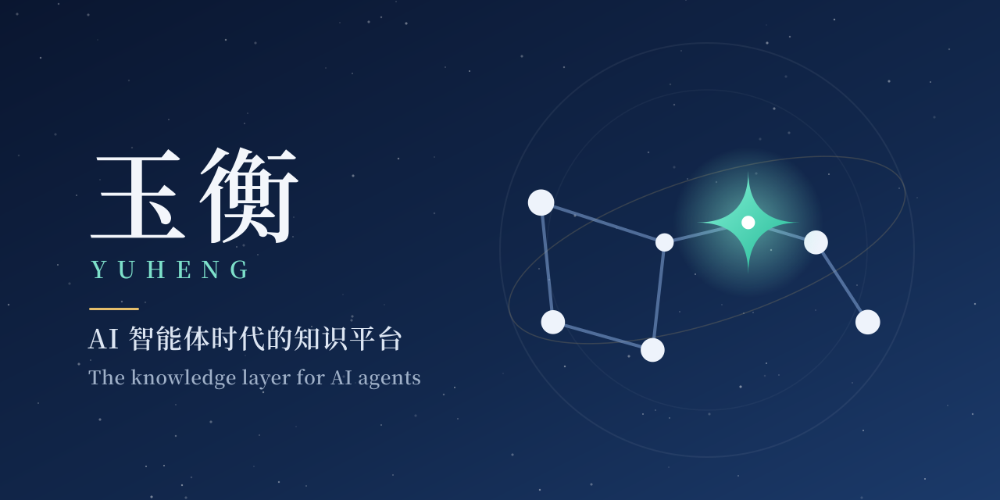

<p align="center">
  
</p>

<p align="center">
    <a href="https://github.com/magicyuan876/Yuheng/blob/main/LICENSE"></a>
    <a href="./CHANGELOG.md"></a>
    
    
    
</p>

<p align="center">
| <a href="./README.md"><b>English</b></a> | <b>简体中文</b> |
</p>

# 玉衡 Yuheng

**AI 智能体时代的知识平台。** Yuheng 把散落在文件、网盘、飞书、Notion 里的资料
接进来，整理成可检索、可信、有人维护的知识，用带出处的问答回答人的问题，并通过
REST 与 MCP 把同样的能力交给你的 AI 智能体。

Yuheng 不试图替你当「智能体」，它只做好**知识层**：Claude、Cursor、自研的
ReAct 循环——任何智能体——都可以来这里检索、问答、读 Wiki、写入知识。

> **名字的由来**：玉衡是北斗七星的第五颗星，位于斗身与斗柄的交界处；「璇玑玉衡」
> 也是古人观测天象、衡量星辰的仪器。标志里的北斗以玉衡为心——星与星相连，是知识的
> 联结；衡，是对知识的衡量与维护。

## 它做什么

```
 接入            组织              问答               维护                开放
 ────────────    ──────────────    ───────────────    ────────────────    ──────────────
 文件与网页      知识库与分块      混合检索 + 重排    重复与内容出入      REST /api/v1
 数据源同步      FAQ 与标签        带引用的流式问答    定期复核            MCP（22 个工具）
 在线协同文档    自动 Wiki         联网搜索           回答反馈            Go SDK · CLI
                 知识图谱（可选）                      负责人与待办
```

- **知识进来**：上传文档（PDF、Word、Excel、PPT、HTML、EPUB、图片、音视频），导入网页，
  或接入飞书/Lark 知识库与云盘、Notion、语雀、RSS、GitLab、腾讯 ima 并定时增量同步；
  也可以直接在 Yuheng 里用**在线协同文档**写作，页面自动进入知识库。
- **答案出去**：向量 + BM25 混合检索、Rerank、查询改写；每条回答都链接回来源分块；
  可选知识图谱与 12 家联网搜索提供商（含自托管 SearXNG）。
- **知识不会悄悄变旧**：**知识健康**在内容变化时比对同一知识库的文档，找出逐字重复和
  「几乎一样却不一样」的内容（例如旧版写年假 15 天、新版写 10 天，并标出差异）；按复核周期
  提醒无人确认的文档；把被标记为「没帮助」的回答交给被引用文档的负责人。每个问题都派给
  该处理的人，汇总进个人待办，可以一键以一份取代另一份或确认仍然有效。
- **为智能体而设计**：界面上能做的事都有 REST 接口（JWT 或细粒度能力域的 API Key）和
  MCP 工具，另有 Go SDK、`yuheng` CLI 与 DeepSeek Harness 插件。
- **企业级**：一个企业一个空间、空间内知识库任意多，四级成员角色与空间组，系统管理员
  统一管理空间与账号；审计日志、凭据 AES-256-GCM 加密、登录限流与锁定、Langfuse 追踪。

## 核心功能

**📥 接入与解析**
- gRPC 文档解析服务 `docreader`：版式分析、扫描件 OCR、表格、多模态图片描述；可选进程内
  Rust 解析器 `anydoc`
- 数据源连接器：飞书/Lark（知识库与云盘）、Notion、语雀、RSS、GitLab、腾讯 ima，凭据加密，
  定时增量同步与冲突策略
- 树形文件夹、多标签、批量操作、分块级编辑与版本历史、自定义元数据

**📝 在线协同文档**（`docs` profile）
- 空间与页面树、页面级权限与受限页面、锁定、回收站
- 多人实时协同（Yjs）或独占编辑；表格、Mermaid、draw.io、附件、块引用、模板
- 评论、@提及、关注与通知、修订历史与回滚、公开分享链接、导入导出
- 空间绑定知识库后，页面自动同步为知识；受限页面绝不进入知识库

**🔎 检索与问答**
- 只用一个检索引擎并把它做扎实：PostgreSQL + ParadeDB（BM25）+ pgvector，无需另外部署搜索集群
- 混合检索、RRF 融合、Rerank、查询改写与扩展；FAQ 条目；知识图谱（Neo4j，可选）
- 流式回答：检索流水线进度 + 可点击的引用角标；回答可评价「有帮助 / 没帮助」

**📖 自动 Wiki**
- LLM 流水线把知识库整理成互相链接的 Wiki 页面；人工编辑、版本历史、问题反馈闭环

**🩺 知识健康**
- 内容比对：逐字重复 / 内容有出入（逐字对比并高亮差异）
- 定期复核：知识库设复核周期，超期的文档交给负责人确认
- 回答反馈：「没帮助」汇总到被引用文档；提问只在反馈者同意时附上
- 负责人与派发：每篇文档有负责人，问题按性质派给最该处理的人；个人「知识待办」
- 处理：以一份取代另一份（在线文档页面排除出知识库并标记为已被取代，不会被删除）、确认仍然有效、
  带原因忽略

**🤖 面向你的 AI 智能体**
- `/api/v1` REST API，Swagger UI 位于 `/swagger/index.html`（非 release 模式）
- 细粒度能力域的 API Key（retrieve、chat、ingest、manage_kbs 等），可限定知识库
- [`yuheng-mcp`](./mcp-server/)：22 个 MCP 工具，stdio / SSE / HTTP
- [Go SDK](./client/)、[`yuheng` CLI](./cli/)、[DeepSeek Harness 插件](./packages/dsh-yuheng/)

**🏢 平台能力**
- 工作空间内 owner / admin / contributor / viewer 四级角色与空间组；用户是全局身份，
  由邀请或系统管理员加入空间，再建空间也由系统管理员负责
- 审计日志与知识库活动流、任务队列看板、Langfuse 可观测性、限流
- 文件存储：本地目录或任意 S3 兼容存储，默认自带 RustFS

## 架构

```
┌──────────────────┐  REST / SSE  ┌─────────────────────────────────────────┐
│ Web 界面 · CLI   │ ◄──────────► │  Go 后端（Gin，/api/v1）                 │
│ Go SDK           │              │  问答 · 检索 · Wiki · 在线文档 · 知识健康 │
└──────────────────┘              │  异步任务（asynq / Redis，可无 Redis）   │
┌──────────────────┐  MCP (23)    └──┬─────────────┬──────────────┬─────────┘
│ AI 智能体        │ ◄────────────── │             │ gRPC         │ WebSocket
└──────────────────┘                 │             ▼              ▼
          ┌──────────────────────────┴──┐   ┌───────────┐   ┌───────────────┐
          │ PostgreSQL（ParadeDB）      │   │ docreader │   │ collab（Yjs） │
          │ 业务数据 · pgvector · BM25   │   │ （Python）│   │ 仅 docs 模式  │
          └─────────────────────────────┘   └───────────┘   └───────────────┘
          Redis · RustFS / S3 · Neo4j（可选） · Langfuse（可选）
```

完整架构见[架构总览](./website-docs/02-architecture/01-overview.md)。

## 项目状态

Yuheng 处于 0.x 预览阶段。它源自腾讯 [WeKnora](https://github.com/Tencent/WeKnora)，现为独立演进的
分支，架构已大幅重构：检索统一到 PostgreSQL（ParadeDB），聚焦知识库、在线协同文档与知识健康；上游的
内置智能体、IM 接入与多引擎适配不再保留。

- `/api/v1` REST 接口在 0.x 各版本之间仍可能变化；MCP 工具名是稳定的，不会改名。
- 文档以中文为主（[`website-docs/`](./website-docs/)）；快速开始和安装部署另有[英文版](./website-docs/en/01-getting-started/02-installation.md)。
- 暂不发布 Docker 镜像，需要在本地构建（见下文）。

## 快速开始

需要：带 Compose v2 的 Docker、Node.js 与 npm（前端要先在宿主机上构建）、`git`；建议
4 核 CPU、8 GB 内存。首次构建要下载很多依赖，耗时较长。

```bash
git clone https://github.com/magicyuan876/Yuheng.git
cd Yuheng
cp .env.example .env
```

首次启动前先编辑 `.env`：`JWT_SECRET` 与 `SYSTEM_AES_KEY` 默认为空，必须填写；为空、
长度不够或仍是旧的公开示例值时，服务会拒绝启动：

```bash
openssl rand -hex 32     # -> JWT_SECRET
openssl rand -hex 16     # -> SYSTEM_AES_KEY（32 个十六进制字符 = AES-256 需要的 32 字节）
```

`DB_PASSWORD` 和 `REDIS_PASSWORD` 也请一并修改。妥善保管 `SYSTEM_AES_KEY`：数据库里的
API Key 等凭据都用它加密，丢失后无法恢复。

```bash
./scripts/build_frontend_dist.sh      # 构建前端静态产物，前端镜像依赖它
docker compose up -d --build
docker compose ps                     # 等服务都变成 healthy
```

默认启动前端、Go 后端（`app`）、`docreader`、PostgreSQL（ParadeDB）、Redis 和 RustFS。
可选 profile：`--profile docs` 额外启动在线协同文档服务与 draw.io（配置见 `.env.example`
的 K 节），`--profile full` 启动全部可选组件（Neo4j、Langfuse、SearXNG、MCP 服务等）。
在中国大陆构建时可以在 `.env` 里设 `APK_MIRROR_ARG=mirrors.tencent.com` 加速；`TZ` 默认为 UTC。

### 首次使用

浏览器打开 `http://localhost`（端口由 `FRONTEND_PORT` 决定，默认 80）。系统没有默认账号。

- **第一个注册的账号成为整个部署的管理员**，之后公开注册自动关闭，其他成员通过邀请加入。
  `DISABLE_REGISTRATION=false` 保持开放注册，`true` 从一开始就关闭。
- 问答前先在「设置 → 模型管理」配置至少一个对话模型和一个向量模型；宿主机上的 Ollama 与任何
  OpenAI 兼容接口都可以。
- 想让知识健康定期提醒复核，在知识库设置的「基本信息」里设复核周期。

| 服务 | 地址 |
| --- | --- |
| Web 界面 | http://localhost（`FRONTEND_PORT`） |
| API | http://localhost:8080（`APP_PORT`） |
| 就绪检查 | http://localhost:8080/ready |
| Swagger UI | http://localhost:8080/swagger/index.html（`GIN_MODE` 不是 `release` 时） |

默认情况下，除前端外所有发布到宿主机的端口都只绑定在 localhost。要在单机之外使用，请在
前端前面放一个带 TLS 的反向代理。完整步骤见[安装部署](./website-docs/01-getting-started/02-installation.md)
与[快速上手](./website-docs/01-getting-started/03-quickstart.md)。

## 客户端与集成

| 客户端 | 目录 | 说明 |
| --- | --- | --- |
| Web 界面 | [`frontend/`](./frontend/) | Vue 3.5 + TypeScript + Vite；Tailwind v4 + shadcn-vue（正从 TDesign 逐屏迁移） |
| MCP 服务 | [`mcp-server/`](./mcp-server/) | 从源码安装（`pip install ./mcp-server`），22 个工具 |
| CLI | [`cli/`](./cli/) | `yuheng`：可脚本化的 JSON 输出，多 profile |
| Go SDK | [`client/`](./client/) | CLI 即基于它 |
| DeepSeek Harness 插件 | [`packages/dsh-yuheng/`](./packages/dsh-yuheng/) | 从源码安装 |

## 文档

- [产品文档](./website-docs/README.md)：入门、架构、功能、API 参考、客户端、开发指南
- 常用入口：[产品介绍](./website-docs/01-getting-started/01-introduction.md) ·
  [在线文档](./website-docs/03-features/07-docs.md) ·
  [知识健康](./website-docs/03-features/22-knowledge-health.md) ·
  [MCP](./website-docs/03-features/08-mcp.md) ·
  [API 总览](./website-docs/04-api/01-api-overview.md) ·
  [扩展点](./website-docs/06-development/03-extension-points.md)
- [更新日志](./CHANGELOG.md) · [路线图](./docs/ROADMAP.md)

## 开发

```bash
make test             # go test ./...（需要 Docker：测试用真实的 PostgreSQL）
make lint             # golangci-lint
cd frontend && npm run lint && npm test && npm run type-check
cd docreader && uv sync && pytest tests/
cd cli && make build && make test
```

贡献流程与代码约定见 [`CONTRIBUTING.md`](./CONTRIBUTING.md)，请遵守[行为准则](./CODE_OF_CONDUCT.md)。
安全问题请按 [`SECURITY.md`](./SECURITY.md) 私下报告。

## 安全说明

- 凭据（API Key、数据源令牌等）静态存储时经 AES-256-GCM 加密；密钥缺失或是示例值时服务拒绝启动。
- 数据源与 URL 导入的外发请求一律经过 SSRF 防护与允许列表。
- 登录与注册按 IP 限流，连续失败会锁定账号；默认 CORS 不携带凭据。
- 切勿提交 `.env`。生产环境建议内网部署，详见[安装部署](./website-docs/01-getting-started/02-installation.md)。

## 致谢与出处

Yuheng 部分衍生自 [WeKnora](https://github.com/Tencent/WeKnora)，上游 MIT 代码按声明使用——见
[`NOTICE`](./NOTICE)、[`THIRD_PARTY_NOTICES.md`](./THIRD_PARTY_NOTICES.md) 与
[`licenses/upstream-weknora/`](./licenses/upstream-weknora/)。 <!-- license-check: attribution -->
标志中的文字使用 Noto Serif CJK（SIL Open Font License 1.1）转为轮廓。

## 许可证

[MIT](./LICENSE)。许可证覆盖的是代码；Yuheng、玉衡这两个名称以及项目标识，不授权用作修改后
产品的名称，详见 [`TRADEMARK.md`](./TRADEMARK.md)。
