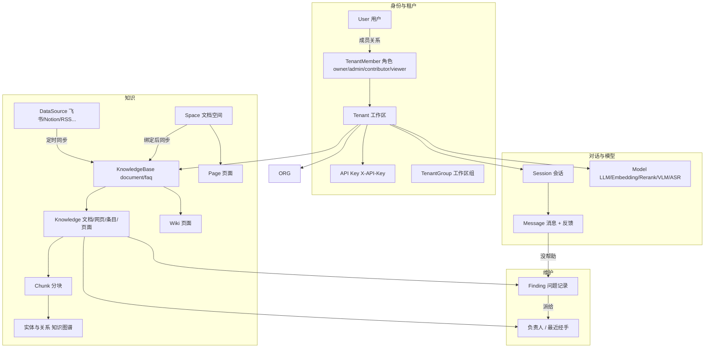
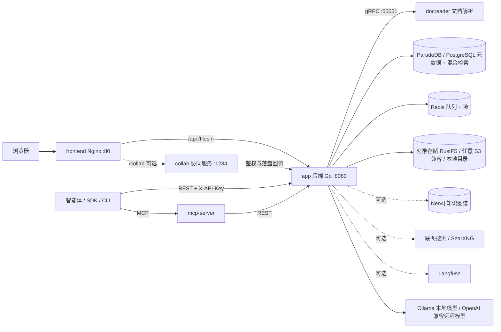

# Yuheng 产品介绍

Yuheng（玉衡）是一个开源（MIT）的企业知识平台，定位是 **AI 智能体的知识层**：把散落在文件、网页、飞书、Notion、语雀里的资料接进来，整理成可检索、有出处、有人维护的知识，用带引用的问答回答人的问题，再通过 REST API 与 MCP 把同样的能力交给任何智能体——Claude、Cursor，或者你自己写的 ReAct 循环。

Yuheng 本身**不是智能体框架**：它不运行智能体、不编排工具调用，只把知识这一层做好，让调用它的智能体拿到可靠的答案和来源。

它做的事情可以分成首尾相接的五段：

```
 接入            组织              问答               维护                开放
 ────────────    ──────────────    ───────────────    ────────────────    ──────────────
 文件与网页      知识库与分块      混合检索 + 重排    重复与内容出入      REST /api/v1
 数据源同步      FAQ 与标签        带引用的流式问答    定期复核            MCP（22 个工具）
 在线协同文档    自动 Wiki         联网搜索           回答反馈            Go SDK · CLI
                 知识图谱（可选）                      负责人与待办
```

- **接入**：上传文档（PDF、Word、Excel、PPT、Markdown、HTML、EPUB、图片、音视频），导入网页，接入飞书 / Lark 知识库与云盘、Notion、语雀、RSS、GitLab、腾讯 ima 并定时增量同步；也可以直接在 Yuheng 里写**在线文档**，页面自动进入知识库。
- **组织**：知识库、树形文件夹与标签、可配置的分块、FAQ 问答对、由 LLM 生成的 Wiki，可选的 Neo4j 知识图谱。
- **问答**：向量 + BM25 混合检索、RRF 融合、Rerank 重排、查询改写；回答流式输出，每条都链接回来源分块；可选联网搜索。
- **维护**：**知识健康**在内容变化时比对同一知识库的文档，找出重复和「几乎一样却不一样」的内容，按复核周期提醒无人确认的文档，把被标为「没帮助」的回答交给被引用文档的负责人；每个问题都派给具体的人，汇总进个人待办。
- **开放**：界面上能做的事都有 REST 接口（`/api/v1`，JWT 或细粒度能力的 API Key），另有 MCP Server（22 个工具）、Go SDK、`yuheng` 命令行与 DeepSeek Harness 插件。

当前版本 0.1.0，处于预览阶段：`/api/v1` 在 0.x 期间仍可能调整，MCP 工具名保持稳定。Yuheng 源自腾讯 WeKnora，现为独立演进的分支，架构已大幅重构，两者不互通。

代码上是一个 Go（Gin）后端、一个 Vue 3 前端、一个 Python（gRPC）文档解析服务 docreader，启用在线文档时再加一个 Node 协同服务 collab。部署用 Docker Compose 或 Helm，镜像都在本地从源码构建。

## Yuheng 解决什么问题

| 痛点 | Yuheng 的做法 |
| --- | --- |
| 资料散在各处，格式繁杂 | 独立的 docreader 解析服务：PDF 版式分析、扫描件 OCR、表格抽取、LibreOffice 转换、Playwright 网页抓取、图片多模态描述（VLM）、音视频转写（ASR）；可选进程内解析引擎 anydoc，按文件类型改用 MinerU、PaddleOCR-VL、OpenDataLoader 等外部引擎；飞书、Notion、语雀等 9 个数据源连接器定时增量同步 |
| 单一向量检索召回不稳 | 向量 + 关键词（BM25）混合检索，RRF 融合，Rerank 重排，查询改写与扩展，可选知识图谱与 Wiki |
| 知识会悄悄变旧、互相矛盾 | 知识健康：内容比对（重复 / 有出入）、定期复核、回答反馈，每条问题派给文档负责人或最近经手人，以一份取代另一份或确认仍然有效 |
| 模型绑定单一厂商 | 模型抽象层：Ollama 本地模型与 OpenAI 兼容的远程接口均可，LLM / Embedding / Rerank / VLM / ASR 分类管理 |
| 数据安全与私有化 | 全栈私有部署；数据库里的 API Key 等凭据以 AES-256-GCM 加密（`SYSTEM_AES_KEY`）；多租户隔离、RBAC 角色鉴权、审计日志、登录限流 |
| 智能体拿不到企业知识 | 检索、问答、读取文档与写入知识都有 REST 接口和 MCP 工具，API Key 可按能力与知识库限定范围 |
| 团队协作 | 一个企业一个工作区，工作区内知识库任意多；四级成员角色、工作区组、邀请机制；系统管理员统一管理工作区与账号；在线文档支持多人实时协同 |

## 核心概念

下面这些概念构成 Yuheng 的数据模型，理解它们就能看懂界面上的大部分选项。

### 租户与身份

| 概念 | 说明 |
| --- | --- |
| 租户 Tenant | 即「工作区」，一个企业通常只有一个，由部署的首个注册者创建，再建只有系统管理员可以。持有存储配额（`StorageQuota`，默认不限）、检索参数（`RetrievalConfig`）、上下文配置（`ContextConfig`）、联网搜索、解析引擎配置，以及默认存储后端。所有知识库、模型、会话都归属某个工作区 |
| 用户 User | 全局身份：唯一的用户名与邮箱，本身不属于任何工作区，通过成员关系进入工作区（注册只建账号）；`IsSystemAdmin` 标记平台级系统管理员，`CanAccessAllTenants` 标记可跨工作区访问的超管 |
| 成员 TenantMember | 用户与工作区的多对多关系，携带角色与状态（`active` / `invited` / `suspended`） |
| 角色 TenantRole | 四级：`owner`（完全控制）> `admin`（管理成员、模型与集成）> `contributor`（创建知识库）> `viewer`（只读） |
| API Key | 机器访问凭证，请求头 `X-API-Key` 携带。分 `tenant` / `platform` 两种作用域；可以是 `full_access`，也可以只授予部分能力（`retrieve`、`chat`、`ingest`、`manage_kbs`、`manage_models` 等），并可用 `knowledge_base_ids` 限定可访问的知识库 |
| 工作区组 TenantGroup | 工作区内的一组成员，作为一个授权主体使用（在线文档的空间成员与页面授权可以授给组）；`source` 为 SSO 组映射预留 |

### 知识

| 概念 | 说明 |
| --- | --- |
| 知识库 KnowledgeBase | 知识容器，类型 `document`（文档库，默认）或 `faq`（问答库）。核心配置：分块（`ChunkingConfig`：大小、重叠、父子分块、自适应策略）、向量模型（`EmbeddingModelID`）、索引策略（`IndexingStrategy`：向量 / 关键词 / Wiki / 图谱四路开关，默认开前两路）、复核周期（`ReviewIntervalDays`，默认 0 不复核） |
| 知识 Knowledge | 一份文档、网页、手写条目或在线文档页面。记录文件元数据、导入渠道 `Channel`（`web` / `api` / `feishu` / `notion` / `docs` 等）与解析状态：`pending → processing → finalizing → completed`（也可能 `failed` / `cancelled`） |
| 分块 Chunk | 检索的最小单元。类型包括 `text`、`parent_text`（父子分块）、`image_ocr`、`image_caption`、`summary`、`faq`、`table_summary` / `table_column`（表格）、`entity` / `relationship`（图谱）、`wiki_page`、`web_search` |
| FAQ 条目 | FAQ 库中的问答对：标准问、相似问、反例问与一个或多个答案 |
| Wiki 页面 | 由 LLM 从知识库文档生成的结构化页面，可按分类浏览、人工修订、回滚版本，也作为一类分块参与问答 |
| 实体与关系 | 知识图谱：从分块中抽取的实体与关系，存在 Neo4j（`NEO4J_ENABLE=true` 时），用于图谱增强检索 |
| 数据源 DataSource | 外部内容连接器，9 个类型：`feishu`、`lark`（飞书知识库，国内版与国际版）、`feishu_drive`、`lark_drive`（云盘）、`notion`、`yuque`、`rss`、`gitlab`、`ima`（腾讯 ima）。支持定时同步（增量 / 全量）与冲突策略，凭据加密存储 |
| 检索配置 RetrievalConfig | 工作区级检索参数：向量召回数 `EmbeddingTopK`（默认 50）、向量阈值（0.15）、关键词阈值（0.3）、`RerankTopK`（10）、重排阈值（0.2）、RRF 参数（k=60，向量权重 0.7 / 关键词权重 0.3） |

### 在线文档

| 概念 | 说明 |
| --- | --- |
| 文档空间 Space | 工作区内的文档容器，有自己的成员与角色、可见性和附件配额。空间可以**绑定一个知识库**，绑定后页面自动同步为该知识库里的知识 |
| 页面 Page | 空间内的树形页面。多人实时协同（需要 collab 服务）或独占编辑；修订历史、评论、回收站、导入导出。受限页面、回收站里的页面、标记为「不参与知识库检索」的页面不进入知识库 |

在线文档是可选模块，默认关闭，见[在线文档](../03-features/07-docs.md)。

### 维护与责任

| 概念 | 说明 |
| --- | --- |
| 负责人 Owner | 每篇文档（包括在线文档页面）有一个负责人，默认是添加它的人，可以转交。负责人**不是权限**，而是出了问题该找的人 |
| 最近经手 Reviewed | 最近一次有人确认「仍然有效」或修改内容的时间和人。重新解析、换向量模型、移动都不算经手；复核计时从这里算起 |
| 问题记录 Finding | 知识健康发现的问题：`duplicate`（内容重复）、`divergent`（内容有出入）、`stale`（需要复核）、`disputed`（回答被反馈有误）。每条带证据与严重程度，状态 `open` / `dismissed` / `resolved`，派给一个处理人 |
| 我的知识待办 | 派给当前用户、尚未处理的问题，跨知识库汇总；是一个查询，不是消息推送 |
| 回答反馈 | 引用了知识库的回答可以标「有帮助 / 没帮助」；「没帮助」会汇总到被引用文档上 |

详见[知识健康](../03-features/22-knowledge-health.md)。

### 对话与模型

| 概念 | 说明 |
| --- | --- |
| 会话 Session | 一次多轮对话。记录上次提问时的输入栏状态（选中的知识库、模型、是否联网等），重开会话时恢复；多轮上下文按 `sliding_window` 或 `smart`（LLM 摘要）压缩 |
| 消息 Message | `user` / `assistant` 消息，支持图片、附件、@提及知识库 / 文档 / 标签，记录 token 用量与引用来源 |
| 模型 Model | 模型注册项。类型：`KnowledgeQA`（对话 LLM）、`Embedding`、`Rerank`、`VLLM`（视觉）、`ASR`（语音）；来源：`local`（Ollama）、`remote`，以及 `openai`、`azure_openai`、`gemini`、`deepseek`、`aliyun`、`zhipu`、`volcengine`、`hunyuan`、`siliconflow`、`openrouter`、`jina` 等厂商。也可以用 `config/builtin_models.yaml` 声明内置模型，对所有工作区可见 |

### 概念关系图



## 功能清单

- **文档接入**：文件上传（PDF / Word / PPT / Excel / Markdown / HTML / EPUB / 图片 / 音视频）、URL 导入、手写条目、整目录上传；飞书 / Lark（知识库与云盘）、Notion、语雀、RSS、GitLab、腾讯 ima 定时同步。见[知识库与知识管理](../03-features/02-knowledge-base.md)、[数据源导入](../03-features/10-datasource.md)。
- **在线文档**：文档空间与页面树、页面级权限、多人实时协同或独占编辑、表格 / Mermaid / draw.io / 附件 / 块引用、评论与通知、修订历史、导入导出、可选的公开分享链接；文档空间绑定知识库后页面自动入库。见[在线文档](../03-features/07-docs.md)。
- **文档理解**：版式分析、扫描件 OCR、表格抽取、图片描述（VLM）、音视频转写（ASR），按文件类型选择解析引擎。见[文档解析服务](../03-features/03-document-parsing.md)。
- **索引**：可配置分块（父子分块、自适应策略）、向量索引、BM25 关键词索引、FAQ 索引、Wiki 生成、知识图谱抽取、问题预生成。见[分块机制](../03-features/04-chunking.md)、[FAQ 能力](../03-features/17-faq.md)、[Wiki 能力](../03-features/14-wiki.md)、[知识图谱](../03-features/09-knowledge-graph.md)。
- **检索**：向量 + BM25 混合检索、RRF 融合、Rerank、查询改写与扩展、意图识别（问候、闲聊、追问、联网搜索等）。检索引擎只有 PostgreSQL（ParadeDB `pg_search` + pgvector）一种。见[检索引擎与向量存储](../03-features/05-retrieval-engines.md)。
- **问答**：流式 SSE 回答、检索进度、可点击的引用、多轮上下文压缩、会话内临时附件、回答反馈；联网搜索支持 12 个提供商（Bing、Google、DuckDuckGo、Tavily、百度、智谱、Exa、秘塔、Firecrawl、Keenable、Ollama、自建 SearXNG）。见[会话与对话体验](../03-features/18-chat-experience.md)、[网络搜索与网页抓取](../03-features/11-web-search.md)。
- **知识健康**：内容比对（重复 / 有出入，标出差异）、定期复核、回答反馈、文档负责人、自动派发与个人待办、以一份取代另一份或确认仍然有效。见[知识健康](../03-features/22-knowledge-health.md)。
- **多租户与安全**：RBAC 角色鉴权（默认开启）、工作区组、审计日志（默认保留 90 天）、OIDC 单点登录、注册策略（默认第一个账号创建默认工作区并成为系统管理员、之后关闭公开注册；再建工作区与账号由系统管理员统一管理）、SSRF 防护、凭据加密、登录限流。见[工作区、用户与认证授权](../03-features/01-tenant-auth.md)、[平台管理与系统管理员](../03-features/20-platform-admin.md)。
- **运维与可观测性**：`/health` 存活与 `/ready` 就绪探针、启动时自动迁移、Langfuse 追踪、评估任务、Swagger（`GIN_MODE=debug` 时）。见[可观测性与审计](../03-features/16-observability.md)、[评估能力](../03-features/15-evaluation.md)、[备份与升级](./05-backup-and-upgrade.md)。
- **开放接口**：REST API（`/api/v1`）+ API Key、MCP Server（`mcp-server/`，22 个工具，stdio / SSE / HTTP）、Go SDK（`client/`）、`yuheng` 命令行（`cli/`）、DeepSeek Harness 插件（`packages/dsh-yuheng/`）。见 [MCP 集成](../03-features/08-mcp.md)、[API 总览](../04-api/01-api-overview.md)、[命令行工具](../05-clients/02-cli.md)、[Go SDK](../05-clients/03-go-sdk.md)。

## 系统组件一览

| 组件 | 技术栈 | 源码位置 | 端口（宿主机默认绑定） | 职责 |
| --- | --- | --- | --- | --- |
| frontend | Vue 3 + Nginx | `frontend/` | 80（所有网卡） | Web 界面；Nginx 把 `/api`、`/files`、`/r`、`/collab` 反代到后端与协同服务 |
| app | Go / Gin | `cmd/server`、`internal/` | 8080（127.0.0.1） | REST API、检索问答、异步任务（Asynq）、数据库迁移 |
| docreader | Python / gRPC | `docreader/` | 50051（仅容器网络） | 文档解析、OCR、网页抓取、图片与音视频处理 |
| postgres | ParadeDB（PostgreSQL 17 + `pg_search` + pgvector） | 镜像 `paradedb/paradedb` | 不发布 | 唯一的数据库，也是唯一的检索引擎 |
| redis | Redis 7 | — | 不发布 | Asynq 任务队列、流式输出恢复、缓存 |
| rustfs | RustFS | 默认启动 | 9000 / 9001（127.0.0.1） | S3 兼容对象存储，默认的文件存储（`STORAGE_TYPE=s3`） |
| 可选：collab + drawio | Node（Yjs / Hocuspocus）、draw.io | `collab/`，profile `docs` | 1234 / 8087（127.0.0.1） | 在线文档的实时协同与绘图编辑器 |
| 可选：neo4j | Neo4j | profile `neo4j` | 7474 / 7687（127.0.0.1） | 知识图谱存储 |
| 可选：searxng | SearXNG | profile `searxng` | 8888（127.0.0.1） | 自建联网搜索 |
| 可选：langfuse 栈 | Langfuse 3 + ClickHouse + MinIO | profile `langfuse` | 3000（127.0.0.1） | LLM 调用追踪 |
| 可选：mcp | Python | `mcp-server/`，profile `full` | 8082（127.0.0.1） | 以 HTTP / SSE 提供的 MCP Server |
| 可选：odl-hybrid | Docling | profile `odl-hybrid` | 5002（仅容器网络） | OpenDataLoader PDF 混合解析后端 |



## 下一步

- 部署安装：[安装部署](./02-installation.md)
- 第一次问答：[快速上手](./03-quickstart.md)
- 配置项：[配置详解](./04-configuration.md)
- 运维：[备份、升级与多副本](./05-backup-and-upgrade.md)
- 系统怎么运转：[总体架构](../02-architecture/01-overview.md)
