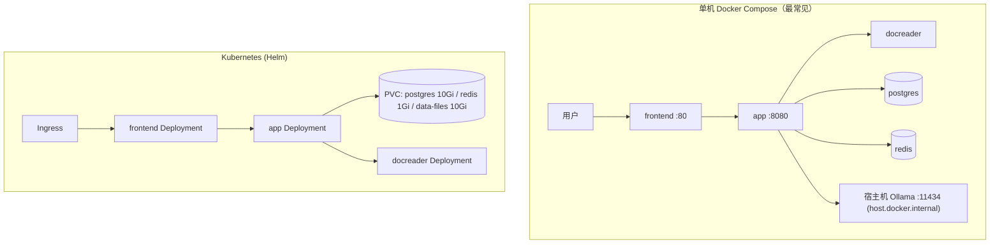

# 安装部署

Yuheng 支持从「一台笔记本」到「Kubernetes 集群」的多种部署形态。本文逐一介绍 Docker Compose（生产/开发两套编排）、镜像构建、Makefile 与脚本、Helm。

## 部署形态总览

| 形态 | 入口 | 数据库 | 队列/流 | 适用场景 |
| --- | --- | --- | --- | --- |
| Docker Compose（标准） | `docker-compose.yml` | ParadeDB（PostgreSQL） | Redis + Asynq | 团队自托管，推荐；镜像在本地构建 |
| Docker Compose（开发） | `docker-compose.dev.yml` | 同上（仅基础设施进容器） | 同上 | 本地开发：app / frontend 在宿主机运行 |
| Helm | `helm/` | ParadeDB（chart 内置） | Redis（chart 内置） | Kubernetes >= 1.25；镜像需自行构建并推送到自己的仓库 |


## 硬件与依赖要求

- **标准 Docker 部署**：Docker 20.10+ 与 Docker Compose v2（v1 `docker-compose` 也兼容，`scripts/start_all.sh` 会自动探测）；建议 4 核 CPU / 8GB 内存起步（docreader 含 LibreOffice、Playwright，较吃内存），磁盘按知识库规模预留（Postgres 卷 + `/data/files` 文件卷）。启用 Langfuse 等可选组件需相应增加内存。
- **模型服务**：本地推理需 [Ollama](https://ollama.com)（默认地址 `http://host.docker.internal:11434`，`OLLAMA_OPTIONAL=true` 时不可用仅告警不阻断）；或任意 OpenAI 兼容 API（DeepSeek、通义、智谱、硅基流动等）。
- **源码编译**：Go 1.26（见 `docker/Dockerfile.app` builder 阶段 `golang:1.26-bookworm`）、CGO（DuckDB 绑定需要 C 工具链）、Node.js + npm（前端）、Python 3.10 + uv（docreader）。
- **Kubernetes**：>= 1.25.0（`helm/Chart.yaml`）。

## 一、Docker Compose 标准部署（docker-compose.yml）

> **本版本不发布 Docker 镜像。** 下面的流程都是在本机从源码构建镜像；`docker compose pull` 拉不到 `magicyuan876/yuheng-*` 镜像，不要用。

前置条件：带 Compose v2 的 Docker、Node.js + npm（前端静态产物要先在宿主机构建）、`git`。

```bash
git clone https://github.com/magicyuan876/Yuheng.git && cd Yuheng
cp .env.example .env
```

编辑 `.env`，必须替换的项：`JWT_SECRET`、`SYSTEM_AES_KEY`（默认为空，为空、长度不够或仍是旧示例值时服务拒绝启动），并建议同时修改 `DB_PASSWORD`、`REDIS_PASSWORD`：

```bash
openssl rand -hex 32     # -> JWT_SECRET
openssl rand -hex 16     # -> SYSTEM_AES_KEY：必须正好 32 字节，32 个十六进制字符即可
```

`SYSTEM_AES_KEY` 用来加密数据库里的 API Key 等凭据，丢失后这些数据无法恢复，请妥善保管。

`.env.example` 里 `APK_MIRROR_ARG=mirrors.tencent.com` 与 `TZ=Asia/Shanghai` 是面向国内的默认值；在国外部署请清空前者、把 `TZ` 改成自己的时区。

然后构建前端、构建并启动整套服务：

```bash
./scripts/build_frontend_dist.sh  # 先产出 frontend/dist，frontend 镜像的构建依赖它
docker compose up -d --build      # 从源码构建 app / docreader / frontend 镜像并启动
docker compose ps                 # 等所有服务变成 healthy/running
```

需要在线协同文档（collab + draw.io）时加上 profile：`docker compose --profile docs up -d --build`，并按 `.env.example` 的 K 节补全 `YUHENG_COLLAB_URL`、`YUHENG_COLLAB_SHARED_SECRET` 等配置。

停止用 `docker compose down`（加 `-v` 会连数据卷一起删，慎用）。`make start-all`（`scripts/start_all.sh`）是另一种入口，会额外做 Ollama 检查与 `.env` 兜底，但它的默认行为是拉取镜像，本版本请直接用上面的命令。

启动后在浏览器打开 `http://localhost` 就是前端（端口由 `FRONTEND_PORT` 决定，默认 80）。**全新部署没有默认账号：你注册的第一个账号自动成为系统管理员，之后公开注册关闭**（`DISABLE_REGISTRATION=false` 可让注册一直开放，详见[快速上手](./03-quickstart.md)）。前端 Nginx 把 `/api/` 反代到后端，所以接口调用同样走 `http://localhost/api/v1`；后端端口（`APP_PORT`，默认 8080）只映射到宿主机的 127.0.0.1，`curl http://localhost:8080/ready` 可确认后端、数据库和迁移都已就绪。

默认情况下，除前端外，发布到宿主机的端口都只绑定在本机回环地址。要对局域网或公网提供服务，请在前端前面放一个带 TLS 的反向代理，并先换掉 `.env` 里的默认口令与 RustFS 的默认账号。

首次问答之前还需要在「设置 → 模型管理」里配置至少一个对话模型和一个向量模型，见[快速上手](./03-quickstart.md)。

> 注意：`docker-compose.yml` 的 app 服务使用 `env_file: [.env]`，`.env` 不存在会导致 compose 解析失败。`make docker-run` / `start_all.sh` 会自动 `cp .env.example .env` 或 `touch .env` 兜底。

### 版本升级

升级也是本地重新构建：更新源码后重新构建前端和镜像，再启动。**升级前先备份**——数据库迁移在启动时自动执行，其中有破坏性的迁移，无法回退。备份、恢复与升级步骤见 [备份与升级](./05-backup-and-upgrade.md)。

```bash
git pull
./scripts/build_frontend_dist.sh
docker compose up -d --build
```

### 核心服务（默认启动）

| 服务 | 镜像 | 端口（宿主:容器） | 依赖 | 说明 |
| --- | --- | --- | --- | --- |
| `frontend` | 本地构建，标记为 `magicyuan876/yuheng-ui:${YUHENG_VERSION:-latest}` | `${FRONTEND_PORT:-80}:80` | app（healthy） | Nginx 托管 SPA 并反代到 app；`APP_HOST`/`APP_BACKEND_PORT`/`APP_SCHEME` 可指向远程后端 |
| `app` | 本地构建 `magicyuan876/yuheng-app` | `${APP_PORT:-8080}:8080` | postgres（healthy）、redis、docreader（healthy） | Go 后端；挂载 `./config/config.yaml` 与 `data-files` 卷；健康检查 `GET /health` |
| `docreader` | 本地构建 `magicyuan876/yuheng-docreader` | 仅 `expose: 50051`（不发布到宿主机） | — | 文档解析 gRPC 服务；健康检查 `grpc_health_probe`；与 app 共享 `docreader-tmp` 卷传递图片 |
| `postgres` | `paradedb/paradedb:v0.22.2-pg17` | 不映射宿主端口 | — | ParadeDB = PostgreSQL 17 + BM25/向量扩展，默认检索引擎 |
| `redis` | `redis:7.0-alpine` | 不映射宿主端口 | — | `--appendonly yes --requirepass ${REDIS_PASSWORD}` |
| `rustfs` | `rustfs/rustfs`（按 digest 固定） | `127.0.0.1:9000`（S3）/ `127.0.0.1:9001`（控制台） | — | 默认文件存储（S3 兼容对象存储），详见下文「对象存储」；即使 `STORAGE_TYPE` 改用别处也会启动 |

### 可选服务与 profiles

检索引擎是 PostgreSQL 本身（ParadeDB 的 `pg_search` 做 BM25，pgvector 做向量），不需要单独的向量库服务。服务启动时会检查所连 PostgreSQL 是否装有 `vector` 与 `pg_search` 两个扩展，缺任何一个都拒绝启动并说明原因。因此要么使用 `docker-compose.yml` 里的 ParadeDB 镜像，要么在自有 PostgreSQL 上自行安装这两个扩展；云厂商托管的 PostgreSQL 通常无法安装 `pg_search`，不适用。

按需以 `docker compose --profile <name> up -d` 启用：

| profile | 服务 | 端口 | 用途 |
| --- | --- | --- | --- |
| `searxng`（含 `full`） | `searxng-init` + `searxng` | `127.0.0.1:8888`（`SEARXNG_BIND`/`SEARXNG_PORT`） | 自建 Web 搜索；默认仅绑定回环，公开前必须轮换 `SEARXNG_SECRET` |
| `docs` | `collab` + `drawio` | `${COLLAB_PORT:-1234}` / `${DRAWIO_PORT:-8087}` | 在线协同文档与 draw.io 绘图；需在 `.env` 补全 `YUHENG_COLLAB_*`（见 `.env.example` K 节） |
| `neo4j`（含 `full`） | `neo4j` | 7474 / 7687 | 知识图谱（`NEO4J_ENABLE=true`），默认 `neo4j/password` |
| `dex`（含 `full`） | `dex` | 5556 | OIDC 测试用 IdP（配置在 `misc/dex-config.yaml`） |
| `langfuse`（含 `full`） | `langfuse-db-init`、`langfuse-clickhouse`、`langfuse-minio`、`langfuse-worker`、`langfuse-web` | 3000（UI）/ 9100/9101（专用 MinIO） | 自建 Langfuse 可观测栈，复用 Yuheng 的 postgres（新建 `langfuse` 库）与 redis（DB 1） |
| `odl-hybrid` | `odl-hybrid` | expose 5002 | OpenDataLoader/Docling PDF 混合解析后端（仅本地构建，配 `DOCREADER_ODL_HYBRID` 使用） |
| `full` | `mcp` 及上述带 full 标记的服务 | mcp: `${MCP_PORT:-8082}:8000` | `mcp` 为独立 MCP Server（`mcp-server/`） |

app 容器的 `environment` 段落是全量环境变量清单（数据库、向量库、对象存储、Docreader 调优、租户策略、OIDC 等），详见 [04-configuration.md](./04-configuration.md)。

### 对象存储（S3 兼容）

文件存储只有两种：`s3`（默认，任何 S3 兼容服务，compose 自带的 RustFS 开箱即用）与 `local`（写入本地目录）。MinIO、RustFS、AWS S3，以及阿里云 OSS、腾讯云 COS、火山引擎 TOS、华为云 OBS，都通过 `s3` 及其 S3 兼容 endpoint 接入，没有各厂商的专用 provider。

通用步骤只有一套：在 `.env` 中设置

```bash
STORAGE_TYPE=s3
S3_ENDPOINT=<S3 兼容 endpoint，AWS S3 可留空>
S3_REGION=<区域，必填>
S3_BUCKET_NAME=<bucket，必填；不存在时首次使用会自动创建>
S3_ACCESS_KEY=<访问密钥>          # 与 S3_SECRET_KEY 要么都填、要么都不填；
S3_SECRET_KEY=<访问密钥 Secret>   # 都不填时使用 AWS 默认凭据链
S3_PATH_PREFIX=yuheng/            # 可选，对象前缀
S3_USE_SSL=true                   # 默认 true，仅在 endpoint 不带协议头时生效
S3_ADDRESSING_STYLE=auto          # auto | path | virtual
```

`S3_ADDRESSING_STYLE=auto` 时，endpoint 为空或属于 `amazonaws.com` 用 virtual-hosted 寻址，其他 endpoint 一律用 path-style。各服务的取值：

| 服务 | `S3_ENDPOINT` 示例 | `S3_ADDRESSING_STYLE` |
| --- | --- | --- |
| RustFS（自建，compose 自带） | `http://rustfs:9000` | `path`（`auto` 也可） |
| MinIO（自建） | `http://minio:9000` | `path`（`auto` 也可） |
| AWS S3 | 留空，或 `https://s3.us-east-1.amazonaws.com` | `auto` |
| 阿里云 OSS | `https://oss-cn-hangzhou.aliyuncs.com` | `virtual`（必须） |
| 腾讯云 COS | `https://cos.ap-guangzhou.myqcloud.com` | `virtual`（必须） |
| 火山引擎 TOS | `https://tos-s3-cn-beijing.volces.com` | `virtual`（必须） |
| 华为云 OBS | `https://obs.cn-north-4.myhuaweicloud.com` | `virtual`（必须） |
| 金山云 KS3 | 未验证，可尝试其 S3 兼容 endpoint | 未验证 |

阿里云 OSS、腾讯云 COS、火山引擎 TOS、华为云 OBS 拒绝 path-style 请求，必须显式设为 `virtual`。金山云 KS3 没有实际测试过，不作保证。

私有网络里的 endpoint（如 `rustfs:9000`、内网 MinIO）会被 SSRF 校验拦截，需要写进 `SSRF_WHITELIST` 或 `SSRF_WHITELIST_EXTRA`；compose 已默认放行 `rustfs` 服务名。

**使用自带的 RustFS（默认）**

`docker compose up -d --build` 会一并启动 RustFS，应用默认连接它：端点 `http://rustfs:9000`、区域 `us-east-1`、桶 `yuheng`（首次使用时自动创建），凭证取自 `RUSTFS_ACCESS_KEY` / `RUSTFS_SECRET_KEY`。不需要在 `.env` 里另外配置存储。改用本机目录时设 `STORAGE_TYPE=local`；改用外部服务时设置 `S3_*`。

RustFS 服务的端口默认只绑定 `127.0.0.1`（`RUSTFS_BIND`、`RUSTFS_PORT`、`RUSTFS_CONSOLE_PORT` 可调），默认账号密码 `rustfsadmin/rustfsadmin` 只适合首次试用，上线前请通过 `RUSTFS_ACCESS_KEY` / `RUSTFS_SECRET_KEY` 更换。

> RustFS 仍处于 1.0 之前的阶段（撰写时为 1.0.0-rc.5），compose 里的镜像按 digest 固定。生产环境要评估这一点：升级镜像前先备份数据，也可以改用 MinIO、AWS S3 或云厂商的 S3 兼容服务。

已有知识库里以 `s3://` 开头的文件路径仍然有效；`minio://`、`cos://`、`tos://`、`oss://`、`ks3://`、`obs://` 这些旧协议头不再被识别。

## 二、开发模式（docker-compose.dev.yml + scripts/dev.sh）

开发编排只把**基础设施**放进容器（postgres、redis、docreader 端口全部映射到宿主机），app 与 frontend 在宿主机上以热更新方式运行：

```bash
make dev-start          # ./scripts/dev.sh start，可加 DEV_ARGS=--odl-hybrid / --neo4j / --dex / --full
make dev-app            # 宿主机启动 Go 后端（自动把 DB_HOST/REDIS_ADDR 指到 localhost）
make dev-frontend       # 宿主机启动 Vue 前端 dev server
make dev-logs / dev-status / dev-stop / dev-restart
```

与生产编排的差异：

- postgres（`5432`）、redis（`6379`）、docreader（`50051`）都发布到宿主机端口，便于本地进程直连；
- `dev.sh` 会加载 `.env` 与 `.env.local`（后者覆盖前者），并支持 `DEV_REMOTE_HOST` 指向远程基础设施。

## 三、镜像构建（docker/ 目录）

| Dockerfile | 产物镜像 | 要点 |
| --- | --- | --- |
| `docker/Dockerfile.app` | `magicyuan876/yuheng-app` | 两阶段：`golang:1.26-bookworm` 编译（`make build-prod`，默认 `WITH_ANYDOC=1` 链接进程内 office 解析引擎，注入版本信息，预下载 DuckDB 扩展 `cmd/download/duckdb`）→ `debian:12.12-slim` 运行层（含 `migrate` 迁移工具、python3/node/uvx（供 stdio MCP 使用）、ffmpeg（ASR）、gosu 降权）。入口 `scripts/docker-entrypoint.sh`：修复挂载目录属主，再以 appuser 运行 `./Yuheng`。`EXPOSE 8080` |
| `docker/Dockerfile.docreader` | `magicyuan876/yuheng-docreader` | Python 3.10 + uv 依赖锁定；生成 protobuf；运行层安装 LibreOffice、OpenJDK 17、antiword、Playwright（webkit）与 `grpc_health_probe`。轻量版不含 PaddleOCR。`EXPOSE 50051`。支持 `APT_MIRROR` 构建参数 |
| `docker/Dockerfile.odl-hybrid` | `yuheng-odl-hybrid:local` | 安装 `opendataloader-pdf[hybrid]`（Docling），监听 5002，默认 `--no-ocr`；仅本地构建不发布 |
| `frontend/Dockerfile` | `magicyuan876/yuheng-ui` | 需先在宿主机执行 `./scripts/build_frontend_dist.sh` 产出 `dist/`；基底为按 digest 固定的 `nginx:1.30.3-alpine`（兼容 CentOS 7 旧内核） |

从源码构建全部镜像：

```bash
make build-images        # ./scripts/build_images.sh，参数 --app/--docreader/--frontend/--clean
# 或单独：
make docker-build-app
make docker-build-docreader
make docker-build-frontend
```

## 四、Makefile 部署相关目标速查

| 目标 | 作用 |
| --- | --- |
| `make start-all` / `stop-all` | 调 `scripts/start_all.sh` 启停整套服务（含 Ollama 检查、.env 兜底） |
| `make start-ollama` / `start-docker` | 仅启动 Ollama / 仅启动 Docker 服务 |
| `make docker-run` / `docker-stop` / `docker-restart` | 传统 `docker-compose up/down/restart`（自动兜底 `.env`） |
| `make build-images*` / `clean-images` | 源码构建 / 清理镜像（`pull-images` 会去拉取镜像，本版本没有可拉取的镜像） |
| `make check-env` / `list-containers` / `show-platform` | 环境检查（`scripts/check-env.sh` 校验 .env 必填变量与工具链）/ 容器列表 / 构建平台（自动识别 amd64/arm64） |
| `make migrate-up` / `migrate-down` / `migrate-version` / `migrate-create name=x` / `migrate-force version=n` / `migrate-goto version=n` | 数据库迁移（`scripts/migrate.sh`；容器内默认 `AUTO_MIGRATE=true` 启动时自动迁移） |
| `make dev-*` | 开发模式（见上文） |
| `make build` / `run` / `build-prod` | 本地编译运行 `cmd/server`（`build-prod` 需 CGO，注入版本号） |
| `make docs` / `install-swagger` | 生成 Swagger 文档（`http://localhost:8080/swagger/index.html`，release 模式禁用） |
| `make clean-db` | 删除 postgres/rustfs/redis 数据卷（危险操作） |

## 五、scripts/ 启动脚本

| 脚本 | 职责 |
| --- | --- |
| `scripts/start_all.sh` | 一键启动：参数 `-o`（仅 Ollama）、`-d`（仅 Docker）、`-a`（全部，默认）、`-s`（停止）、`-c`（检查环境）、`-l`（列容器）、`-p`(拉镜像)；自动探测 compose v1/v2、按 `uname -m` 设定 `PLATFORM`、后台预拉取镜像 |
| `scripts/dev.sh` | 开发环境编排（见上文），子命令 `start/stop/restart/logs/status/app/frontend` |
| `scripts/check-env.sh` | 校验 `.env` 必填变量（DB_*、STORAGE_TYPE、REDIS_ADDR、OLLAMA_BASE_URL 等）与 Go/npm/Docker/Air 工具链 |
| `scripts/build_images.sh` | 构建镜像并注入版本（git tag / commit / build time），支持跨架构 |
| `scripts/build_frontend_dist.sh` | 构建前端静态产物 `frontend/dist`（frontend 镜像的前置步骤） |
| `scripts/migrate.sh` | golang-migrate 封装 |
| `scripts/docker-entrypoint.sh` | app 容器入口（挂载目录属主修复 + gosu 降权） |

## 六、Helm 部署（helm/）

`helm/Chart.yaml`：apiVersion v2，chart 名 `yuheng`，appVersion 跟随版本（如 v0.1.0），要求 Kubernetes >= 1.25.0。

Chart 内包含五个组件：`app`（`magicyuan876/yuheng-app`）、`frontend`（`magicyuan876/yuheng-ui`）、`docreader`、`postgresql`（ParadeDB 镜像）、`redis`（`redis:7-alpine`），并可选启用 `neo4j`。

`helm/values.yaml` 关键配置：

```yaml
app:
  replicaCount: 1
  env:
    GIN_MODE: release
    RETRIEVE_DRIVER: postgres      # 社区版只支持 postgres（ParadeDB + pgvector）
    STORAGE_TYPE: local            # local / s3（任何 S3 兼容服务）
    STREAM_MANAGER_TYPE: redis
postgresql:
  enabled: true
  persistence: { enabled: true, size: 10Gi }
redis:
  enabled: true
  persistence: { enabled: true, size: 1Gi }
dataFiles:
  persistence: { enabled: true, size: 10Gi }
secrets:                            # 必填项，或用 existingSecret 引用已有 Secret
  dbPassword: ""
  redisPassword: ""
  jwtSecret: ""
  systemAesKey: ""                  # 32 字节 AES-256 主密钥
```

```bash
helm install yuheng ./helm -n yuheng --create-namespace \
  --set secrets.dbPassword=xxx --set secrets.redisPassword=xxx \
  --set secrets.jwtSecret=xxx --set secrets.systemAesKey=$(openssl rand -hex 16)
```

## 七、源码编译运行

```bash
# 后端（需本地 postgres/redis/docreader，见开发模式）
go mod download
make build && ./Yuheng                       # 或 make build-prod

# 前端
cd frontend && npm ci && npm run dev          # 开发；npm run build 产出 dist/

# docreader
cd docreader && uv sync --locked && bash scripts/generate_proto.sh && python -m docreader.server  # 具体入口见 docreader/
```

配置文件查找顺序（`internal/config/config.go` 的 `LoadConfig`）：当前目录 → `./config` → `$HOME/.appname` → `/etc/appname/`，文件名 `config.yaml`。

## 常见部署拓扑



## 下一步

部署完成后，请阅读 [03-quickstart.md](./03-quickstart.md) 完成初始化与首次问答。
