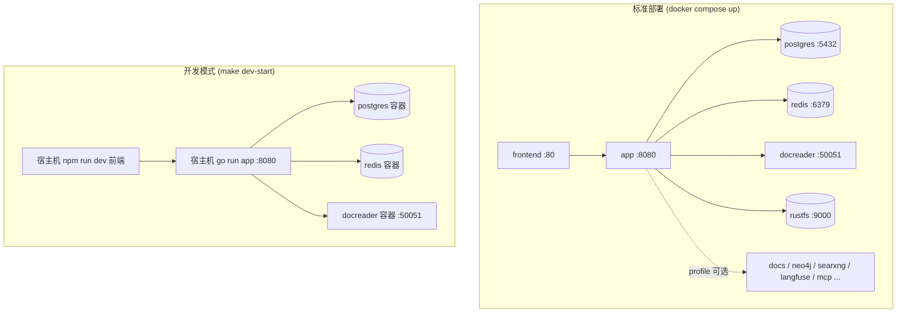
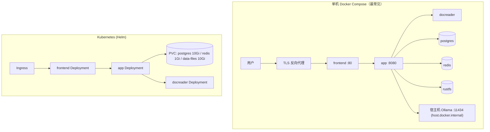

# 安装部署

Yuheng 可以跑在一台笔记本上，也可以跑在 Kubernetes 集群里。本文依次介绍 Docker Compose 标准部署（含可选组件）、一键部署脚本、开发模式、镜像构建、Makefile 与脚本、Helm 和源码运行。

**本版本不发布 Docker 镜像。** 下面所有方式都在本机从源码构建镜像；`docker compose pull` 拉不到 `magicyuan876/yuheng-*` 镜像，不要用。

## 部署形态总览

| 形态 | 入口 | 数据库 | 队列 / 流 | 适用场景 |
| --- | --- | --- | --- | --- |
| Docker Compose（标准） | `docker-compose.yml` | ParadeDB（PostgreSQL） | Redis + Asynq | 团队自托管，推荐 |
| 一键部署脚本 | `scripts/deploy.sh` | 同上 | 同上 | 一台新服务器上从源码构建并启动，自动按机器规格调参 |
| Docker Compose（开发） | `docker-compose.dev.yml` + `scripts/dev.sh` | 同上（只有基础设施进容器） | 同上 | 本地开发：app 与 frontend 在宿主机运行 |
| Helm | `helm/` | ParadeDB（chart 内置） | Redis（chart 内置） | Kubernetes >= 1.25；镜像自行构建并推到自己的仓库 |



## 硬件与依赖要求

- **Docker 部署**：Docker 20.10+ 与 Docker Compose v2；建议 4 核 CPU / 8GB 内存起步。docreader 内含 LibreOffice、ffmpeg 和无头浏览器，compose 给它设了 4GB 内存上限（`DOCREADER_MEM_LIMIT`，解析很大的 PDF 或长视频时调大）。磁盘按知识库规模预留（Postgres 卷 + 对象存储卷）。启用 Langfuse 等可选组件需要更多内存。
- **宿主机工具**：`git`、Node.js 20 或更新（前端静态产物在宿主机构建；CI 用 Node 24）。
- **模型服务**：本地 [Ollama](https://ollama.com)（容器内默认地址 `http://host.docker.internal:11434`；`OLLAMA_OPTIONAL=true` 时 Ollama 不可用只告警、不阻断启动），或任意 OpenAI 兼容 API。
- **源码编译**：Go 1.26、CGO（DuckDB 绑定需要 C 工具链）、Python 3.10 + uv（docreader）。
- **Kubernetes**：>= 1.25.0（`helm/Chart.yaml`）。

## 一、Docker Compose 标准部署

### 1. 准备 `.env`

```bash
git clone https://github.com/magicyuan876/Yuheng.git && cd Yuheng
cp .env.example .env
```

编辑 `.env`，**必须**填写 `JWT_SECRET` 和 `SYSTEM_AES_KEY`：`.env.example` 里它们是空的，为空、长度不够或仍是旧示例值时服务拒绝启动，并在日志里说明是哪一项、怎么修。

```bash
openssl rand -hex 32     # -> JWT_SECRET：至少 32 个字符
openssl rand -hex 16     # -> SYSTEM_AES_KEY：必须正好 32 字节，32 个十六进制字符即可
```

`SYSTEM_AES_KEY` 用来加密数据库里的 API Key、模型密钥、数据源凭据等，丢失后这些数据无法解密，请与数据备份分开妥善保管。同时建议修改 `DB_PASSWORD`、`REDIS_PASSWORD` 的示例值。

`.env.example` 的时区是 `TZ=UTC`，按需改成本地时区。在中国大陆构建镜像时，可设 `APK_MIRROR_ARG=mirrors.tencent.com`（app 镜像的 Debian 源）、`APT_MIRROR`（docreader 镜像的 Debian 源）、`GOPROXY_ARG`、`PIP_INDEX_URL` 加速；它们默认为空，走官方源。

`.env.example` 分组注释了全部可配置项，含义见[配置详解](./04-configuration.md)。

### 2. 构建并启动

```bash
./scripts/build_frontend_dist.sh  # 先产出 frontend/dist，frontend 镜像的构建依赖它
docker compose up -d --build      # 从源码构建 app / docreader / frontend 镜像并启动
docker compose ps                 # 等所有服务变成 healthy / running
```

首次构建要十几分钟。停止用 `docker compose down`（加 `-v` 会连数据卷一起删，慎用）。

> `docker-compose.yml` 的 app 服务用 `env_file: [.env]`，`.env` 不存在时 compose 直接解析失败。

### 3. 访问与验证

- 前端：浏览器打开 `http://localhost`（端口由 `FRONTEND_PORT` 决定，默认 80）。前端 Nginx 把 `/api/` 反代到后端，所以接口同样可以走 `http://localhost/api/v1`。
- 后端：`APP_PORT`（默认 8080）只发布在宿主机的 `127.0.0.1` 上。`curl http://localhost:8080/health` 返回 `{"status":"ok"}` 说明进程活着；`curl http://localhost:8080/ready` 返回 200 说明数据库、Redis 可达且迁移状态干净。compose 的健康检查用的就是 `/ready`。
- **全新部署没有默认账号**：你注册的第一个账号自动成为系统管理员，之后公开注册关闭（`DISABLE_REGISTRATION` 可覆盖，见[快速上手](./03-quickstart.md)）。

首次问答之前还要在「设置 → 模型管理」里配置至少一个对话模型和一个向量模型，见[快速上手](./03-quickstart.md)。

### 4. 对外提供服务

默认情况下，除前端外，所有发布到宿主机的端口都只绑定在 `127.0.0.1`：浏览器经前端 Nginx 访问后端（`/api`、`/files`、`/r`）和协同服务（`/collab`），容器之间走 compose 内部网络。每个端口都有一个 `*_BIND` 变量（`APP_BIND`、`COLLAB_BIND`、`DRAWIO_BIND`、`MCP_BIND`、`NEO4J_BIND`、`RUSTFS_BIND`、`SEARXNG_BIND` 等），只有确实需要从别的机器直连时才改成 `0.0.0.0`。

要对局域网或公网提供服务：在前端前面放一个带 TLS 的反向代理；先换掉 `.env` 里的默认口令和 RustFS 的默认账号；需要在对外链接里引用图片和文件时设 `APP_EXTERNAL_URL`（见[配置详解](./04-configuration.md)）。

### 核心服务（默认启动）

| 服务 | 镜像 | 宿主机端口 | 依赖 | 说明 |
| --- | --- | --- | --- | --- |
| `frontend` | 本地构建，标记为 `magicyuan876/yuheng-ui:${YUHENG_VERSION:-latest}` | `${FRONTEND_PORT:-80}`，所有网卡 | app（healthy） | Nginx 托管前端并反代到 app 与 collab；`APP_HOST` / `APP_BACKEND_PORT` / `APP_SCHEME` 可指向远程后端 |
| `app` | 本地构建 `magicyuan876/yuheng-app` | `127.0.0.1:${APP_PORT:-8080}` | postgres、redis、docreader、rustfs（均 healthy） | Go 后端；挂载 `./config/config.yaml` 与 `data-files` 卷；健康检查 `GET /ready` |
| `docreader` | 本地构建 `magicyuan876/yuheng-docreader` | 不发布（容器网络内 50051） | — | 文档解析 gRPC 服务，以非 root 运行；健康检查 `grpc_health_probe`；与 app 共享 `docreader-tmp` 卷传递图片 |
| `postgres` | `paradedb/paradedb:v0.22.2-pg17` | 不发布 | — | PostgreSQL 17 + `pg_search`（BM25）+ pgvector，唯一的数据库与检索引擎 |
| `redis` | `valkey/valkey:8.1.10-alpine` | 不发布 | — | Valkey（BSD 许可的 Redis 延续版，协议兼容）；`--appendonly yes`，数据在 `redis-data` 卷 |
| `rustfs` | `rustfs/rustfs`（按 digest 固定） | `127.0.0.1:9000`（S3）/ `127.0.0.1:9001`（控制台） | — | 默认的文件存储（S3 兼容对象存储），见下文「文件存储」；即使 `STORAGE_TYPE` 改成别的也会启动 |

### 可选服务与 profiles

检索引擎就是 PostgreSQL 本身，不需要单独的向量库或搜索集群。服务启动时会检查所连 PostgreSQL 是否装有 `vector` 与 `pg_search` 两个扩展，缺一个就拒绝启动并说明原因。所以要么用 `docker-compose.yml` 里的 ParadeDB 镜像，要么在自有 PostgreSQL 上自行安装这两个扩展；云厂商托管的 PostgreSQL 通常装不了 `pg_search`，不适用。

按需以 `docker compose --profile <name> up -d --build` 启用：

| profile | 服务 | 宿主机端口 | 用途 |
| --- | --- | --- | --- |
| `docs` | `collab` + `drawio` | `127.0.0.1:${COLLAB_PORT:-1234}` / `127.0.0.1:${DRAWIO_PORT:-8087}` | 在线文档的实时协同与 draw.io 编辑器，见下一节 |
| `neo4j`（含于 `full`） | `neo4j` | `127.0.0.1:7474` / `127.0.0.1:7687` | 知识图谱，另需 `NEO4J_ENABLE=true`；默认账号 `neo4j/password`，上线前改 `NEO4J_PASSWORD` |
| `searxng`（含于 `full`） | `searxng-init` + `searxng` | `127.0.0.1:8888`（`SEARXNG_BIND` / `SEARXNG_PORT`） | 自建联网搜索；对外开放前必须设置 `SEARXNG_SECRET` |
| `langfuse`（含于 `full`） | `langfuse-db-init`、`langfuse-clickhouse`、`langfuse-minio`、`langfuse-worker`、`langfuse-web` | `127.0.0.1:3000`（界面）/ `127.0.0.1:9100`、`9101`（专用 MinIO） | 自建 Langfuse，复用 Yuheng 的 postgres（新建 `langfuse` 库）与 redis（DB 1） |
| `dex`（含于 `full`） | `dex` | `127.0.0.1:5556` | 测试用 OIDC 身份提供方（`misc/dex-config.yaml`，静态密码，不要用于生产） |
| `odl-hybrid` | `odl-hybrid` | 不发布（容器网络内 5002） | OpenDataLoader / Docling PDF 混合解析后端，配合 `DOCREADER_ODL_HYBRID` 使用 |
| `full` | `mcp` 及上面标注「含于 `full`」的服务 | mcp：`127.0.0.1:${MCP_PORT:-8082}` | `mcp` 是以 HTTP / SSE 提供的 MCP Server（`mcp-server/`），需 `YUHENG_API_KEY` 与 `MCP_SERVER_AUTH_TOKEN` |

各服务的全部环境变量见 `docker-compose.yml` 各服务的 `environment` 段与 `.env.example`，说明见[配置详解](./04-configuration.md)。

### 在线文档（可选）

在线文档默认关闭，由两个相互独立的开关控制：

1. **打开模块**：`.env` 里设 `YUHENG_DOCS_ENABLED=true`，再 `docker compose up -d app` 让它生效。不需要新容器，前端出现「文档」入口。此时同一页面同时只能一个人编辑（独占编辑：进入编辑取得 5 分钟租约并自动续期，其他人只读）。
2. **实时协同**（可选）：再设

   ```bash
   YUHENG_COLLAB_SHARED_SECRET=<openssl rand -base64 32 的输出>   # 至少 16 个字符，app 与 collab 共用
   YUHENG_COLLAB_URL=ws://localhost/collab                        # 浏览器实际访问的地址；HTTPS 站点用 wss://<域名>/collab
   ```

   并带上 profile 启动：`docker compose --profile docs up -d --build`。前端 Nginx 已把 `/collab` 代理到 collab 容器，不需要另开端口。collab 不连数据库、不落盘，鉴权与保存都回调 app。

draw.io 图表需要设 `YUHENG_DOCS_DRAWIO_URL`，填**浏览器**能打开的地址：本机部署填 `http://localhost:8087/`；给远程用户用时设 `DRAWIO_BIND=0.0.0.0` 或放到反向代理后面，并填用户实际访问的地址。不设时已有图表只能查看。

其余在线文档配置（附件上限、回收站保留期、公开分享、嵌入白名单等）见 `.env.example` 的 K 节与[在线文档](../03-features/07-docs.md)。

### 文件存储（S3 兼容）

文件存储只有两种：`s3`（compose 默认，任何 S3 兼容服务；自带的 RustFS 开箱即用）与 `local`（写入容器内目录 `/data/files`，即 `data-files` 卷）。RustFS、MinIO、AWS S3，以及阿里云 OSS、腾讯云 COS、火山引擎 TOS、华为云 OBS，都通过 `s3` 及各自的 S3 兼容 endpoint 接入，没有厂商专用的 provider。

**使用自带的 RustFS（默认）**：`docker compose up -d --build` 会一并启动 RustFS，应用默认连接它：endpoint `http://rustfs:9000`、区域 `us-east-1`、桶 `yuheng`（首次使用时自动创建），凭证取自 `RUSTFS_ACCESS_KEY` / `RUSTFS_SECRET_KEY`（默认都是 `rustfsadmin`）。不需要在 `.env` 里另外配置存储。

默认账号只适合首次试用，上线前通过 `RUSTFS_ACCESS_KEY` / `RUSTFS_SECRET_KEY` 更换；`RUSTFS_BIND` 不是 `127.0.0.1` 时必须更换。

> RustFS 仍处于 1.0 之前的阶段，compose 里的镜像按 digest 固定。生产环境要考虑这一点：升级镜像前先备份数据，也可以改用 MinIO、AWS S3 或云厂商的 S3 兼容服务。

**改用外部 S3 兼容服务**：在 `.env` 中设置

```bash
STORAGE_TYPE=s3
S3_ENDPOINT=<S3 兼容 endpoint，AWS S3 可留空>
S3_REGION=<区域，必填>
S3_BUCKET_NAME=<bucket，必填；不存在时首次使用会自动创建>
S3_ACCESS_KEY=<访问密钥>          # 与 S3_SECRET_KEY 要么都填、要么都不填；
S3_SECRET_KEY=<访问密钥 Secret>   # 都不填时使用 AWS 默认凭证链
S3_PATH_PREFIX=yuheng/            # 可选，对象前缀
S3_USE_SSL=true                   # 仅在 endpoint 不带协议头时生效
S3_ADDRESSING_STYLE=auto          # auto | path | virtual
```

`S3_ADDRESSING_STYLE=auto` 时，endpoint 为空或属于 `amazonaws.com` 用 virtual-hosted 寻址，其他 endpoint 一律用 path-style。常见服务的取值：

| 服务 | `S3_ENDPOINT` 示例 | `S3_ADDRESSING_STYLE` |
| --- | --- | --- |
| RustFS（compose 自带） | `http://rustfs:9000` | `path`（`auto` 也可） |
| MinIO（自建） | `http://minio:9000` | `path`（`auto` 也可） |
| AWS S3 | 留空，或 `https://s3.us-east-1.amazonaws.com` | `auto` |
| 阿里云 OSS | `https://oss-cn-hangzhou.aliyuncs.com` | `virtual`（必须） |
| 腾讯云 COS | `https://cos.ap-guangzhou.myqcloud.com` | `virtual`（必须） |
| 火山引擎 TOS | `https://tos-s3-cn-beijing.volces.com` | `virtual`（必须） |
| 华为云 OBS | `https://obs.cn-north-4.myhuaweicloud.com` | `virtual`（必须） |

OSS、COS、TOS、OBS 拒绝 path-style 请求，必须显式设为 `virtual`。

私有网络里的 endpoint（如 `rustfs:9000`、内网 MinIO）会被 SSRF 校验拦截，需要写进 `SSRF_WHITELIST`，或写进 `SSRF_WHITELIST_EXTRA`（compose 默认值 `searxng,rustfs`，自定义时要把这两项一起写上）。

改用本机目录时设 `STORAGE_TYPE=local`。多副本部署不能用 `local`，见[备份、升级与多副本](./05-backup-and-upgrade.md)。

这些变量配置的是部署存储（存储后端里那条 `env` 记录），每次启动同步；改了存储位置而旧位置上还有文件时服务会拒绝启动，见[存储后端](../03-features/19-storage-backends.md)。

### 版本升级

升级也是本地重新构建。**升级前先备份**：数据库迁移在启动时自动执行，其中有破坏性的迁移，无法回退。完整步骤见[备份、升级与多副本](./05-backup-and-upgrade.md)。

```bash
git pull
./scripts/build_frontend_dist.sh
docker compose up -d --build        # 启用了哪些 profile，这里就带上哪些，例如 --profile docs
```

## 二、一键部署脚本（scripts/deploy.sh）

在一台新服务器上，`scripts/deploy.sh` 把上面的步骤串起来：

```bash
cp .env.example .env              # 先生成 .env 并填好 JWT_SECRET、SYSTEM_AES_KEY
./scripts/deploy.sh us            # 海外服务器：全部走官方源（等同 ./scripts/deploy_us.sh）
./scripts/deploy.sh cn            # 中国大陆服务器：apt / Go / pip / npm 走国内镜像（等同 ./scripts/deploy_cn.sh）
```

它依次做这些事：检查 docker 与 compose；`.env` 不存在时从 `.env.example` 生成，并把端口改为前端 `8088`、API `9527`（已有 `.env` 时原样保留）；按本机 CPU / 内存补齐 docreader 并发、Embedding 协程池和 PostgreSQL 容量参数（只填缺失或注释掉的项，默认按 60% CPU / 50% 内存预算，可用 `TUNE_CPU_PERCENT`、`TUNE_MEM_PERCENT` 调整）；交互式询问 `APP_EXTERNAL_URL`；构建前端（宿主机没有 Node.js 20+ 时改用 `node:20` 容器）；`docker compose build`；`DOCKER_NETWORK_MTU` 变化时重建网络；最后 `docker compose up -d`。

脚本**不会**生成 `JWT_SECRET` 和 `SYSTEM_AES_KEY`，所以要先按上一节填好，否则 app 会拒绝启动。脚本可以重复执行：每次重新构建镜像并原地更新容器，数据卷不受影响。它只启动核心服务，不带任何 profile。

## 三、开发模式（docker-compose.dev.yml + scripts/dev.sh）

开发编排只把基础设施放进容器，app 与 frontend 在宿主机上以热更新方式运行：

```bash
make dev-start          # ./scripts/dev.sh start；可加 DEV_ARGS="--neo4j --docs" 等
make dev-app            # 宿主机启动 Go 后端（自动把 DB_HOST / REDIS_ADDR 指到 localhost）
make dev-frontend       # 宿主机启动前端 dev server（Vite，把 /api 代理到 localhost:8080）
make dev-logs / dev-status / dev-stop / dev-restart
```

`dev-start` 默认启动 postgres、redis、docreader、rustfs 和 Langfuse 栈；`DEV_ARGS` 可加 `--neo4j`、`--dex`、`--docs`、`--odl-hybrid`、`--full`，`--no-langfuse` 去掉 Langfuse。

与标准编排的差异：

- postgres（`5432`）、redis（`6379`）、docreader（`50051`）都发布到宿主机端口，便于本地进程直连；
- `dev.sh` 加载 `.env` 与 `.env.local`（后者覆盖前者）；设了 `DEV_REMOTE_HOST` 时不启动本地容器，改连远程基础设施。

开发工作流、测试与代码规范见[开发指南](../06-development/01-dev-guide.md)。

## 四、镜像构建（docker/ 目录）

| Dockerfile | 产物镜像 | 要点 |
| --- | --- | --- |
| `docker/Dockerfile.app` | `magicyuan876/yuheng-app` | 两阶段：`golang:1.26-bookworm` 编译（`make build-prod`；默认 `WITH_ANYDOC=1` 链接进程内解析引擎 anydoc，需要 Rust 工具链，设 `WITH_ANYDOC=0` 跳过；注入版本信息；预下载 DuckDB 扩展）→ `debian:12.12-slim` 运行层（只装运行时真正用到的：`migrate` 迁移工具（与服务同一版本的 golang-migrate）、gosu、curl（健康检查）、tzdata、psql）。入口 `scripts/docker-entrypoint.sh` 修复挂载目录属主后以 `appuser` 运行 `./Yuheng`。数据库迁移已嵌入二进制，启动时自动执行 |
| `docker/Dockerfile.docreader` | `magicyuan876/yuheng-docreader` | Python 3.10 + uv 锁定依赖；运行层安装 LibreOffice、OpenJDK 17、antiword、Playwright（WebKit）与 `grpc_health_probe`，不含 PaddleOCR；以非 root 运行。支持 `APT_MIRROR`、`PIP_INDEX_URL` 构建参数 |
| `collab/Dockerfile` | `magicyuan876/yuheng-collab` | 在线文档协同服务（Node 24），构建上下文是仓库根目录（要打包 `packages/docs-schema`） |
| `docker/Dockerfile.odl-hybrid` | `yuheng-odl-hybrid:local` | 安装 `opendataloader-pdf[hybrid]`（Docling），监听 5002，默认 `--no-ocr` |
| `frontend/Dockerfile` | `magicyuan876/yuheng-ui` | 需先在宿主机执行 `./scripts/build_frontend_dist.sh` 产出 `dist/`；基底为按 digest 固定的 `nginx:1.30.3-alpine` |

`docker compose up -d --build` 会构建当前启用的服务所需的全部镜像。也可以单独构建：

```bash
make build-images           # ./scripts/build_images.sh：app、docreader、frontend
make build-images-collab    # 协同服务镜像（不在上一条里）
make docker-build-app / docker-build-docreader / docker-build-frontend
```

## 五、Makefile 部署相关目标

| 目标 | 作用 |
| --- | --- |
| `make build-images*` / `clean-images` | 从源码构建 / 清理镜像 |
| `make dev-*` | 开发模式（见上文） |
| `make start-all` / `stop-all` | 调 `scripts/start_all.sh` 启停（含 Ollama 检查）。启动时总是在本机构建 Yuheng 自身的镜像（`docker compose up --build`） |
| `make docker-run` / `docker-stop` / `docker-restart` | 以前台方式运行 `docker-compose up` / `down` / `restart`（需要 v1 的 `docker-compose` 命令；`.env` 不存在时自动从 `.env.example` 复制） |
| `make check-env` / `list-containers` / `show-platform` | 环境检查 / 容器列表 / 构建平台（自动识别 amd64 / arm64） |
| `make migrate-up` / `migrate-down` / `migrate-version` / `migrate-create name=x` / `migrate-force version=n` / `migrate-goto version=n` | 手工管理数据库迁移（`scripts/migrate.sh`）；平时不需要，app 启动时自动迁移（`AUTO_MIGRATE=true`） |
| `make build` / `run` / `build-prod` | 本地编译运行 `cmd/server`（`build-prod` 需要 CGO，注入版本号） |
| `make docs` / `install-swagger` | 生成 Swagger 文档（`GIN_MODE=debug` 时在 `http://localhost:8080/swagger/index.html` 查看） |
| `make clean-db` | 删除 postgres、rustfs、redis 数据卷（危险操作；先 `docker compose down`。项目名向 `docker compose` 查询，目录不叫 `yuheng` 或设了 `COMPOSE_PROJECT_NAME` 也能找对卷） |

`make pull-images` 只拉取第三方镜像（postgres、redis 等）；Yuheng 自身的镜像不发布，带 `build` 的服务会被跳过。

## 六、scripts/ 部署脚本

| 脚本 | 职责 |
| --- | --- |
| `scripts/deploy.sh`（`deploy_us.sh` / `deploy_cn.sh`） | 一键源码部署，见第二节 |
| `scripts/build_frontend_dist.sh` | 构建前端静态产物 `frontend/dist`（frontend 镜像的前置步骤） |
| `scripts/build_images.sh` | 构建镜像并注入版本（git tag / commit / 构建时间），参数 `--app` / `--docreader` / `--frontend` / `--collab` / `--clean` |
| `scripts/start_all.sh` | 启停脚本：`-o`（仅 Ollama）、`-d`（仅 Docker）、`-a`（全部，默认）、`-s`（停止）、`-c`（检查环境）、`-l`（列容器）、`-r <容器>`（重建并重启单个容器）、`-p`（只拉第三方镜像后退出）；启动总是在本机构建 |
| `scripts/dev.sh` | 开发环境编排，子命令 `start` / `stop` / `restart` / `logs` / `status` / `app` / `frontend` |
| `scripts/check-env.sh` | 校验 `.env` 必填变量与 Go / npm / Docker 工具链 |
| `scripts/migrate.sh` | golang-migrate 封装（`version`、`force` 等，排障用） |
| `scripts/probe-mtu.sh` | 探测到某台主机的链路 MTU，结果填进 `DOCKER_NETWORK_MTU` |
| `scripts/docker-entrypoint.sh` | app 容器入口（挂载目录属主修复 + gosu 降权） |

## 七、Helm 部署（helm/）

`helm/Chart.yaml`：chart 名 `yuheng`，`appVersion` 为 `v0.1.0`，要求 Kubernetes >= 1.25.0。

Chart 包含 `app`、`frontend`、`docreader`、`postgresql`（ParadeDB 镜像）、`redis`，可选启用 `neo4j`、在线文档（`docs.enabled`）与协同服务（`collab.enabled`）。本版本不发布镜像，请自行构建、推到自己的仓库，再用 `global.imageRegistry` 告诉 chart 去哪里拉（`<仓库>/yuheng-app` 等，标签默认 `appVersion`；单个组件可用 `image.repository` / `image.tag` 覆盖）。不设时 `helm install` / `helm template` 直接报错，而不是装出一堆拉不到镜像的 Pod。构建与推送步骤见 `helm/README.md` 的「Images」。

`helm/values.yaml` 关键配置：

```yaml
global:
  imageRegistry: ""                 # 必填：Yuheng 自身镜像所在的仓库路径
app:
  replicaCount: 1
  env:
    GIN_MODE: release
    RETRIEVE_DRIVER: postgres      # 只支持 postgres（ParadeDB + pgvector）
    STORAGE_TYPE: local            # local / s3（任何 S3 兼容服务）
    STREAM_MANAGER_TYPE: redis
postgresql:
  enabled: true
  persistence: { enabled: true, size: 10Gi }
redis:
  enabled: true
  persistence: { enabled: true, size: 1Gi }
dataFiles:
  persistence: { enabled: true, size: 10Gi }
docs:
  enabled: false
collab:
  enabled: false                    # 需要 docs.enabled
secrets:                            # 或用 existingSecret 引用已有 Secret
  dbPassword: ""                    # 必填
  redisPassword: ""                 # 必填
  jwtSecret: ""                     # 必填，至少 32 个字符
  systemAesKey: ""                  # 32 字节；留空时首次安装随机生成并在升级时复用
  collabSharedSecret: ""            # collab.enabled 时必填，至少 16 个字符
```

```bash
helm install yuheng ./helm -n yuheng --create-namespace \
  --set global.imageRegistry=registry.example.com/yuheng \
  --set secrets.dbPassword=xxx --set secrets.redisPassword=xxx \
  --set secrets.jwtSecret=$(openssl rand -hex 32) --set secrets.systemAesKey=$(openssl rand -hex 16)
```

`systemAesKey` 建议显式设置：留空时生成的随机值保存在 chart 创建的 Secret 里，一旦这个 Secret 被删除重建，旧数据就再也解不开。app 的 `startupProbe` 与 `livenessProbe` 指向 `/health`，`readinessProbe` 指向 `/ready`。

chart 的 ParadeDB 镜像（`postgresql.image.tag`）与 `docker-compose.yml` 一致，都是 `v0.22.2-pg17`。从旧 chart（`v0.18.9-pg17`）升级时要在数据库里执行一次 `ALTER EXTENSION pg_search UPDATE;`，见 `helm/README.md` 的「Upgrading」。

## 八、源码编译运行

```bash
# 后端（需要 postgres / redis / docreader，最省事的办法是 make dev-start 起容器）
go mod download
make build && ./Yuheng                       # 或 make build-prod

# 前端
cd frontend && npm ci && npm run dev          # 开发；npm run build 产出 dist/

# docreader（通常直接用开发模式的容器；在宿主机跑需要自备 LibreOffice 等依赖）
cd docreader && uv sync --locked && cd ..
docreader/.venv/bin/python -m docreader.main  # 在仓库根目录执行
```

配置文件查找顺序（`internal/config/config.go` 的 `LoadConfig`）：当前目录 → `./config` → `$HOME/.appname` → `/etc/appname/`，文件名 `config.yaml`。

## 常见部署拓扑



## 下一步

部署完成后，按[快速上手](./03-quickstart.md)注册第一个账号、配置模型并完成第一次问答。
