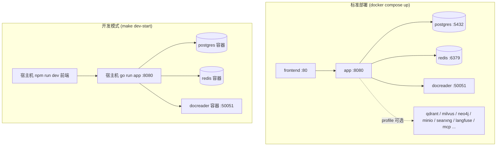
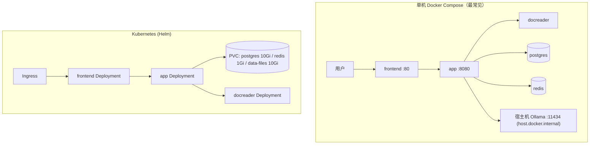

# 安装部署

Yuheng 支持从「一台笔记本」到「Kubernetes 集群」的多种部署形态。本文逐一介绍 Docker Compose（生产/开发两套编排）、镜像构建、Makefile 与脚本、Helm。

## 部署形态总览

| 形态 | 入口 | 数据库 | 队列/流 | 适用场景 |
| --- | --- | --- | --- | --- |
| Docker Compose（标准） | `docker-compose.yml` | ParadeDB（PostgreSQL） | Redis + Asynq | 生产 / 团队自托管，推荐 |
| Docker Compose（开发） | `docker-compose.dev.yml` | 同上（仅基础设施进容器） | 同上 | 本地开发：app / frontend 在宿主机运行 |
| Helm | `helm/` | ParadeDB（chart 内置） | Redis（chart 内置） | Kubernetes >= 1.25 |



## 硬件与依赖要求

- **标准 Docker 部署**：Docker 20.10+ 与 Docker Compose v2（v1 `docker-compose` 也兼容，`scripts/start_all.sh` 会自动探测）；建议 4 核 CPU / 8GB 内存起步（docreader 含 LibreOffice、Playwright，较吃内存），磁盘按知识库规模预留（Postgres 卷 + `/data/files` 文件卷）。启用 Milvus / OpenSearch / Langfuse 等可选组件需相应增加内存。
- **模型服务**：本地推理需 [Ollama](https://ollama.com)（默认地址 `http://host.docker.internal:11434`，`OLLAMA_OPTIONAL=true` 时不可用仅告警不阻断）；或任意 OpenAI 兼容 API（DeepSeek、通义、智谱、硅基流动等）。
- **源码编译**：Go 1.26（见 `docker/Dockerfile.app` builder 阶段 `golang:1.26-bookworm`）、CGO（DuckDB 绑定需要 C 工具链）、Node.js + npm（前端）、Python 3.10 + uv（docreader）。
- **Kubernetes**：>= 1.25.0（`helm/Chart.yaml`）。

## 一、Docker Compose 标准部署（docker-compose.yml）

最快路径：

```bash
git clone https://github.com/magicyuan876/yuheng.git && cd Yuheng
cp .env.example .env              # 编辑必填项：DB_USER/DB_PASSWORD/DB_NAME、REDIS_PASSWORD、JWT_SECRET、SYSTEM_AES_KEY
make start-all                # 等价 ./scripts/start_all.sh（默认拉取最新镜像）
# 或直接：
docker compose pull           # 拉取与 YUHENG_VERSION 匹配的镜像
docker compose up -d
docker compose ps                 # 等所有服务变成 healthy/running
```

停止用 `docker compose down`（加 `-v` 会连数据卷一起删，慎用）。仓库里的 `make start-all` 是同一条命令的封装（`scripts/start_all.sh`，额外做 Ollama 检查与 `.env` 兜底），两者选一即可。

启动后在浏览器打开 `http://localhost` 就是前端（端口由 `FRONTEND_PORT` 决定，默认 80），首次访问会落到注册页。前端 Nginx 把 `/api/` 反代到后端，所以接口调用同样走 `http://localhost/api/v1`；后端 `8080` 端口也直接映射到宿主机，`curl http://localhost:8080/health` 可用于确认后端就绪。

> 注意：`docker-compose.yml` 的 app 服务使用 `env_file: [.env]`，`.env` 不存在会导致 compose 解析失败。`make docker-run` / `start_all.sh` 会自动 `cp .env.example .env` 或 `touch .env` 兜底。

### 版本升级

若已有部署并下载了更新的 release：

```bash
# 在 .env 中将 YUHENG_VERSION 设为目标版本（如 0.1.0），或保持 latest
docker compose pull
docker compose up -d
```

> 仅执行 `docker compose up -d` 会复用本地缓存镜像，可能导致 Web UI 显示版本与下载的 release 不一致。

### 核心服务（默认启动）

| 服务 | 镜像 | 端口（宿主:容器） | 依赖 | 说明 |
| --- | --- | --- | --- | --- |
| `frontend` | `magicyuan876/yuheng-ui:${YUHENG_VERSION:-latest}` | `${FRONTEND_PORT:-80}:80` | app（healthy） | Nginx 托管 SPA 并反代到 app；`APP_HOST`/`APP_BACKEND_PORT`/`APP_SCHEME` 可指向远程后端 |
| `app` | `magicyuan876/yuheng-app` | `${APP_PORT:-8080}:8080` | postgres（healthy）、redis、docreader（healthy） | Go 后端；挂载 `./config/config.yaml` 与 `data-files` 卷；健康检查 `GET /health` |
| `docreader` | `magicyuan876/yuheng-docreader` | 仅 `expose: 50051`（不发布到宿主机） | — | 文档解析 gRPC 服务；健康检查 `grpc_health_probe`；与 app 共享 `docreader-tmp` 卷传递图片 |
| `postgres` | `paradedb/paradedb:v0.22.2-pg17` | 不映射宿主端口 | — | ParadeDB = PostgreSQL 17 + BM25/向量扩展，默认检索引擎 |
| `redis` | `redis:7.0-alpine` | 不映射宿主端口 | — | `--appendonly yes --requirepass ${REDIS_PASSWORD}` |

### 可选服务与 profiles

按需以 `docker compose --profile <name> up -d` 启用：

| profile | 服务 | 端口 | 用途 |
| --- | --- | --- | --- |
| `searxng`（含 `full`） | `searxng-init` + `searxng` | `127.0.0.1:8888`（`SEARXNG_BIND`/`SEARXNG_PORT`） | 自建 Web 搜索；默认仅绑定回环，公开前必须轮换 `SEARXNG_SECRET` |
| `minio`（含 `full`） | `minio` | 9000（S3）/ 9001（控制台） | S3 兼容对象存储（`STORAGE_TYPE=minio`），默认账号 `minioadmin/minioadmin` |
| `neo4j`（含 `full`） | `neo4j` | 7474 / 7687 | 知识图谱（`NEO4J_ENABLE=true`），默认 `neo4j/password` |
| `qdrant`（含 `full`） | `qdrant` | 6333（REST）/ 6334（gRPC） | 向量库（`RETRIEVE_DRIVER=qdrant`） |
| `milvus` | `milvus` | 19530 / 9091 | 向量库（standalone，内嵌 etcd） |
| `weaviate` | `weaviate` | 9035（HTTP）/ 50052（gRPC） | 向量库 |
| `doris` | `doris-fe` + `doris-be` | 8030（FE HTTP）/ 9030（FE MySQL）/ 8040（BE） | Apache Doris 4.1 检索引擎（需 >= 3.0，HNSW ANN） |
| `dex`（含 `full`） | `dex` | 5556 | OIDC 测试用 IdP（配置在 `misc/dex-config.yaml`） |
| `langfuse`（含 `full`） | `langfuse-db-init`、`langfuse-clickhouse`、`langfuse-minio`、`langfuse-worker`、`langfuse-web` | 3000（UI）/ 9100/9101（专用 MinIO） | 自建 Langfuse 可观测栈，复用 Yuheng 的 postgres（新建 `langfuse` 库）与 redis（DB 1） |
| `odl-hybrid` | `odl-hybrid` | expose 5002 | OpenDataLoader/Docling PDF 混合解析后端（仅本地构建，配 `DOCREADER_ODL_HYBRID` 使用） |
| `full` | `mcp` 及上述带 full 标记的服务 | mcp: `${MCP_PORT:-8082}:8000` | `mcp` 为独立 MCP Server（`mcp-server/`） |

app 容器的 `environment` 段落是全量环境变量清单（数据库、向量库、对象存储、Docreader 调优、租户策略、OIDC 等），详见 [04-configuration.md](./04-configuration.md)。

## 二、开发模式（docker-compose.dev.yml + scripts/dev.sh）

开发编排只把**基础设施**放进容器（postgres、redis、docreader 端口全部映射到宿主机），app 与 frontend 在宿主机上以热更新方式运行：

```bash
make dev-start          # ./scripts/dev.sh start，可加 DEV_ARGS=--odl-hybrid / --minio / --qdrant / --neo4j / --dex / --full
make dev-app            # 宿主机启动 Go 后端（自动把 DB_HOST/REDIS_ADDR 指到 localhost）
make dev-frontend       # 宿主机启动 Vue 前端 dev server
make dev-logs / dev-status / dev-stop / dev-restart
```

与生产编排的差异：

- postgres（`5432`）、redis（`6379`）、docreader（`50051`）都发布到宿主机端口，便于本地进程直连；
- 额外提供 `opensearch`（9200）与 `opensearch-dashboards`（5601，profile `opensearch-ui`）单节点开发环境（security 插件关闭）；
- `dev.sh` 会加载 `.env` 与 `.env.local`（后者覆盖前者），并支持 `DEV_REMOTE_HOST` 指向远程基础设施。

## 三、镜像构建（docker/ 目录）

| Dockerfile | 产物镜像 | 要点 |
| --- | --- | --- |
| `docker/Dockerfile.app` | `magicyuan876/yuheng-app` | 两阶段：`golang:1.26-bookworm` 编译（`make build-prod`，默认 `WITH_ANYDOC=1` 链接进程内 office 解析引擎，注入版本信息，预下载 DuckDB 扩展 `cmd/download/duckdb`）→ `debian:12.12-slim` 运行层（含 `migrate` 迁移工具、python3/node/uvx（供 stdio MCP 使用）、ffmpeg（ASR）、gosu 降权）。入口 `scripts/docker-entrypoint.sh`：修复挂载目录属主，再以 appuser 运行 `./Yuheng`。`EXPOSE 8080` |
| `docker/Dockerfile.docreader` | `magicyuan876/yuheng-docreader` | Python 3.10 + uv 依赖锁定；生成 protobuf；运行层安装 LibreOffice、OpenJDK 17、antiword、Playwright（webkit）与 `grpc_health_probe`。轻量版不含 PaddleOCR。`EXPOSE 50051`。支持 `APT_MIRROR` 构建参数 |
| `docker/Dockerfile.odl-hybrid` | `yuheng-odl-hybrid:local` | 安装 `opendataloader-pdf[hybrid]`（Docling），监听 5002，默认 `--no-ocr`；仅本地构建不发布 |
| `frontend/Dockerfile` | `magicyuan876/yuheng-ui` | 需先在宿主机执行 `./scripts/build_frontend_dist.sh` 产出 `dist/`；基底为按 digest 固定的 `nginx:1.30.3-alpine`（兼容 CentOS 7 旧内核） |

从源码构建全部镜像：

```bash
make build-images        # ./scripts/build_images.sh，参数 --app/--docreader/--frontend/--clean
# 或单独：
make docker-build-app
make docker-build-docreader
make docker-build-frontend
```

## 四、Makefile 部署相关目标速查

| 目标 | 作用 |
| --- | --- |
| `make start-all` / `stop-all` | 调 `scripts/start_all.sh` 启停整套服务（含 Ollama 检查、.env 兜底） |
| `make start-ollama` / `start-docker` | 仅启动 Ollama / 仅启动 Docker 服务 |
| `make docker-run` / `docker-stop` / `docker-restart` | 传统 `docker-compose up/down/restart`（自动兜底 `.env`） |
| `make build-images*` / `clean-images` / `pull-images` | 源码构建 / 清理 / 拉取镜像 |
| `make check-env` / `list-containers` / `show-platform` | 环境检查（`scripts/check-env.sh` 校验 .env 必填变量与工具链）/ 容器列表 / 构建平台（自动识别 amd64/arm64） |
| `make migrate-up` / `migrate-down` / `migrate-version` / `migrate-create name=x` / `migrate-force version=n` / `migrate-goto version=n` | 数据库迁移（`scripts/migrate.sh`；容器内默认 `AUTO_MIGRATE=true` 启动时自动迁移） |
| `make dev-*` | 开发模式（见上文） |
| `make build` / `run` / `build-prod` | 本地编译运行 `cmd/server`（`build-prod` 需 CGO，注入版本号） |
| `make docs` / `install-swagger` | 生成 Swagger 文档（`http://localhost:8080/swagger/index.html`，release 模式禁用） |
| `make clean-db` | 删除 postgres/minio/redis 数据卷（危险操作） |

## 五、scripts/ 启动脚本

| 脚本 | 职责 |
| --- | --- |
| `scripts/start_all.sh` | 一键启动：参数 `-o`（仅 Ollama）、`-d`（仅 Docker）、`-a`（全部，默认）、`-s`（停止）、`-c`（检查环境）、`-l`（列容器）、`-p`(拉镜像)；自动探测 compose v1/v2、按 `uname -m` 设定 `PLATFORM`、后台预拉取镜像 |
| `scripts/dev.sh` | 开发环境编排（见上文），子命令 `start/stop/restart/logs/status/app/frontend` |
| `scripts/check-env.sh` | 校验 `.env` 必填变量（DB_*、STORAGE_TYPE、REDIS_ADDR、OLLAMA_BASE_URL 等）与 Go/npm/Docker/Air 工具链 |
| `scripts/build_images.sh` | 构建镜像并注入版本（git tag / commit / build time），支持跨架构 |
| `scripts/build_frontend_dist.sh` | 构建前端静态产物 `frontend/dist`（frontend 镜像的前置步骤） |
| `scripts/migrate.sh` | golang-migrate 封装 |
| `scripts/docker-entrypoint.sh` | app 容器入口（挂载目录属主修复 + gosu 降权） |

## 六、Helm 部署（helm/）

`helm/Chart.yaml`：apiVersion v2，chart 名 `yuheng`，appVersion 跟随版本（如 v0.1.0），要求 Kubernetes >= 1.25.0。

Chart 内包含五个组件：`app`（`magicyuan876/yuheng-app`）、`frontend`（`magicyuan876/yuheng-ui`）、`docreader`、`postgresql`（ParadeDB 镜像）、`redis`（`redis:7-alpine`），并可选启用 `minio` 与 `neo4j`。

`helm/values.yaml` 关键配置：

```yaml
app:
  replicaCount: 1
  env:
    GIN_MODE: release
    RETRIEVE_DRIVER: postgres      # postgres / elasticsearch_v7 / elasticsearch_v8 / qdrant ...
    STORAGE_TYPE: local            # local / minio / cos / tos / s3
    STREAM_MANAGER_TYPE: redis
postgresql:
  enabled: true
  persistence: { enabled: true, size: 10Gi }
redis:
  enabled: true
  persistence: { enabled: true, size: 1Gi }
dataFiles:
  persistence: { enabled: true, size: 10Gi }
secrets:                            # 必填项，或用 existingSecret 引用已有 Secret
  dbPassword: ""
  redisPassword: ""
  jwtSecret: ""
  systemAesKey: ""                  # 32 字节 AES-256 主密钥
```

```bash
helm install yuheng ./helm -n yuheng --create-namespace \
  --set secrets.dbPassword=xxx --set secrets.redisPassword=xxx \
  --set secrets.jwtSecret=xxx --set secrets.systemAesKey=$(openssl rand -hex 16)
```

## 七、源码编译运行

```bash
# 后端（需本地 postgres/redis/docreader，见开发模式）
go mod download
make build && ./Yuheng                       # 或 make build-prod

# 前端
cd frontend && npm ci && npm run dev          # 开发；npm run build 产出 dist/

# docreader
cd docreader && uv sync --locked && bash scripts/generate_proto.sh && python -m docreader.server  # 具体入口见 docreader/
```

配置文件查找顺序（`internal/config/config.go` 的 `LoadConfig`）：当前目录 → `./config` → `$HOME/.appname` → `/etc/appname/`，文件名 `config.yaml`。

## 常见部署拓扑



## 下一步

部署完成后，请阅读 [03-quickstart.md](./03-quickstart.md) 完成初始化与首次问答。
