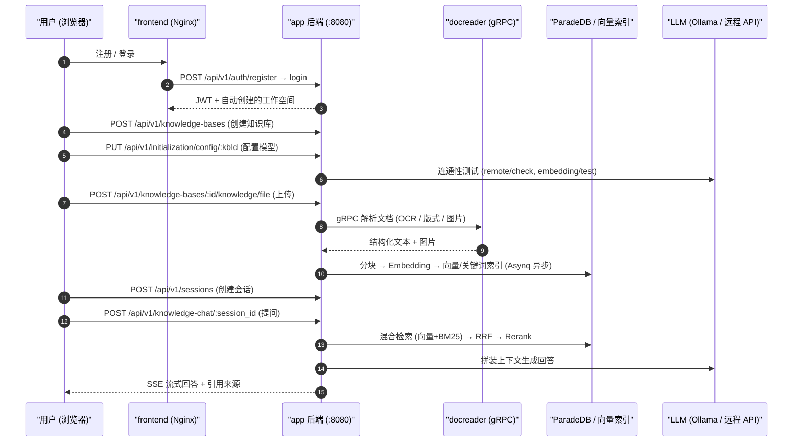

# 快速上手

跟着本文走一遍，你会得到一个能回答自己文档内容的知识库：注册账号 → 建库并选模型 → 上传文档 → 提问并看到带出处的回答。全程在网页界面完成，顺利的话十几分钟，其中大部分时间花在等文档解析上。

想用接口做集成的，跳到本文第 7 节，那里有一段可直接复制运行的 curl 链路。

## 1. 开始之前

- 服务已经跑起来：按[安装部署](./02-installation.md)启动后，前端在 `http://localhost`，后端在 `http://localhost:8080`（只绑定本机回环；用 `scripts/deploy.sh` 新生成的 `.env` 端口是前端 `8088`、后端 `9527`）；
- 手上有一套可用的模型：本地 Ollama（容器内默认地址 `http://host.docker.internal:11434`），或者任意 OpenAI 兼容服务的 `base_url` + `api_key`。至少需要一个对话模型和一个向量（embedding）模型；
- 确认后端就绪：`curl http://localhost:8080/ready` 返回 200（`/health` 只说明进程活着，`/ready` 还检查数据库、Redis 与迁移状态）。

## 2. 注册并登录

首次访问会落到登录页，注册是同一页上的一个页签，只在注册开放时才显示（前端读 `/auth/config` 决定）。系统没有内置默认账号：

- **全新部署里，你注册的第一个账号会成为整个部署的系统管理员**，同时得到一个属于自己的工作空间（你是这个空间的 Owner）。之后公开注册自动关闭，其他人通过邀请加入；
- 想让注册一直开放，设 `DISABLE_REGISTRATION=false`；想从一开始就关闭（账号由别的办法创建），设 `DISABLE_REGISTRATION=true`；不设置就是默认的 `auto`：只在还没有任何用户时开放。系统管理员也可以登录后在「设置 → 系统设置」里改注册模式（键 `auth.registration_mode`，立即生效，不用重启；数据库里的值优先于环境变量）。

几点值得先知道：

- 用户名 2–50 个字符；密码在注册页要求 8–32 位且含字母和数字（直接调 `POST /auth/register` 接口时后端只校验 ≥6 位，建议仍按 8 位以上来）；
- 邀请成员：登录后在「设置 → 成员管理」发邀请（站内邀请，或生成邀请链接）；被邀请的人走邀请注册，不受上面的注册开关影响；
- 如果部署把默认空间策略设成了 `tenantless`（`auth.default_tenant_mode`），注册后**不会**自动建空间，而是被引导到 `/onboarding/workspace`，需要先自建或接受邀请加入一个空间才能继续。

::: tip 空间 Owner ≠ 系统管理员
这两个是不同维度的身份，很容易混：

- **空间 Owner**：某一个工作空间内的最高权限，管这个空间的成员、模型、知识库。
- **系统管理员（System Admin）**：平台级身份，管的是整个部署——全局系统设置、任务队列、平台 API Key、跨空间审计日志、重置用户密码。它不属于任何空间。

第一个注册的账号两个身份兼有。之后新增系统管理员在「设置 → 系统设置」里操作。如果部署里已经有用户却没有系统管理员（比如从旧版本升级而来），可以给 app 服务设 `YUHENG_BOOTSTRAP_SYSTEM_ADMIN_EMAIL=<已注册账号的邮箱>` 并重启，启动时会把该用户提升为系统管理员；已经存在系统管理员时这个变量不再生效。详见[租户、用户与认证授权](../03-features/01-tenant-auth.md)。
:::

## 3. 配置模型并创建知识库

问答能用之前，必须先有模型：**至少一个对话模型（LLM）和一个向量模型（Embedding）**。模型在工作空间层面配置，知识库再从中选用。

1. 打开「设置 → 模型管理」，点「添加模型」。选模型类型（对话 / Embedding / ReRank / 视觉 / 语音）与来源（远程 API 或本地 Ollama），填模型名称、Base URL 和 API Key，用「测试连接」确认连得通再保存；
2. 回到「知识库」页点「新建知识库」，填名称，选类型：「文档」（`document`，普通文档库）或「问答」（`faq`，问答对库）；
3. 在「模型配置」里为这个库选模型：
   - **对话模型（LLM）**：摘要与生成回答用；
   - **向量模型（Embedding）**：把文档转成向量用，**建库后不要再换**，换了需要重建索引；
   - 其余（重排 Rerank、图片理解 VLM、语音转写 ASR、知识图谱抽取、问题预生成）都可以先不开，之后随时能加。

::: tip 用本地 Ollama 时最容易踩的坑
后端跑在容器里，填 `http://localhost:11434` 连不上宿主机的 Ollama，要填 `http://host.docker.internal:11434`。
:::

## 4. 上传文档

进入知识库，把文件拖进上传区，或者粘贴一个网页 URL。上传确认对话框里可以顺手指定标签和这一批文件的解析选项。

支持的格式包括 PDF、Word、Excel、PPT、Markdown、HTML、EPUB、图片、音频和视频等，完整清单见[文档解析服务](../03-features/03-document-parsing.md)。

上传后文档会异步解析，状态依次是 `pending → processing → finalizing → completed`。PDF 扫描件、大文件会慢一些，列表页会实时刷新进度。

你上传的文档，负责人默认就是你：之后知识健康发现这篇文档与别的文档重复、需要复核，或者引用它的回答被标为「没帮助」，都会找到你。负责人可以在文档详情里转交。

## 5. 提问

进入对话页，选择刚才的知识库，直接提问。系统检索相关片段，交给大模型作答，回答流式输出并带出处，点引用可以跳回原文。回答下方可以标「有帮助 / 没帮助」；「没帮助」会汇总到被引用的文档上，交给它的负责人核对。

到这一步，最小闭环就跑通了。

## 6. 再往前一步

- **让知识保持准确**：知识健康会自动找出重复和内容有出入的文档；在知识库设置的「基本信息」里设一个复核周期，超期无人确认的文档会提醒负责人。派给你的问题出现在页面右上角的待办里，见[知识健康](../03-features/22-knowledge-health.md)；
- **直接在 Yuheng 里写**：打开在线文档后，把文档空间绑定到知识库，页面写完就进入知识库，见[在线文档](../03-features/07-docs.md)；
- **把知识库变成 Wiki**：让 LLM 基于知识库生成互相链接的 Wiki 页面，人工可修订、可追溯版本，见 [Wiki 能力](../03-features/14-wiki.md)；
- **让答案更准**：开启 Rerank 重排、调整分块大小，见[分块机制](../03-features/04-chunking.md)与[检索引擎](../03-features/05-retrieval-engines.md)；
- **让知识自动进来**：接飞书 / Lark、Notion、语雀、RSS、GitLab、腾讯 ima 定时同步，见[数据源导入](../03-features/10-datasource.md)；
- **让智能体也能用**：通过 MCP 把知识库检索、问答与写入接入 Claude Desktop、Cursor 等客户端，或用 `yuheng` 命令行、Go SDK 集成，见 [MCP 集成](../03-features/08-mcp.md)、[命令行工具](../05-clients/02-cli.md)。

## 7. 用 API 走通同样的链路

上面每一步都有对应接口，统一前缀 `/api/v1`。下面这段可以直接跑：

```bash
BASE=http://localhost:8080/api/v1

# 1) 注册（全新部署里第一个注册的账号成为系统管理员，之后注册默认关闭；username>=2 字符，password>=6 字符）
curl -s -X POST $BASE/auth/register -H "Content-Type: application/json" \
  -d '{"username":"admin","email":"admin@example.com","password":"pass123456"}'

# 2) 登录，取 JWT 与当前工作空间 ID
LOGIN=$(curl -s -X POST $BASE/auth/login -H "Content-Type: application/json" \
  -d '{"email":"admin@example.com","password":"pass123456"}')
TOKEN=$(echo "$LOGIN" | jq -r '.token')
TENANT_ID=$(echo "$LOGIN" | jq -r '.active_tenant.id')
AUTH="Authorization: Bearer $TOKEN"

# 3) 创建知识库
KB_ID=$(curl -s -X POST $BASE/knowledge-bases -H "$AUTH" -H "Content-Type: application/json" \
  -d '{"name":"我的知识库","description":"demo","type":"document"}' | jq -r '.data.id')

# 4) 注册模型（以本地 Ollama 为例；远程模型改 source，并在 parameters 里给 base_url / api_key）
LLM_ID=$(curl -s -X POST $BASE/models -H "$AUTH" -H "Content-Type: application/json" \
  -d '{"name":"qwen3:8b","type":"KnowledgeQA","source":"local","parameters":{}}' | jq -r '.data.id')
EMB_ID=$(curl -s -X POST $BASE/models -H "$AUTH" -H "Content-Type: application/json" \
  -d '{"name":"bge-m3","type":"Embedding","source":"local","parameters":{"embedding_parameters":{"dimension":1024}}}' | jq -r '.data.id')

# 5) 给知识库配置模型与分块
curl -s -X PUT $BASE/initialization/config/$KB_ID -H "$AUTH" -H "Content-Type: application/json" -d '{
  "llmModelId":"'$LLM_ID'","embeddingModelId":"'$EMB_ID'",
  "documentSplitting":{"chunkSize":512,"chunkOverlap":50,"separators":["\n\n","\n","。"]}}'

# 6) 上传文档（multipart，字段名 file）
curl -s -X POST $BASE/knowledge-bases/$KB_ID/knowledge/file -H "$AUTH" \
  -F "file=@./demo.pdf"
# 轮询解析状态：GET /knowledge-bases/$KB_ID/knowledge 直到 parse_status=completed

# 7) 创建会话
SESSION_ID=$(curl -s -X POST $BASE/sessions -H "$AUTH" -H "Content-Type: application/json" \
  -d '{"title":"第一次对话"}' | jq -r '.data.id')

# 8) 知识问答（SSE 流式输出）
curl -N -X POST $BASE/knowledge-chat/$SESSION_ID -H "$AUTH" -H "Content-Type: application/json" \
  -d '{"query":"这份文档讲了什么？","knowledge_base_ids":["'$KB_ID'"]}'

# 9) 仅检索不生成（结构化 JSON 结果）
curl -s -X POST $BASE/knowledge-search -H "$AUTH" -H "Content-Type: application/json" \
  -d '{"query":"关键字","knowledge_base_ids":["'$KB_ID'"]}'
```

问答请求体还支持 `knowledge_ids`（限定到具体文档）、`web_search_enabled`、`summary_model_id`、`images` / `attachment_uploads`（多模态附件）等字段，完整说明见 [API 参考：会话与聊天](../04-api/02-api-chat.md)。`/api/v1` 在 0.x 版本之间仍可能调整。

### 三种认证方式

| 方式 | 请求头 | 适用 |
| --- | --- | --- |
| JWT | `Authorization: Bearer <token>` | 浏览器 / 交互式调用，登录接口签发 |
| API Key | `X-API-Key: <key>` | 服务端集成与智能体；由空间 Owner 在「设置 → 空间 → API Key」创建（或调 `POST /api/v1/tenants/:id/api-keys`），支持细粒度能力（`retrieve`/`chat`/`ingest`/`manage_kbs` 等）、知识库白名单与过期时间 |
| 指定空间 | `X-Tenant-ID: <id>` | 多空间用户切换当前工作空间 |

服务端集成建议用 API Key 而不是 JWT：

```bash
# 以 Owner 身份创建 API Key（TENANT_ID 取自上面的登录响应）
curl -s -X POST $BASE/tenants/$TENANT_ID/api-keys -H "$AUTH" -H "Content-Type: application/json" \
  -d '{"name":"ci-bot","full_access":true}'
# 之后所有请求改用：
curl -s $BASE/knowledge-bases -H "X-API-Key: <创建时返回的 key>"
```

### 初始化向导对应的接口

界面上的每一步向导都有独立端点，自建管理后台时可以直接复用：

| 步骤 | 端点 | 说明 |
| --- | --- | --- |
| 读取当前配置 | `GET /api/v1/initialization/config/:kbId` | 返回 llm / embedding / rerank / multimodal / documentSplitting / nodeExtract / questionGeneration 各段及 `hasFiles`（已有文件时限制修改 embedding） |
| 检测 Ollama | `GET /api/v1/initialization/ollama/status`、`GET /api/v1/initialization/ollama/models` | 检查 Ollama 可用性与已装模型 |
| 下载 Ollama 模型 | `POST /api/v1/initialization/ollama/models/download` → `GET /api/v1/initialization/ollama/download/progress/:taskId` | 异步下载并轮询进度 |
| 测试远程模型 | `POST /api/v1/initialization/remote/check`、`/initialization/embedding/test`、`/initialization/rerank/check`、`/initialization/asr/check`、`/initialization/multimodal/test` | 保存前连通性验证 |
| 知识图谱试抽取 | `POST /api/v1/initialization/extract/text-relation`（配 `fabri-text` / `fabri-tag` 生成示例） | 预览实体/关系抽取效果 |
| 保存配置 | `POST /api/v1/models`（注册模型）→ `PUT /api/v1/initialization/config/:kbId` | 先建 Model 记录，再把模型 ID 与分块等配置写入 KnowledgeBase |

模型的 `source` 取 `local`（Ollama）或远程厂商标识（`openai`、`deepseek`、`aliyun`、`zhipu`、`siliconflow` 等）。

### 整条链路发生了什么



## 8. 卡住了看这里

| 现象 | 检查点 |
| --- | --- |
| app 容器反复重启，前端一直等待 | `docker compose logs app`。最常见的是 `JWT_SECRET` / `SYSTEM_AES_KEY` 为空、太短或仍是示例值，日志会写明哪一项和生成命令；其次是数据库迁移失败，见[备份与升级](./05-backup-and-upgrade.md) |
| 上传后一直 `processing` | `docker logs Yuheng-docreader`；大文件受上传上限（`MAX_FILE_SIZE_MB`，默认 50，系统管理员可在系统设置里调）与 `YUHENG_DOCUMENT_PROCESS_TIMEOUT`（默认 2h）约束 |
| 初始化时 Ollama 检测失败 | 容器内默认地址 `http://host.docker.internal:11434`（`OLLAMA_BASE_URL`）；Linux 需确认 `extra_hosts: host.docker.internal:host-gateway` 生效 |
| 问答无引用 / 召回为空 | 确认知识解析 `completed`；调低 `vector_threshold`；检查 embedding 模型与建库时一致 |
| 注册页签消失 | 默认的 `auto` 模式只在还没有任何用户时开放注册，有了第一个账号后就会隐藏。查 `GET /api/v1/auth/config` 的 `registration_open`；值可能来自「设置 → 系统设置」里的数据库设置，不只是 `DISABLE_REGISTRATION`；邀请链接与 OIDC 首次登录是另外两条通路，不受它影响 |
| API Key 请求 403 | Key 的 capabilities 不含所需能力，或 `knowledge_base_ids` 白名单未包含目标库 |

下一步：想调细节看[配置详解](./04-configuration.md)，想了解系统怎么运转看[总体架构](../02-architecture/01-overview.md)。
