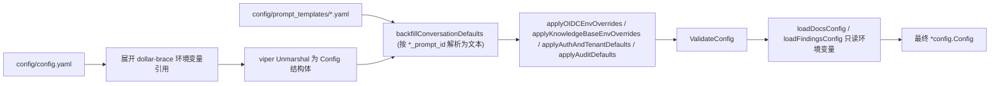

# 配置详解

Yuheng 的配置由四层组成，**优先级从低到高**：

| 层 | 位置 | 什么时候用 |
| --- | --- | --- |
| 主配置文件 | `config/config.yaml` | 结构化的默认值，随镜像分发 |
| 模板 / 预设 | `config/prompt_templates/*.yaml`、`builtin_models.yaml` | 提示词模板、内置模型 |
| 环境变量 | `.env` / 容器 environment | 部署级覆盖，改完需重启 |
| 运行时系统设置 | 数据库 `system_settings` 表，界面在「设置 → 系统设置」（系统管理员） | 一部分开关可以在线改，**盖过环境变量**，绝大多数立即生效 |

最后一层容易被忽略，却是排查「改了 env 没生效」的第一现场：注册模式、工作区策略与配额、上传大小上限、SSRF 白名单、邀请自动加入、各 worker pool 并发、模型并发上限这些键一旦在界面上改过，数据库里就留下一行记录，此后环境变量不再起作用；把该项重置（`DELETE /api/v1/system/admin/settings/:key`）才会回落到环境变量或内置默认值。完整键表与语义见[工作区、用户与认证授权](../03-features/01-tenant-auth.md)的「运行时可改的系统设置」。

`.env.example` 按用途分组注释了每一个可配置的环境变量，是最完整的清单；下文先对照 `internal/config/config.go` 中的结构体解读 `config.yaml`，再按主题汇总重要的环境变量。

## 配置加载机制

`internal/config/config.go` 的 `LoadConfig()` 流程：

1. viper 按顺序查找 `config.yaml`：当前目录 → `./config` → `$HOME/.appname` → `/etc/appname/`；
2. **环境变量展开**：对文件内容做正则替换，`${ENV_VAR}` 会被同名环境变量的值替换；变量未设置时保留字面量 `${ENV_VAR}` 原样（便于暴露配置错误）；
3. viper 开启 `AutomaticEnv()` 且 key 分隔符 `.` 映射为 `_`（即 `server.port` 可被环境变量 `SERVER_PORT` 覆盖）；
4. 从 `config/prompt_templates/*.yaml` 加载提示词模板，并按 `xxx_prompt_id` 字段**回填**到 conversation 配置（`backfillConversationDefaults`）；
5. 应用环境变量覆盖（OIDC、KnowledgeBase、Auth/Tenant、Audit 各组）并执行 `ValidateConfig` 校验；
6. 在线文档（`YUHENG_DOCS_*`）与知识健康（`YUHENG_FINDINGS_*`）的配置只从环境变量读取，不看 `config.yaml`；知识健康阈值越界时启动失败。



## config/config.yaml 逐段解读

### server（`ServerConfig`）

| 名称 | 类型 | 默认值 | 说明 |
| --- | --- | --- | --- |
| `server.port` | int | 8080 | HTTP 监听端口，校验范围 1–65535 |
| `server.host` | string | "0.0.0.0" | 监听地址 |
| `server.log_path` | string | 空 | 日志文件路径（也可用环境变量 `LOG_PATH`） |
| `server.shutdown_timeout` | duration | 30s | 优雅停机超时（默认文件未写出；compose 给 app 的 `stop_grace_period` 是 45s，比它长） |

### conversation（`ConversationConfig`）——检索问答管线

| 名称 | 类型 | 默认值（config.yaml） | 说明 |
| --- | --- | --- | --- |
| `max_rounds` | int | 5 | 携带的多轮历史轮数 |
| `keyword_threshold` | float | 0.3 | 关键词检索最低分 |
| `embedding_top_k` | int | 30 | 向量检索召回条数（>=0） |
| `vector_threshold` | float | 0.2 | 向量相似度阈值（0–1） |
| `rerank_top_k` | int | 30 | 重排后保留条数 |
| `rerank_threshold` | float | 0.3 | 重排最低分（-10–10） |
| `fallback_strategy` | string | "model" | 召回为空时策略：`model`（让模型兜底）或固定回复 |
| `fallback_response` | string | "Sorry, I am unable to answer this question." | 固定兜底文案 |
| `enable_rewrite` | bool | true | 多轮指代消解 / 查询改写 |
| `enable_query_expansion` | bool | true | 查询扩展 |
| `enable_rerank` | bool | true | 启用 Rerank |
| `fallback_prompt_id` | string | "default_fallback_prompt" | 兜底 prompt 模板 ID（`prompt_templates/fallback.yaml`，mode:"model"） |
| `rewrite_prompt_id` | string | "default_rewrite" | 改写模板 ID（含 content 系统侧 + user 用户侧） |
| `generate_summary_prompt_id` | string | "default_summary" | 文档摘要模板 ID |
| `generate_session_title_prompt_id` | string | "default_session_title" | 会话标题生成模板 ID |
| `extract_entities_prompt_id` / `extract_relationships_prompt_id` | string | "default_extract_entities" / "default_extract_relationships" | 图谱抽取模板 ID（`graph_extraction.yaml`） |
| `generate_questions_prompt_id` | string | "default_generate_questions" | 预生成问题模板 ID |

`conversation.summary`（`SummaryConfig`，答案生成参数）：

| 名称 | 类型 | 默认值 | 说明 |
| --- | --- | --- | --- |
| `max_input_chars` | int | 16384 | 送入 LLM 的最大字符数 |
| `temperature` | float | 0.3 | 生成温度 |
| `repeat_penalty` | float | 1.0 | 重复惩罚 |
| `max_completion_tokens` | int | 2048 | 最大生成 token |
| `no_match_prefix` | string | `<think>\n</think>\nNO_MATCH` | 模型输出以此为前缀时判定「未命中」触发 fallback |
| `prompt_id` | string | "default_kb" | 系统 Prompt 模板 ID（`system_prompt.yaml`） |
| `context_template_id` | string | "default_context" | 上下文拼装模板 ID（`context_template.yaml`） |
| `max_tokens` / `top_k` / `top_p` / `frequency_penalty` / `presence_penalty` / `seed` / `thinking` | 多种 | 未设置 | 透传给模型的可选采样参数；`thinking` 为 `*bool` 控制思考模式 |

### knowledge_base（`KnowledgeBaseConfig`）——全局默认分块

| 名称 | 类型 | 默认值 | 说明 |
| --- | --- | --- | --- |
| `chunk_size` | int | 512 | 默认分块大小（>0，且 > overlap） |
| `chunk_overlap` | int | 50 | 分块重叠 |
| `split_markers` | []string | `["\n\n", "\n", "。"]` | 分割标记 |
| `keep_separator` | bool | false | 保留分隔符 |
| `document_process_timeout` | duration | 2h | 单文档处理任务总超时（env `YUHENG_DOCUMENT_PROCESS_TIMEOUT` 可覆盖） |
| `docreader_call_timeout` | duration | 30m | 单次 DocReader RPC 超时（env `YUHENG_DOCREADER_CALL_TIMEOUT`），须小于上一项 |
| `image_processing.enable_multimodal` | bool | true | 上传时启用图片多模态处理（OCR/Caption） |

> 每个知识库的 `ChunkingConfig` 会覆盖这里的全局默认值。

### extract（`ExtractManagerConfig`）——知识图谱抽取模板

`extract.extract_graph` / `extract.extract_entity` / `extract.fabri_text` 定义图谱抽取的说明文（`description`）、允许的关系标签（`tags`，默认 `Author`、`Alias`）与 few-shot 示例（`examples`：`text` + `node` + `relation`）。初始化向导中的「试抽取 / 生成示例文本」即使用这些配置（`fabri_text.with_tag` / `with_no_tag` 中的 `%s` 会被标签列表替换）。

### tenant（`TenantConfig`）

| 名称 | 类型 | 默认值 | 说明 |
| --- | --- | --- | --- |
| `enable_cross_tenant_access` | bool | false | 允许具备 `CanAccessAllTenants` 的用户跨工作区访问（内网可开） |
| `enable_rbac` | *bool | true | 工作区角色强制鉴权；显式 `false` 进入仅记录不拦截的灰度模式（env `YUHENG_TENANT_ENABLE_RBAC`） |
| `default_session_name` / `default_session_title` / `default_session_description` | string | 空 | 新会话默认文案 |

### 结构体支持但默认文件未写出的段

以下段落在 `Config` 结构体中存在，可按需追加到 `config.yaml`（多数也有环境变量入口）：

| 段 | 结构体 | 关键字段与默认值 |
| --- | --- | --- |
| `auth` | `AuthConfig` | `registration_mode`：`auto`（默认：仅在还没有任何用户时开放，首个注册者创建默认工作区并成为系统管理员）/ `self_serve` / `invite_only`（`DISABLE_REGISTRATION=true` 时强制；`false` 强制 `self_serve`）。注册只创建账号，不创建工作区，没有别的注册策略可配 |
| `audit` | `AuditConfig` | `retention_days`：审计日志保留天数，段落省略时默认 90；0 禁用清理；<0 校验报错（env `YUHENG_AUDIT_RETENTION_DAYS`） |
| `oidc_auth` | `OIDCAuthConfig` | `enable`、`issuer_url`、`discovery_url`（缺省由 issuer 拼 `/.well-known/openid-configuration`）、`client_id`、`client_secret`、`authorization_endpoint`、`token_endpoint`、`user_info_endpoint`、`scopes`（默认 `openid profile email`）、`user_info_mapping.username`（默认 `name`）/`email`（默认 `email`）；全部可用 `OIDC_AUTH_*` 环境变量覆盖 |
| `docreader` | `DocReaderConfig` | `addr`（gRPC 地址如 `docreader:50051` 或 HTTP base URL）、`transport`：`grpc`（默认）/ `http`；通常用 env `DOCREADER_ADDR` / `DOCREADER_TRANSPORT` |
| `vector_database` | `VectorDatabaseConfig` | `driver`（通常用 env `RETRIEVE_DRIVER`） |
| `stream_manager` | `StreamManagerConfig` | `type`：`memory` / `redis`；`redis.address/username/password/db/prefix/ttl`；`cleanup_timeout`（通常用 env `STREAM_MANAGER_TYPE`、`REDIS_*`） |
| `models` | `[]ModelConfig` | 历史遗留的静态模型清单（`type`/`source`/`model_name`/`parameters`）；现推荐用 `builtin_models.yaml` 或界面配置 |
| `frontend_base_url` | string | 空 | SPA 对外 origin，用于生成邀请等绝对链接（env `FRONTEND_BASE_URL`） |

默认文件里另有 `web_search.timeout: 60`（联网搜索单次请求超时，秒；抓取正文的提供商需要比 10 秒默认值长得多）。

## 重要环境变量

以下变量来自 `docker-compose.yml` 的 `environment` 段、`.env.example` 与代码中的 `os.Getenv`。「默认值」一栏是 compose 部署下的实际取值；两者不同时分别注明。生产部署至少要设：`JWT_SECRET`、`SYSTEM_AES_KEY`（不设服务拒绝启动），并改掉 `DB_PASSWORD`、`REDIS_PASSWORD`、`RUSTFS_ACCESS_KEY` / `RUSTFS_SECRET_KEY` 的示例值。

### 运行时基础

| 名称 | 默认值 | 说明 |
| --- | --- | --- |
| `GIN_MODE` | release | `debug` 开发模式（启用 Swagger）/ `release` 生产 |
| `LOG_LEVEL` / `LOG_PATH` / `LOG_FORMAT` | debug / 空 / 空 | 日志级别（debug / info / warn / error / fatal）、文件路径（空则仅 stdout）、自定义格式 |
| `LLM_DEBUG_LOG` | false | true 时在 LOG_PATH 同目录写 `llm_debug.log` |
| `TZ` | UTC（`.env.example`；`.env` 未设置时 compose 回退为 Asia/Shanghai） | 时区，影响日志时间戳与时间显示。数据库连接固定用 UTC |
| `YUHENG_LANGUAGE` | 空 | 文档处理语言（问题/摘要生成）。优先级：本变量 > 请求的 `Accept-Language` > 内置 `zh-CN`。**它压过请求头**是刻意的：界面语言与文档处理语言是两件事，允许「英文界面 + 处理韩文文档」 |
| `AUTO_MIGRATE` | true | 启动时自动执行数据库迁移（迁移文件已嵌入二进制） |
| `MIGRATION_FAIL_FAST` | true | 迁移失败即终止启动。只有在服务外自行迁移（CI、DBA）时才设 false：服务照常启动，但 `/ready` 在迁移状态恢复正常前一直返回 503 |
| `AUTO_RECOVER_DIRTY` | false | 遇到 dirty 状态（上次迁移被中断）时自动回退一个版本并重跑。只有被中断的迁移可以安全地执行两遍时才能开，见[备份与升级](./05-backup-and-upgrade.md)与[数据库与迁移](../06-development/02-database-schema.md) |
| `YUHENG_INSECURE_DEV` | 空 | 设为 true 时跳过 `JWT_SECRET` / `SYSTEM_AES_KEY` 的启动检查，仅供一次性的本机试验，每次启动都会打印警告；绝不要用在别人能访问的部署上 |
| `YUHENG_TRUSTED_PROXIES` | 未设置 | gin 信任的代理 CIDR（逗号分隔）。未设置时信任回环与私网段（覆盖容器网络里的 Nginx）；显式设为空字符串则不信任任何代理 |
| `YUHENG_CORS_ALLOWED_ORIGINS` | 空 | 浏览器跨域允许的来源（逗号分隔）。空或含 `*` 表示任意来源且不带 credentials；前端经自带 Nginx 同源访问，通常不用设 |
| `MAX_FILE_SIZE_MB` / `MAX_VIDEO_FILE_SIZE_MB` | 50 / 2048 | 文档与视频的上传大小上限，也是系统设置 `file.max_size_mb` / `file.video_max_size_mb` 的默认值（系统管理员可在界面调整）。前端 Nginx 的请求体上限取两者较大值，docreader 的 gRPC 消息上限默认 `max(MAX_FILE_SIZE_MB, 512)`，界面上的值不能超过它们 |
| `CONCURRENCY_POOL_SIZE` | 5 | Embedding 并发协程池，模型服务返回 429 时调小 |
| `DEFAULT_LOCALE` | 空 | 前端界面的默认语言（`zh-CN` / `en-US` / `ko-KR` / `ru-RU`），只影响还没手动选过语言的用户；改完重启 frontend 容器即可 |
| `APP_EXTERNAL_URL` / `FRONTEND_BASE_URL` | 空 | 文件引用外链的外部可达 URL（配合 `RESOURCE_URL_MODE=public`，详见 [图片与文件的对外访问](../03-features/21-file-access.md)） / 前端外部 origin（用于生成邀请等绝对链接） |
| `RESOURCE_URL_MODE` | handle | API 响应里文件引用的默认形式：`handle` 返回内部 `resource://`，`public` 返回可直接加载的限时外链。单次请求可用 `?resource_urls=` 覆盖，详见 [API 总览](../04-api/01-api-overview.md) |

`APP_EXTERNAL_URL` 决定 `resource://` 引用能否改写成外部可加载的链接：

1. 设置了 `APP_EXTERNAL_URL` 时，`resource://` 一律被改写成 `<APP_EXTERNAL_URL>/r/<token>` 走 Yuheng 自身，对任何存储后端都有效（需要 nginx 代理 `/r/`，官方前端镜像已内置该 location）；
2. 没设置时，只有 S3 兼容后端能给出预签名 URL，而且它的端点必须对客户端可达（公网 endpoint，或把 `S3_ENDPOINT` 设成公网 host）。

默认的自带 RustFS 内网部署（`rustfs:9000`）与本机目录后端都只能走第一种。`scripts/deploy.sh` 会交互式地帮你填这个变量。本变量为空时，服务启动会打印一次 WARN；改写结果若不是 http(s) URL 会保留原引用并记录可操作的告警，而不是发出外部无法访问的链接。

四种 URL 形式与取法见[图片与文件的对外访问](../03-features/21-file-access.md)。

### 端口与网络

| 名称 | 默认值 | 说明 |
| --- | --- | --- |
| `FRONTEND_PORT` | 80 | 前端端口，监听所有网卡，是唯一的公开入口 |
| `APP_PORT` / `APP_BIND` | 8080 / 127.0.0.1 | 后端在宿主机上的端口与绑定地址。浏览器经前端 Nginx 访问后端，通常不需要改绑定 |
| `COLLAB_BIND`、`DRAWIO_BIND`、`MCP_BIND`、`NEO4J_BIND`、`DEX_BIND`、`LANGFUSE_WEB_BIND`、`LANGFUSE_MINIO_BIND`、`RUSTFS_BIND`、`SEARXNG_BIND` | 127.0.0.1 | 各可选服务端口的绑定地址。只有确实需要从别的机器直连时才设 `0.0.0.0`，并在前面放 TLS |
| `APP_HOST` / `APP_BACKEND_PORT` / `APP_SCHEME` | app / 8080 / http | 前端 Nginx 反代的后端地址，前后端分开部署时改 |
| `DOCKER_NETWORK_MTU` | 1500 | 容器网络 MTU。要访问的服务位于 MTU 更小的 VPN / 隧道之后时调小（用 `scripts/probe-mtu.sh` 探测），改完需重建网络 |
| `DOCREADER_MEM_LIMIT` | 4g | docreader 容器内存上限 |

### 数据库与队列

| 名称 | 默认值 | 说明 |
| --- | --- | --- |
| `DB_DRIVER` | postgres | 只支持 `postgres`，其他取值启动即报错 |
| `DB_HOST` / `DB_PORT` / `DB_USER` / `DB_PASSWORD` / `DB_NAME` | postgres / 5432 / 见 `.env.example` | PostgreSQL 连接（必填）。compose 的 postgres 容器用同一组值初始化 |
| `DB_MAX_OPEN_CONNS` / `DB_MAX_IDLE_CONNS` / `DB_CONN_MAX_LIFETIME_MINUTES` | 50 / 10 / 10 | 每个 app 进程的连接池。`副本数 × DB_MAX_OPEN_CONNS` 加上其他客户端要小于 PostgreSQL 的 `max_connections`（`POSTGRES_MAX_CONNECTIONS`，默认 100）；无效值会终止启动 |
| `POSTGRES_SHARED_BUFFERS` 等 `POSTGRES_*` | PostgreSQL 出厂值 | compose 传给 postgres 的容量参数（`shared_buffers`、`work_mem`、并行度等）；`scripts/deploy.sh` 会按机器规格填写 |
| `STREAM_MANAGER_TYPE` | redis（`.env.example`） | `redis` / `memory` |
| `REDIS_ADDR` / `REDIS_USERNAME` / `REDIS_PASSWORD` / `REDIS_DB` / `REDIS_PREFIX` | redis:6379 / … | Redis 连接 |
| `REDIS_USE_TLS` | false | **启用 TLS 的总开关**，托管 Redis（如 AWS ElastiCache）需要打开；`REDIS_TLS_SERVER_NAME` 指定校验与 SNI 用的服务器名（地址是 IP 时有用），`REDIS_TLS_INSECURE_SKIP_VERIFY` 跳过证书校验（不安全，仅自签证书的开发环境用） |
| `YUHENG_REDIS_NAMESPACE` | 空 | 多部署共用 Redis 时的频道命名空间后缀 |
| `YUHENG_REDIS_OP_TIMEOUT_MS` | 500 | Asynq 客户端的 Redis 读写超时（毫秒） |
| `YUHENG_ASYNQ_CORE_CONCURRENCY` 等 | 8 / 2 / 12 / 4 / 6 | Asynq 各队列并发（core/postprocess/enrichment/maintenance/shared），另有 `YUHENG_WIKI_ASYNQ_CONCURRENCY=8`、`YUHENG_MODEL_MAX_CONCURRENCY=32`。这些都可以在系统设置里运行时调整，数据库里的值优先 |

### 检索引擎与向量库

| 名称 | 默认值 | 说明 |
| --- | --- | --- |
| `RETRIEVE_DRIVER` | postgres | 检索引擎。社区版只支持 `postgres`（ParadeDB `pg_search` BM25 + pgvector）；服务器启动时若所连 PostgreSQL 缺少 `vector` 或 `pg_search` 扩展会拒绝启动。请使用 `docker-compose.yml` 的 ParadeDB 镜像，或在自有 PostgreSQL 上自行安装这两个扩展（托管 PostgreSQL 通常无法安装 `pg_search`） |
| `MULTI_STORE_RETRIEVE_TIMEOUT_SEC` | 空 | 多个检索引擎并行检索时的超时（秒）。社区版只有一个引擎，通常用不到 |
| `NEO4J_ENABLE` / `NEO4J_URI` / `NEO4J_USERNAME` / `NEO4J_PASSWORD` | 空 / bolt://neo4j:7687 / neo4j / password | 知识图谱唯一开关（`ENABLE_GRAPH_RAG` 已废弃） |

### 文件存储

| 名称 | 默认值 | 说明 |
| --- | --- | --- |
| `STORAGE_TYPE` | s3（compose 与 `.env.example`；变量完全未设置时代码回退为 local，例如源码运行） | 部署存储的类型：`local` / `s3`（任何 S3 兼容服务）。不受支持或被 `STORAGE_ALLOW_LIST` 排除时服务拒绝启动 |
| `STORAGE_ALLOW_LIST` | 空 | 允许的存储类型白名单（逗号分隔），同时约束部署存储与工作区注册的实例 |
| `LOCAL_STORAGE_BASE_DIR` | /data/files | 本地存储根目录；每个本机目录实例是它下面的 `path_prefix` 子目录 |
| `LOCAL_STORAGE_PATH_PREFIX` | 空 | 部署存储为 `local` 时在根目录下使用的子目录 |
| `S3_ENDPOINT` | http://rustfs:9000（compose） | S3 兼容服务地址；可带 `http://` / `https://`；空表示 AWS S3 |
| `S3_REGION` | us-east-1（compose） | 区域，`STORAGE_TYPE=s3` 时必填 |
| `S3_ACCESS_KEY` / `S3_SECRET_KEY` | 取 `RUSTFS_ACCESS_KEY` / `RUSTFS_SECRET_KEY`（compose） | 访问密钥，要么都填、要么都不填 |
| `S3_BUCKET_NAME` | yuheng（compose） | Bucket，必填；不存在时首次使用自动创建 |
| `S3_PATH_PREFIX` | yuheng/ | 对象前缀 |
| `S3_USE_SSL` | false（compose）；未设置时 true | endpoint 不带协议头时是否用 HTTPS |
| `S3_ADDRESSING_STYLE` | auto | `auto` / `path` / `virtual`。`auto`：endpoint 为空或 `amazonaws.com` 用 virtual-hosted，其他 endpoint（RustFS、MinIO）用 path-style；阿里云 OSS、腾讯云 COS、火山引擎 TOS、华为云 OBS 必须设 `virtual` |
| `RUSTFS_ACCESS_KEY` / `RUSTFS_SECRET_KEY` | rustfsadmin | 自带 RustFS（默认启动）的账号，上线前务必更换；另有 `RUSTFS_PORT` / `RUSTFS_CONSOLE_PORT` / `RUSTFS_BIND` |

这组变量描述的是**部署存储**：存储后端表里那条 `id = env` 的记录。服务每次启动按它们重写这条记录（只写类型与位置，不写密钥——`S3_ACCESS_KEY` / `S3_SECRET_KEY` 只从环境变量读，轮换后重启即生效）。如果位置变量（`STORAGE_TYPE`、端点、区域、桶、路径前缀）与记录不同，而记录上还存着文件，服务拒绝启动：那些文件都按记录里的位置解析。详见[存储后端](../03-features/19-storage-backends.md)。

各服务的 endpoint 与寻址方式对照表见[安装部署](02-installation.md)。原有的 `MINIO_*` / `COS_*` / `TOS_*` / `OSS_*` / `OBS_*` / `KS3_*` 变量已不再生效，请改用 `S3_*`。

AWS S3 的 `S3_ACCESS_KEY` / `S3_SECRET_KEY` 可以**同时留空**，此时走 AWS SDK 默认凭证链，支持 EC2/ECS/EKS IAM Role、IRSA/Web Identity、环境变量与共享配置文件——在 AWS 上部署时不必再往环境变量里塞长期密钥。两者必须同填或同空。`S3_ENDPOINT` 留空则使用 Region 对应的标准端点。

### 模型与推理

| 名称 | 默认值 | 说明 |
| --- | --- | --- |
| `OLLAMA_BASE_URL` | http://host.docker.internal:11434 | Ollama 地址 |
| `OLLAMA_OPTIONAL` | true | Ollama 不可用时仅告警不阻断启动 |
| `BATCH_EMBED_SIZE` | 空 | 批量 embedding 大小 |
| `VLM_HTTP_TIMEOUT_SECONDS` | 180 | VLM 单次请求超时 |
| `BUILTIN_MODELS_CONFIG` | config/builtin_models.yaml | 内置模型声明文件路径（见下文） |
| `FEISHU_DOCX_PARSE_MODE` | export | 飞书 / Lark 同步新版云文档时的解析方式：`export` 导出为 docx 交给 docreader（图片与正文关联，较慢）；`blocks` 用 blocks API 转 Markdown（快，保留附件，但图片不与正文关联） |
| `YUHENG_LLM_STREAM_RAW_DUMP` / `_DIR` | 空 | LLM 流原始转储（排障用） |

### 认证、租户与安全

| 名称 | 默认值 | 说明 |
| --- | --- | --- |
| `JWT_SECRET` | 空 | JWT 签名密钥，**必填，至少 32 个字符**（`openssl rand -hex 32`）。多副本必须一致 |
| `SYSTEM_AES_KEY` | 空 | 数据库中敏感字段加密的 AES-256 主密钥，**必填，正好 32 字节**（`openssl rand -hex 16`）；丢失则已加密的数据（API Key、模型密钥、数据源凭据等）不可恢复。取代已废弃的 `TENANT_AES_KEY` / `CRYPTO_MASTER_KEY` / `CRYPTO_SALT` |
| `DISABLE_REGISTRATION` | 未设置 | 未设置：`auto`（只在还没有用户时开放注册，首个注册者创建默认工作区并成为系统管理员）；`true`：强制 `invite_only`；`false`：强制 `self_serve`。注册只建账号；工作区只能由系统管理员创建 |
| `YUHENG_TENANT_ENABLE_RBAC` | （默认 true） | 工作区角色强制鉴权开关 |
| `YUHENG_TENANT_ENABLE_CROSS_TENANT_ACCESS` | false | 跨工作区访问 |
| `YUHENG_TENANT_AUTO_ACCEPT_INVITATION` | false | 邀请已注册用户时直接加入工作区，不需要对方接受 |
| `YUHENG_GOVERNANCE_CENTRALIZED_INFRA` | false | 集中管控：模型、网络搜索、存储、解析引擎、Ollama 等基础设施配置收归系统管理员，工作区管理员只读但照常可选用。也可在系统设置里开关，数据库里的值优先 |
| `YUHENG_TENANT_DEFAULT_STORAGE_QUOTA_GB` | 0 | 新工作区默认存储配额（GB），0 = 不限；只在创建工作区时读取，也可在系统设置里改 |
| `YUHENG_INVITATION_TTL` | 168h | 邀请链接有效期 |
| `YUHENG_AUDIT_RETENTION_DAYS` | 90 | 审计日志保留天数 |
| `YUHENG_BOOTSTRAP_SYSTEM_ADMIN_EMAIL` | 空 | 引导第一个系统管理员。**不会创建用户**：该邮箱需先自行注册，下次启动时若部署内还没有任何系统管理员，才把它提升；已有管理员后本变量不再生效。详见[工作区、用户与认证授权](../03-features/01-tenant-auth.md) |
| `OIDC_AUTH_ENABLE` 及 `OIDC_AUTH_*` / `OIDC_USER_INFO_MAPPING_*` | false / 空 | OIDC 单点登录全套配置 |
| `SSRF_WHITELIST` / `SSRF_WHITELIST_EXTRA` | 空 / `searxng,rustfs` | 出站请求 SSRF 白名单（域名、通配域名、IP 或 CIDR，逗号分隔）。两者合并生效；自定义 `SSRF_WHITELIST_EXTRA` 会覆盖 compose 默认值，要把 `searxng,rustfs` 一起写上 |
| `IMAGE_HOST_KEEP_URL` | 空 | 保留原始 URL 的图片域名白名单 |

### Docreader 解析（docreader 容器）

| 名称 | 默认值 | 说明 |
| --- | --- | --- |
| `DOCREADER_ADDR` / `DOCREADER_TRANSPORT` | docreader:50051 / grpc | app 侧连接地址与传输（`grpc`/`http`） |
| `DOCREADER_GRPC_MAX_WORKERS` / `DOCREADER_GRPC_PORT` / `DOCREADER_GRPC_MAX_FILE_SIZE_MB` | 4 / 50051 / `max(MAX_FILE_SIZE_MB, 512)` | gRPC 服务参数。批量入库时 worker 数往往是瓶颈，`scripts/deploy.sh` 会按 CPU 数填写 |
| `GRPC_TLS_ENABLED/CERT/KEY/CA/SERVER_NAME`、`GRPC_MTLS_REQUIRE_CLIENT_CERT`、`GRPC_AUTH_TOKEN` | false / 空 | app↔docreader 链路 TLS/mTLS 与 token 认证。`GRPC_AUTH_TOKEN` 可以不设（docreader 只在容器内网）；设了就必须至少 16 个字符且不是示例值，否则 app 拒绝启动 |
| `DOCREADER_PDF_RENDER_DPI` / `DOCREADER_PDF_JPEG_QUALITY` / `DOCREADER_PDF_RENDER_MAX_EDGE` | 200 / 85 / 2000 | PDF 渲染 |
| `DOCREADER_PDF_FORCE_SCANNED` / `DOCREADER_PDF_SCAN_IMAGE_RATIO` / `DOCREADER_PDF_SCAN_MIN_CHARS` | false / 代码默认 | 扫描件判定 |
| `DOCREADER_ODL_HYBRID` / `DOCREADER_ODL_HYBRID_URL` / `DOCREADER_ODL_HYBRID_MODE` / `DOCREADER_ODL_HYBRID_FALLBACK` | off / http://odl-hybrid:5002 / auto / false | OpenDataLoader 混合解析 |
| 其余 `DOCREADER_PDF_*`（词距/边栏/隐藏文本/嵌入图/图表区等 20+ 项） | 见 `docker-compose.yml` docreader 段注释 | PDF 版式与抽取精调 |
| `DOCREADER_EXTERNAL_HTTP_PROXY` / `_HTTPS_PROXY` | 空 | docreader 出站抓取代理 |

### 文档处理与会话附件

| 名称 | 默认值 | 说明 |
| --- | --- | --- |
| `YUHENG_DOCUMENT_PROCESS_TIMEOUT` / `YUHENG_DOCREADER_CALL_TIMEOUT` | 2h / 30m | 文档处理任务与单次 RPC 超时，后者须小于前者 |
| `YUHENG_HOUSEKEEPING_ENABLED` | true | 巡检回收卡在 processing 的文档，不建议关 |
| `YUHENG_CHAT_ATTACHMENT_TTL_HOURS` / `_WAIT_TIMEOUT_SEC` / `_OCR_CONCURRENCY` / `_OCR_MAX_PAGES` | 24 / 60 / 8 / 8 | 聊天附件解析保留时长、等待超时与 OCR 并发/页数上限 |

### 知识健康

| 名称 | 默认值 | 说明 |
| --- | --- | --- |
| `YUHENG_FINDINGS_ENABLED` | true | 是否自动检测（索引后的内容比对，以及每小时的复核巡检）。关闭后不再产生新问题，已有记录仍可查看 |
| `YUHENG_FINDINGS_DUPLICATE_MIN_SCORE` | 0.95 | 内容比对时两个段落被视为重叠的余弦相似度，取值 0.5–1，超出范围服务拒绝启动 |

复核周期是知识库级设置（知识库设置的「基本信息」），不是环境变量。详见[知识健康](../03-features/22-knowledge-health.md)。

### 在线文档

在线文档默认关闭，全部配置在 `.env.example` 的 K 节，常用的几项：

| 名称 | 默认值 | 说明 |
| --- | --- | --- |
| `YUHENG_DOCS_ENABLED` | false | 打开在线文档模块（注册 `/api/v1/docs/**`） |
| `YUHENG_COLLAB_URL` | 空 | 协同服务的浏览器侧 WebSocket 地址，例如 `ws://localhost/collab`；留空为独占编辑 |
| `YUHENG_COLLAB_SHARED_SECRET` | 空 | app 与 collab 之间的 HMAC 共享密钥，设了 `YUHENG_COLLAB_URL` 就必须设，至少 16 个字符 |
| `YUHENG_COLLAB_INTERNAL_URL` | http://collab:1234（compose） | app 回调协同服务的内网地址 |
| `COLLAB_REDIS_URL` | 空 | 协同服务多实例时用 Redis 同步；单实例留空 |
| `YUHENG_DOCS_DRAWIO_URL` | 空 | 浏览器能打开的 draw.io 地址；留空时图表只能查看 |
| `YUHENG_DOCS_PUBLIC_SHARING` | false | 是否允许发布免登录的公开链接；关闭时连公开路由都不注册 |
| `YUHENG_DOCS_MAX_YDOC_BYTES` / `YUHENG_DOCS_MAX_ATTACHMENT_BYTES` | 20MiB / 200MiB | 单页协同状态上限 / 单个附件上限 |
| `YUHENG_DOCS_INDEX_DEBOUNCE_SECONDS` | 60 | 页面编辑后延迟多少秒同步到知识库 |

部署步骤见[安装部署](./02-installation.md)的「在线文档」一节，功能说明见[在线文档](../03-features/07-docs.md)。

### 可观测性（Langfuse）

`LANGFUSE_PUBLIC_KEY` + `LANGFUSE_SECRET_KEY` 同时设置即自动启用；`LANGFUSE_HOST`（默认 `https://cloud.langfuse.com`，自建栈填 `http://langfuse-web:3000`）、`LANGFUSE_ENABLED`、`LANGFUSE_RELEASE`、`LANGFUSE_ENVIRONMENT`、`LANGFUSE_SAMPLE_RATE`、`LANGFUSE_FLUSH_AT/FLUSH_INTERVAL/QUEUE_SIZE/REQUEST_TIMEOUT/DEBUG` 为调优项；`--profile langfuse` 自建栈另有 `LANGFUSE_SALT`、`LANGFUSE_ENCRYPTION_KEY`、`LANGFUSE_NEXTAUTH_SECRET`、`LANGFUSE_INIT_*`（首启自动建组织/项目/管理员）等，见 `.env.example` I1/I2 节。

### 可选服务：SearXNG 与 MCP Server

这两组变量只在启用对应 compose profile 时才需要，独立于主服务。

**SearXNG**（自托管元搜索，`--profile searxng` / `full`）：

| 名称 | 默认值 | 说明 |
| --- | --- | --- |
| `SEARXNG_PORT` | 8888 | 宿主机端口 |
| `SEARXNG_BIND` | 127.0.0.1 | **默认只监听本机**。Yuheng 打包的配置关掉了 SearXNG 自身的限流（否则后端会被节流），所以不应直接暴露到 LAN；确实要开放请显式改成 `0.0.0.0` 并自行加固 |
| `SEARXNG_SECRET` | 空 | 入口脚本用它替换 `settings.yml` 里的 `secret_key`，对外开放时必须设 |

自建 SearXNG 时记得把 `127.0.0.1` 加进 `SSRF_WHITELIST`，否则后端的 SSRF 防护会拦掉本机地址。用法见[网络搜索与网页抓取](../03-features/11-web-search.md)。

**MCP Server**（把 Yuheng 暴露给 Claude Desktop 等 MCP 客户端，`--profile full`）：

| 名称 | 默认值 | 说明 |
| --- | --- | --- |
| `YUHENG_API_KEY` | 空 | mcp-server 调 Yuheng REST 用的 API Key，由工作区 Owner 在「设置 → 工作区 → API Key」创建（或调 `POST /api/v1/tenants/:id/api-keys`） |
| `MCP_SERVER_AUTH_TOKEN` | 空 | **HTTP/SSE 传输必填**，缺失时进程直接拒绝启动；客户端以 `Authorization: Bearer` 携带 |
| `YUHENG_CHAT_TIMEOUT` | 300 | 调 Yuheng REST 的读超时（秒） |
| `YUHENG_VERIFY_SSL` | true | 是否校验后端 TLS 证书，自签证书可设 false |
| `MCP_ALLOWED_UPLOAD_DIRS` | 空 | 允许上传的目录白名单（逗号分隔），留空即禁用文件上传工具 |

完整说明见 [MCP 集成](../03-features/08-mcp.md)。

## config/prompt_templates/：提示词模板

每类 Prompt 一个 YAML 文件，统一结构为 `templates:` 列表；单个模板字段（`PromptTemplate` 结构体，`internal/config/config.go`）：

| 字段 | 说明 |
| --- | --- |
| `id` | 唯一 ID，被 config.yaml 的 `*_prompt_id` 引用 |
| `name` / `description` | 展示名与说明 |
| `content` | 系统侧 Prompt 正文（所有模板必备） |
| `user` | 用户侧 Prompt（仅 system+user 配对模板使用，如 rewrite、keywords_extraction） |
| `default` | 是否为该类默认模板 |
| `mode` | 子类区分（如 fallback 中 `model` 表示模型兜底 prompt） |
| `has_knowledge_base` / `has_web_search` | 模板适用场景标记 |
| `i18n` | 多语言 name/description（键为 locale，如 `zh-CN`） |

各文件用途与内含模板 ID：

| 文件 | 用途 | 模板 ID |
| --- | --- | --- |
| `system_prompt.yaml` | 问答的系统 Prompt | `default_kb`（默认）、`expert_assistant`、`customer_service`、`technical_support`、`pure_chat`、`web_search_assistant` |
| `context_template.yaml` | 检索结果拼装为上下文的模板 | `default_context`、`detailed_context`、`simple_context`、`qa_context` |
| `rewrite.yaml` | 多轮查询改写（content+user 成对） | `default_rewrite`、`standard_rewrite`、`strict_rewrite` |
| `fallback.yaml` | 未命中兜底（固定回复 + `mode:"model"` 模型兜底） | `default_fallback`、`polite_fallback`、`brief_fallback`、`model_fallback`、`default_fallback_prompt` |
| `generate_session_title.yaml` | 会话标题生成 | `default_session_title` |
| `generate_summary.yaml` | 文档摘要生成 | `default_summary` |
| `generate_questions.yaml` | 文档预生成问题 | `default_generate_questions` |
| `keywords_extraction.yaml` | 关键词抽取 | `default_keywords_extraction` |
| `graph_extraction.yaml` | 图谱实体/关系抽取 | `default_extract_entities`、`default_extract_relationships` |
| `intent_prompts.yaml` | 意图路由的分意图系统 Prompt（模板 ID = 意图值） | `greeting`、`chitchat`、`follow_up`、`image_only`、`summarize`、`web_search`、`doc_only` |

**可定制点**：直接编辑模板 `content`，或新增模板条目并把 config.yaml 中对应 `*_prompt_id` 改为新 ID；重启（compose 已挂载 `./config/config.yaml`，模板目录随镜像/挂载）即生效。ID 找不到时启动日志会输出 `Warning: xxx_prompt_id not found`。

## config/builtin_models.yaml.example：声明式内置模型

复制为 `config/builtin_models.yaml`（或用 `BUILTIN_MODELS_CONFIG` 指定路径）后，其中条目会在**每次启动时**写入 `models` 表并标记 `is_builtin=true`，对所有租户可见（compose 中取消 `- ./config/builtin_models.yaml:/app/config/builtin_models.yaml:ro` 挂载行的注释）。格式：

```yaml
builtin_models:
  - id: builtin-llm-default        # 稳定 ID，重复启动按 ID 幂等更新
    type: KnowledgeQA              # KnowledgeQA | Embedding | Rerank | VLLM | ASR
    source: remote                 # remote（默认）| local
    is_default: true               # 是否设为该类型默认模型
    name: ${LLM_MODEL_NAME}        # 字符串字段均支持 ${ENV} 引用（.env 经 env_file 注入容器）
    parameters:
      base_url: ${LLM_BASE_URL}
      api_key: ${LLM_API_KEY}
      provider: ${LLM_PROVIDER}    # openai | generic | aliyun | moonshot | ...
      embedding_parameters:        # 仅 Embedding 类型
        dimension: 1536
        truncate_prompt_tokens: 0
```

注意：未设置的 `${ENV}` 会保留字面量以便暴露配置错误；非字符串字段（`type`、`source`、`is_default`、`dimension` 等）必须写字面值。这些记录标记为 `managed_by=yaml`：从文件里删掉一个条目，下次启动时对应记录会被软删除；系统管理员在界面上改过的记录转为手工管理，之后不再受文件影响。完整说明（界面共享、YAML 对账规则、下线与临时停用）见[模型管理：内置模型](../03-features/06-models.md#内置模型)。

## 配置优先级速记

对同一语义的配置，生效优先级为：**数据库 `system_settings`（仅注册在表内的键）> 环境变量 > config.yaml > 代码内置默认值**；租户/知识库级配置（`RetrievalConfig`、`ChunkingConfig` 等，存于数据库）在运行时覆盖全局默认。修改 `.env` 后需重建容器才会生效（`docker compose up -d app`，单纯 `restart` 不会重读 `.env`）；开发模式的热重载同样不会重读 `.env`，需重启 dev 脚本。
