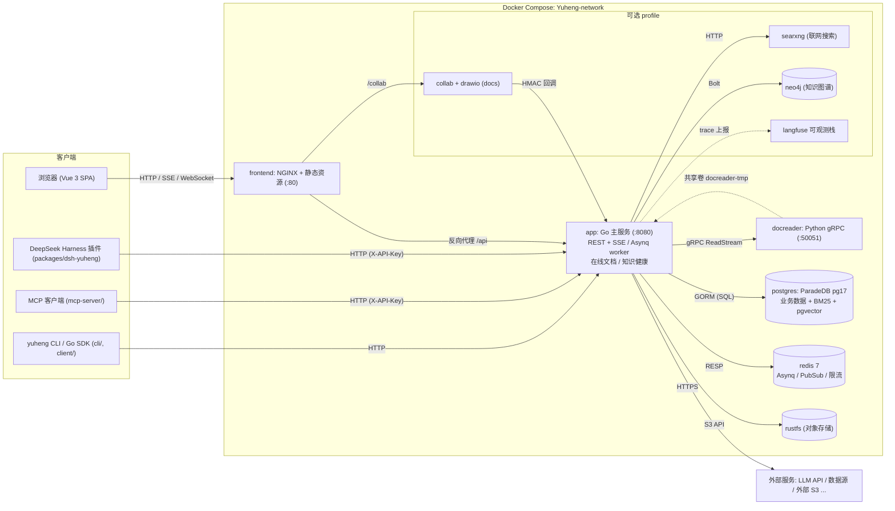
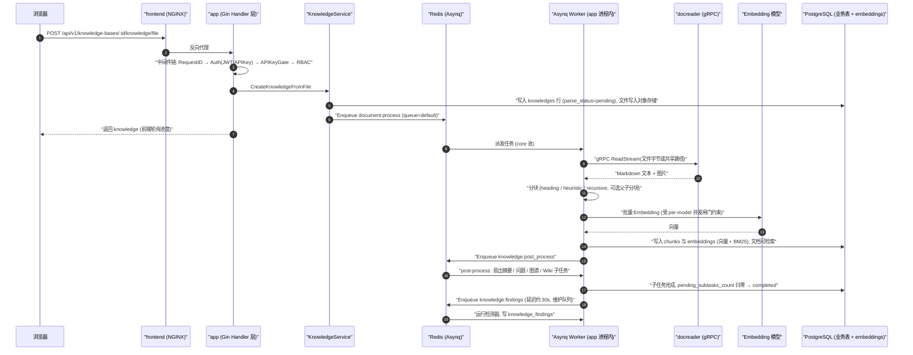

# 总体架构

本章从部署视角与代码视角两个维度介绍 Yuheng 的整体架构：系统由哪些进程/容器组成、各组件之间如何通信、使用了哪些技术栈、主要子系统如何分工，以及代码仓库的顶层目录布局。

Yuheng 是面向 AI 智能体的**知识层**：负责把文档接入进来（解析、数据源同步、在线文档）、组织成知识库（分块、FAQ、Wiki、可选知识图谱）、回答问题（混合检索、重排、带引用的流式问答）、维护知识质量（知识健康），并通过 REST API、MCP Server、Go SDK、CLI 暴露给调用方。它本身不是智能体框架：不内置 Agent 编排、工具调用循环或记忆系统。

## 1. 系统组成

Yuheng 的核心是"主服务 + 前端 + 文档解析微服务"三个进程，外加 PostgreSQL、Redis 与 RustFS（S3 兼容对象存储）三个基础设施依赖；其余组件（在线文档协同、知识图谱、联网搜索、可观测栈等）均为可选，通过 Docker Compose profile 按需启用。

### 1.1 核心服务（默认启动）

| 服务 | 构建 | 端口 | 职责 |
| --- | --- | --- | --- |
| `app` | `docker/Dockerfile.app`（Go） | `8080`（宿主机默认只绑 `127.0.0.1`，`APP_BIND` 可改） | 主后端：REST API、RAG 检索问答、异步任务 worker、在线文档后端、知识健康检测。存活探针 `GET /health`，就绪探针 `GET /ready`（compose 的 healthcheck 用后者） |
| `frontend` | `frontend/`（NGINX + Vue 3 静态产物，需先 `scripts/build_frontend_dist.sh`） | `80`（`FRONTEND_PORT`） | Web UI；NGINX 同时是反向代理，把 `/api`、`/files`、`/r` 与 `/collab` 转发到后端（`APP_HOST`/`APP_BACKEND_PORT`/`APP_SCHEME` 可指向远端后端） |
| `docreader` | `docker/Dockerfile.docreader`（Python） | `50051`（仅 compose 网络内） | 文档解析微服务：gRPC 服务端，PDF/DOCX/Excel/EPUB/网页/音视频等格式解析与页面渲染 |
| `postgres` | `paradedb/paradedb:v0.22.2-pg17` | `5432`（网络内） | 唯一的数据库。ParadeDB 发行版自带 pgvector 与 `pg_search`（BM25），同时承担业务数据与检索索引；服务启动时检查 `vector` 与 `pg_search` 两个扩展，缺失即拒绝启动 |
| `redis` | `redis:7.0-alpine` | `6379`（网络内） | Asynq 任务队列、`system_settings` 变更发布订阅、分布式限流与模型并发闸门、在线文档的事件总线与权限缓存；配置 `STREAM_MANAGER_TYPE=redis` 时还承载 SSE 事件流 |
| `rustfs` | `rustfs/rustfs`（按 digest 固定） | `9000` / 控制台 `9001`（仅 `127.0.0.1`） | 默认的 S3 兼容对象存储（compose 默认 `STORAGE_TYPE=s3`、`S3_ENDPOINT=http://rustfs:9000`）；改用本地目录或外部对象存储时它仍会启动 |

仓库目前不发布预构建镜像：compose 中的 `image:` 名只是本地构建产物的标签，`docker compose up -d --build` 会从源码构建。`app` 与 `docreader` 之间通过共享卷 `docreader-tmp`（挂载于 `/tmp/docreader`）传递解析产物图片；`app` 的本地文件存储卷为 `data-files`（`/data/files`），大视频在本地存储时也经共享路径交给 docreader，而不走 gRPC 消息体。

### 1.2 可选组件（Compose profile）

| 服务 | profile | 用途 |
| --- | --- | --- |
| `collab`、`drawio` | `docs` | 在线文档的协同编辑服务（Node + Yjs/Hocuspocus，`collab/`）与嵌入编辑器的 draw.io。在线文档模块本身由 `YUHENG_DOCS_ENABLED` 开关控制（默认关闭）；不启动 `collab` 时编辑器退化为独占编辑（进入即取 5 分钟租约） |
| `searxng`（+ 一次性 `searxng-init`） | `searxng` / `full` | 自托管元搜索引擎，为问答提供联网搜索（默认绑定 `127.0.0.1:8888`） |
| `neo4j` | `neo4j` / `full` | 知识图谱存储，开关为 `NEO4J_ENABLE`，Bolt 协议 `7687` |
| `odl-hybrid` | `odl-hybrid` | OpenDataLoader PDF 混合解析后端（docreader 通过 HTTP `:5002` 调用），仅本地构建 |
| `dex` | `dex` / `full` | OIDC 测试用 IdP（配合 `OIDC_AUTH_ENABLE`），不用于生产 |
| `langfuse-*`（web/worker/clickhouse/minio/db-init） | `langfuse` / `full` | 自建 LLM 可观测栈，复用 Yuheng 的 postgres（新建 `langfuse` 库）与 redis |
| `mcp` | `full` | 以 HTTP/SSE 方式运行的 `mcp-server/`（Yuheng MCP Server） |

检索引擎只有 PostgreSQL 一种（`RETRIEVE_DRIVER=postgres`），没有独立的向量库服务；对象存储只有 `local` 与 `s3` 两种，`s3` 可对接 compose 内的 RustFS，也可对接 MinIO、AWS S3 或各云的 S3 兼容端点。

### 1.3 部署形态

除 Docker Compose 外，仓库还提供 Kubernetes Helm Chart（`helm/`，含 app、frontend、docreader、collab、postgres、neo4j 等模板）。

## 2. 技术栈清单

| 层 | 技术 | 版本/说明 |
| --- | --- | --- |
| 后端语言 | Go | `go.mod` 声明 `go 1.26.0` |
| Web 框架 | `github.com/gin-gonic/gin` | v1.12.0 |
| ORM | `gorm.io/gorm` + postgres driver | v1.31.1；PostgreSQL 是唯一数据库，没有其它方言分支 |
| 依赖注入 | `go.uber.org/dig` | v1.19.0（构造函数注入，见后端设计篇） |
| 异步任务 | `github.com/hibiken/asynq` | v0.26.0（基于 Redis，6 个 worker 池；无 Redis 时换成进程内同步执行器） |
| 缓存/队列 | `github.com/redis/go-redis/v9` | v9.14.1 |
| 认证 | `github.com/golang-jwt/jwt/v5` + OIDC | JWT Bearer / X-API-Key / OIDC |
| 数据库迁移 | `github.com/golang-migrate/migrate/v4` | v4.19.1；`migrations/versioned/*.sql` 以 `embed.FS` 编进二进制，启动时自动执行（`AUTO_MIGRATE`） |
| 日志 | `github.com/sirupsen/logrus` + lumberjack 轮转 | 自研 formatter，request_id 贯穿 |
| 配置 | `config/config.yaml` + 环境变量 | 每个环境变量在 `.env.example` 中说明 |
| 可观测 | Langfuse（`internal/tracing/langfuse`） | LLM 调用级 trace |
| gRPC | `google.golang.org/grpc` v1.84.0 | 调用 docreader |
| LLM 接入 | `sashabaranov/go-openai`、`ollama/ollama` 等 | 25 个模型提供商（`internal/models/provider`），多数走 OpenAI 兼容协议 |
| 向量/检索 | pgvector + ParadeDB `pg_search` | 引擎目录 `retriever.Catalog` 中只有 postgres；缺扩展则启动失败 |
| 知识图谱 | `neo4j-go-driver/v6` | 可选 |
| 表格摘要 | DuckDB（`duckdb-go/v2`）、`pg_query_go` SQL 校验 | 入库时对 CSV/Excel 表格生成摘要与列描述（`internal/dataanalysis`） |
| 协程池 | `panjf2000/ants/v2` | 文档处理并发池（`CONCURRENCY_POOL_SIZE`） |
| API 文档 | swaggo/gin-swagger | 非 release 模式暴露 `/swagger` |
| 前端 | Vue 3.5 + TypeScript + Vite 7 + Pinia + vue-router + vue-i18n | 新代码用 Tailwind v4 + shadcn-vue，旧页面仍是 TDesign，逐屏迁移 |
| 文档解析服务 | Python + grpcio | `docreader/`；解析器位于 `docreader/parser/` |
| 协同编辑服务 | Node + Yjs（Hocuspocus） | `collab/`；共享文档 schema 在 `packages/docs-schema/` |

## 3. 进程间通信方式

| 链路 | 协议 | 说明 |
| --- | --- | --- |
| 浏览器 → `frontend`(NGINX) → `app` | HTTP（REST + SSE） | NGINX 反代 `/api`；问答走 SSE 流式响应 |
| 浏览器 → `frontend` → `collab` | WebSocket（`/collab`） | 在线文档的实时协同 |
| `collab` → `app` | HTTP，HMAC 共享密钥（`YUHENG_COLLAB_SHARED_SECRET`） | 协同服务自己不连数据库：鉴权、加载、落盘全部回调 `app` 的 `/internal/collab/*` |
| `app` → `collab` | HTTP（`YUHENG_COLLAB_INTERNAL_URL`） | 服务端整体替换页面内容（如恢复历史版本）或需要协同服务丢弃内存中的文档时调用（`internal/docs/collab` 的 `Replace` / `Evict`） |
| `app` → `docreader` | **gRPC**（默认 `docreader:50051`，支持 TLS/mTLS 与 `GRPC_AUTH_TOKEN`） | proto 定义在 `docreader/proto/`；大文件走流式 `ReadStream` |
| `app` → `postgres` | PostgreSQL wire（GORM） | 业务数据 + BM25 + pgvector |
| `app` ↔ `redis` | RESP（支持 TLS） | ① Asynq 任务队列（21 类任务）；② `system_settings` 变更 Pub/Sub；③ 限流与分布式 per-model 并发信号量；④ 在线文档事件总线与权限缓存；⑤ 可选的 SSE 事件流存储 |
| `app` → `neo4j` | Bolt（`bolt://neo4j:7687`） | 图谱实体/关系存取 |
| `app` → `searxng` / 联网搜索服务商 | HTTP | SSRF 白名单校验（`SSRF_WHITELIST_EXTRA` 默认放行 compose 内 `searxng,rustfs`） |
| `app` → 对象存储 / LLM 提供商 / 数据源 | HTTP(S) | 检索走 `app` → `postgres`，不经过独立向量库 |

## 4. 总体架构图

## 5. 主要子系统

| 子系统 | 做什么 | 代码位置 |
| --- | --- | --- |
| 接入 | 文件/URL/手工创建知识，docreader 解析；数据源连接器（飞书/Lark 知识库与云盘、Notion、语雀、RSS、GitLab、腾讯 ima）定时同步 | `internal/application/service/knowledge_*.go`、`internal/datasource/`、`internal/infrastructure/docparser/` |
| 在线文档（可选） | 空间、页面树、协同编辑、评论、分享、历史版本；页面按空间绑定的知识库**镜像**为知识条目（`channel=docs`） | `internal/docs/`（`module.go` 是对容器和路由唯一可见的入口）、`collab/` |
| 组织 | 知识库、分块、标签、FAQ、Auto-Wiki、可选知识图谱 | `internal/application/service/`、`internal/infrastructure/chunker/` |
| 问答 | 混合检索（向量 + BM25）、重排、联网搜索、带引用的流式回答 | `internal/application/service/chat_pipeline/`、`knowledgebase_search*.go`、`internal/modelcontext/` |
| 知识健康 | 索引后检测重复/有出入的文档、到期复核、被反馈「没帮助」的回答所引用的文档；文档负责人与派发 | `internal/application/service/findings/`、`knowledge_findings.go`、`knowledge_stewardship.go`、`message_feedback.go` |
| 对外接口 | REST `/api/v1`、MCP Server（23 个工具）、Go SDK、`yuheng` CLI、DeepSeek Harness 插件 | `internal/router/`、`mcp-server/`、`client/`、`cli/`、`packages/dsh-yuheng/` |
| 扩展接缝 | 独立扩展包在不改核心的前提下增加特性、路由、检索引擎、检测器与迁移 | `internal/extension/`、`internal/database/migration.go` |

## 6. 典型请求链路：文档上传与解析入库

下图展示一篇文档从上传到可被检索、再到完成健康检测的链路，覆盖了大部分组件间交互（同步 API、Asynq 异步任务、gRPC 解析、Embedding 与索引写入、富化子任务）：

对话链路（`POST /api/v1/knowledge-chat/:session_id`）为 SSE：Handler → `SessionService` → `chat_pipeline` 插件流水线（查询理解 → 并行检索 → 重排 → 合并 → Prompt 组装 → LLM 流式补全）→ 事件经 Stream Manager（内存或 Redis）推回客户端，详见《检索问答流程》。

## 7. 代码仓库顶层目录导览

| 目录 | 职责 |
| --- | --- |
| `cmd/` | 可执行入口。`cmd/server`：主服务（`main.go`/`bootstrap.go`/`listen.go` + 平台信号处理）；`cmd/download/duckdb`：DuckDB 扩展下载工具 |
| `internal/` | Go 后端全部业务代码（分层结构见后端设计篇）：`handler`、`application/service`、`application/repository`、`container`（DI）、`router`、`middleware`、`types`、`docs`（在线文档模块）、`extension`、`database`、`datasource`、`modelcontext`、`stream`、`testutil/pgtest` 等 |
| `frontend/` | Vue 3 + Vite 的 Web 前端，构建产物由 NGINX 托管 |
| `docreader/` | Python gRPC 文档解析微服务：`parser/` 解析器、`proto/` 协议定义、`tests/` |
| `collab/` | Node 协同编辑服务（Yjs），只在 `docs` profile 下运行 |
| `packages/` | `docs-schema/`（前端与 collab 共用的文档 schema）、`dsh-yuheng/`（DeepSeek Harness 插件） |
| `cli/` | `yuheng` 命令行工具（独立 Go module，kb/doc/chunk/chat/session/search/model/mcp 等命令组） |
| `client/` | Go SDK：以 HTTP 客户端形式封装 Yuheng API |
| `mcp-server/` | Python 实现的 MCP Server（`yuheng_mcp_server.py`），把 Yuheng API 暴露为 MCP 工具，支持 stdio / SSE / HTTP |
| `migrations/` | `versioned/`（PostgreSQL 版本化迁移，经 `migrations/embed.go` 编进二进制）、`paradedb/`（扩展初始化与存量库切换脚本） |
| `config/` | `config.yaml` 主配置、`builtin_models.yaml.example` 声明式内置模型、`prompt_templates/` 提示词模板 |
| `docker/` | app/docreader/odl-hybrid 的 Dockerfile 与 searxng 配置 |
| `helm/` | Kubernetes Helm Chart |
| `third_party/` | 内嵌的第三方代码（如 `anydoc-go`，带 `anydoc` 构建标签时链接的进程内 Office 解析器） |
| `dataset/` | 评估用 QA 数据集及生成脚本 |
| `scripts/` | 构建、开发模式、迁移、冒烟测试等脚本（`dev.sh`、`build_frontend_dist.sh`、`migrate.sh`、`smoke.sh`） |
| `testdata/` | 测试数据 |
| `misc/` | 杂项（如 `dex-config.yaml` OIDC 测试配置） |
| `docs/` | Swagger 产物（`make docs` 生成）与早期专题说明，部分内容已过时；正式文档是 `website-docs/` |
| `website-docs/` | 本文档站点（VitePress） |

> Go 模块路径为 `github.com/magicyuan876/yuheng`；根目录还有 `docker-compose.yml`（部署编排）、`docker-compose.dev.yml`（开发模式依赖服务）、`Makefile`、`VERSION`（当前 `0.1.0`）等。

下一篇《Go 后端设计》深入 `internal/` 内部：分层架构、dig 依赖注入、启动流程、路由与 RBAC、中间件、在线文档与知识健康两个子系统、领域模型与错误/日志规范。
