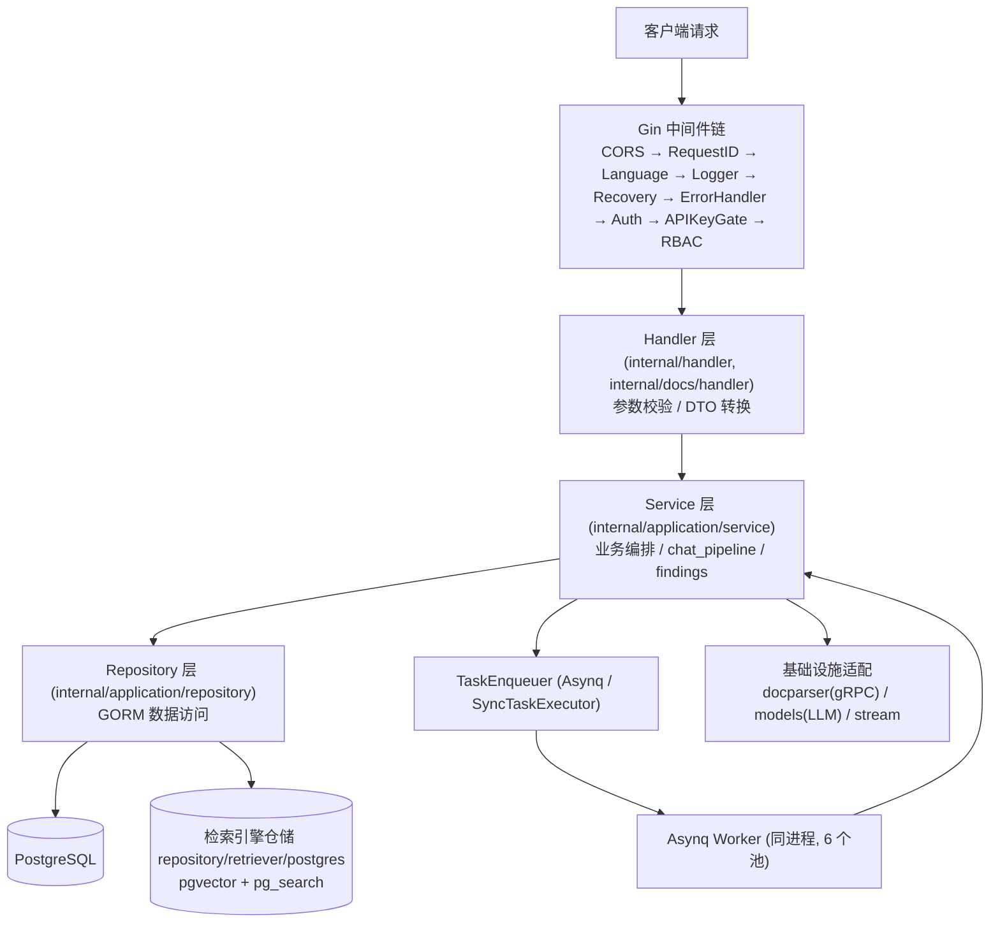
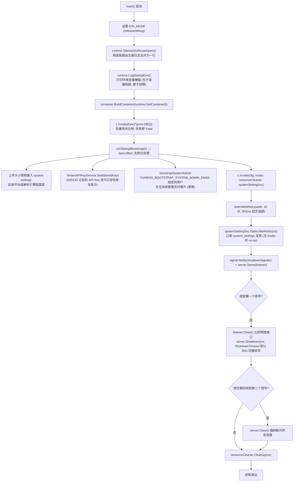
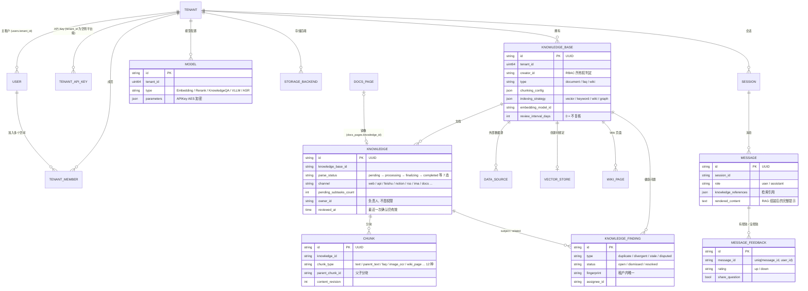

# Go 后端设计

本章深入 Yuheng Go 后端（`internal/` 与 `cmd/server`）的内部设计：分层架构、基于 uber/dig 的依赖注入与扩展接缝、启动与优雅退出流程、路由组织与 RBAC 装配、HTTP 中间件、在线文档与知识健康两个子系统、领域模型、错误处理与日志规范，以及公共工具库。

## 1. 分层架构

后端遵循 **Handler → Service → Repository → 数据库** 四层结构，层间依赖通过接口（`internal/types/interfaces/`）解耦，由 DI 容器在启动时装配：

| 层 | 位置 | 职责 |
| --- | --- | --- |
| Router / Middleware | `internal/router/`、`internal/middleware/` | 路由注册、认证、RBAC、API Key 网关、限流、日志、错误信封 |
| Handler | `internal/handler/`（会话与问答在 `internal/handler/session/`） | 解析请求参数（DTO 在 `internal/handler/dto/`）、调用 Service、写响应；不含业务逻辑 |
| Service | `internal/application/service/`（根目录约 80 个非测试文件，另有 `chat_pipeline/`、`findings/`、`retriever/`、`file/` 等子包） | 业务编排：知识库/知识/分块、会话与 `chat_pipeline/` 流水线、租户与成员、模型、数据源同步、Wiki、知识健康、审计等 |
| Repository | `internal/application/repository/`（约 30 个文件） | 数据访问，统一使用 **GORM**（`r.db.WithContext(ctx)`）；检索引擎的仓储按引擎分包于 `repository/retriever/{postgres,neo4j}`（检索引擎只有 PostgreSQL，Neo4j 用于知识图谱） |
| 独立模块 | `internal/docs/` | 在线文档：自带 model / repository / service / handler / acl / events 等子包，对外只暴露 `docs.Module`（见第 6 节） |
| 领域模型 | `internal/types/` | GORM 实体、枚举、context key、接口定义（`types/interfaces`） |
| 基础设施 | `internal/infrastructure/`（docparser gRPC 客户端、chunker、web_search）、`internal/models/`（chat/embedding/rerank/asr 模型适配）、`internal/stream/`、`internal/datasource/` | 外部系统适配 |
| 扩展接缝 | `internal/extension/`、`internal/database/migration.go` | 独立扩展包挂入服务的入口（见 2.3 节） |



关键约定：

- Handler 只依赖 Service 接口（如 `interfaces.KnowledgeService`），Service 只依赖 Repository 接口与其他 Service 接口；
- 接口集中声明在 `internal/types/interfaces/`，实现方通过 dig 绑定；
- Asynq worker 与 HTTP server 运行在**同一个进程**内，任务处理函数复用同一套 Service；
- 在线文档模块只依赖它自己定义的窄接口（如 `knowledgebridge.go` 里对知识服务的三个方法），不直接依赖 `interfaces.KnowledgeService` 的全部方法。

## 2. 依赖注入：internal/container（uber/dig）

Yuheng 使用 **`go.uber.org/dig` v1.19.0**（运行时构造函数注入，不是代码生成的 wire）。入口是 `internal/container/container.go` 的 `BuildContainer`：

```go
// cmd/server/main.go
c := container.BuildContainer(runtime.GetContainer())

// internal/container/container.go（节选）
func BuildContainer(container *dig.Container) *dig.Container {
    must(container.Provide(NewResourceCleaner, dig.As(new(interfaces.ResourceCleaner))))
    must(container.Provide(config.LoadConfig))
    must(container.Provide(initDatabase))     // *gorm.DB，含迁移
    must(container.Provide(initRedisClient))  // *redis.Client（无 Redis 时为 nil）
    must(container.Provide(NewEngineCatalog))
    must(container.Provide(retriever.PostgresDescriptor, dig.Group(retriever.EngineGroup)))
    ...
    must(container.Provide(docs.NewModule))
    ...
    must(container.Provide(extension.NewFeatures))
    must(extension.ApplyHooks(container))     // 扩展钩子：必须在任何 Invoke 解析之前
    must(container.Provide(router.NewRouter)) // 最终产出 *gin.Engine
    ...
    return container
}
```

`runtime.GetContainer()`（`internal/runtime/container.go`）持有全局单例 `dig.Container`；`must(err)` 对注册失败直接 panic——DI 装配错误属于启动期致命错误。

### 2.1 用到的 dig 特性

| 特性 | 用法示例 |
| --- | --- |
| `dig.As` | 把具体类型绑定为接口：`NewResourceCleaner` → `interfaces.ResourceCleaner`；`router.NewAsyncqClient` → `interfaces.TaskEnqueuer`；`findings.NewTrigger` → `interfaces.KnowledgeFindingsTrigger` |
| `dig.Name` 命名依赖 | 同一接口多实例：任务处理器 `chunkExtractor` / `dataTableSummary` / `imageMultimodal` / `knowledgePostProcess` / `knowledgeAutoTag` / `knowledgeFindings` / `wikiIngest`；6 个 Asynq server（`coreAsynqServer` / `postProcessAsynqServer` / `enrichmentAsynqServer` / `maintenanceAsynqServer` / `sharedAsynqServer` / `wikiAsynqServer`） |
| `dig.Group` 值组 | 可由扩展追加的集合：检索引擎描述符 `retrieve_engines`（`retriever.EngineGroup`）、知识健康检测器 `finding_detectors`（`findings.DetectorGroup`）、扩展路由 `route_registrars`（`extension.RouteRegistrarGroup`） |
| `dig.In` 参数结构体 | `router.RouterParams` 内嵌 `dig.In`，一次注入约 55 个 Handler/Service 依赖；`docs.Params` 把知识服务、存储、收藏、知识健康等都标为 `optional:"true"`，缺一项只让对应功能不可用并记入 `Module.Degraded` |
| `container.Invoke` 执行副作用 | 注册即启动的后台组件：`registerPoolCleanup`、`registerWebSearchProviders`、`startDataSourceScheduler`、`startAuditLogRetention`、`startReviewSweep`、`startHousekeepingService`、`startTemporaryDocumentCleanup`、14 个 `chatpipeline.NewPluginXxx`（插件自注册到 EventManager）、`router.RunAsynqServer` 或 `router.RegisterSyncHandlers`、`recoverPendingWikiTasks` |
| 适配器 Provide | 用闭包做接口转换：`func(s *service.StorageBackendService) interfaces.StorageBackendResolver { return s }`；`RetrieveEngineRegistry` 同实例同时暴露为 `StoreRegistry` |

### 2.2 注册顺序与条件装配

`BuildContainer` 的注册按源码中的日志分为以下阶段：

1. 核心基础设施：config、Langfuse、数据库（含迁移）、文件服务、Redis、ants 池；
2. 检索引擎目录与注册表：`NewEngineCatalog` 收集 `retrieve_engines` 值组（社区版只有 `PostgresDescriptor`），`initRetrieveEngineRegistry` 按 `RETRIEVE_DRIVER` 装配；
3. 外部客户端：docreader gRPC、图片解析器、Ollama、Neo4j、StreamManager、DuckDB；
4. Repository 层（含 `KnowledgeFindingRepository`、`KnowledgeStewardshipRepository`、`MessageFeedbackRepository`）；
5. Service 层，其中知识健康部分：`FinderResolver`、三个核心检测器进 `finding_detectors` 组、`ReviewSweep`、`Runner`、`Trigger`、`knowledgeFindings` 任务处理器、`KnowledgeRetirers` 注册表、findings / stewardship / feedback 三个服务；
6. 联网搜索注册表、向量库与存储后端服务、事件总线、会话服务；
7. **任务执行器条件装配**（见下）；
8. 数据源同步框架、审计保留、复核巡检、Housekeeping、chat_pipeline 插件；
9. Handler 层，第一个就是 `docs.NewModule`；
10. 扩展：`extension.NewFeatures` + `extension.ApplyHooks`；
11. Router，随后启动 Asynq server（或注册同步处理器），最后 `recoverPendingWikiTasks`。

第 7 步是最重要的条件分支——**有无 Redis 决定运行形态**：

```go
redisAvailable := os.Getenv("REDIS_ADDR") != ""
if redisAvailable {
    must(container.Provide(router.NewAsyncqClient, dig.As(new(interfaces.TaskEnqueuer))))
    must(container.Provide(router.NewCoreAsynqServer, dig.Name("coreAsynqServer")))
    ... // 共 6 个 worker 池 + AsynqInspector / AsynqTaskInspector
    must(container.Invoke(registerModelConcurrencyLimiter))      // Redis 分布式 per-model 并发闸门
} else {
    syncExec := router.NewSyncTaskExecutor()                     // 无 Redis：进程内执行器
    must(container.Provide(func() interfaces.TaskEnqueuer { return syncExec }))
    must(container.Provide(router.NewNoopTaskInspector))
    must(container.Invoke(registerLocalModelConcurrencyLimiter)) // 进程内信号量
}
```

6 个 Asynq worker 池的并发度可经 system settings / 环境变量调整（默认 Core=8、PostProcess=2、Enrichment=12、Maintenance=4、Shared=6、Wiki=8，`YUHENG_ASYNQ_*_CONCURRENCY` / `YUHENG_WIKI_ASYNQ_CONCURRENCY`）；队列拓扑与 21 个任务类型定义在 `internal/types/task.go`，详见《异步任务系统》。

### 2.3 扩展接缝与构建顺序

`internal/extension` 是独立扩展包挂入服务的唯一入口：扩展在 `init()` 里调用 `extension.RegisterHook(name, func(c *dig.Container) error)`，钩子可以 `Provide` 新组件、`Decorate` 核心提供的默认值。`ApplyHooks` 必须在核心全部 Provide 之后、第一次解析之前执行——dig 不会拒绝迟到的 `Decorate`，只会让已经构建好的值继续使用未装饰的版本。为把这类顺序错误变成启动失败，凡是可能被扩展追加或装饰的值，其构造函数都先调用 `extension.RequireApplied`：`NewFeatures`、`NewEngineCatalog`、`findings.NewRunnerFromContainer` 都是如此。

扩展目前能提供：特性注册表 `extension.Features`、`/api/v1` 下的路由（`route_registrars` 值组，配合 `extension.RequireFeature` 按特性门控）、检索引擎描述符、知识健康检测器，以及通过 `database.RegisterMigrationSource(name, fsys, table)` 注册的独立迁移源。详见《扩展点指南》第 8、9 节。

### 2.4 资源清理与工厂

- `ResourceCleaner`（`internal/container/cleanup.go`）：各组件通过 `RegisterWithName(name, cleanupFunc)` 注册析构（ants 池、Langfuse flush、数据源调度器、Housekeeping、`KnowledgeReviewSweep` 等），退出时统一 `Cleanup(ctx)`；
- `EngineFactory`（`internal/container/engine_factory.go`）：根据 `vector_stores` 表行在运行时创建检索引擎实例——按行的 `engine_type` 到引擎目录（`retriever.Catalog`，由各引擎的 `EngineDescriptor` 构成）里查描述符并调用其 `New`。社区版目录里只有 postgres 且不可由工作空间注册，因此这条路径在社区版不会创建新引擎；
- `initDatabase`（`container.go`）：`DB_DRIVER` 只接受 `postgres`；内置检索引擎启用时先检查 `vector` / `pg_search` 扩展（`pgextensions.go`），再执行迁移（`AUTO_MIGRATE`，默认开启）。迁移失败默认**终止启动**（`MIGRATION_FAIL_FAST`，设为 `false` 才只告警继续，此时 `/ready` 保持 503）。迁移之后依次执行：`__pending_env__` 存储 provider 回填、遗留存储后端迁移（`migrateLegacyStorageBackends`）、序列同步（`syncSequences`）、遗留 pending 任务复位（`resetPendingTasks`）、`config/builtin_models.yaml` 声明式内置模型 UPSERT。

## 3. cmd/server 启动流程

`cmd/server` 有三个逻辑文件：`main.go`（入口与 HTTP 生命周期）、`bootstrap.go`（一次性引导钩子）、`listen.go`（端口重试），另有 `signals_unix.go` / `signals_windows.go` 提供平台化的 `shutdownSignals`。



要点：

- **先建数据库**：dig 不缓存失败的构造函数，如果不在引导前单独解析一次 `*gorm.DB`，后面每个需要数据库的引导步骤都会重跑一遍迁移、重复同一条失败日志；
- **引导钩子刻意 best-effort**：所有失败路径只 `logger.Warnf`；系统管理员晋升仅当部署中尚无任何系统管理员时生效，不会替尚未注册的邮箱创建账号；
- **HTTP 超时**：只设 `ReadHeaderTimeout`（10s）与 `IdleTimeout`（120s），刻意不设整体读写超时——大文件上传与持续数分钟的 SSE 流都会被它们切断；
- **两段式优雅退出**：第一个 SIGTERM/SIGINT 先关 listener 再 `Shutdown` 排空；第二个信号强制 `Close`。compose 为 `app` 设了 `stop_grace_period: 45s`，长于默认的 30s 排空窗口。

## 4. 路由组织与 RBAC 装配（internal/router）

### 4.1 NewRouter 的装配顺序

`internal/router/router.go` 的 `NewRouter(params RouterParams)` 按以下顺序装配，**顺序即安全语义**：

1. `gin.New()` + `SetTrustedProxies`（`YUHENG_TRUSTED_PROXIES`，默认仅信任回环与私网段，防止伪造 `X-Forwarded-For` 绕过按 IP 限流）；
2. 全局中间件：`cors` → `RequestID` → `Language` → `Logger` → `Recovery` → `ErrorHandler`；
3. 免认证端点：`GET /health`（存活）、`GET /ready`（就绪：数据库、已配置的 Redis、迁移状态都正常才 200，`router/ready.go`）；非 release 模式挂载 `/swagger/*any`；
4. **认证之前**注册的路由：协同服务回调 `/internal/collab/*`（HMAC 共享密钥校验）、在线文档公开分享 `/api/v1/docs/public/*`（链接 key 本身即凭据）、短时效能力 URL（resource grants，`/r/:token`）；
5. `middleware.Auth(...)` 全局认证；随后是需认证的文件代理路由、免认证但签名校验的 presigned 文件路由、Langfuse trace 中间件、`AuditServiceProvider`；
6. `v1 := r.Group("/api/v1")`：先 `v1.Use(rbacGuards.apiKeyAuthorizer.Middleware())`（API Key 网关，JWT 会话直接放行），再依次调用约 30 个 `RegisterXxxRoutes(v1, ..., rbacGuards)`；
7. **扩展路由最后注册**（`RegisterExtensionRoutes`，收集 `route_registrars` 值组）：扩展若注册了核心已占用的路径，gin 会 panic，扩展因此无法替换核心路由；
8. 收尾自检：`rbacGuards.assertAPIKeyPoliciesMatchRoutes(r)` —— 声明的 API Key 策略若指向不存在的路由模板，**启动即 panic**。

### 4.2 路由分组一览

| 分组前缀 | Register 函数 | API Key 策略示例 |
| --- | --- | --- |
| `/auth`、`/me` | RegisterAuthRoutes / RegisterMyInvitationRoutes | 多数免 Key；登录、注册、切换租户按 IP 限流 |
| `/tenants`、`/tenants/:id/*`（成员/邀请/审计） | RegisterTenantRoutes | `manage_members` / `manage_spaces`；`/:id` 组挂 `PathTenantMatch()` |
| `/knowledge-bases`、`/knowledge-bases/:id/knowledge\|faq\|tags\|shares\|activity` | RegisterKnowledgeBaseRoutes 等 | `retrieve` / `ingest` |
| `/knowledge`、`/chunks` | RegisterKnowledgeRoutes / RegisterChunkRoutes | `ingest` |
| `/docs/*` | RegisterDocsRoutes（模块未启用时不注册） | 按读 / 写 / 管理三档声明；页面与空间权限由模块自己的 `acl.Guard` 判定 |
| `/knowledge-bases/:id/findings*`、`/findings/assigned*` | RegisterKnowledgeFindingRoutes | 读 `retrieve`，处理 `ingest`，重新检测 `manage_kbs` |
| `/knowledge/:id/stewardship\|owner\|review` | RegisterKnowledgeStewardshipRoutes | 读 `retrieve`，转交负责人与确认复核 `ingest`（确认复核还要求登录用户） |
| `/sessions/:id/feedback`、`/sessions/:id/messages/:message_id/feedback` | RegisterMessageFeedbackRoutes | 路由策略 `chat`；提交反馈要求登录用户，API Key 调用被拒绝 |
| `/sessions`、`/knowledge-chat`、`/knowledge-search`、`/messages` | RegisterSessionRoutes / RegisterChatRoutes / RegisterMessageRoutes | `chat` / `retrieve` |
| `/models`、`/evaluation`、`/initialization` | RegisterModelRoutes / RegisterEvaluationRoutes / RegisterInitializationRoutes | `manage_models` / `run_evaluations` |
| `/system`、`/system/admin` | RegisterSystemRoutes / RegisterSystemAdminRoutes | admin 组强制 `g.SystemAdmin()` |
| `/web-search`、`/web-search-providers` | RegisterWebSearchRoutes / RegisterWebSearchProviderRoutes | `manage_web_search` |
| `/vector-stores`、`/storage-backends` | RegisterVectorStoreRoutes / RegisterStorageBackendRoutes | `manage_vector_stores` / `manage_storage_backends` |
| `/organizations`、`/user/favorites` | RegisterOrganizationRoutes / RegisterUserFavoriteRoutes | `manage_spaces` 等 |
| `/datasource`、`/knowledgebase/:kb_id/wiki`、`/chunker/preview` | RegisterDataSourceRoutes / RegisterWikiPageRoutes / RegisterChunkerDebugRoutes | `manage_datasources` / `ingest` |

各端点的精确权限见 04 API 参考；知识健康相关端点见 [知识健康](../03-features/22-knowledge-health.md) 第 6 节。

### 4.3 rbacGuards：集中式权限矩阵

`internal/router/rbac.go` 定义 `rbacGuards`，由 `NewRouter` 构造一次后传入每个 Register 函数。守卫在路由行内联使用，一眼可见权限要求：

```go
kb.PUT("/:id", g.OwnedKBOrAdmin(), handler.UpdateKnowledgeBase)
```

- **角色守卫**（调用者在租户内是什么角色）：`Viewer()` / `Contributor()` / `Admin()` / `Owner()` / `AdminOrSystemAdmin()` / `SystemAdmin()`，底层是 `middleware.RequireRole`；
- **所有权守卫**（是否为资源创建者或 Admin+）：`OwnedKBOrAdmin()`、`OwnedKnowledgeKBOrAdmin()`、`OwnedChunkKBOrAdmin()`、`OwnedWikiKBOrAdmin()` 等——子资源通过 `KBCreatorLookupFromKnowledgeID` 等闭包沿 URL 参数回溯到所属 KB 的 `creator_id`；
- **知识库访问守卫**（自有 KB / 跨组织共享 KB 两层解析）：`KBAccessRead|Write(param)` 及 `...FromKnowledgeIDParam` / `...FromChunkIDParam` 变体，底层是 `middleware.RequireKBAccess`；
- **租户边界守卫**：`CrossTenant()`（平台级操作需 `EnableCrossTenantAccess` + `CanAccessAllTenants`）、`PathTenantMatch()`（`/tenants/:id` 必须与上下文租户一致）。

所有守卫尊重 `cfg.Tenant.EnableRBAC`：关闭时只记录"本应拒绝"日志后放行。

**API Key 策略**与角色守卫正交：`apiKeyGroup(grp, policy)` 在注册路由的同时把 `(method, fullPath) → APIKeyRoutePolicy` 写入 `APIKeyRouteAuthorizer` 策略表；策略构造器有 `apiKeyFullAccess()`、`apiKeyPlatform(...)` 及一组能力包装器（`apiKeyRetrieve` / `apiKeyChat` / `apiKeyIngest` / `apiKeyManageModels` ...）。未注册策略的路由对 API Key 主体默认 **fail-closed 拒绝**；扩展通过 `Routes.APIKeys(policy)` 走同一张策略表。

## 5. 中间件清单（internal/middleware）

按请求经过的先后顺序：

| 中间件 | 文件 | 职责与关键逻辑 |
| --- | --- | --- |
| `cors.New`（gin-contrib） | `router/cors.go` | 允许 `Authorization`、`X-API-Key`、`X-Tenant-ID`、`X-Request-ID` 等头；来源白名单 `YUHENG_CORS_ALLOWED_ORIGINS` |
| `RequestID()` | `logger.go` | 复用请求头 `X-Request-ID` 或生成 UUID，写入 gin context 与 `Request.Context()` |
| `Language()` | `language.go` | 决定文档处理语言：`YUHENG_LANGUAGE` > `Accept-Language` 首个标签 > 默认 `zh-CN` |
| `Logger()` | `logger.go` | 请求/响应日志；脱敏密码/令牌字段、截断 base64 图片、跳过 SSE 响应体 |
| `Recovery()` | `recovery.go` | panic 捕获 + 堆栈记录 + 500 响应 |
| `ErrorHandler()` | `error_handler.go` | 读取 `c.Errors` 末位错误：`*errors.AppError` 按其 `HTTPCode` 返回 `{success:false, error:{code,message,details}}`；其余 500 |
| `AuthIPRateLimit(scope, limit)` | `auth_ip_ratelimit.go` | 登录、注册、切换租户、在线文档公开页解锁的按 IP 每分钟限流；有 Redis 时跨实例共享 |
| `PublicAuthRateLimit()` | `auth_public_ratelimit.go` | 免认证的邀请查询 / 受邀注册路由：进程内存滑动窗口，超限 429 |
| `Auth(...)` | `auth.go` | 认证三态：JWT（`Authorization: Bearer`）、API Key（`X-API-Key`）、免认证白名单。支持 `X-Tenant-ID` 切换租户（自有租户 / 跨租户管理员 / 有效成员关系三层校验）；写入 `TenantIDContextKey`、`UserContextKey`、`TenantRoleContextKey`、`PrincipalContextKey` 等 |
| `langfuse.GinMiddleware()` | `internal/tracing/langfuse` | LLM trace；未配置 `LANGFUSE_*` 时为 no-op |
| `AuditServiceProvider()` | `audit_provider.go` | 把 `AuditLogService` 注入 gin context，供 RBAC 拒绝路径记审计 |
| `APIKeyRouteAuthorizer.Middleware()` | `api_key_gate.go` | API Key 主体的路由级网关：查策略表，校验 `PlatformOnly` / `RequireFullAccess` / `Capabilities`；未声明路由默认拒绝；JWT 用户透传 |
| `RequireRole(min)` 等 | `rbac.go` | 租户内角色下限（owner=40 > admin=30 > contributor=20 > viewer=10）；`RequireOwnershipOrRole` 允许资源创建者越过下限；拒绝时 `AuditService.LogDenied` |
| `RequireCrossTenantAccess()` / `RequirePathTenantMatch()` | `access.go` | 平台级操作网关与 URL 租户一致性校验 |
| `RequireKBAccess(resolver, perm, ...)` | `kb_access.go` | KB 两层访问解析，并把 `Request.Context()` 中的租户**改写**为 KB 源租户，使下游检索落到正确租户 |
| `asynqdl.Middleware()` | `asynqdl/` | 非 HTTP：Asynq 任务重试耗尽时写入 `task_dead_letters`，可挂 `OnDeadLetter` 回调（如把知识标记为解析失败） |

## 6. 在线文档模块（internal/docs）

在线文档是一个自成一体的模块：空间（`docs_spaces`）、页面树（`docs_pages`，分数索引排序）、评论、附件、分享、历史版本、模板、标签、导入导出等。它由 `YUHENG_DOCS_ENABLED` 开关（默认关闭），关闭时 `docs.NewModule` 返回 `Enabled=false` 的空模块，路由一条都不注册。

| 部件 | 位置 | 说明 |
| --- | --- | --- |
| 装配 | `internal/docs/module.go` | `NewModule(Params)` 构建仓储、权限解析器、事件总线、审计、服务与 handler，并启动索引器与清理器；缺失的可选依赖记入 `Degraded` 并告警 |
| 权限 | `internal/docs/acl/` | 空间角色 + 页面限制/授权的解析器（`Resolver`）与路由守卫（`Guard`）；决策缓存在 Redis（无 Redis 时在内存），任何可能改变权限的事件都会让该租户的缓存失效 |
| 事件总线 | `internal/docs/events/` | 有 Redis 时为 `RedisBus`（跨实例），否则 `MemoryBus`；驱动权限缓存失效、通知、SSE 推送与知识库镜像 |
| 协同 | `internal/docs/collab/`、`handler/collab.go` | 与 `collab/` 服务的 HMAC 签名回调（`/internal/collab/authenticate\|load/:pid\|store\|health`）。未配置协同服务时改用独占编辑租约（`docs_edit_leases`） |
| 知识库镜像 | `indexer.go`、`index/policy.go`、`service/index*.go`、`knowledgebridge.go` | 见下 |
| 维护 | `cleanup.go` | 按 `YUHENG_DOCS_CLEANUP_INTERVAL_MINUTES` 定时运行 `service/maintenance.go` 的两项清理：回收站中超过保留期（`YUHENG_DOCS_TRASH_RETENTION_DAYS`）的页面、从未被页面引用的孤儿附件 |

**页面如何进入知识库**：空间可以绑定一个知识库。索引器（`Indexer`）订阅模块事件，把"这个页面需要再看一次"写进 `docs_index_state`（`due_at` 带防抖，默认 60 秒，`YUHENG_DOCS_INDEX_DEBOUNCE_SECONDS`；限制访问、移动、删除这类收回可见性的事件立即到期）。每个实例都运行同一个循环：按 `FOR UPDATE SKIP LOCKED` 认领到期行并设 10 分钟租约（`claimed_until`），重新推导该页面是否应该被索引，再通过 `knowledgeBridge` 以**手工知识**（`channel=docs`）创建或更新镜像条目，于是后续的分块、索引、后处理与知识健康检测与普通文档完全一致。只有对整个空间可见、未被排除（`exclude_from_knowledge`）、不在回收站的页面才会被镜像——检索没有条目级权限过滤，受限页面进入知识库就等于泄露。`seq` 与 `indexed_hash` 让晚到、重复或乱序的事件只多一次无害的检查；每 5 分钟的 `RequeueIndex` 兜住没有事件的变化（如空间换绑知识库）。

镜像条目在知识健康里的"取代"（supersede）不删除页面，而是把页面排除出知识库并在页面上标记 `superseded_by`：模块在构建时把自己的 `pageRetirer` 注册到 `KnowledgeRetirers` 注册表（来源 `docs`），知识健康服务按条目来源查找退出方式，从而不必反向依赖文档模块。

## 7. 知识健康（internal/application/service/findings）

知识健康在文档内容变化后运行一组检测器，把报告的问题存为 `knowledge_findings`。结构：

| 部件 | 说明 |
| --- | --- |
| `Detector` 接口与值组 | `detector.go`；核心提供 `DuplicateDetector`（比较已存储向量并逐字比对，报告 `duplicate` / `divergent`，阈值 `YUHENG_FINDINGS_DUPLICATE_MIN_SCORE`）、`ReviewDetector`（超过知识库复核周期无人确认，`stale`）、`DisputeDetector`（回答被标为「没帮助」时指向其引用的文档，`disputed`）；扩展可向 `finding_detectors` 组追加 |
| `FinderResolver` | `engine.go`；经引擎注册表按知识库的向量库绑定取得 `SimilarChunkFinder`，引擎不支持时健康概览显示「不支持」 |
| `Runner` | `runner.go`；按名字顺序运行全部检测器，按 `(tenant_id, fingerprint)` 插入或更新，已运行的检测器不再报告的 `open` 问题自动 `resolved`；并按每条问题的派发规则（负责人 / 最近经手人 / 最久未经手者）重新计算处理人 |
| `Trigger` | `trigger.go`；把检测排成 `knowledge:findings` 任务（维护队列，按文档 30 秒防抖）。调用点：`KnowledgePostProcessService` 在每次索引完成后调用一次（上传、重解析、手工编辑、文档镜像都经过这里），此外还有转交负责人、确认复核、提交/撤回反馈、手动重新检测 |
| `TaskHandler` | `task.go`；文档已删除、移走或正在重新索引、功能已关闭时直接成功返回 |
| `ReviewSweep` | `review.go`；每小时查找复核到期的文档并排检测（`startReviewSweep` 启动，随 `YUHENG_FINDINGS_ENABLED` 开关） |
| 服务层 | `knowledge_findings.go`（列表、概览、忽略/重开、指派、取代、重新检测）、`knowledge_stewardship.go`（负责人 `knowledges.owner_id`、确认复核 `reviewed_at/reviewed_by`）、`message_feedback.go`（`message_feedback` 表）、`knowledge_retirers.go`（按来源的退出方式注册表） |

数据库层面，`knowledges` 上的触发器在文档软删除、硬删除或换知识库时删除相关问题记录（迁移 000124），检测器不需要自己清理。

## 8. 领域模型总览（internal/types）

`internal/types/` 中约 30 个实体声明了 `TableName()`，其余用 GORM 默认表名。核心关系：



设计要点：

- **多租户隔离**：几乎所有实体带 `TenantID`；`tenant_id=0` 表示系统级（如系统审计）；
- **敏感字段静态加密**：`Model.Parameters`、`VectorStore.ConnectionConfig`、`StorageBackend.Config`、`DataSource.Config`、`TenantAPIKey` 等在 GORM `Value()` 时以 `SYSTEM_AES_KEY`（32 字节）做 AES-256-GCM 加密；
- **创建时绑定不可变**：KB 的 `VectorStoreID`（gorm tag `<-:create`）与 `StorageBackendID` 一经创建不可修改；
- **异步状态机**：`Knowledge.ParseStatus` 七态 + `PendingSubtasksCount` 追踪 finalizing 阶段的富化子任务；
- **负责人不是权限**：`Knowledge.OwnerID` 只决定问题派给谁，创建时默认取当前用户；条目来源（`KnowledgeOrigin`：`local` / `docs` / `synced`）由 `channel` 与 `metadata.datasource_id` 推导，决定"取代"时的退出方式；
- **审计 append-only**：`AuditLog` 无更新/软删字段；
- 非实体的重要类型：`SearchResult`、`Pagination`、队列拓扑（`task.go`）、各类 JSONB 配置结构（`ChunkingConfig`、`IndexingStrategy`、`FindingDetails` 等）、context key 与取值助手。

在线文档模块的实体在 `internal/docs/model/`（`space.go`、`page.go`、`collab.go`），表结构见《数据库与迁移》。

## 9. 错误处理规范（internal/errors）

统一错误载体是 `AppError`：

```go
// internal/errors/errors.go
type AppError struct {
    Code     ErrorCode // 业务错误码
    Message  string
    Details  any
    HTTPCode int       // HTTP 状态映射
}
```

- **错误码分段**：1000–1999 通用 HTTP 语义（`ErrBadRequest=1000`、`ErrUnauthorized=1001`、`ErrForbidden=1002`、`ErrNotFound=1003`、`ErrConflict=1005`、`ErrTooManyRequests=1006`、`ErrServiceUnavailable=1008`、`ErrValidation=1010`）；2000–2099 租户；2200–2299 向量库绑定（2100–2199 曾是上游的 Agent 错误码，已随 Agent 一起删除）；
- **构造函数**：`NewBadRequestError` / `NewUnauthorizedError` / `NewForbiddenError` / `NewNotFoundError` / `NewValidationError` / `NewConflictError` / `NewTooManyRequestsError` / `NewServiceUnavailableError` 等；
- **配合方式**：Handler/中间件用 `c.Error(appErr)` 挂错，`ErrorHandler` 末端统一渲染信封，前端据 `error.code` 做 i18n；非 `AppError` 一律 500。扩展的特性门控另有字符串码 `feature_disabled`（`extension.FeatureDisabledCode`）；
- `session.go` 提供会话域哨兵错误；`parse_error_codes.go` 定义文档解析阶段的字符串错误码（`DOCREADER_TIMEOUT`、`EMBEDDING_RATE_LIMIT`、`VECTORSTORE_WRITE_FAILED`、`TASK_TIMEOUT` 等），落在 `Knowledge.ErrorMessage` 与处理 span 上供前端翻译。

## 10. 日志体系（internal/logger）

- 基于 **logrus**，私有 `appLogger` 单例 + 自定义 Formatter（`LOG_FORMAT` 可用 `%d` `%level` `%traceId` `%msg` 等占位符；`LOG_PATH` 设置后经 lumberjack 轮转写文件并剥离 ANSI 颜色码）；
- **request_id 贯穿**：`middleware.RequestID` 写入 context → `logger.GetLogger(ctx)` 自动注入 `request_id` 字段；常用出口为 `logger.Infof/Warnf/Errorf(ctx, format, ...)`；
- **LLM 调试日志**（`llm_logger.go`）：`LLM_DEBUG_LOG=true` 时按 request_id 分文件记录每次 LLM 调用（Chat/Embedding/Rerank/VLM、模型、耗时、完整消息、错误），7 天自动清理。

## 11. 关键工具库（internal/common、internal/utils）

| 位置 | 工具 | 用途 |
| --- | --- | --- |
| `common/tools.go` | `Deduplicate` / `DeduplicateWithScore`、`ParseLLMJsonResponse`、`CleanInvalidUTF8`、`PipelineLog` 系列 | 泛型去重、解析 LLM 返回的 JSON 代码块、清洗非法 UTF-8、RAG 管道阶段日志 |
| `common/db_retry.go` | `WithDeadlockRetry(ctx, fn)` | 数据库死锁检测重试 |
| `common/redis_tls.go`、`common/redislock/` | `RedisTLSConfig()`、分布式锁 | Redis TLS 配置与锁 |
| `utils/crypto.go` | `EncryptAESGCM` / `DecryptAESGCM`（`enc:v1:` 前缀，幂等） | 敏感字段静态加密的底层实现 |
| `utils/security.go` | `SanitizeHTML`、`ValidateFilePath`、`SanitizeForLog` | XSS 清洗、目录穿越防护、日志脱敏 |
| `utils/inject.go` | `ValidateSQL`（基于 `pg_query_go`） | 表格摘要 DuckDB 查询的白名单校验与注入检测 |
| `utils/presign.go` | `GeneratePresignURL` / `ValidatePresignURL` | HMAC-SHA256 预签名文件 URL |
| `utils/oidc_state.go` | `GenerateState` / `ValidateState` | OIDC state 的 HMAC 签名与 TTL |
| 其余 | `taskid.go` / `fileutil.go` / `filesize.go` / `httputil.go` / `json.go` 等 | 任务 ID、文件大小限制、HTTP 下载、JSON Schema 生成等 |

## 实现参考

| 主题 | 源码 |
| --- | --- |
| 容器装配 | `internal/container/container.go`、`findings.go`、`engine_factory.go`、`pgextensions.go`、`reset_pending_tasks.go` |
| 扩展接缝 | `internal/extension/extension.go`、`routes.go`、`internal/router/routes_extension.go`、`internal/database/migration.go` |
| 启动 | `cmd/server/main.go`、`bootstrap.go`、`listen.go` |
| 路由与权限 | `internal/router/router.go`、`rbac.go`、`ready.go`、`routes_*.go`、`internal/middleware/` |
| 在线文档 | `internal/docs/module.go`、`indexer.go`、`knowledgebridge.go`、`index/policy.go`、`repository/indexstate.go` |
| 知识健康 | `internal/application/service/findings/`、`knowledge_findings.go`、`knowledge_stewardship.go`、`message_feedback.go`、`knowledge_retirers.go` |
| 错误与日志 | `internal/errors/`、`internal/logger/` |
