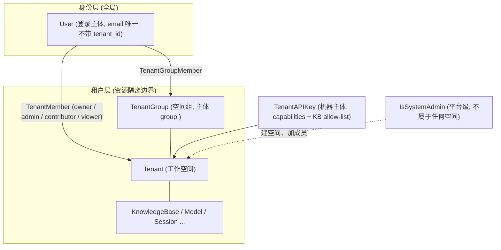
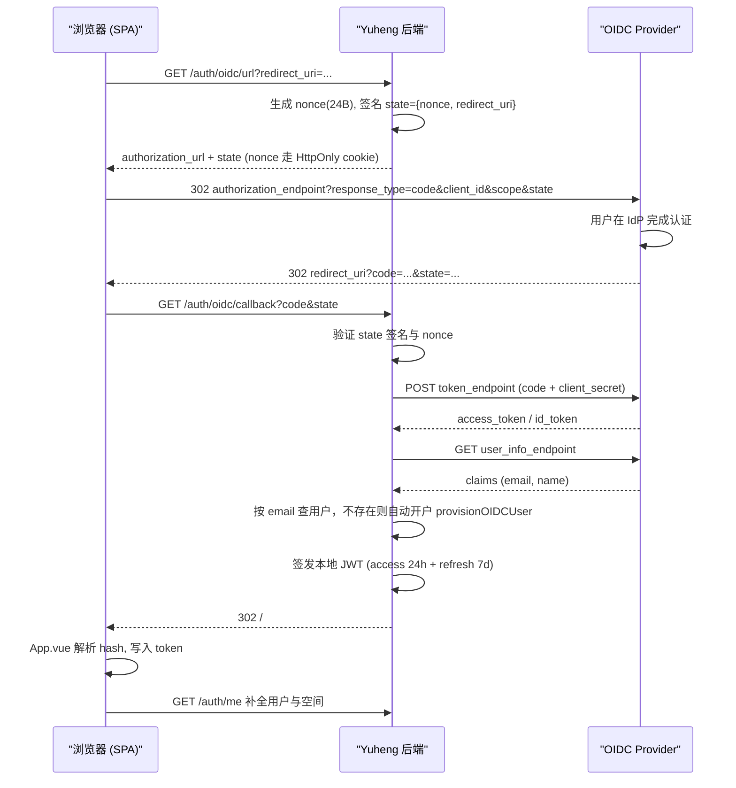

# 租户、用户与认证授权

在 Yuheng 里，**用户**是全局身份：注册只创建账号，账号本身不属于任何空间。**空间**（后端叫租户 Tenant，界面上叫工作空间）是资源隔离边界：知识库、模型、会话、API Key 都归属某个空间，配额也按空间算。一个用户可以是多个空间的成员，每个成员关系有各自的角色。

模型是**一个企业一个空间，空间内知识库任意多**：部署的第一个注册者（bootstrap）创建默认空间并成为它的 Owner 与系统管理员；之后再建空间只有系统管理员可以。企业内的团队用**空间组**（见 §8）表达，不再有跨空间共享知识库的「组织」——一个知识库只能从拥有它的空间访问。

日常最常用的操作：

| 想做什么 | 怎么做 |
| --- | --- |
| 部署后创建第一个账号 | 直接在注册页注册。默认的 `auto` 注册模式下，第一个注册的人同时创建默认空间（注册页此时多一个「空间名称」字段，默认「默认空间」）、成为其 Owner 与系统管理员，之后公开注册自动关闭（见 §2.1） |
| 让没有账号的人加入 | 空间设置 → 成员 → 生成邀请链接，对方凭链接注册并直接进入空间（公开注册关闭时也可用）；或由系统管理员在「设置 → 用户与空间」创建账号，创建时可直接选定空间与角色 |
| 拉同事进来一起用 | 空间设置 → 成员 → 邀请（对方须已有账号），并给对方一个角色（Owner / Admin / Contributor / Viewer）；系统管理员也可以在「用户与空间」里把任何账号加入任何空间 |
| 把成员分组，批量授权 | 空间设置 → 空间组：建组、加人；在线文档的空间成员与页面授权可以直接授给组（见 §8） |
| 再开一个空间 | 只有**系统管理员**可以（「设置 → 用户与空间 → 创建空间」或 `POST /tenants`），创建时就要指定 Owner |
| 让程序调接口 | 由空间 Owner 在 **设置 → 空间 → API Key** 创建 API Key（等价接口 `POST /api/v1/tenants/:id/api-keys`），按需勾选能力（检索 / 问答 / 入库 / 管理），必要时限定可访问的知识库、设置过期时间；之后可在同一页修改授权范围或吊销 |
| 管理整个部署（全局设置、空间与账号、任务队列、跨空间审计） | 需要**系统管理员**身份，与空间 Owner 是两回事，见[平台管理与系统管理员](20-platform-admin.md) |
| 删除整个空间 | 空间设置里由 **Owner** 触发（`DELETE /tenants/:id`）；会连带清掉该空间的知识库、会话与成员关系，不可撤销。空间里还有别的成员、或它是部署里最后一个空间时拒绝（见 §7.3） |

四个角色能做什么，一句话版本：Viewer 只能看和问，Contributor 可以建库和传文档，Admin 管成员和空间设置，Owner 额外能删空间和转让。完整矩阵见下文 RBAC 章节。

技术上，认证支持密码登录、OIDC 单点登录与 API Key 三种主体；授权由空间内 RBAC 角色阶梯 + 资源所有权（ownership）+ API Key 能力（capability）三套正交机制共同实现，下面逐层展开。

## 概念总览



关键点：

- 用户与空间之间**只有** `tenant_members` 一种关系：一个 User 可以同时属于多个 Tenant，每个成员关系有独立角色。用户行上没有「主空间」，`users.tenant_id` 已删除（迁移 000139）；用户「当前所在」的空间只是一个偏好 `preferences.last_active_tenant_id`，每次登录都按成员关系校验。
- 没有任何空间的用户可以登录，但只能访问身份级接口（`/auth/me`、邀请收件箱等），其余接口返回 409 `TENANT_REQUIRED`；界面提示「你的账号还没有加入任何空间，请联系管理员」。
- 知识库只能从拥有它的空间访问；别的空间的知识库对调用者来说**不存在**（404），没有跨空间共享通道。
- 空间组是空间内的成员集合，授权可以授给组（`group:<id>`）；表与类型名沿用 `tenant_groups` / `TenantGroup`。
- API Key 是与 JWT 用户完全独立的机器主体，不复用租户角色阶梯；空间 Key 始终以合成用户 `system-<tenantID>` 的身份行动。

## 1. 数据模型

### 1.1 Tenant（租户 / 工作空间）

`internal/types/tenant.go`：

```go
type Tenant struct {
    ID                      uint64               `json:"id" gorm:"primaryKey"`
    Name                    string               `json:"name"`
    Description             string               `json:"description"`
    Status                  string               `json:"status" gorm:"default:'active'"`
    RetrieverEngines        RetrieverEngines     `json:"retriever_engines" gorm:"type:json"`
    Business                string               `json:"business"`
    StorageQuota            int64                `json:"storage_quota"` // ≤ 0 = 不限
    StorageUsed             int64                `json:"storage_used"  gorm:"default:0"`
    ContextConfig           *ContextConfig       `json:"context_config" gorm:"type:jsonb"`
    WebSearchConfig         *WebSearchConfig     `json:"web_search_config" gorm:"type:jsonb"`
    ParserEngineConfig      *ParserEngineConfig  `json:"parser_engine_config" gorm:"type:jsonb"`
    Credentials             *CredentialsConfig   `json:"credentials" gorm:"type:jsonb"`
    DefaultStorageBackendID string               `json:"default_storage_backend_id" gorm:"not null;default:'env'"`
    ChatHistoryConfig       *ChatHistoryConfig   `json:"chat_history_config" gorm:"type:jsonb"`
    RetrievalConfig         *RetrievalConfig     `json:"retrieval_config" gorm:"type:jsonb"`
    APIPrincipalConfig      *APIPrincipalConfig  `json:"-" gorm:"type:jsonb"`
    // CreatedAt / UpdatedAt / DeletedAt（软删除）
}
```

租户是配额（`StorageQuota` / `StorageUsed`；新空间按系统设置 `tenant.default_storage_quota_gb` 取值，默认 0 即不限，列上没有 gorm 默认值，所以 0 不会被覆盖成别的数）与各类租户级配置（检索引擎、Web 搜索、解析引擎、凭证、聊天历史等）的挂载点。存储没有租户级配置：`DefaultStorageBackendID` 指向一个存储后端（新租户为部署存储 `env`），见[存储后端](19-storage-backends.md)。

### 1.2 User（用户）

`internal/types/user.go`：

```go
type User struct {
    ID                  string          `json:"id" gorm:"type:varchar(36);primaryKey"`
    Username            string          `json:"username" gorm:"uniqueIndex;not null"`
    Email               string          `json:"email" gorm:"uniqueIndex;not null"`
    PasswordHash        string          `json:"-" gorm:"not null"`
    Avatar              string          `json:"avatar"`
    IsActive            bool            `json:"is_active" gorm:"default:true"`
    CanAccessAllTenants bool            `json:"can_access_all_tenants" gorm:"default:false"` // 跨租户超级用户
    IsSystemAdmin       bool            `json:"is_system_admin" gorm:"default:false;index"`  // 平台管理员
    Preferences         UserPreferences `json:"preferences" gorm:"type:jsonb"`
}

type UserPreferences struct {
    // 用户「当前所在」的空间：新设备登录、刷新 token 时落到这里，
    // 也是没带 X-Tenant-ID、JWT 里又没有 tenant_id 时的作用域。
    // 它只是一个指针，是否可用由 tenant_members 决定（见下文解析顺序）。
    LastActiveTenantID *uint64 `json:"last_active_tenant_id,omitempty"`
    // OIDC 自动开户的账号为 true：它的密码是随机生成、用户不知道的，
    // 个人资料页因此隐藏「修改密码」，直到用户通过改密接口设置一个已知密码
    OidcOnlyLogin *bool `json:"oidc_only_login,omitempty"`
}
```

用户行上**没有** `tenant_id`：用户是全局身份，属于哪些空间只看 `tenant_members`。请求作用于哪个空间（「当前空间」）由一个统一的解析器决定，登录签发 token、刷新 token 和认证中间件都走同一条路径（`UserService.ResolveActiveTenantID` 与 `middleware/auth.go` 的 `resolveTargetTenant`），顺序是：

1. 请求头 `X-Tenant-ID`（须是该空间的活跃成员，或跨空间超管；畸形或 0 值返回 400，无权访问返回 403）；
2. JWT 里的 `tenant_id` claim（登录或 `/auth/switch-tenant` 签发时写入）；
3. `preferences.last_active_tenant_id`，且它指向的空间仍存在、用户仍是活跃成员（或 CanAccessAllTenants）；
4. 按加入时间最早的活跃成员关系（结果回写为偏好，下次不再遍历）；
5. 以上都没有 → 无空间。认证通过但只放行身份级接口，其余返回 409 `TENANT_REQUIRED`。

一个还没有任何空间的用户拿到的 token 里 `tenant_id` 为 0；接受邀请或被管理员加入空间后，下一次请求就会按第 3/4 步落到那个空间，不需要重新登录。

两个特殊标志：

- `CanAccessAllTenants`：跨空间超级用户。**必须两个开关同时为真**才生效——用户行上的 `CanAccessAllTenants`，以及部署级的 `tenant.enable_cross_tenant_access` / `YUHENG_TENANT_ENABLE_CROSS_TENANT_ACCESS`（`middleware/access.go` 的 `IsCrossTenantSuperuser()` 先查配置再查用户；配置关掉时登录响应里这个字段也会被抹成 false）。生效后可绕过空间角色检查，访问任意空间，并与系统管理员一样能调空间目录接口（`/tenants/all`、`/tenants/search`、`POST /tenants`）。
- `IsSystemAdmin`：平台级管理员（system admin），独立于任何租户角色，用于 `/system/admin/*` 控制面，也是创建空间、把用户加入任意空间的身份（`middleware/access.go` 的 `CanManageTenantCatalog`：系统管理员、生效中的跨空间超管、平台 API Key 三者之一）。它管的是整个部署而不是某个空间，怎么产生第一个、能做什么见[平台管理与系统管理员](20-platform-admin.md)。

### 1.3 TenantMember 与租户角色

`internal/types/tenant_member.go`：

```go
type TenantRole string

const (
    TenantRoleOwner       TenantRole = "owner"       // 完全控制：删除租户、转移所有权、管理 API Key、成员
    TenantRoleAdmin       TenantRole = "admin"       // 管理成员、模型、向量库等租户基础设施
    TenantRoleContributor TenantRole = "contributor" // 创建 KB、编辑自己创建的资源
    TenantRoleViewer      TenantRole = "viewer"      // 只读
)

var tenantRoleLevel = map[TenantRole]int{
    TenantRoleOwner: 40, TenantRoleAdmin: 30,
    TenantRoleContributor: 20, TenantRoleViewer: 10,
}

func (r TenantRole) HasPermission(required TenantRole) bool {
    return r.Level() >= required.Level()
}
```

```go
type TenantMember struct {
    ID        uint64
    UserID    string
    TenantID  uint64
    Role      TenantRole         // 默认 contributor
    Status    TenantMemberStatus // active / invited / suspended
    InvitedBy *string
    JoinedAt  time.Time
}
```

登录响应里返回 `Membership{TenantID, TenantName, Role}` 投影列表，前端据此渲染工作空间切换器。

一个空间可以有**多位** Owner，约束是「至少一位」：降级或移除成员、成员自己退出时，只有会让空间失去最后一位活跃 Owner 的操作被拒绝（`ErrLastOwner`）。

空间**从诞生起就有 Owner**：bootstrap 注册在同一个事务里写入空间、用户与 Owner 成员关系；`POST /tenants` 在同一个请求里创建空间并写入 Owner（`owner_email` 指定，缺省为调用者本人），写不进去就把空间回滚。因此认证中间件没有「孤儿空间自愈」：`resolveTenantRole` 只看成员关系行与跨空间超管，没有成员的空间是要暴露的 bug，不是靠把下一个登录的人提升为 Owner 来修的状态。

### 1.4 TenantAPIKey（API Key）

`internal/types/tenant_api_key.go`：

```go
type TenantAPIKey struct {
    ID               uint64
    TenantID         *uint64         // platform key 为 NULL
    ScopeType        APIKeyScopeType // "tenant" | "platform"
    Name             string
    KeyHash          string      `json:"-" gorm:"uniqueIndex"` // 认证用的 SHA-256
    KeyHint          string      `json:"api_key"`              // 掩码提示，不可还原
    FullAccess       bool        // 全量访问（不受 capabilities 限制）
    KnowledgeBaseIDs StringArray // KB allow-list（空 = 不限制）
    Capabilities     StringArray // 能力列表
    LastUsedAt / ExpiresAt / RevokedAt *time.Time
}
```

- **不落库明文**：Key 只在创建时返回一次（响应里的 `token`），库里只存两样东西：认证用的不可逆 `KeyHash`（SHA-256），以及用来区分 Key 的 `KeyHint`（前 7 位 + `...` + 后 4 位，接口里仍以 `api_key` 字段返回）。两者都无法还原出 Key，所以丢了只能吊销重建。
- **校验流程**：请求携带 `X-API-Key` → 计算哈希 → 按 `KeyHash` 查表 → 检查 `RevokedAt` / `ExpiresAt` → 将 `TenantAPIKeyScope{KeyID, ScopeType, FullAccess, KnowledgeBaseIDs, Capabilities}` 注入 context，后续用 `types.TenantAPIKeyScopeFromContext` 读取。

### 1.5 TenantGroup（空间组）

`internal/types/tenant_group.go`：

```go
type TenantGroup struct {
    ID          string
    TenantID    uint64
    Name        string            // 空间内不区分大小写唯一
    Description string
    IsDefault   bool              // 隐式的「所有人」组：成员就是全部活跃成员，不写 tenant_group_members
    Source      TenantGroupSource // manual（默认）| oidc | ldap —— SSO 组映射的挂点
    ExternalID  *string
    CreatorID   *string           // API Key 创建的组为空：合成用户不是账号
}

type TenantGroupMember struct {
    GroupID  string
    UserID   string
    TenantID uint64
    AddedBy  *string
}
```

空间组是空间内的一组成员，授权时作为一个主体（`group:<id>`）使用。它曾是在线文档模块的一部分，现在是核心概念（`internal/application/service`、`internal/handler`、`internal/router/routes_groups.go`），不依赖 `YUHENG_DOCS_ENABLED`；表名与类型名沿用 `tenant_groups` / `TenantGroup`，因为 ACL 主体 `group:<id>` 与已存的行是契约的一部分。管理方式见 §8。

## 2. 注册与登录

### 2.1 注册模式

`internal/handler/auth.go` + `internal/config/config.go`：

```go
type AuthConfig struct {
    RegistrationMode string // "auto"（默认：仅在还没有任何用户时开放，首个注册者创建默认空间并成为系统管理员） | "self_serve"（公开注册） | "invite_only"（仅邀请）
}

func (c *AuthConfig) IsInviteOnly() bool {
    return c != nil && c.RegistrationMode == AuthRegistrationModeInviteOnly
}
```

注册**只创建账号，不创建空间**——没有「注册后自动建个人空间」的策略可配（旧的 `auth.default_tenant_mode` / `YUHENG_AUTH_DEFAULT_TENANT_MODE` 已删除）。唯一的例外是 bootstrap：部署的第一个账号。

判定分两层，理解这一点才能解释「改了 env 没生效」：

**启动时**（`applyAuthAndTenantDefaults()`）合成 `cfg.Auth.RegistrationMode`：`DISABLE_REGISTRATION=true` 会直接把它改写成 `invite_only`，`DISABLE_REGISTRATION=false` 改写成 `self_serve`（明确要求一直开放），两者都**盖过 YAML** 里的值；未设置或留空时保持 YAML 的值，默认 `auto`。之所以让 env 盖 YAML，是为了让「接口拒绝注册」和「前端隐藏注册入口」（前端读 `/auth/config`）两道闸门一致，否则会出现按钮还在、点了报 403。

**每次请求时**（`resolveRegistrationMode()`）只比较两个来源：数据库 `system_settings` 的 `auth.registration_mode` 行 > 上面合成的 cfg 值 > 硬编码兜底 `auto`。`DISABLE_REGISTRATION` **不会**被逐请求重新读取。

`auto` 模式下，只要系统里还没有任何用户，注册就是开放的，且首个注册者是 **bootstrap**：在一个事务里（`CreateFirstUser`，PostgreSQL advisory lock 保证并发注册只有一个赢家）创建部署的默认空间、把用户标为系统管理员、写入该空间的 Owner 成员关系——任何时刻都不存在没有 Owner 的空间。空间名称来自请求体可选的 `workspace_name`（`/auth/config` 的 `first_user` 为 true 时注册页才显示这个字段，默认值 `default_workspace_name` 即 `Default Workspace`，界面上叫「默认空间」）。之后公开注册自动关闭（邀请注册走另一个端点，不受影响）。无法识别的模式值按 `auto` 处理，拼写错误不会意外打开注册；`config.yaml` 里写了非法值则启动校验直接报错。

这是一个**安装步骤**而不是注册策略：bootstrap 之后再注册的任何账号（`self_serve` 模式）都不带空间，等待被邀请或被系统管理员加入。

公开注册关闭时，`POST /auth/register` 返回 403，提示「请管理员创建账号或发送邀请链接」。之后的账号有三个来源：邀请链接注册（§2.3，注册即进入发出邀请的空间）、系统管理员在控制台直接创建（`POST /system/admin/users/create`，可带 `tenant_id` + `role` 一步加入空间，见[平台管理与系统管理员](20-platform-admin.md)）、OIDC 首次登录（只建账号，不进任何空间）。

后果是：系统管理员在界面上把 `auth.registration_mode` 设成 `self_serve` 后，即使部署里仍写着 `DISABLE_REGISTRATION=true`，公开注册也是开着的。要彻底关掉，得把数据库里那一行重置（`DELETE /system/admin/settings/auth.registration_mode`）。

`invite_only` 模式下 `POST /auth/register` 返回 403，但它只挡住**密码自助注册**这一条路，以下两条不受影响：

- **邀请注册端点** `POST /auth/register-by-invite`（设计如此，见 §2.3）；
- **OIDC 首次登录**：`LoginWithOIDC()` 查不到邮箱时直接 `provisionOIDCUser()` 建号，全程不读注册模式。也就是说开了 OIDC 之后，`invite_only` 挡不住 IdP 里的任何人——要限制范围得在 IdP 侧做（应用可见性 / 用户组），或干脆关掉 OIDC。

### 2.2 密码注册 / 登录

- `POST /auth/register`：`{username(2-50), email, password, workspace_name?}`；只创建账号。`workspace_name`（≤128 字符）只在 bootstrap 注册时生效，其他时候被忽略。
- `POST /auth/login`：`{email, password}`，返回 `LoginResponse{user, active_tenant, memberships[], token, refresh_token}`；`active_tenant` 按 §1.2 的顺序解析（偏好 → 最早的成员关系），没有任何空间时为 `null`，`memberships` 为空数组。
- 密码要求分三处，**强度并不一致**，集成时要按最严的来：
  - **注册页（前端表单）**：8–32 字符，且至少含 1 个字母 + 1 个数字；
  - **`POST /auth/register`（后端）**：只有 binding 的 `min=6`——`Register()` **不调用** `ValidatePasswordPolicy`，所以直接打接口能设出 6 位纯数字密码；
  - **`ValidatePasswordPolicy`（8–32 + 字母 + 数字）**：只用于**修改密码**（`user.go` 的改密路径）与**系统管理员重置他人密码**（`handler/system.go`）。

  也就是说走界面注册受 8 位强校验，走 API 注册只受 6 位下限约束。系统管理员直接创建用户（`POST /system/admin/users/create`）时提供的密码同样要过 `ValidatePasswordPolicy`；不提供则生成一个符合策略的随机密码，只在响应里返回一次。

### 2.3 邀请注册（register-by-invite）

`internal/handler/auth_register_by_invite.go`。租户 Owner 生成的**共享邀请链接**（share link，见 §7.2）持有 token，注册页凭 token 完成注册，即使系统处于 `invite_only` 模式：

```go
// POST /auth/register-by-invite
type registerByInviteRequest struct {
    Token    string `binding:"required"`
    Email    string `binding:"required,email"` // 注册者自填，与 token 不绑定
    Username string `binding:"required"`
    Password string `binding:"required,min=6"`
}
```

流程：校验 token（`LookupByToken`）→ 检查邮箱未注册（已注册返回 409）→ 创建账号 → `AcceptByToken` 创建 `tenant_members` 行（状态 `active`，角色取邀请中指定的角色）→ 把邀请空间记为该用户的当前空间（`RememberFirstWorkspace`，只在偏好为空时写入）。

配套端点 `POST /auth/invitations/lookup`（无需认证）返回邀请上下文 `{tenant_id, tenant_name, role, expires_at}` 供注册页展示；**故意使用 POST + body 而非 GET + path，避免 token 落入访问日志**；token 无效/被撤销返回 410。已经有账号的用户登录后用 `POST /me/invitations/accept-by-token` 凭同一个 token 加入空间，不新建账号。

### 2.4 登录保护：按 IP 限流与账户锁定

未认证的凭据端点都有防暴力破解的限制，超限返回 429 并带 `Retry-After` 头：

| 端点 | 每个 IP 每分钟上限 |
| --- | --- |
| `POST /auth/login` | 30 |
| `POST /auth/register` | 10 |
| `POST /auth/switch-tenant` | 60 |
| `POST /auth/register-by-invite`、`POST /auth/invitations/lookup` | 两者合计 30（进程内滑动窗口） |

IP 取 Gin 的 `ClientIP()`，只信任 `YUHENG_TRUSTED_PROXIES` 配置的代理，伪造 `X-Forwarded-For` 换不到新的计数桶；代理把地址剥掉时归入同一个 `_unknown_` 桶，而不是不限流。

**账户锁定**针对分散在多个 IP 上的猜测：同一邮箱 15 分钟内登录失败 5 次，锁定 15 分钟。锁定期间无论密码对错都返回 429「Too many failed login attempts」，登录成功会清零计数。锁按提交的邮箱（小写、去空白后哈希）计，不管该账号是否存在，所以锁与不锁都不会泄露账号是否存在；未知邮箱与密码错误的响应耗时也被对齐（与一个固定 bcrypt 哈希比较）。

配置了 Redis 时，IP 限流与锁定计数都存在 Redis 里，多个副本共享；没有 Redis 或 Redis 出错时退回进程内计数。

## 3. JWT 机制

实现于 `internal/application/service/user.go`，使用 `github.com/golang-jwt/jwt`（HMAC-SHA256）。

### 3.1 密钥来源与启动校验

签名密钥来自环境变量 `JWT_SECRET`。启动时 `internal/runtime/startup.go` 的 `ValidateSecrets` 检查部署密钥，下列任一情况都**拒绝启动**，并在错误信息里说明原因与生成方法：

| 变量 | 拒绝条件 | 生成方法 |
| --- | --- | --- |
| `JWT_SECRET` | 未设置；仍是 `.env.example` 里公开过的示例值；不足 32 个字符 | `openssl rand -hex 32` |
| `SYSTEM_AES_KEY` | 未设置；仍是示例值；长度不是正好 32 字节 | `openssl rand -hex 16` |
| `GRPC_AUTH_TOKEN` | 设置了但是示例值或不足 16 个字符（未设置是允许的，docreader 此时不鉴权） | `openssl rand -hex 24` |

之所以不允许 `JWT_SECRET` 留空：留空时代码会为每个进程随机生成一个密钥，每次重启所有人都会被登出，多副本之间 token 也互不认。多个副本必须使用同一个 `JWT_SECRET`。`SYSTEM_AES_KEY` 加密模型 API Key、数据源凭据等落库密钥，丢失或更换后已加密字段无法解密，需要妥善备份。

`YUHENG_INSECURE_DEV=true` 可以跳过这项检查（每次启动打印警告），只用于一次性的本地试验，不能用在别人能访问的部署上。

### 3.2 签发（Access + Refresh 双 token）

```go
accessClaims := jwt.MapClaims{
    "user_id":   user.ID,
    "email":     user.Email,
    "tenant_id": activeTenantID, // 请求的租户作用域写死在 token 里
    "exp":       time.Now().Add(24 * time.Hour).Unix(),
    "iat":       time.Now().Unix(),
    "type":      "access",
}
refreshClaims := jwt.MapClaims{
    "user_id": user.ID,
    "exp":     time.Now().Add(7 * 24 * time.Hour).Unix(),
    "type":    "refresh",
}
```

| Token | 有效期 | Claims 要点 |
| --- | --- | --- |
| Access Token | 24 小时 | `user_id` / `email` / `tenant_id` / `type=access` |
| Refresh Token | 7 天 | `user_id` / `type=refresh`（不含 tenant_id） |

两个 token 都会写入 `auth_tokens` 表，用于**服务端撤销**。

### 3.3 校验与刷新

`ValidateToken` 的检查链：

1. 签名算法必须是 HMAC 族（防算法混淆攻击）；
2. `type=refresh` 的 token **不能**当 access token 用（`isRefreshTokenClaims`）；
3. 查 `auth_tokens` 表检查 `IsRevoked`（登出 = 撤销记录）；
4. 从 claims 提取 `user_id` 加载用户、`tenant_id` 作为激活租户。

**租户切换即换发 token**：`SwitchTenant` 校验目标租户的 active 成员资格（跨租户超级用户除外）后，签发携带新 `tenant_id` claim 的新 token 对，并尽力撤销旧 refresh token。

## 4. API Key 体系

### 4.1 能力（Capabilities）清单

`internal/types/tenant_api_key.go`。API Key **不复用租户角色**：一把 key 要么 `FullAccess`，要么携带显式能力集合；未声明策略的路由对 API Key 默认拒绝（default-deny）。

| 能力 | 说明 |
| --- | --- |
| `retrieve` | 读取 / 搜索知识库数据（KB 列表、知识详情、hybrid-search 等） |
| `chat` | 会话流：创建 session、knowledge-chat、加载与删除消息 |
| `ingest` | 写内容：上传文档、编辑 chunk / FAQ / 标签 / Wiki、批量删除与移动知识 |
| `manage_kbs` | KB 生命周期：创建 / 复制 / 副本 / 更新 / 删除 / 初始化配置 |
| `message_history` | 搜索与查看租户级聊天历史（`POST /messages/search` 等，独立于 chat） |
| `manage_models` | 管理模型定义与凭证 |
| `manage_datasources` | 管理数据源连接器与同步任务 |
| `manage_vector_stores` | 管理向量库与解析器 |
| `manage_storage_backends` | 管理对象存储后端 |
| `manage_web_search` | 管理 Web 搜索配置 |
| `run_evaluations` | 运行与查看评估任务 |
| `manage_members` | 管理租户成员、邀请与空间组（`/tenants/:id/members`、`/tenants/:id/invitations`、`/groups/**`）——把人加进组在一切方面都是成员关系变更，只是写的表不同 |
| `manage_tenant_settings` | 读写租户整合设置 |
| `system_tenants_read` / `system_tenants_manage` | 平台级：租户管理（仅 platform key） |
| `system_settings_read` / `system_settings_manage` | 平台级：系统设置 |
| `system_runtime_read` / `system_runtime_manage` | 平台级：运行时队列 / 任务 |
| `system_audit_read` | 平台级：审计日志 |
| `docs_read` / `docs_write` / `docs_admin` | 在线文档模块：读（空间、页面、评论、搜索、事件流）/ 写作 / 页面权限、附件配额、工作区模板与清理 |

### 4.2 路由声明机制

`internal/router/rbac.go` 中每条 API-Key-可访问的路由都通过 `apiKeyGroup` / `apiKeyRoute` 显式登记一条 `APIKeyRoutePolicy`（`middleware.APIKeyRouteAuthorizer` 是唯一事实来源）：

```go
// 策略构造器
apiKeyAny()                    // 任何有效 key
apiKeyFullAccess()             // 仅 FullAccess key
apiKeyPlatform(caps...)        // 仅 platform key + 指定能力
apiKeyRetrieve(base) / apiKeyChat(base) / apiKeyIngest(base) / ...
```

启动时 `assertAPIKeyPoliciesMatchRoutes` 校验每条声明的策略都对应真实注册的路由，配置漂移直接 panic。`router_api_key_capabilities_test.go` 佐证的典型映射：

| 路由 | 要求能力 |
| --- | --- |
| `POST /sessions`、`POST /knowledge-chat/:session_id`、`GET /messages/:session_id/load` | `chat` |
| `PUT/DELETE /knowledge-bases/:id`、`PUT /initialization/config/:kbId` | `manage_kbs` |
| `POST /messages/search`、`GET /messages/chat-history-stats` | `message_history`（不是 chat） |
| `GET /system/admin/settings` | platform key + `system_settings_read` |
| `POST /system/admin/runtime/queues/:queue/tasks/:task_id/actions/:action` | platform key + `system_runtime_manage` |

### 4.3 KB Allow-list

`KnowledgeBaseIDs` 非空时 key 只能触达清单内的 KB（`knowledge_api_key_scope_test.go` 佐证）：

```go
// 越界单个 KB → 403
requireTenantAPIKeyKnowledgeBase(ctx, "kb-2") // scope 只含 kb-1 → forbidden
// 批量操作中任一 KB 越界 → 整体 403（拒绝部分重叠）
requireTenantAPIKeyKnowledgeBases(ctx, "kb-1", "kb-2") // → forbidden
```

其他硬限制：platform key 不能创建其他 platform key；API Key 主体不参与 ownership 判定（见 §6）。

### 4.4 API Key 的身份

空间 Key 不冒充任何真人：认证中间件为它合成一个按空间固定的用户 `system-<tenantID>`（`middleware/auth.go` 的 `systemAPIKeyUser`），Key 写下的资源的 `creator_id`、审计行的 `actor_user_id` 都是这个 ID。Key 属于空间而不是创建它的人，所以经 Key 写入的数据在那个人离开后仍归空间所有。`types.IsSyntheticUserID` 识别这类 ID；记录「谁加入了谁」时（成员的 `invited_by`、组的 `creator_id` / `added_by`）合成用户不被写入，因为它不是账号——审计行里仍记着是谁操作的。平台 Key 则有自己稳定的机器身份（`platform-api-key-<keyID>`），跨它访问的所有空间不变。

## 5. OIDC 单点登录

### 5.1 配置

`internal/config/config.go` 的 `OIDCAuthConfig`，位于 `config.yaml` 的 `oidc_auth` 节：

| 配置项 | 说明 |
| --- | --- |
| `enable` | 是否启用 OIDC |
| `issuer_url` | Issuer 地址 |
| `discovery_url` | OpenID Connect Discovery 地址（`.well-known/openid-configuration`） |
| `provider_display_name` | 登录按钮展示名 |
| `client_id` / `client_secret` | 客户端凭证（secret 序列化为 `json:"-"`，不下发前端） |
| `authorization_endpoint` / `token_endpoint` / `user_info_endpoint` | 手动指定端点 |
| `scopes` | 请求的 scope（如 `openid email profile`） |
| `user_info_mapping.username` / `.email` | claims 字段映射（默认 `name` / `email`） |

端点解析顺序：若 `authorization_endpoint` 与 `token_endpoint` 均已配置则直接使用；否则从 `discovery_url` 动态发现。`enable: true` 时启动校验要求 `client_id`、`client_secret`，以及 `discovery_url` 或这两个端点，缺一则拒绝启动。

路由（`internal/router/router.go`）：

```go
r.GET("/auth/oidc/config",   handler.GetOIDCConfig)           // 前端探测是否启用
r.GET("/auth/oidc/url",      handler.GetOIDCAuthorizationURL) // 获取授权 URL
r.GET("/auth/oidc/callback", handler.OIDCRedirectCallback)    // 授权码回调
r.GET("/auth/oidc/start",    handler.OIDCStart)               // 直接 302 跳转到 IdP，供无法用 JS 取 URL 的场景
```

### 5.2 流程与安全设计

`internal/application/service/user.go`：

整体上，OIDC 登录由**后端**完成：前端只负责跳转，授权码 `code` 换 token、取用户信息、关联或创建本地账号都在后端做，最后签发 Yuheng 自己的 JWT。IdP 的 token 只用来确认「你是谁」，访问 Yuheng API 用的始终是本地 JWT。

- `GetOIDCAuthorizationURL`：生成 24 字节随机 `nonce`，用 `secutils.SignOIDCState` 把 `{nonce, redirect_uri}` **签名进 state**（防 CSRF / 重放 / 回调地址篡改）；nonce 通过 HttpOnly cookie 下发（响应 JSON 中 `json:"-"` 省略）。
- `LoginWithOIDC`：用 state 里记录的 `redirect_uri`（保证与授权时一致）向 `token_endpoint` 换 token → 解析用户信息 → **按 email 匹配本地用户**；未找到则 `provisionOIDCUser` 自动开户 → 签发与密码登录完全相同的本地 JWT 对。
- 用户信息的来源：先解码 `id_token` 的 payload（直接取自 token 端点的响应，不单独验签），再在配置了 `user_info_endpoint` 时调用它，两边的 claims 合并、UserInfo 覆盖同名字段。用户名按 `user_info_mapping.username` → `preferred_username` → `name` → 邮箱前缀依次取；**拿不到邮箱则登录失败**，因为本地账号按邮箱关联。
- 发现文档与各端点地址都经过 SSRF 校验：部署在内网（例如本机 `127.0.0.1`）的 IdP 需要加入 `SSRF_WHITELIST`。

自动开户细节：

- 只创建账号，不进任何空间；新用户登录后看到「还没有加入任何空间」的引导页，等待被邀请或被系统管理员加入（将来 SSO 组映射会挂在空间组的 `source = oidc` 上）；
- 用户名候选：OIDC username → email 前缀 → `oidc-user`，冲突时追加 `-1..-20` 数字后缀，仍冲突则用 Unix 时间戳；
- 生成 32 字符随机密码写入（用户不知晓，只能走 OIDC 登录）；
- 响应带 `is_new_user` 供 SPA 做首登引导；`IsActive=false` 的账户拒绝登录。



**回调结果怎么回到前端**：`/auth/oidc/callback` 不返回 JSON，而是 302 到前端根路径 `/`，结果放在 URL hash 里（不会再作为请求发回服务端，前端读取后立即清除）：

| hash | 含义 |
| --- | --- |
| `#oidc_result=…` | 成功，内容是回调响应 JSON 的 base64url 编码 |
| `#oidc_error=<IdP 的 error>&oidc_error_description=…` | IdP 返回了错误 |
| `#oidc_error=invalid_state` | state 签名无效，或 nonce cookie 缺失 / 不匹配 |
| `#oidc_error=missing_code` | 回调没有带 `code` |
| `#oidc_error=login_failed&oidc_error_description=…` | 换 token、取用户信息或本地登录失败（例如账号被停用） |

前端在 `frontend/src/App.vue` 统一处理这个 hash（`Login.vue` 不处理回调）：失败时回到 `/login` 并提示；成功时保存 token 与 refresh token，调 `/auth/me` 取用户与空间，若 OIDC 跳转前在邀请注册页暂存了邀请 token，先凭它加入对应空间，最后进入 `/platform/knowledge-bases`（没有可用空间时进入 `/onboarding/workspace`）。

### 5.3 部署与本地联调

- 配置写在 `config.yaml` 的 `oidc_auth` 节，也可以全部用环境变量：`OIDC_AUTH_ENABLE`、`OIDC_AUTH_ISSUER_URL`、`OIDC_AUTH_DISCOVERY_URL`、`OIDC_AUTH_PROVIDER_DISPLAY_NAME`（默认 `OIDC`）、`OIDC_AUTH_CLIENT_ID`、`OIDC_AUTH_CLIENT_SECRET`、`OIDC_AUTH_AUTHORIZATION_ENDPOINT`、`OIDC_AUTH_TOKEN_ENDPOINT`、`OIDC_AUTH_USER_INFO_ENDPOINT`、`OIDC_AUTH_SCOPES`（默认 `openid profile email`，空格或逗号分隔）、`OIDC_USER_INFO_MAPPING_USER_NAME`、`OIDC_USER_INFO_MAPPING_EMAIL`，示例见 `.env.example` 的 F3 节；
- 前端传给后端的回调地址固定是 `${window.location.origin}/api/v1/auth/oidc/callback`，IdP 客户端里登记的 redirect URI 必须与之**完全一致**。从 `http://127.0.0.1:5173`（开发服务器）和从 nginx 入口访问，得到的是两个不同的地址，都要登记；
- 本地联调可以用 Dex：`docker compose -f docker-compose.dev.yml --profile dex up -d dex`，配置在 `misc/dex-config.yaml`，其中已登记上面两个本地回调地址（client secret 需自行补上）。Keycloak 等符合 OpenID Connect 的 IdP 同样可用。

## 6. RBAC：角色、所有权与守卫矩阵

授权由三套正交机制组成，全部汇聚在 `internal/router/rbac.go` 的 `rbacGuards` 中：

1. **角色守卫**（role-only）：`Viewer()` / `Contributor()` / `Admin()` / `Owner()` / `SystemAdmin()`，问"调用者在本租户的角色是什么"。
2. **所有权守卫**（ownership-or-role）：`OwnedKBOrAdmin()` 等，问"调用者是否是**这个资源**的创建者，或至少 Admin+"。
3. **KB 访问守卫**（KB-access）：`KBAccess()` 及其变体，问"这个 KB 是不是调用者空间的"——不是就当它不存在（404）。

### 6.1 角色能力矩阵

| 能力 | Owner (40) | Admin (30) | Contributor (20) | Viewer (10) |
| --- | --- | --- | --- | --- |
| 删除租户 / 转移所有权 / 管理 API Key | ✓ | ✗ | ✗ | ✗ |
| 添加 / 移除成员、改角色、发邀请 | ✓ | ✗（handler 限 Owner） | ✗ | ✗ |
| 配置租户基础设施（模型 / 向量库 / Web 搜索 / 存储后端 / 数据源） | ✓ | ✓ | ✗ | ✗ |
| 清空知识库内容（`DELETE /knowledge-bases/:id/knowledge`） | ✓ | ✓ | ✗ | ✗ |
| 修改 / 删除**他人**创建的 KB / 知识 / chunk / Wiki / 标签 | ✓ | ✓ | ✗ | ✗ |
| 创建 KB | ✓ | ✓ | ✓ | ✗ |
| 修改 / 删除**自己创建**的 KB 及其子资源 | ✓ | ✓ | ✓ | ✗ |
| 创建/管理自己的会话、发起问答（`/sessions`、`/knowledge-chat` 均为 Viewer+） | ✓ | ✓ | ✓ | ✓ |
| 查看成员列表 / 邀请列表 / KB 列表 / 知识 / 检索 / 预览 | ✓ | ✓ | ✓ | ✓ |

`internal/router/rbac.go` 顶部的设计注释总结了产品语义：

> - Owner / Admin：管理租户内一切；
> - Contributor：管理自己创建的资源，他人资源等同只读；
> - Viewer：全部只读；
> - 创建新资源至少需要 Contributor；配置租户基础设施需要 Admin+。

两处容易踩空的例外：**成员增删改角色与发邀请是 Owner 独有**，Admin 也不行（`routes_auth_tenant.go` 上挂的是 `g.Owner()`，成员列表才是 Viewer+）；**Viewer 并非「什么都不能建」**——会话属于自己的工作数据，Viewer 也能建会话、提问，只是建不了知识库。

### 6.2 守卫选择规则（Q1 / Q2）

`rbac.go` 明文规定了新增路由的守卫选择方法：

- **Q1：资源有 creator 吗？** 有（KB、知识文档、Chunk、WikiPage、FAQ 条目、KB 标签）→ 变更路由用 `OwnedXxxOrAdmin`；没有（Model、VectorStore、WebSearchProvider、DataSource 等租户级基础设施）→ 用 `Admin()`；创建入口（资源尚不存在）→ `Contributor()`。
- **Q2：副作用私有还是公开？** 私有（如 `POST /knowledge-bases/:id/copy` 只给自己复制）→ `Contributor()` 足够；公开（转移负责人、改别人能看到的东西）→ `OwnedXxxOrAdmin` 或 `Admin`。

### 6.3 所有权守卫清单

| 守卫 | 解析路径 | 适用路由 |
| --- | --- | --- |
| `OwnedKBOrAdmin` | `:id` → KB.CreatorID | KB 更新 / 删除 / pin / 上传知识 / 标签 CRUD |
| `OwnedKBOrAdminFromKbIDParam` | `:kbId` → KB.CreatorID | `/initialization/*` KB 配置路由 |
| `OwnedKnowledgeKBOrAdmin` | knowledge `:id` → 所属 KB.CreatorID | 知识更新 / 删除 / 重解析 / 图片编辑 |
| `OwnedChunkKBOrAdmin` / `...FromChunkID` | `:knowledge_id` 或 chunk `:id` → KB.CreatorID | chunk 变更 |
| `OwnedWikiKBOrAdmin` | `:kb_id` → KB.CreatorID | Wiki 页面 CRUD |

子资源必须继承父 KB 的门禁（注释明确点名曾修复过 FAQ/Tag、KB share 接错轴的 bug）。归属链是 `chunk / FAQ 条目 / 生成的问题 / 标签 / Wiki 页面 → knowledge → KB → knowledge_bases.creator_id`；`creator_id` 为空的 KB 视为空间共有，只有 Admin+ 能改。这样 Contributor 在自己的 KB 里像 Owner，在别人的 KB 里像 Viewer。

### 6.4 中间件语义（`internal/middleware/rbac.go`）

`RequireRole` / `RequireOwnershipOrRole` 的判定顺序：

1. API Key 主体直接放行（其授权走 §4.2 的 APIKeyGate；合成用户 `system-<tenantID>` 不参与 ownership 比较）；
2. 角色满足 → 放行；
3. 跨租户超级用户（`IsCrossTenantSuperuser`）→ 放行；
4. RBAC 未强制执行（`tenant.enable_rbac=false`，灰度模式）→ 仅记日志放行；
5. ownership 守卫执行 creator 查询：资源不存在 → 放行让 handler 返回 404；查询失败 → 503；creator == 当前用户 → 放行；
6. 否则 403 + 审计日志（`AuditActionAccessDenied = "rbac.access_denied"`）。

强制执行开关 `TenantConfig.EnableRBAC`：`nil` 或 `true` = 强制（当前默认），`false` = 只记日志不拒绝（发布过渡用）；可用环境变量 `YUHENG_TENANT_ENABLE_RBAC` 覆盖。

观察模式下：角色不足的请求照常放行，应用日志记一行 `[rbac] role insufficient (logged but not enforced): user=… have=… need=… path=…`；找不到成员关系时按 Admin 放行，避免成员数据滞后时锁死现有部署。切回强制前，把这些日志逐条处理掉（调整成员角色，或把脚本改用 API Key），它们就是切换后会变成 403 的请求。`tenant_members` 与 `creator_id` 数据在两种模式下都保留，来回切换不需要重做任何迁移。

拒绝写审计日志 `rbac.access_denied` 只在强制模式下发生，并按 1 分钟窗口去重（同一调用者、路径、动作一分钟内只写一行），防止探测请求刷表；完整序列仍在应用日志里。审计日志的保留期由 `audit.retention_days` / `YUHENG_AUDIT_RETENTION_DAYS` 控制（默认 90 天，0 关闭清理），见[可观测性与审计](16-observability.md) §4.5。

前端 `authStore` 暴露 `currentTenantRole` 与 `hasRole('admin')` 等按层级判断的函数，页面再叠加 `kb.creator_id === 当前用户` 做单个资源的判断，原则是后端会 403 的按钮前端直接不显示。

`RequireSystemAdmin`：JWT 用户须 `IsSystemAdmin=true`；API Key 须为 platform key（tenant key 一律 403）。

### 6.5 KB 访问守卫

`middleware/kb_access.go`（`RequireKBAccess`，由 `rbac.go` 的 `KBAccess(param)` / `KBAccessFromKnowledgeIDParam` / `KBAccessFromChunkIDParam` 包装）只回答一个二元问题：**这个知识库属不属于调用者的空间**。属于 → 放行，调用者接下来能做什么由角色与所有权守卫决定；不属于，或 ID 根本不存在 → 一律 404 `knowledge base not found`，所以用 ID 探测得不到「别的空间有没有这个库」的信息。守卫同时执行 API Key 的 KB 白名单（`AuthorizeTenantAPIKeyKnowledgeBases`），对只带 knowledge / chunk ID 的路由也一样。

守卫成功后把 `KBAccess{KnowledgeBase}` 存入 gin context（`KBAccessContextKey`），handler 不必再查一次；请求上下文里的租户 ID 不会被改写——没有「有效租户」的概念，因为没有跨空间访问。以前区分读 / 写的 `KBAccessRead` / `KBAccessWrite` 只是为了表达组织共享的权限级别，随组织一起删除；写操作的门禁就是 `OwnedXxxOrAdmin`。

## 7. 租户成员、邀请与邀请链接

### 7.1 成员管理与定向邀请

Handler：`internal/handler/tenant_member.go`、`tenant_invitation.go`。`/tenants/:id` 组统一挂 `PathTenantMatch()`（URL 租户必须等于 token 中的激活租户，超级用户除外）。

| 端点 | 最低角色 | 说明 |
| --- | --- | --- |
| `GET /tenants/:id/members` | Viewer | 分页列出 active 成员，`q` 按邮箱/用户名模糊过滤 |
| `POST /tenants/:id/members` | Owner | 直接添加现有用户 `{email, role}` |
| `PUT /tenants/:id/members/:user_id` | Owner | 修改角色 |
| `DELETE /tenants/:id/members/:user_id` | Owner | 移除成员 |
| `POST /tenants/:id/leave` | Viewer | 本人退出空间；会让空间失去最后一个 Owner 时拒绝 |
| `POST /tenants/:id/invitations` | Owner | 定向邀请现有用户 `{email, role, message}` |
| `GET /tenants/:id/invitations` | Viewer | 列出邀请 |
| `DELETE /tenants/:id/invitations/:inv_id` | Owner | 撤销邀请 |
| `GET /me/invitations`、`GET /me/invitations/pending-count` | 本人 | 邀请收件箱 / 待处理数量 |
| `POST /me/invitations/:inv_id/accept` / `.../decline` | 本人 | 接受 / 拒绝 |
| `GET / POST /system/admin/tenants/:id/members`、`PATCH / DELETE .../members/:user_id` | 系统管理员 | 同一组 handler，但守卫换成 `SystemAdmin()`，不要求是该空间成员——用来给自己不在的空间加第一批人，或把没有空间的用户加进来 |

`TenantInvitation` 状态机：`pending → accepted / declined / revoked / expired`（过期由惰性清扫转移并审计 `rbac.invitation_expired`）。邀请（定向邀请与邀请链接）的有效期默认 7 天，由 `YUHENG_INVITATION_TTL`（Go duration，如 `168h`）调整。接受邀请（或被加入）时，如果用户还没有当前空间偏好，这个空间会被记为 `last_active_tenant_id`——只是偏好，不是归属。成员与邀请全生命周期都有审计事件：`rbac.member_added` / `member_removed` / `member_role_changed` / `member_left` / `invitation_sent` / `invitation_accepted` / `invitation_declined` / `invitation_revoked`（`internal/types/audit_log.go`）。系统管理员在自己不在的空间里操作时，审计行的 `actor_role` 记为 `system_admin`，而不是他在别处恰好持有的角色。

### 7.2 共享邀请链接（invite link）

`internal/handler/tenant_invite_link.go`。与定向邀请同表存储：`InviteeUserID` 为空即共享链接（多人可用，`AcceptedCount` 计数），非空即定向邀请。

- `POST /tenants/:id/invite-links`（Owner）：`{role, message}` → 返回 `invite_url`（`{FrontendBaseURL}/register?token=...`，`FrontendBaseURL` 取 YAML `frontend_base_url` → 环境变量 `FRONTEND_BASE_URL` → 相对路径兜底）；
- 邀请链接没有单独的列表和撤销端点：它们和定向邀请一起出现在 `GET /tenants/:id/invitations`（Viewer）里，用 `DELETE /tenants/:id/invitations/:inv_id`（Owner）撤销。

链接持续有效直到过期或撤销，配合 §2.3 的 `register-by-invite` 打通 invite-only 模式下的开户闭环。

### 7.3 空间的创建与删除

创建空间是**目录操作**，不是空间内操作：`POST /tenants` 走 `TenantCatalog()` 守卫（`RequireTenantCatalogAccess`），只对系统管理员、生效中的跨空间超管与带 `system_tenants_manage` 的平台 API Key 开放；它在 `isTenantOptionalAPI` 名单里，所以还没有任何空间的系统管理员也能建。请求体是完整的 `types.Tenant`（`name` 必填，`storage_quota` 缺省取 `tenant.default_storage_quota_gb`）加 `owner_email`：指定则该已注册用户成为 Owner，省略则调用者本人成为 Owner；平台 Key 没有「本人」，不给 `owner_email` 返回 400（code 2006），邮箱没注册返回 404。Owner 成员关系在同一请求里写入（`EnsureOwner`），失败就删掉刚建的空间。成功后记平台级审计 `system.tenant_created`（`details` 含 `name`、`owner_user_id`、`owner_email`）。

删除（`DELETE /tenants/:id`，Owner）有两道拒绝：空间里还有调用者以外的活跃成员 → 409（code 2007，消息里带人数，先把他们移出）；这是部署里最后一个空间 → 409（code 2008，部署总要留一个空间放人）。成功后记 `system.tenant_deleted`。

## 8. 空间组

空间组（`tenant_groups`，界面叫「空间组」）是空间内的一组成员，用途是把一批人当作一个授权主体：在线文档的空间成员与页面授权可以直接授给 `group:<id>`，ACL 的后续工作也建在它上面；`source = oidc | ldap` 为 SSO 组映射预留。它不依赖在线文档模块，`/api/v1/groups/**` 始终注册（`internal/router/routes_groups.go`）。

| 端点 | 最低角色 | 说明 |
| --- | --- | --- |
| `GET /groups`、`GET /groups/:gid`、`GET /groups/:gid/members` | Viewer | 任何成员都能看——授权选择器要列出组 |
| `POST /groups`、`PATCH /groups/:gid`、`DELETE /groups/:gid` | Admin | 建组（可同时带 `member_ids`）、改名 / 改描述、删除 |
| `PUT /groups/:gid/members`、`DELETE /groups/:gid/members/:uid` | Admin | 加人（须是空间活跃成员）、移出 |

与 `/tenants/:id/members` 不同，这里不要求 Owner：组本身不授予任何权限，组能做什么由管理被授权对象的人决定。API Key 需要 `manage_members`（或 full-access）。每个空间有一个隐式的默认组 `everyone`（`is_default`），成员就是全部活跃成员，不能改名、删除或增删成员；其他组名不能占用这个名字。

删除一个组时，在线文档模块里授予该组的空间成员身份与页面授权在**同一个事务**里清理（`internal/docs/groupbridge.go` 注册到核心服务的回调），不会有「组没了、授权还在」的瞬间；每次提交后权限缓存失效，并向文档事件流发 `docs.group.changed`。审计动作与成员事件同族：`rbac.group_created` / `group_updated` / `group_deleted` / `group_member_added`（每个被加的人一行，`target_user_id` 是他）/ `group_member_removed`。

界面在「设置 → 空间 → 空间组」，不再跟随在线文档的部署能力显示。

### 8.1 已删除：组织与跨空间共享

早期版本有「组织（共享空间）」：多个空间加入一个组织，把知识库共享进去，用 `admin / editor / viewer` 三级组织角色封顶权限。这一层连同 `kb_shares`、加入申请、`manage_spaces` 能力、MCP 的 `list_shared_knowledge_bases`、SDK 的组织客户端一起删除（迁移 `000138_drop_organizations`，共享记录不迁移）。一个企业就是一个空间，团队用空间组表达；历史审计行里的 `kb.share_*` 动作仍按原字符串显示。

## 9. 配置速查

| 配置项 | 取值 | 默认 | 作用 |
| --- | --- | --- | --- |
| `auth.registration_mode` | `auto` / `self_serve` / `invite_only` | `auto` | 公开注册策略（DB system_settings 可热改） |
| `DISABLE_REGISTRATION`（环境变量） | 留空 / `true` / `false` | 留空 | `true` 改写为 `invite_only`，`false` 改写为 `self_serve`，留空沿用 YAML（见 §2.1） |
| `tenant.enable_rbac` / `YUHENG_TENANT_ENABLE_RBAC` | `true` / `false` | `true` | RBAC 强制执行 / 仅日志模式 |
| `tenant.enable_cross_tenant_access` / `YUHENG_TENANT_ENABLE_CROSS_TENANT_ACCESS` | `true` / `false` | `false` | 跨空间超级用户开关（还需用户行上的 `can_access_all_tenants`） |
| `JWT_SECRET`（环境变量） | 至少 32 个字符 | 无，必填 | JWT HMAC 密钥（§3.1） |
| `SYSTEM_AES_KEY`（环境变量） | 正好 32 字节 | 无，必填 | API Key、模型凭据等落库加密（§3.1） |
| `YUHENG_INSECURE_DEV`（环境变量） | `true` / `false` | `false` | 跳过密钥校验，仅限本地试验 |
| `oidc_auth.*` | 见 §5.1 | 关闭 | OIDC 单点登录 |
| `frontend_base_url` / `FRONTEND_BASE_URL` | URL | 相对路径 | 邀请链接注册页地址 |
| `YUHENG_INVITATION_TTL` | Go duration | `168h` | 邀请与邀请链接的有效期 |
| `YUHENG_TRUSTED_PROXIES` | CIDR 列表 | loopback + 私网段 | 计算客户端 IP（限流用）时信任的代理 |
| `YUHENG_CORS_ALLOWED_ORIGINS` | 逗号分隔的来源 | 留空（任意来源，不带 credentials） | 浏览器跨域策略（见 §10） |
| `tenant.default_storage_quota_gb` / `YUHENG_TENANT_DEFAULT_STORAGE_QUOTA_GB` | 整数 GB | 0（不限） | 新建空间的存储配额，仅创建时读取；`Tenant.StorageQuota` ≤ 0 表示不限 |
| `tenant.auto_accept_invitation` / `YUHENG_TENANT_AUTO_ACCEPT_INVITATION` | `true` / `false` | `false` | 邀请已注册用户时直接加入，不等对方接受 |

## 10. 跨域（CORS）

API 的认证全部走请求头（`Authorization`、`X-API-Key`），不依赖 cookie，所以浏览器请求不需要携带凭据。默认（`YUHENG_CORS_ALLOWED_ORIGINS` 留空或含 `*`）允许任意来源，但**不**返回 `Access-Control-Allow-Credentials: true`——通配来源与 credentials 同时出现是 CORS 规范禁止、浏览器也会拒绝的组合。设置了明确的来源列表（如 `https://app.example.com,https://admin.example.com`）时，只放行这些来源，并声明 credentials。

自带 nginx 的前端与 API 同源，通常不需要设置；只有让其他网站上的浏览器脚本直接调用 API 时才需要收紧（`internal/router/cors.go`）。

## 实现参考

想读源码时按下表定位（路径相对仓库根目录）：

| 层 | 文件 |
| --- | --- |
| 租户模型 | `internal/types/tenant.go` |
| 用户模型 | `internal/types/user.go` |
| 租户成员与角色 | `internal/types/tenant_member.go` |
| 租户邀请 | `internal/types/tenant_invitation.go` |
| API Key 模型与能力 | `internal/types/tenant_api_key.go` |
| 空间组模型 | `internal/types/tenant_group.go` |
| 注册 / 登录 Handler | `internal/handler/auth.go` |
| 邀请注册 Handler | `internal/handler/auth_register_by_invite.go` |
| 成员 / 邀请 / 邀请链接 Handler | `internal/handler/tenant_member.go`、`tenant_invitation.go`、`tenant_invite_link.go` |
| 空间 Handler（创建 / 删除、目录） | `internal/handler/tenant.go` |
| 空间组 Handler / 路由 | `internal/handler/tenant_group.go`、`internal/router/routes_groups.go` |
| JWT / OIDC / 用户服务 | `internal/application/service/user.go` |
| 空间组服务 / 在线文档桥接 | `internal/application/service/tenant_group.go`、`internal/docs/groupbridge.go` |
| 当前空间解析 | `internal/application/service/user.go`（`ResolveActiveTenantID`）、`internal/middleware/auth.go`（`resolveTargetTenant`） |
| 空间目录守卫 | `internal/middleware/access.go`（`CanManageTenantCatalog`、`RequireTenantCatalogAccess`） |
| KB 访问守卫 | `internal/middleware/kb_access.go` |
| RBAC 中间件 | `internal/middleware/rbac.go` |
| RBAC 路由守卫矩阵 | `internal/router/rbac.go` |
| 认证配置 | `internal/config/config.go`（`AuthConfig` / `OIDCAuthConfig` / `TenantConfig`，`applyAuthAndTenantDefaults`） |
| 启动时密钥校验 | `internal/runtime/startup.go`（`ValidateSecrets`） |
| 按 IP 限流 / 账户锁定 | `internal/middleware/auth_ip_ratelimit.go`、`auth_public_ratelimit.go`、`internal/ratelimit/lockout.go` |
| CORS | `internal/router/cors.go` |
