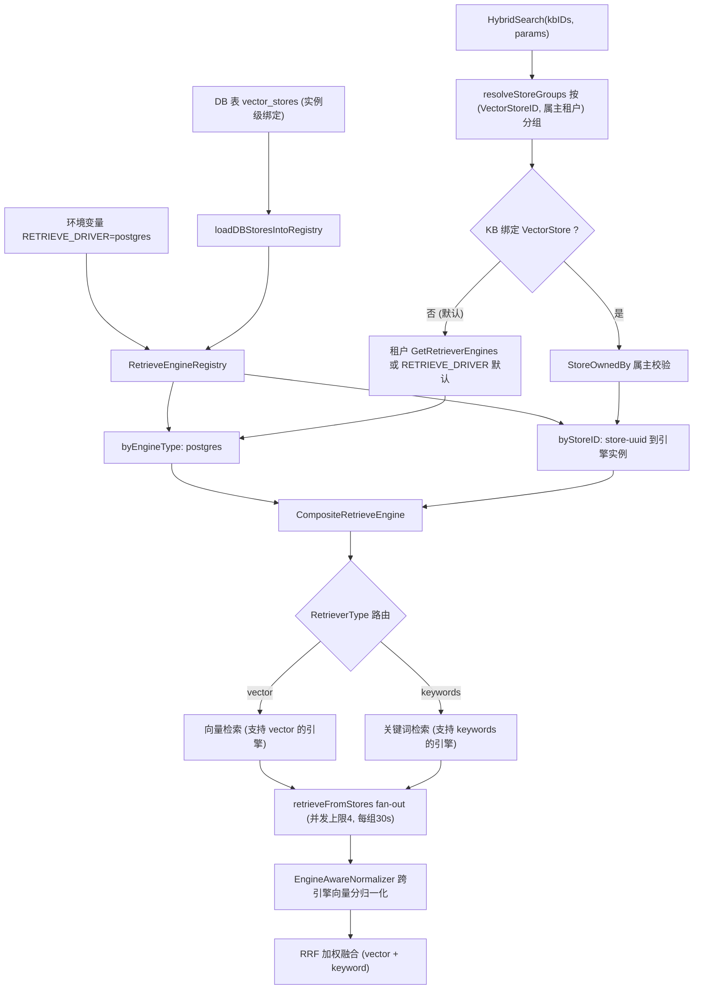
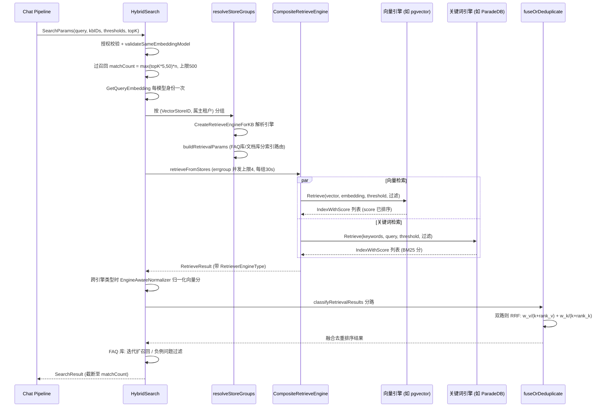

# 检索引擎与向量存储（Retrieval Engines）

向量存到哪、关键词怎么搜，由「检索引擎」决定。社区版只支持一种：PostgreSQL 加两个扩展——ParadeDB 的 `pg_search`（BM25 关键词检索）与 pgvector（向量检索），即 `RETRIEVE_DRIVER=postgres`。它和业务数据同库，向量、关键词、业务事务在同一个数据库里，运维成本最低，所以社区版没有做成可选项。

Elasticsearch、OpenSearch、Milvus、Weaviate、Qdrant、Doris、腾讯云 VectorDB 的驱动已从社区版移除；`/api/v1/vector-stores` 注册机制与设置页仍在，但社区版没有可注册的引擎，列表为空。

**扩展要求**：`RETRIEVE_DRIVER` 含 `postgres` 时，服务启动会检查所连 PostgreSQL 是否装有 `vector` 与 `pg_search`，缺任何一个都拒绝启动并给出原因。处理办法是使用 `docker-compose.yml` 里的 ParadeDB 镜像（已内置二者），或在自有 PostgreSQL 上自行安装 pgvector 与 pg_search。云厂商托管的 PostgreSQL 通常无法安装 `pg_search`，不适用。

建库之后知识库绑定的向量存储不可更改。下面说明检索层的结构、PostgreSQL 引擎的检索能力、建索引方式、过滤能力与配置方法，源码位置如下：

| 环节 | 源码位置 |
|------|----------|
| 引擎注册（env + DB store） | `internal/container/engine_factory.go`（`initRetrieveEngineRegistry`、`NewEngineFactory`、`NewEngineCatalog`）、`internal/container/pgextensions.go`（扩展检查） |
| 引擎目录（`EngineDescriptor`） | `internal/application/service/retriever/catalog.go` |
| 注册表 / 组合引擎 / 工厂 | `internal/application/service/retriever/`（`registry.go`、`composite.go`、`factory.go`、`normalizer.go`） |
| 各引擎实现 | `internal/application/repository/retriever/{postgres,neo4j}` |
| 混合检索调度与融合 | `internal/application/service/knowledgebase_search*.go` |
| 引擎类型常量 | `internal/types/retriever.go` |
| 租户默认引擎 | `internal/types/tenant.go`（`GetDefaultRetrieverEngines`） |
| 环境变量清单 | `.env.example`（C1 节）、`docker-compose.yml` |

## 1. 分层架构：Repository → KVHybridRetrieveEngine → Composite → Registry

每个后端实现 `interfaces.RetrieveEngineRepository`（`EngineType()` / `Support()` / `Save` / `BatchSave` / `Retrieve` / `DeleteBy*` / `CopyIndices` / `BatchUpdateChunkEnabledStatus` / `BatchUpdateChunkTagID` / `EstimateStorageSize`）。其上依次是：

- **KVHybridRetrieveEngine**（`retriever/keywords_vector_hybrid_indexer.go`）：把 Repository 包装成 `RetrieveEngineService`，负责在 Index 时按支持的检索类型计算 embedding 并写入；
- **CompositeRetrieveEngine**（`retriever/composite.go`）：组合模式。`Retrieve` 按每个 `RetrieveParams.RetrieverType`（`vector` / `keywords`）路由到第一个支持该类型的引擎并发执行；`Index` / `Delete` / `CopyIndices` 等写操作广播到所有成员引擎；
- **RetrieveEngineRegistry**（`retriever/registry.go`）：双索引注册表——`byEngineType`（`RETRIEVE_DRIVER` 环境变量驱动的"env store"，每类型仅一个）与 `byStoreID`（数据库 `VectorStore` 表驱动的实例级注册，同一引擎类型可注册多实例；社区版没有可注册的引擎，此路径为其他引擎保留）。

#### 按需重建（rehydrate）

启动时某个向量存储恰好不可用（后端还没起来、网络抖动），它就不会进入 `byStoreID`；此后所有绑定该 store 的知识库检索、甚至删除知识库都会一直失败。注册表因此支持**按需重建**：

- `GetOrLoadByStoreID` 命中不到时，用注入的 `VectorStoreRepository` + `EngineFactory` 现场构建引擎并注册；仓库或工厂任一为 nil 时退化为普通查找；
- 单次构建有 `EngineBuildTimeout`（10s）上限，`singleflight` 把并发请求合并成一次构建；
- 构建失败进入 `rebuildCooldown`（30s）冷却，避免后端持续不可用时每个请求都白等一个完整超时；
- 用 `storeGen` 代际计数防止竞态：构建开始前采样，只有代际没变才发布结果，因此构建期间发生的注册或删除不会被旧结果覆盖。

删除知识库时若引擎尚未就绪，也会走这条重建路径重试，而不是直接判失败。

### 1.1 引擎注册：initRetrieveEngineRegistry

`internal/container/engine_factory.go`。启动时解析 `RETRIEVE_DRIVER`（逗号分隔），逐驱动构建并 `registry.Register(retriever.NewKVHybridRetrieveEngine(repo, engineType))`；单个驱动初始化失败只记日志不阻断启动。随后 `loadDBStoresIntoRegistry` 从 `vector_stores` 表加载租户自建的向量存储实例，经 `createEngineServiceFromStore`（`engine_factory.go`）构建引擎后 `RegisterWithStoreID` 注册。

### 1.2 检索时的引擎选择

检索入口 `HybridSearch`（`knowledgebase_search.go`）按 KB 的绑定关系选择引擎：

1. `resolveStoreGroups` 把参与检索的 KB 按 `(VectorStoreID, 属主租户)` 分组；
2. 每组调用 `retriever.CreateRetrieveEngineForKB`（`factory.go`）：
   - KB 未绑定 store（`VectorStoreID` 为空，当前默认）→ 走租户的 `GetRetrieverEngines()`：租户配置了 `RetrieverEngines.Engines` 则用之，否则 `GetDefaultRetrieverEngines()` 按 `RETRIEVE_DRIVER` 环境变量生成（`internal/types/tenant.go`）；
   - KB 绑定了 store → 先 `ownership.StoreOwnedBy` 校验租户属主（防跨租户探测，失败返回 `ErrVectorStoreForbidden`），再 `registry.GetByStoreID` 取实例（未注册返回 `ErrVectorStoreNotFound`），包装为单成员 Composite；
3. `buildRetrievalParams` 按引擎 `SupportRetriever` 能力与 KB 类型生成向量/关键词两类 `RetrieveParams`（FAQ 库只走 FAQ 向量索引，文档库走默认向量索引 + 关键词索引）；
4. 多组时 `retrieveFromStores` errgroup 并发 fan-out（上限 4 组、每组超时 `MULTI_STORE_RETRIEVE_TIMEOUT_SEC` 默认 30s），结果跨引擎类型时做分数归一化。



## 2. 引擎详解

引擎类型常量见 `internal/types/retriever.go`：社区版只有 `postgres`。引擎的 `Support()` 返回 `[keywords, vector]` 两类。

### 2.1 PostgreSQL（pgvector + ParadeDB）— 唯一的检索引擎

`internal/application/repository/retriever/postgres/repository.go`。数据与业务库同库（`embeddings` 表，GORM 管理）。

- **向量检索**：pgvector `halfvec`（半精度，2 字节/维）。`embedding` 列不定维，HNSW 索引建在表达式 `(embedding::halfvec(dim)) halfvec_cosine_ops` 上——**ORDER BY 表达式必须与索引表达式完全一致**（两侧显式 cast），否则退化为顺序扫描（源码注释引 pgvector issue #702/#835）。查询用子查询先取 `expandedTopK`（TopK*2，夹在 [100,200]，避免大 LIMIT 拖垮 HNSW）个候选算 `distance = embedding <=> query`，再按 `distance <= 1-threshold` 过滤，`score = 1 - distance`。事务内 `SET LOCAL hnsw.ef_search`（≥40）与 `SET LOCAL hnsw.iterative_scan = strict_order`（pgvector ≥ 0.8，选择性过滤下持续补召回），老版本 GUC 不存在时自动降级重试。
- **关键词检索**：ParadeDB `pg_search` BM25——`content ||| query`（任意 token 匹配）+ `paradedb.score(id) as score`。
- **过滤**：`knowledge_base_id` / `knowledge_id` / `tag_id` IN 过滤（AND 语义），`is_enabled` 为 NULL 或 true。
- **建索引**：`BatchSave` + `ON CONFLICT DO NOTHING`；删除按 chunk/source/knowledge ID 物理删除。

### 2.2 Neo4j — 图谱检索（不在 Registry 体系内）

`internal/application/repository/retriever/neo4j/repository.go` 实现的是 `RetrieveGraphRepository`（`SearchNode(ctx, NameSpace, entities)`），不是向量/关键词引擎：按 `NameSpace{KnowledgeBase, Knowledge}` 检索实体节点与关系，服务于 chat pipeline 的 `ENTITY_SEARCH` 阶段（GraphRAG）。由 `NEO4J_ENABLE=true` + `NEO4J_URI`/`NEO4J_USERNAME`/`NEO4J_PASSWORD` 启用。

## 3. 能力概览

| 引擎 | RETRIEVE_DRIVER 值 | 向量检索 | 关键词/全文 | 关键词打分 | 中文分词 | 维度管理 | 阈值下推 |
|------|-------------------|----------|------------|-----------|---------|----------|---------|
| PostgreSQL | `postgres` | pgvector halfvec + HNSW 表达式索引 | ParadeDB BM25（`\|\|\|`） | BM25（paradedb.score） | ParadeDB tokenizer | 单表混维，表达式索引按维 cast | 距离阈值 SQL 内 |

> 说明：Yuheng 的混合始终是**上层统一的 RRF 融合**（`knowledgebase_search_fusion.go`）——向量与关键词各自独立检索，按 rank 加权合并（见 §5），因此引擎只需分别提供两类单模检索。

## 4. Embedding 维度管理

Yuheng 允许不同 KB 使用不同 embedding 模型（维度各异），各引擎的维度隔离策略：

| 引擎 | 策略 |
|------|------|
| PostgreSQL | 单表 `embeddings` 混存，行内 `dimension` 列；HNSW 建在 `embedding::halfvec(dim)` 表达式上，检索时 `WHERE dimension = ?` + 同维 cast 命中对应索引 |

检索侧的一致性由 `validateSameEmbeddingModel`（`knowledgebase_search_shared.go`）保证：一次多库检索中的所有 KB 必须共享同一 embedding 模型身份（`model.Name + BaseURL`，跨租户可等价），否则拒绝——避免跨向量空间的分数不可比。查询向量按模型身份分组只计算一次（`ResolveEmbeddingModelKeys` + `GetQueryEmbedding`），随 `params.QueryEmbedding` 传播到所有 store 组，杜绝重复 embedding API 调用。

## 5. 混合检索打分与归一化

### 5.1 跨引擎向量分归一化（EngineAwareNormalizer）

`internal/application/service/retriever/normalizer.go`。多 store fan-out 且结果跨引擎类型时（`hasMixedEngineTypes`），把各引擎的向量分映射到统一 [0,1]。社区版只有 postgres 一种引擎，这条路径不会触发；它是为可能接入的其他引擎保留的机制。

| 引擎 | 原始值域 | 归一化 |
|------|---------|--------|
| Postgres | 理论 [-1,1]，IR 归一化 embedding 实际 [0,1] | 直通 clamp01 |
| 未知引擎 | — | clamp01 兜底 + 每请求一次 WARN |

**关键词（BM25）分数不归一化**——其值域无上界，压缩会坍缩长尾；下游 RRF 基于 rank，天然免疫尺度差异。`clamp01` 同时消化 NaN/Inf，保护下游排序的严格弱序不变量。同一引擎内部的结果保持原生尺度（直接可比，不做无谓变换）。

### 5.2 RRF 加权融合

`knowledgebase_search_fusion.go`。向量与关键词两路都有结果时：

```go
// fuseWithRRF
rrfScore = vectorWeight/(rrfK + vectorRank) + keywordWeight/(rrfK + keywordRank)
```

- rank 为各路结果的 1-indexed 排名（各引擎已按分排序返回）；
- `rrfK`、`vectorWeight`、`keywordWeight` 来自租户 `RetrievalConfig`（`GetEffectiveRRFK` / `GetEffectiveRRFWeights` 提供缺省）；
- 单路结果时不走 RRF，`deduplicateByScore` 保留每 chunk 最高原始分（对 FAQ 的 embedding 相似度语义很重要，如 `FAQDirectAnswerThreshold` 直接比对该分数）。

融合之后的复合打分（rerank 模型分 0.6 + 检索基础分 0.3 + 来源权重 0.1、MMR、FAQ/Wiki 加权）发生在 chat pipeline 的 `CHUNK_RERANK` 阶段，见《检索问答全流程》文档 §3.4。

## 6. 配置方法汇总

核心开关（`.env.example` C1 节、`docker-compose.yml`）：

| 环境变量 | 默认 | 说明 |
|----------|------|------|
| `RETRIEVE_DRIVER` | `postgres` | 社区版只支持 `postgres`。`docker-compose.yml` 已不带其他引擎的服务与环境变量 |
| `MULTI_STORE_RETRIEVE_TIMEOUT_SEC` | 30 | 多 store 并行检索每组超时 |
| `NEO4J_ENABLE` / `NEO4J_URI` / `_USERNAME` / `_PASSWORD` | `false` / `bolt://neo4j:7687` | 图谱检索（独立于向量引擎体系） |

除环境变量（env store，进程级全局）外，机制上还可在管理端为租户创建 `VectorStore` 记录（DB store）并绑定到具体 KB，检索时按 KB 绑定自动路由并做租户属主校验（§1.2）。社区版没有可注册的引擎，所以这条路径目前不产生新的 store；所有知识库使用 postgres 的 env store。

## 7. 检索执行数据流


