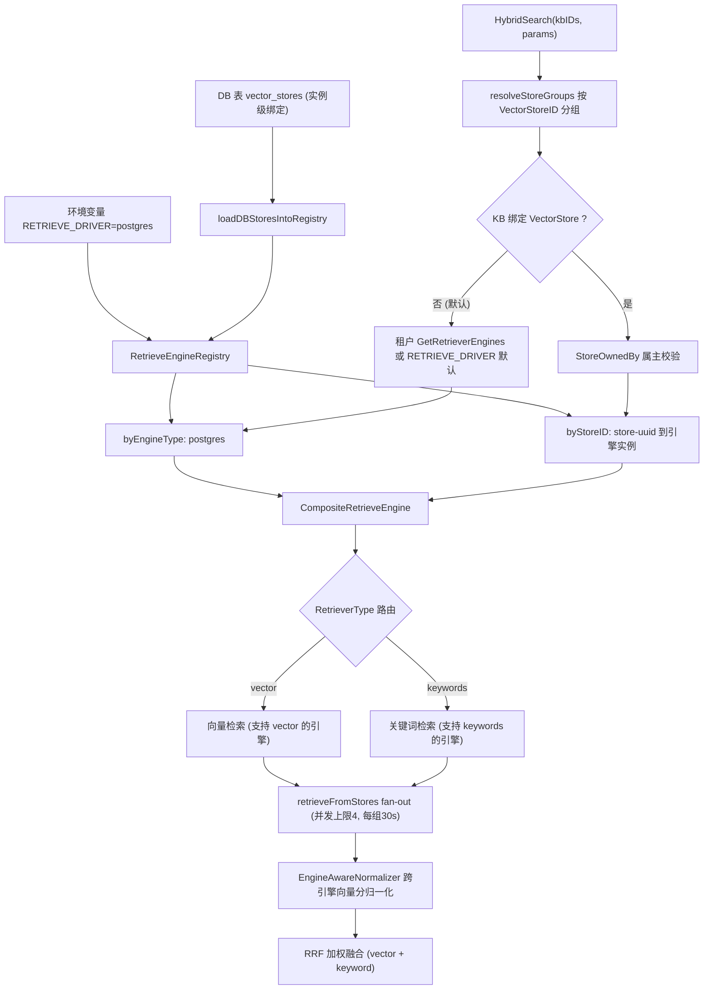
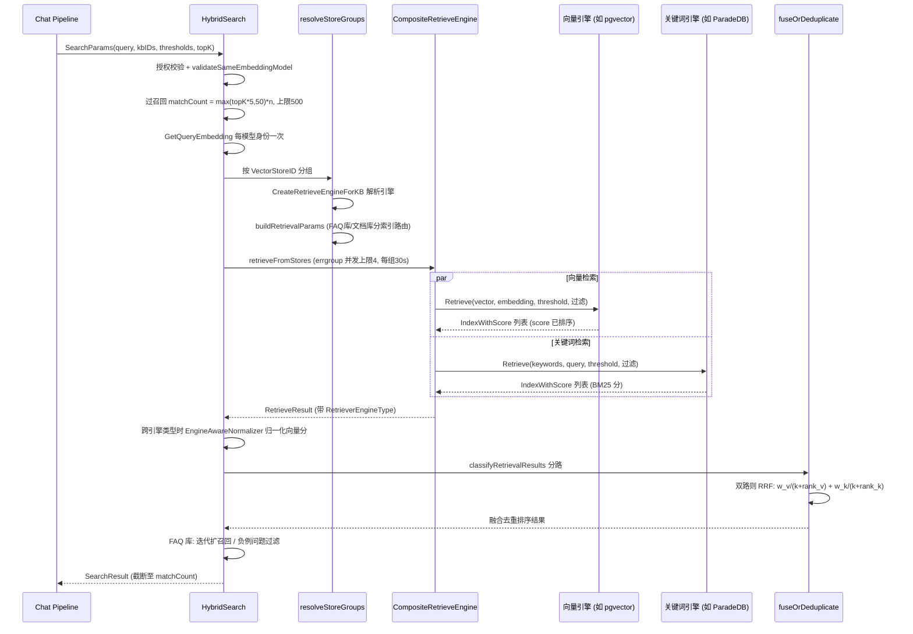

# 检索引擎与向量存储（Retrieval Engines）

向量存到哪、关键词怎么搜，由「检索引擎」决定。开源版只内置一种：PostgreSQL 加两个扩展——ParadeDB 的 `pg_search`（BM25 关键词检索）与 pgvector（向量检索），即 `RETRIEVE_DRIVER=postgres`（默认值）。检索索引和业务数据在同一个数据库里，不需要另外部署、备份一套向量库。

作为使用者通常不需要做任何选择：

- 部署时用 `docker-compose.yml` 自带的 ParadeDB 镜像（已内置 `vector` 与 `pg_search`）即可。改用自有 PostgreSQL 时须自行安装这两个扩展；服务启动会检查，缺任何一个都拒绝启动并说明原因。云厂商托管的 PostgreSQL 通常无法安装 `pg_search`，不适用；
- 知识库编辑弹窗的「向量存储」页签会列出唯一的「PostgreSQL」存储，所有知识库都用它。知识库建好后绑定的向量存储不可更改；
- 工作区设置里的向量存储列表同样只显示这一个由环境变量决定的只读存储，没有可以新注册的引擎类型。

上游 WeKnora 的 Elasticsearch、OpenSearch、Milvus、Weaviate、Qdrant、Doris、腾讯云 VectorDB 驱动不在开源版里。可用引擎由后端的**引擎目录**（engine catalog）决定：核心只注册 PostgreSQL，其他引擎要通过扩展提供一个引擎描述（`EngineDescriptor`）加入目录；`/api/v1/vector-stores` 的注册接口、`RETRIEVE_DRIVER` 的解析、设置页的表单都从目录读取。

下面说明检索层的结构、PostgreSQL 引擎的检索能力、建索引方式、过滤能力与配置方法，源码位置如下：

| 环节 | 源码位置 |
|------|----------|
| 引擎注册（env + DB store） | `internal/container/engine_factory.go`（`initRetrieveEngineRegistry`、`NewEngineFactory`、`NewEngineCatalog`）、`internal/container/pgextensions.go`（扩展检查） |
| 引擎目录（`EngineDescriptor`、`Catalog`） | `internal/application/service/retriever/catalog.go`；PostgreSQL 的描述在 `engine_postgres.go` |
| 注册表 / 组合引擎 / 工厂 | `internal/application/service/retriever/`（`registry.go`、`composite.go`、`factory.go`、`ownership.go`、`normalizer.go`） |
| 各引擎实现 | `internal/application/repository/retriever/postgres`（检索、按维度建索引、相似分块比对）、`internal/application/repository/retriever/neo4j`（图谱） |
| 混合检索调度与融合 | `internal/application/service/knowledgebase_search*.go` |
| 引擎类型常量 | `internal/types/retriever.go` |
| 租户默认引擎 | `internal/types/tenant.go`（`GetDefaultRetrieverEngines`） |
| 环境变量清单 | `.env.example`（C1 节）、`docker-compose.yml` |

## 1. 分层架构：Catalog → Repository → KVHybridRetrieveEngine → Composite → Registry

**引擎目录**（`Catalog`）是一次性构建、之后不可变的引擎清单。每个 `EngineDescriptor` 声明：类型与 `RETRIEVE_DRIVER` 里的驱动名、支持的检索类型（`vector` / `keywords`）、向量分数的值域（`ScoreScale`：已在 [0,1] 或原始余弦 [-1,1]）、能否由工作区自行注册（`Registrable`）、注册表单字段、连接测试与待拨号地址（用于 SSRF 校验）、构造函数。核心在容器里以 dig value group `retrieve_engines` 提供 `PostgresDescriptor`，扩展往同一个 group 提供自己的描述即可接入；两个描述重复声明同一类型或驱动名、或缺少必需字段时启动失败。PostgreSQL 的描述是 `Registrable: false`：`embeddings` 表名固定、不按存储分区，同一台服务器上再注册一个存储也分不开数据。

每个后端实现 `interfaces.RetrieveEngineRepository`（`EngineType()` / `Support()` / `Save` / `BatchSave` / `Retrieve` / `DeleteBy*` / `CopyIndices` / `BatchUpdateChunkEnabledStatus` / `BatchUpdateChunkTagID` / `EstimateStorageSize`）。其上依次是：

- **KVHybridRetrieveEngine**（`retriever/keywords_vector_hybrid_indexer.go`）：把 Repository 包装成 `RetrieveEngineService`，负责在 Index 时按支持的检索类型计算 embedding 并写入；
- **CompositeRetrieveEngine**（`retriever/composite.go`）：组合模式。`Retrieve` 按每个 `RetrieveParams.RetrieverType`（`vector` / `keywords`）路由到第一个支持该类型的引擎并发执行；`Index` / `Delete` / `CopyIndices` 等写操作广播到所有成员引擎；
- **RetrieveEngineRegistry**（`retriever/registry.go`）：双索引注册表——`byEngineType`（`RETRIEVE_DRIVER` 环境变量驱动的"env store"，每类型仅一个）与 `byStoreID`（数据库 `vector_stores` 表驱动的实例级注册，同一引擎类型可注册多实例；只有目录里 `Registrable` 的引擎才能走这条路径，开源版没有这样的引擎）。

#### 按需重建（rehydrate）

启动时某个向量存储恰好不可用（后端还没起来、网络抖动），它就不会进入 `byStoreID`；此后所有绑定该 store 的知识库检索、甚至删除知识库都会一直失败。注册表因此支持**按需重建**：

- `GetOrLoadByStoreID` 命中不到时，用注入的 `VectorStoreRepository` + `EngineFactory` 现场构建引擎并注册；仓库或工厂任一为 nil 时退化为普通查找；
- 单次构建有 `EngineBuildTimeout`（10s）上限，`singleflight` 把并发请求合并成一次构建；
- 构建失败进入 `rebuildCooldown`（30s）冷却，避免后端持续不可用时每个请求都白等一个完整超时；
- 用 `storeGen` 代际计数防止竞态：构建开始前采样，只有代际没变才发布结果，因此构建期间发生的注册或删除不会被旧结果覆盖。

删除知识库时若引擎尚未就绪，也会走这条重建路径重试，而不是直接判失败。

### 1.1 引擎注册：initRetrieveEngineRegistry

`internal/container/engine_factory.go`。启动时用目录解析 `RETRIEVE_DRIVER`（逗号分隔）：目录里没有的驱动名记错误日志并跳过；其余逐个用描述的 `EnvStore` 与构造函数建成引擎并 `Register`，单个驱动初始化失败只记日志不阻断启动。随后 `loadDBStoresIntoRegistry` 从 `vector_stores` 表加载工作区注册的存储实例，经 `NewEngineFactory` 构建后 `RegisterWithStoreID`；工厂会拒绝目录里没有的引擎、不可注册的引擎，以及地址没通过 SSRF 校验的存储。

数据库初始化时，`RETRIEVE_DRIVER` 含 `postgres` 才会执行建 `embeddings` 表的迁移并检查扩展（`requireRetrievalExtensions`）。

### 1.2 检索时的引擎选择

检索入口 `HybridSearch`（`knowledgebase_search.go`）按 KB 的绑定关系选择引擎：

1. `resolveStoreGroups` 把参与检索的 KB 按 `VectorStoreID` 分组（所有 KB 都属于请求的租户，别的工作区的知识库在更早的守卫处就按不存在处理）；
2. 每组调用 `retriever.CreateRetrieveEngineForKB`（`factory.go`）：
   - KB 未绑定 store（`VectorStoreID` 为空，当前默认）→ 走租户的 `GetRetrieverEngines()`：租户配置了 `RetrieverEngines.Engines` 则用之，否则 `GetDefaultRetrieverEngines()` 按 `RETRIEVE_DRIVER` 环境变量生成（`internal/types/tenant.go`）；
   - KB 绑定了 store → 先 `StoreOwnedBy`（`ownership.go`）校验租户属主（防跨租户探测，失败返回 `ErrVectorStoreForbidden`），再按 store ID 取实例（必要时按需重建，未注册返回 `ErrVectorStoreNotFound`，暂不可用返回 `ErrVectorStoreUnavailable`），包装为单成员 Composite；
3. `buildRetrievalParams` 按引擎 `SupportRetriever` 能力与 KB 类型生成向量/关键词两类 `RetrieveParams`（FAQ 库只走 FAQ 向量索引，文档库走默认向量索引 + 关键词索引）；
4. 多组时 `retrieveFromStores` errgroup 并发 fan-out（上限 4 组、每组超时 `MULTI_STORE_RETRIEVE_TIMEOUT_SEC` 默认 30s），结果跨引擎类型时做分数归一化。



## 2. 引擎详解

引擎类型常量见 `internal/types/retriever.go`：开源版只有 `postgres`。它在目录里声明支持 `[keywords, vector]` 两类检索，向量分数值域为 [0,1]。

### 2.1 PostgreSQL（pgvector + ParadeDB）— 唯一的检索引擎

`internal/application/repository/retriever/postgres/repository.go`。数据与业务库同库（`embeddings` 表，GORM 管理）。

- **向量检索**：pgvector `halfvec`（半精度，2 字节/维）。`embedding` 列不定维，每个维度一个**部分 HNSW 索引** `embeddings_embedding_idx_<dim>`，建在表达式 `(embedding::halfvec(dim)) halfvec_cosine_ops` 上、带 `WHERE dimension = dim`——**ORDER BY 表达式必须与索引表达式完全一致**（两侧显式 cast），否则退化为顺序扫描（源码注释引 pgvector issue #702/#835）。迁移只预建了最初几个常用维度的索引；其他维度（如 768、1536、3072）在该维度的向量第一次写入时用 `CREATE INDEX CONCURRENTLY` 补建（`vectorindex.go`，单次构建上限 30 分钟，不阻塞写入）。超过 4000 维的向量 pgvector 无法为其建 HNSW 索引，照常存储，但检索会扫全表。查询用子查询先取 `expandedTopK`（TopK*2，夹在 [100,200]，避免大 LIMIT 拖垮 HNSW）个候选算 `distance = embedding <=> query`，再按 `distance <= 1-threshold` 过滤，`score = 1 - distance`。事务内 `SET LOCAL hnsw.ef_search`（≥40）与 `SET LOCAL hnsw.iterative_scan = strict_order`（pgvector ≥ 0.8，选择性过滤下持续补召回），老版本 GUC 不存在时自动降级重试。
- **关键词检索**：ParadeDB `pg_search` BM25——`content ||| query`（任意 token 匹配）+ `paradedb.score(id) as score`。
- **过滤**：`knowledge_base_id` / `knowledge_id` / `tag_id` IN 过滤（AND 语义），`is_enabled` 为 NULL 或 true。
- **建索引**：`BatchSave` + `ON CONFLICT DO NOTHING`，保留分块的 `is_enabled` 状态；删除按 chunk/source/knowledge ID 物理删除。
- **相似分块比对**（`similar.go`）：为[知识健康](22-knowledge-health.md)的重复检测服务，直接比较已存储的向量，不重新做 embedding。对一篇文档的每个分块，在同一知识库其他文档的分块里找最近邻：按维度一条语句，文档的分块行 `LATERAL` 连接各自的近邻查询，近邻查询使用与 HNSW 索引完全相同的表达式。引擎不支持这项比对时，知识健康概览显示「不支持」。
- **权限过滤**：目录里声明了 `SupportsACL`，但 `embeddings` 表不存条目级主体，检索也忽略 `RetrieveParams.Subjects`——目前不能依赖它做访问控制，访问控制在知识库一级完成。

### 2.2 Neo4j — 图谱检索（不在 Registry 体系内）

`internal/application/repository/retriever/neo4j/repository.go` 实现的是 `RetrieveGraphRepository`（`SearchNode(ctx, NameSpace, entities)`），不是向量/关键词引擎：按 `NameSpace{KnowledgeBase, Knowledge}` 检索实体节点与关系，服务于 chat pipeline 的 `ENTITY_SEARCH` 阶段（GraphRAG）。由 `NEO4J_ENABLE=true` + `NEO4J_URI`/`NEO4J_USERNAME`/`NEO4J_PASSWORD` 启用。

## 3. 能力概览

| 引擎 | RETRIEVE_DRIVER 值 | 向量检索 | 关键词/全文 | 关键词打分 | 中文分词 | 维度管理 | 阈值下推 |
|------|-------------------|----------|------------|-----------|---------|----------|---------|
| PostgreSQL | `postgres` | pgvector halfvec + HNSW 表达式索引 | ParadeDB BM25（`\|\|\|`） | BM25（paradedb.score） | ParadeDB tokenizer | 单表混维，表达式索引按维 cast | 距离阈值 SQL 内 |

> 说明：Yuheng 的混合始终是**上层统一的 RRF 融合**（`knowledgebase_search_fusion.go`）——向量与关键词各自独立检索，按 rank 加权合并（见 §5），因此引擎只需分别提供两类单模检索。

## 4. Embedding 维度管理

Yuheng 允许不同 KB 使用不同 embedding 模型（维度各异），各引擎的维度隔离策略：

| 引擎 | 策略 |
|------|------|
| PostgreSQL | 单表 `embeddings` 混存，行内 `dimension` 列；每维一个部分 HNSW 索引，建在 `embedding::halfvec(dim)` 表达式上，检索时 `WHERE dimension = ?` + 同维 cast 命中对应索引 |

知识库换了 embedding 模型、旧文档还没重新索引时，新旧维度的向量都留在表里，但一次检索只命中查询向量那一维。

检索侧的一致性由 `validateSameEmbeddingModel`（`knowledgebase_search_storegroup.go`）保证：一次多库检索中的所有 KB 必须共享同一 embedding 模型身份（`model.Name + BaseURL`，跨租户可等价），否则拒绝——避免跨向量工作区的分数不可比。查询向量按模型身份分组只计算一次（`ResolveEmbeddingModelKeys` + `GetQueryEmbedding`），随 `params.QueryEmbedding` 传播到所有 store 组，杜绝重复 embedding API 调用。

## 5. 混合检索打分与归一化

### 5.1 跨引擎向量分归一化（EngineAwareNormalizer）

`internal/application/service/retriever/normalizer.go`。多 store fan-out 且结果跨引擎类型时（`hasMixedEngineTypes`），按目录里各引擎声明的 `ScoreScale` 把向量分映射到统一 [0,1]。开源版只有 postgres 一种引擎，这条路径不会触发；它是为扩展接入的其他引擎准备的。

| 声明的值域 | 归一化 |
|---------|--------|
| `ScoreUnit`（已在 [0,1]，如 PostgreSQL：`1 - 余弦距离`，对 L2 归一化的 embedding 落在 [0,1]） | 直通 clamp01 |
| `ScoreSignedCosine`（原始余弦 [-1,1]） | `(score + 1) / 2` 后 clamp01 |
| 目录里没有的引擎 | clamp01 兜底 + 每请求一次 WARN |

**关键词（BM25）分数不归一化**——其值域无上界，压缩会坍缩长尾；下游 RRF 基于 rank，天然免疫尺度差异。`clamp01` 同时消化 NaN/Inf，保护下游排序的严格弱序不变量。同一引擎内部的结果保持原生尺度（直接可比，不做无谓变换）。

### 5.2 RRF 加权融合

`knowledgebase_search_fusion.go`。向量与关键词两路都有结果时：

```go
// fuseWithRRF
rrfScore = vectorWeight/(rrfK + vectorRank) + keywordWeight/(rrfK + keywordRank)
```

- rank 为各路结果的 1-indexed 排名（各引擎已按分排序返回）；
- `rrfK`、`vectorWeight`、`keywordWeight` 来自租户 `RetrievalConfig`（`GetEffectiveRRFK` / `GetEffectiveRRFWeights` 提供缺省）；
- 单路结果时不走 RRF，`deduplicateByScore` 保留每 chunk 最高原始分，向量相似度的原始语义得以保留（FAQ 检索的阈值判断依赖它）。

融合之后的复合打分（rerank 模型分 0.6 + 检索基础分 0.3 + 来源权重 0.1、MMR、FAQ/Wiki 加权）发生在 chat pipeline 的 `CHUNK_RERANK` 阶段，见《检索问答全流程》文档 §3.4。

## 6. 配置方法汇总

核心开关（`.env.example` C1 节、`docker-compose.yml`）：

| 环境变量 | 默认 | 说明 |
|----------|------|------|
| `RETRIEVE_DRIVER` | `postgres` | 开源版目录里只有 `postgres`；写了目录里没有的驱动名只记错误日志并忽略。`docker-compose.yml` 不带其他引擎的服务与环境变量 |
| `MULTI_STORE_RETRIEVE_TIMEOUT_SEC` | 30 | 多 store 并行检索每组超时（未设置、非数字或 ≤0 时取 30） |
| `NEO4J_ENABLE` / `NEO4J_URI` / `_USERNAME` / `_PASSWORD` | `false` / `bolt://neo4j:7687` | 图谱检索（独立于向量引擎体系） |

除环境变量（env store，进程级全局）外，机制上还可在管理端为租户创建 `VectorStore` 记录（DB store）并绑定到具体 KB，检索时按 KB 绑定自动路由并做租户属主校验（§1.2）。开源版没有可注册的引擎，`POST /vector-stores` 会拒绝创建，所有知识库都使用 postgres 的 env store。向量存储的写操作（创建、修改、删除、测试、平台共享）要求 Admin+，开启 `governance.centralized_infra` 后只有系统管理员可以写；读操作 Viewer+。

## 7. 检索执行数据流



## 实现参考

源码位置见文首表格。与本文相关的测试：`internal/application/service/retriever/catalog_test.go`（目录校验）、`registry_rehydrate_test.go`（按需重建）、`internal/application/repository/retriever/postgres/vectorindex_test.go`（按维度建索引）、`retrieve_sql_test.go`（检索 SQL 形状）、`similar_test.go`（相似分块比对）。
