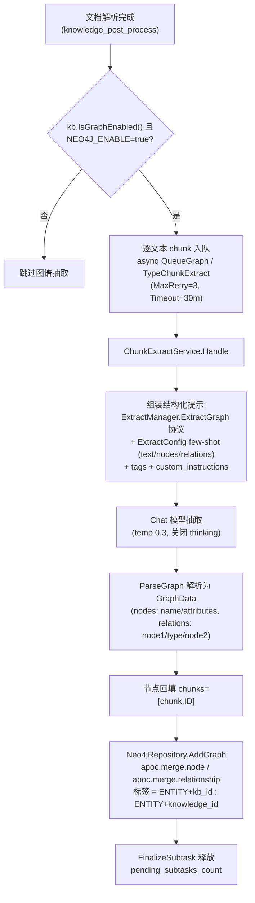
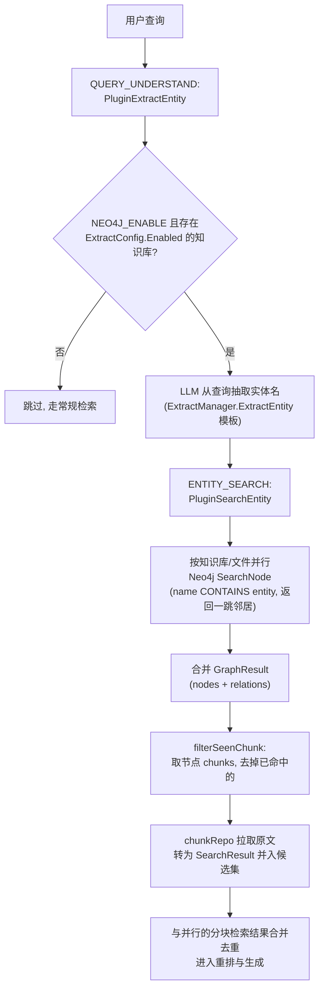

# 知识图谱

向量检索擅长找「意思相近的段落」，但不擅长回答「A 和 B 是什么关系」。知识图谱补的就是这一块：文档入库时用大模型把里面的实体和关系抽出来存成图，提问时顺着图多召回一批相关片段，一起交给模型作答。

适合关系密集的资料（人物、组织、产品线、合同条款之间互相牵扯），普通的问答场景开不开区别不大。代价是入库时要额外调大模型，且需要部署 Neo4j。

图谱存储后端为 **Neo4j**（唯一实现，依赖 APOC 插件；代码中不存在 Nebula 等其他图数据库集成）。

## 怎么开启

1. **部署 Neo4j 并打开全局开关**。docker compose 的 `neo4j` 服务属于 `neo4j` 与 `full` 两个 profile；在 `.env` 里设置 `NEO4J_ENABLE=true`（并把 `NEO4J_PASSWORD` 换成自己的密码）后启动：

   ```bash
   docker compose --profile neo4j up -d
   ```

   这些变量在 app 启动时读取，已经在运行的 app 要重启（`docker compose up -d app`）才会连上 Neo4j。用外部 Neo4j 时把 `NEO4J_URI` 换成它的地址，它同样需要装 APOC 插件。

2. **在知识库里配置抽取**。打开知识库设置，在「索引与解析」分组里选「知识图谱」。Neo4j 未启用时这里只显示一条警告「知识图谱数据库未启用，实体关系提取功能将无法使用」（前端依据 `GET /system/info` 返回的 `graph_database_engine` 判断）。启用后可以：
   - 打开「启用实体关系提取」；
   - 填写「额外提取要求」（领域范围、实体筛选、属性要求），结构化输出协议仍由系统控制；
   - 定义「关系类型」标签，或点「生成随机标签」让大模型推荐；
   - 填写「示例文本」，或点「生成随机文本」；
   - 点「开始提取」对示例文本试跑一次，得到实体列表与关系列表，再手工增删改（「默认示例」「清除示例」可快速填充或清空）。

   这些内容构成 few-shot 示例。开启抽取时，示例文本、关系类型、实体与关系四项都不能为空，否则保存会被拒绝（`validateExtractConfig`）。「生成」与「开始提取」需要知识库已配置对话模型。

3. **上传文档**。之后入库的文档会逐分块抽取实体与关系。知识库已启用图谱时，上传确认对话框里也有「知识图谱」一节，可以只针对本次上传调整或关闭抽取（写入文件级处理覆盖项 `ProcessOverrides`）。抽取只在文档入库的后处理阶段进行，已入库的文档要重新解析才会抽取。

图谱只影响检索时的补充召回，没有单独的图谱浏览界面，见下文「可视化」。

## 验证与排查

- **看图里有没有数据**：浏览器打开 `http://127.0.0.1:7474`（Neo4j 自带的控制台，端口见 `NEO4J_HTTP_PORT`），用 `.env` 里的账号密码登录，执行 `MATCH (n) RETURN n LIMIT 50` 查看节点；只看某个知识库时按标签查，如 ``MATCH (n:`ENTITY<kb_id>`) RETURN n LIMIT 50``（标签里的连字符换成下划线，见下文「存储后端：Neo4j」）。
- **连不上 Neo4j**：app 启动日志里会有 `Failed to create Neo4j driver (attempt n/30)` 一类的重试警告；核对 `NEO4J_URI`、用户名密码，并看 Neo4j 容器日志。约 60 秒（30 次、间隔 2 秒）仍连不上时 `initNeo4jClient` 返回错误，依赖它的组件装配失败，app 无法启动——所以 `NEO4J_ENABLE=true` 时要保证 Neo4j 先起来。
- **知识库里没有「知识图谱」配置项，只有警告**：说明 `GET /system/info` 报告 `Not Enabled`，即 app 没读到 `NEO4J_ENABLE=true`。
- **上传后没有生成节点**：确认知识库开启了抽取、文档已解析完成；抽取任务在 asynq 的图谱队列里跑，失败会留在 app 日志与「设置 → 系统管理 → 任务队列」里。上传前已入库的文档需要重新解析才会抽取。

## 两级开关

图谱功能需要**两级开关**同时满足。

### 1. 全局开关：Neo4j 环境变量

`NEO4J_ENABLE` 是知识图谱的唯一全局开关（`ENABLE_GRAPH_RAG` 已被它取代，Go 主应用不再读取）。

| 名称 | 默认值 | 说明 |
|------|--------|------|
| `NEO4J_ENABLE` | 空（关闭） | 置为 `true` 启用图谱；启动时的 Neo4j 连接、抽取任务入队、问答时的实体抽取都会检查它 |
| `NEO4J_URI` | `bolt://neo4j:7687`（compose 默认） | Neo4j 连接地址；单机用 `bolt://`，集群路由用 `neo4j://` |
| `NEO4J_USERNAME` | `neo4j` | 用户名 |
| `NEO4J_PASSWORD` | `password` | 密码，生产环境务必修改 |

`internal/container/container.go` 的 `initNeo4jClient` 启动时最多重试 30 次（间隔 2s）建立并验证连接，全部失败则返回错误；未启用时返回 `nil` driver，此时 `Neo4jRepository` 的所有方法降级为 no-op（日志 `NOT SUPPORT RETRIEVE GRAPH`）。`GET /system/info` 通过 `getGraphDatabaseEngine()` 报告 `"Neo4j"` 或 `"Not Enabled"`（`internal/handler/system.go`）。

docker-compose 的 `neo4j` 服务（镜像 `neo4j:2025.10.1`）预装 APOC：`NEO4JLABS_PLUGINS=["apoc"]`（图谱写入依赖 `apoc.merge.node` / `apoc.merge.relationship`，删除依赖 `apoc.periodic.iterate`）。端口 7474 / 7687 默认只绑定 `127.0.0.1`（`NEO4J_BIND`），供浏览器 UI 使用；app 通过 compose 网络访问。

### 2. 知识库级开关：IndexingStrategy + ExtractConfig

`internal/types/knowledgebase.go`：

```go
// IsGraphEnabled checks if knowledge graph extraction is enabled.
// Requires both the IndexingStrategy flag and a valid ExtractConfig.
func (kb *KnowledgeBase) IsGraphEnabled() bool {
    return kb != nil && kb.IndexingStrategy.GraphEnabled &&
        kb.ExtractConfig != nil && kb.ExtractConfig.Enabled
}
```

- `IndexingStrategy.GraphEnabled`（`internal/types/indexing_strategy.go`）：索引策略里的图谱开关，默认 `false`。两者互相同步：`EnsureDefaults` 在 `ExtractConfig.Enabled` 为真时把 `GraphEnabled` 置真；通过更新接口写入 `indexing_strategy` 时，`GraphEnabled` 反向同步到 `ExtractConfig.Enabled`（`internal/application/service/knowledgebase.go`）。
- `ExtractConfig`（`internal/types/knowledgebase.go`）承载抽取的 few-shot 配置：

| 名称 | 类型 | 默认值 | 说明 |
|------|------|--------|------|
| `enabled` | bool | false | 是否启用抽取 |
| `text` | string | 空 | few-shot 示例原文 |
| `tags` | []string | nil | 关系类型标签集合 |
| `nodes` | []*GraphNode | nil | 示例实体节点（name / attributes） |
| `relations` | []*GraphRelation | nil | 示例关系（node1 / node2 / type） |
| `custom_instructions` | string | 空 | 领域自定义抽取指令（追加进系统提示，结构化输出协议仍由系统控制） |

配置界面背后的辅助 API（`internal/handler/initialization.go`，路由见 `internal/router/routes_infra.go`，需空间 Admin 角色）：

- `POST /initialization/extract/text-relation`（`ExtractTextRelations`）：对一段文本（≤5000 字符）按选定标签试跑关系抽取，即「开始提取」；
- `POST /initialization/extract/fabri-text` / `fabri-tag`（`FabriText` / `FabriTag`）：让大模型生成示例文本 / 推荐标签，即「生成随机文本」「生成随机标签」。

## 实体关系抽取流程（构建）

### 触发与任务编排

文档解析完成后，`internal/application/service/knowledge_post_process.go` 在增强扇出阶段对每个文本 chunk 计数（`eff.GraphEnabled` 时 `graphChunkCount = len(textChunks)`），并调用 `internal/application/service/extract.go` 的 `NewChunkExtractTask` 逐 chunk 入队：

```go
func NewChunkExtractTask(...) (bool, error) {
    if strings.ToLower(os.Getenv("NEO4J_ENABLE")) != "true" {
        logger.Warn(ctx, "NEO4J is not enabled, skip chunk extract task")
        return false, nil
    }
    ...
    task := asynq.NewTask(types.TypeChunkExtract, payload,
        asynq.Queue(types.QueueGraph), asynq.MaxRetry(3), asynq.Timeout(30*time.Minute))
    ...
}
```

任务走独立的 asynq `QueueGraph` 队列，使用知识库的对话模型（`SummaryModelID`），每个 chunk 一次 LLM 调用（源码注释称其为"管线中最昂贵的增强扇出"），受模型级后台并发限流（limiter）约束；被取消 / 删除 / 被新解析尝试取代（`attemptSuperseded`）的任务会跳过执行并释放父任务的 `pending_subtasks_count` 计数。

### 抽取执行（ChunkExtractService.Handle）

`internal/application/service/extract.go`：

1. 加载 chunk、知识库与文件级 `ProcessOverrides`，用 `ResolveProcessConfig` 求出生效的 `ExtractConfig`（未启用则跳过）。
2. 组装结构化提示模板：系统协议部分来自 `config.ExtractManager.ExtractGraph`（`config/config.yaml` 的 `extract.extract_graph`，一个包含实体抽取 + 属性丰富 + 关系抽取步骤的多步指令），叠加知识库的 `custom_instructions`、`tags` 与 `ExtractConfig` 的 few-shot 示例（`Text/Nodes/Relations`）。
3. `chatpipeline.NewExtractor(chatModel, template).Extract(ctx, chunk.Content)` 调用 Chat 模型（`temperature 0.3`、`max_tokens 4096`、关闭 thinking），由 `Formater.ParseGraph` 解析为 `types.GraphData`（`internal/types/extract_graph.go`）：

```go
type GraphNode struct {
    Name       string   `json:"name,omitempty"`
    Chunks     []string `json:"chunks,omitempty"`
    Attributes []string `json:"attributes,omitempty"`
}
type GraphRelation struct {
    Node1 string `json:"node1,omitempty"`
    Node2 string `json:"node2,omitempty"`
    Type  string `json:"type,omitempty"`
}
```

4. 为每个节点回填 `node.Chunks = []string{chunk.ID}`，然后 `graphEngine.AddGraph(ctx, NameSpace{KnowledgeBase, Knowledge}, ...)` 写入 Neo4j。
5. 全程有 SpanTracker 追踪（`postprocess.graph.chunk[i]` 子 span，记录 nodes/relations 数量与样例）。

### 存储后端：Neo4j

`internal/application/repository/retriever/neo4j/repository.go` 实现 `interfaces.RetrieveGraphRepository`（`AddGraph` / `DelGraph` / `SearchNode`）：

- **命名空间即标签**：`NameSpace{KnowledgeBase, Knowledge}` 映射为节点标签 `ENTITY<kb_id>`、`ENTITY<knowledge_id>`（连字符替换为下划线），节点属性含 `name`、`kg`（knowledge_id）、`attributes`、`chunks`。
- 写入用 APOC 幂等合并，同名实体的 `chunks` 做并集：

```cypher
UNWIND $data AS row
CALL apoc.merge.node(row.labels, {name: row.name, kg: row.knowledge_id}, row.props, {}) YIELD node
SET node.chunks = apoc.coll.union(node.chunks, row.chunks)
```

- 删除知识 / 知识库时（`knowledge_delete.go`、`knowledgebase.go`）调用 `DelGraph`，用 `apoc.periodic.iterate` 按 1000 批并行删边删点。

## 检索时的图谱增强（GraphRAG）

问答流水线（`internal/application/service/chat_pipeline`）中有两个插件：

1. **PluginExtractEntity**（`extract_entity.go`，挂在 `QUERY_UNDERSTAND` 事件）：`NEO4J_ENABLE=true` 时，先从本次问答涉及的知识库（含所选文件所属的知识库）中筛出 `ExtractConfig.Enabled` 的那些（存入 `chatManage.EntityKBIDs` / `EntityKnowledge`），再用 `ExtractManager.ExtractEntity` 模板（`config/config.yaml` 的 `extract.extract_entity`）+ 对话模型从**用户查询**里抽取实体名，存入 `chatManage.Entity`。
2. **PluginSearchEntity**（`search_entity.go`，响应 `ENTITY_SEARCH` 事件）：由 `search_parallel.go` 与常规分块检索**并行**调用（查询中没抽出实体时跳过）。它对每个启用图谱的知识库 / 文件调用 `graphRepo.SearchNode`——Cypher 用 `n.name CONTAINS nodeText` 模糊匹配实体并返回一跳邻居与关系，合并为 `chatManage.GraphResult`；随后 `filterSeenChunk` 取出图谱节点携带的 `chunks`，从 `chunkRepo` 拉取原文并转换为 `SearchResult`。两路结果合并后去重，实现"实体 → 关联 chunk"的补充召回。

未配置图谱的知识库在图谱补充阶段直接跳过，不影响常规向量/关键词检索。

## 流程图

### 构建流程



### 查询流程



## 可视化

- **没有图谱浏览界面**：知识图谱本身没有可视化页面或 REST 端点，图谱补充召回的结果以 `SearchResult` 形式进入回答引用。需要直接查看图时，用 Neo4j 自带的浏览器（`http://127.0.0.1:7474`）按标签 `ENTITY<kb_id>` 查询。`GET /knowledgebase/:kb_id/wiki/graph`（`wikiHandler.GetGraph`）是 Wiki 页面之间的链接图，与本文的实体关系图谱无关。
- **未接入的内存版构建器**：`internal/application/service/graph.go` 的 `graphBuilder` 是 `types.GraphBuilder` 接口的内存版实现（LLM 抽实体 → 抽关系 → PMI×0.6 + Strength×0.4 计算关系权重 → 构建 chunk 关联图 → 输出 Mermaid 图到日志）。`NewGraphBuilder` 没有被容器装配调用，生产路径不经过它。
- **prompt 模板**：`config/prompt_templates/graph_extraction.yaml` 提供 `default_extract_entities` 等模板（实体类型枚举 Person/Organization/Location/... 与 JSON 输出协议），经 `internal/config/config.go` 的 `extract_entities_prompt_id` / `extract_relationships_prompt_id` 解析进 `Conversation.ExtractEntitiesPrompt` / `ExtractRelationshipsPrompt`，只供上述内存版 `graphBuilder` 使用；生产异步抽取路径使用的是 `config.yaml` 中 `extract.extract_graph` / `extract.extract_entity` 模板（`ExtractManagerConfig`）。

## 实现参考

| 路径 | 内容 |
|---|---|
| `internal/types/knowledgebase.go`、`internal/types/indexing_strategy.go` | `ExtractConfig`、`IsGraphEnabled`、开关同步 |
| `internal/types/extract_graph.go` | `GraphData` / `GraphNode` / `GraphRelation` |
| `internal/application/service/knowledge_post_process.go` | 分块抽取任务的扇出 |
| `internal/application/service/extract.go` | `NewChunkExtractTask`、`ChunkExtractService.Handle` |
| `internal/application/repository/retriever/neo4j/repository.go` | Neo4j 写入、删除、`SearchNode` |
| `internal/application/service/chat_pipeline/extract_entity.go`、`search_entity.go`、`search_parallel.go` | 问答时的实体抽取与图谱补充召回 |
| `internal/container/container.go` | `initNeo4jClient` |
| `internal/handler/initialization.go` | 抽取试跑、示例生成、`nodeExtract` 配置写入 |
| `internal/handler/knowledgebase.go` | `validateExtractConfig` |
| `config/config.yaml` | `extract.extract_graph` / `extract.extract_entity` 提示模板 |
| `frontend/src/views/knowledge/settings/GraphSettings.vue` | 知识库设置里的「知识图谱」页 |
