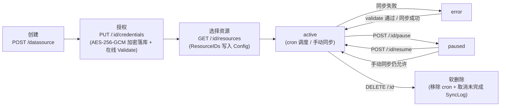
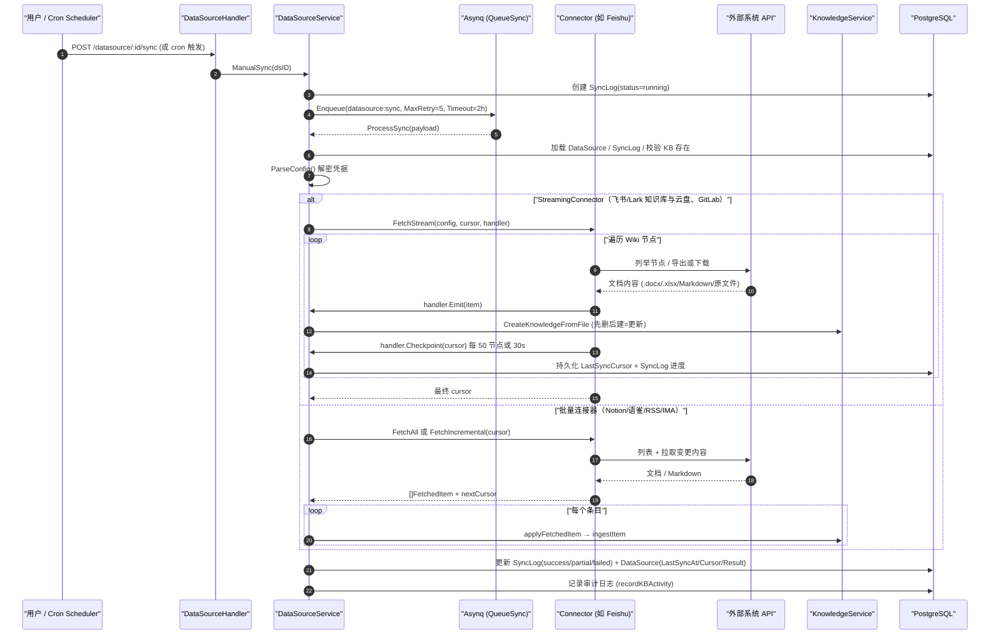

# 数据源导入（Data Source）

团队的知识往往长在飞书、Notion、语雀、GitLab 里，手动导一次很快就过期。数据源要解决的是**持续同步**：绑定一次账号，之后按计划自动把新增和修改同步进知识库，源端删除的文档默认也会从知识库删除。

## 在界面上怎么用

数据源是**挂在知识库上**的，不在全局设置里：打开目标知识库的设置，在「存储与数据」分组里选「数据源」（只在编辑已有知识库时出现），点「添加数据源」，按四步完成：

1. **选择类型**：飞书、Lark（飞书国际版）、飞书云盘、Lark 云盘、Notion、语雀、腾讯 IMA、RSS / Atom 订阅、GitLab。
2. **配置凭证**：填写该连接器需要的凭据（见下文「连接器能力对比」），可以先「测试连接」。对话框会给出各平台获取凭据与开通权限的指引，例如飞书需要企业自建应用、机器人能力，以及 `wiki:wiki:readonly`、`drive:drive:readonly`、`drive:export:readonly`、`docx:document:readonly` 权限，并通过群聊把应用加为知识库成员。
3. **选择范围**：勾选要同步的空间 / 目录 / 知识库。飞书知识库还可以粘贴文档链接直接添加（用于不在空间列表里的个人云文档，连同子文档一起同步）；飞书云盘需要输入具体文件夹的 `folder_token` 或文件夹链接（不支持云空间根目录）；GitLab 填写项目 ID 或 `group/project` 路径，可选分支（默认分支）与目录；RSS 每行填一个订阅源地址。
4. **同步策略**：
   - 同步频率：每 30 分钟 / 每小时 / 每 6 小时（默认）/ 每 12 小时 / 每天；
   - 同步模式：增量同步（默认）或全量同步；
   - 冲突策略：条目在知识库中已存在（按来源 ID 判断）时，「覆盖更新」删除旧条目并重新解析入库，「跳过已存在」保持原样，省下重复解析和模型开销；
   - 同步删除（默认开启）：源端删除时同步删除知识库中的对应条目；
   - 飞书系连接器另有「同步视频附件」（默认上限 2048 MB）与「抓取文档中的网页链接」（每篇最多 50 个外部链接）两个开关。

保存时可以选「创建并立即同步」。首次同步是全量，之后按游标增量拉取。数据源列表上可以「立即同步」「暂停」「恢复」、查看同步历史（每次的新增、更新、删除、跳过、失败数与失败文档）；编辑数据源不会自动触发同步。删除数据源不会删除已同步进知识库的知识。

同步进来的每个条目都会自动打上以数据源名称命名的标签，并在元数据里记录 `external_id`、`source_resource_id`、`datasource_id`，便于在知识库里识别来源。

## 实现概览

它不是一次性导入工具，而是一套完整的"连接器 + 调度器 + 增量同步 + 知识入库"流水线：

- 连接器框架与实现：`internal/datasource/`（`connector.go`、`scheduler.go`、`httpclient.go`、`errors.go`、`progress.go`、`connector/` 各实现）
- HTTP 接口层：`internal/handler/datasource.go`、`internal/handler/datasource_credentials.go`
- 业务服务层：`internal/application/service/datasource_service.go`
- 数据模型：`internal/types/datasource.go`

## 核心抽象：Connector 接口

所有连接器必须实现 `internal/datasource/connector.go` 中的 `Connector` 接口：

```go
type Connector interface {
    // Type 返回连接器类型标识（如 "feishu"、"notion"）
    Type() string
    // Validate 通过实际调用外部 API 验证配置与凭据有效性
    Validate(ctx context.Context, config *types.DataSourceConfig) error
    // ListResources 列出可同步的资源（文档、空间、文件夹等）。
    // parentID 支持层级资源的懒加载：""=顶层；非空=该资源的直接子节点
    ListResources(ctx context.Context, config *types.DataSourceConfig, parentID string) ([]types.Resource, error)
    // ResolveResourceAncestors 解析已选资源的祖先链，用于懒加载选择器回显深层选中项
    ResolveResourceAncestors(ctx context.Context, config *types.DataSourceConfig, resourceIDs []string) ([]string, error)
    // FetchAll 全量同步指定资源
    FetchAll(ctx context.Context, config *types.DataSourceConfig, resourceIDs []string) ([]types.FetchedItem, error)
    // FetchIncremental 基于游标增量同步，返回变更项与下一次同步的新游标
    FetchIncremental(ctx context.Context, config *types.DataSourceConfig, cursor *types.SyncCursor) ([]types.FetchedItem, *types.SyncCursor, error)
}
```

### 可选扩展：StreamingConnector（流式可恢复同步）

针对大规模同步（如上千篇文档的飞书 Wiki），`connector.go` 还定义了可选的 `StreamingConnector` 接口。实现了它的连接器不再一次性把所有条目攒在内存里，而是"边抓取、边入库、边落盘游标"：

```go
type StreamHandler interface {
    // Emit 逐条入库一个抓取项；返回错误则中止整个流
    Emit(ctx context.Context, item types.FetchedItem) error
    // Checkpoint 同步持久化游标快照（必须是完整可恢复的快照，而非增量）
    Checkpoint(ctx context.Context, cursor *types.SyncCursor) error
}

type StreamingConnector interface {
    Connector
    FetchStream(ctx context.Context, config *types.DataSourceConfig,
        cursor *types.SyncCursor, h StreamHandler) (*types.SyncCursor, error)
}
```

价值：同步任务超时（Asynq 任务超时为 6 小时）后可以从最后一个 checkpoint **续传**，而不是从头重来；同时内存占用被限制在"单个条目"级别。目前实现了 `StreamingConnector` 的是**飞书/Lark 知识库、飞书/Lark 云盘与 GitLab** 连接器。

### ConnectorRegistry：注册与查找

`ConnectorRegistry` 是简单的 `map[string]Connector` 注册表。实际注册发生在 `internal/container/container.go` 的 `initConnectorRegistry()`：

```go
registry.Register(wiki.NewConnector(core.RegionFeishu))                        // feishu
registry.Register(wiki.NewConnector(core.RegionLark))                          // lark（国际版，同一实现不同 Region）
registry.Register(notionConnector.NewConnector())                              // notion
registry.Register(yuqueConnector.NewConnector())                               // yuque
registry.Register(drive.NewDriveConnector(core.RegionFeishuDrive))             // feishu_drive（云盘）
registry.Register(drive.NewDriveConnector(core.RegionLarkDrive))               // lark_drive
registry.Register(imaConnector.NewConnector())                                 // ima（腾讯 ima）
registry.Register(rssConnector.NewConnector())                                 // rss
registry.Register(gitlabConnector.NewConnector())                              // gitlab
```

> 注意：`connector.go` 中的 `ConnectorMetadataRegistry`（`GET /datasource/types` 的返回）还列出了 Confluence、GitHub、Google Drive、OneDrive、DingTalk、Web Crawler、Slack、IMAP 等元数据，但**实际注册可用的连接器只有 9 个类型：`feishu`、`lark`、`feishu_drive`、`lark_drive`、`notion`、`yuque`、`ima`、`rss`、`gitlab`**（飞书/Lark 的知识库与云盘各用一份实现），前端的类型列表也只列这 9 个。未注册类型在创建数据源时会被 `connectorRegistry.Get()` 以 `ErrConnectorNotFound` 拒绝。

## 数据模型（internal/types/datasource.go）

| 结构 | 说明 |
| --- | --- |
| `DataSource` | 数据源配置实体（表 `data_sources`）。关键字段：`Type`（连接器类型）、`Config`（JSONB，含加密凭据）、`SyncSchedule`（6 段 cron 表达式）、`SyncMode`（`incremental`（默认）/`full`）、`Status`（`active`/`paused`/`error`/`deleted`）、`ConflictStrategy`（`overwrite`（默认）/`skip`）、`SyncDeletions`（默认 true）、`LastSyncCursor`（增量游标 JSONB）、`LastSyncAt`、`LastSyncResult`、`SyncLogRetentionDays`（默认 30） |
| `SyncLog` | 单次同步执行记录（表 `sync_logs`）。状态：`running`/`success`/`partial`/`failed`/`canceled`；计数：`ItemsTotal/Created/Updated/Deleted/Skipped/Failed`；`Result` 保存 `SyncResult` JSON |
| `DataSourceConfig` | 解密后的配置结构：`Type` + `Credentials map[string]interface{}` + `ResourceIDs []string`（选中的资源）+ `Settings map[string]interface{}`（非机密配置） |
| `Resource` | 外部系统的可选资源：`ExternalID`、`Name`、`Type`、`URL`、`ParentID`、`HasChildren`、`ModifiedAt`、`Metadata` |
| `FetchedItem` | 单个抓取到的文档：`ExternalID`、`Title`、`Content []byte`、`ContentType`、`FileName`、`URL`、`UpdatedAt`、`Metadata`、`IsDeleted`、`SourceResourceID` |
| `SyncCursor` | 增量游标：`LastSyncTime` + `ConnectorCursor map[string]interface{}`（连接器自定义结构） |
| `SyncResult` | 同步结果汇总 + `Errors []SyncItemError`（失败样本，上限 100 条，见 `maxSyncResultErrors`） |
| `SyncItemError` | 面向用户的失败样本：稳定的 i18n `Code` + 插值 `Params` + 兜底 `Message`；原始 API 状态码/响应体只留在服务端日志 |
| `DataSourceSyncPayload` | Asynq 任务载荷：`DataSourceID`、`TenantID`、`SyncLogID`、`ForceFull`、`Trigger`（`manual`/`schedule`） |

## 凭据加密存储

凭据安全是该模块的重点设计，实现分散在三处：

**1. 写入时加密 —— `DataSourceConfig.ToJSON()`**（`internal/types/datasource.go`）：

```go
// 当配置了 SYSTEM_AES_KEY 时，Credentials 中的每个字符串值在序列化前
// 都会做 AES-256-GCM 加密。这是凭据进入 DB 的唯一写路径（GORM 的 JSON
// 类型本身是字节透传），因此在这里加密即可保证 DataSource.Config 落库全程密文。
if key := utils.GetAESKey(); key != nil && len(out.Credentials) > 0 {
    ...
    if enc, err := utils.EncryptAESGCM(s, key); err == nil { encCreds[k] = enc }
}
```

**2. 读取时解密 —— `DataSource.ParseConfig()`**：透明处理三种情况——空串原样返回；无 `enc:v1:` 前缀的历史明文原样返回（免迁移）；密文用 `SYSTEM_AES_KEY` 解密。解密失败（密钥丢失/轮转）时**不让行加载失败**，而是把该字段置空，UI 显示"凭据未配置"，用户重填即可，不会丢失数据源其他配置。

**3. 独立的凭据子资源 —— `internal/handler/datasource_credentials.go`**：凭据不走普通的 `PUT /datasource/:id`，而是独立的 `/credentials` 子资源，且是**整体原子替换**（不允许按字段 PATCH，因为"配了一半的连接器认证"没有意义）：

- `PUT /api/v1/datasource/:id/credentials` — 整体替换凭据 map，替换后立即调用连接器 `Validate` 做在线校验（错 token 立刻反馈，而不是等到下次调度同步）
- `DELETE /api/v1/datasource/:id/credentials/credentials` — 整体清空
- 响应中**永远不回传密文/明文**，只返回 `{"credentials": {"configured": true/false}}`；列表/详情接口经 `dto.NewDataSourceResponse` 序列化时也从构造上剥离 `Credentials`

普通更新接口 `UpdateDataSource`（`datasource_service.go`）会**强制保留库中已存凭据**，即使请求体里带了 credentials 也被忽略并打警告日志。另外 `StripNonSecretCredentials` 会把误放进 credentials 的非机密字段清出去（目前只有 RSS 的 `feed_urls`，它属于 `Settings`）。

## 数据源生命周期与 REST API

路由注册在 `internal/router/routes_infra.go` 的 `RegisterDataSourceRoutes`（查询类读操作 Viewer+，写操作与访问外部系统的操作 Admin+；API Key 调用需要 `manage_datasources` 能力或全量权限）：

| 方法与路径 | 权限 | 说明 |
| --- | --- | --- |
| `GET /api/v1/datasource/types` | Viewer | 可用连接器元数据列表（`ListAvailableConnectors`，按 Priority 排序） |
| `POST /api/v1/datasource/validate-credentials` | Admin | 用裸凭据测试连通性（不落库），供创建向导的"测试连接"按钮 |
| `POST /api/v1/datasource` | Admin | 创建数据源（校验 KB 归属租户 → 校验连接器类型 → 在线 Validate → 落库 → 注册 cron） |
| `GET /api/v1/datasource?kb_id=` | Viewer | 按知识库列出数据源（附带最近一次 SyncLog） |
| `GET /api/v1/datasource/:id` | Viewer | 详情 |
| `PUT /api/v1/datasource/:id` | Admin | 更新（凭据字段被忽略；配置实际变化且已有凭据时才触发在线校验；同步更新 cron） |
| `DELETE /api/v1/datasource/:id` | Admin | 软删除 + 移除 cron + 取消 pending/running 的 SyncLog（已同步的知识保留） |
| `PUT /api/v1/datasource/:id/credentials` | Admin | 原子替换凭据（见上节） |
| `DELETE /api/v1/datasource/:id/credentials/:field` | Admin | 清空凭据（field 只接受 `credentials`） |
| `POST /api/v1/datasource/:id/validate` | Admin | 对已存数据源做连接测试；失败置 `status=error`，成功清除 error 状态 |
| `GET /api/v1/datasource/:id/resources?parent_id=` | Admin | 列出外部系统可选资源（parent_id 支持懒加载展开） |
| `POST /api/v1/datasource/:id/resource-ancestors` | Admin | 解析选中资源的祖先链（编辑时回显深层勾选） |
| `POST /api/v1/datasource/:id/sync` | Admin | 手动触发同步（创建 SyncLog + 入队 Asynq 任务） |
| `POST /api/v1/datasource/:id/pause` / `resume` | Admin | 暂停/恢复（同时移除/重挂 cron） |
| `GET /api/v1/datasource/:id/logs`、`GET /api/v1/datasource/logs/:log_id` | Viewer | 同步历史 |

所有 `:id` 路径都先经 `getOwnedDataSource` → `getOwnedKnowledgeBase` 做**租户隔离**校验（数据源归属的 KB 必须属于当前租户，且通过 API Key 的 KB 授权检查）。

生命周期状态流转：



## 同步调度（internal/datasource/scheduler.go）

`Scheduler` 基于 `robfig/cron`（`cron.WithSeconds()`，支持秒级 6 段表达式）为每个配置了 `SyncSchedule` 的 active 数据源维护一个 cron entry；服务启动时 `Start()` 从 DB 加载全部 active 数据源批量注册。

由于 robfig/cron 按**绝对墙钟时间**触发（例如 `0 0 * * * *` 总在整点触发），多实例部署时所有实例会同时触发。去重靠两层机制：

1. **DB 层防重叠**：`syncLogRepo.HasRunningSync` —— 上一次同步还在 running 就跳过本次（防止同步耗时超过 cron 间隔时叠加执行）。
2. **Redis 层跨实例去重**：确定性的 `asynq.TaskID = "dssync:<dsID>:<yyyyMMddHHmm>"`（按分钟截断）。同一分钟内所有实例产生相同 TaskID，Redis 保证只有一个入队成功，其余得到 `asynq.ErrTaskIDConflict`，对应 SyncLog 标记为 `canceled`（"deduplicated: another instance enqueued first"）。

入队参数：队列 `types.QueueSync`、`MaxRetry(5)`、`Timeout(6*time.Hour)`。任务类型为 `types.TypeDataSourceSync`（`"datasource:sync"`），由 `internal/router/task.go` 中 `mux.HandleFunc(types.TypeDataSourceSync, params.DataSourceService.ProcessSync)` 消费。

## 同步执行与知识入库（datasource_service.go）

`ProcessSync` 是 Asynq 任务处理器，完整流程见下方时序图。要点：

- **防御性取消**：数据源或知识库已被删除时，把 SyncLog 置为 `canceled` 并返回 nil（不再重试）。
- **两条抓取路径**：连接器实现了 `StreamingConnector` 走 `processSyncStreaming`（流式）；否则按 `ForceFull || SyncMode==full` 走 `FetchAll`，或带上 `ParseSyncCursor()` 的游标走 `FetchIncremental`（批量）。
- **流式路径的游标策略**（`streamStartCursor`）：用户触发的全量同步在**首次尝试**时丢弃游标全量抓取；Asynq **重试**（attempt > 0）以及所有增量同步都从最后一个 checkpoint 续传。
- **入库核心 `applyFetchedItem` → `ingestItem`**：
  - `IsDeleted=true` 的条目：数据源关闭了 `SyncDeletions` 时既不删除也不计数；开启时（默认）按 `external_id` 在**本数据源拥有的**条目里查找并真正删除（软删后硬删），计为 Deleted，找不到则计为 Skipped（删除幂等）。删除失败计入 `DeletionFailed`，由于游标已越过该条目，通常要等下次全量同步才会重试；
  - 有 `Content` 字节 → 包装成 `multipart.FileHeader` 走 `KnowledgeService.CreateKnowledgeFromFile`（完整文档解析流水线）；只有 `URL` → 走 `CreateKnowledgeFromURL` 由 Yuheng 下载解析；
  - **更新 = 先删后建**：按 `external_id` 在本数据源拥有的条目里查到既有知识条目，冲突策略为 `overwrite` 时先删除再重建，计为 Updated；为 `skip` 时原样保留，计为 Skipped；
  - 重复文件（`DuplicateKnowledgeError`）计为 Skipped，不算失败；
  - 每个条目自动带上 metadata：`external_id`、`source_resource_id`、`datasource_id` 以及连接器附加的 metadata。
- **自动打标**：`resolveAutoTagIDs` 按数据源名称在目标 KB 中 FindOrCreate 一个标签，所有同步条目自动挂上，便于在 KB 中识别来源；打标失败不阻断同步。
- **结果状态**：全部条目失败 → `failed`（`allFetchedItemsFailedError`）；RSS 部分 feed 失败（`PartialFetchError`）或流式路径存在失败文档 → `partial`；其余 → `success`。失败样本以 `SyncItemError` 形式最多保留 100 条。
- 抓取失败时若连接器返回了新游标（如 RSS），仍会持久化游标，避免瞬时故障后被迫全量重抓。



## 连接器实现详解

### 连接器能力对比

| | 飞书 / Lark 知识库 | 飞书 / Lark 云盘 | Notion | 语雀 | RSS / Atom | GitLab | 腾讯 IMA |
| --- | --- | --- | --- | --- | --- | --- | --- |
| 源码目录 | `connector/feishu/wiki/` + `core/` | `connector/feishu/drive/` + `core/` | `connector/notion/` | `connector/yuque/` | `connector/rss/` | `connector/gitlab/` | `connector/ima/` |
| 类型标识 | `feishu` / `lark` | `feishu_drive` / `lark_drive` | `notion` | `yuque` | `rss` | `gitlab` | `ima` |
| 凭据字段 | `app_id`、`app_secret`，可选 `base_url`（开放平台地址）、`web_base_url`（生成原文链接用的访问域名） | 同左 | `api_key`（Internal Integration Token） | `api_token`（`X-Auth-Token` 头），可选 `base_url`（私有化部署） | 可选 `auth_headers`；`feed_urls` 属 Settings | `base_url`、`access_token`（个人访问令牌） | `client_id`、`api_key`，可选 `base_url` |
| 资源模型 | Wiki 空间 → 节点树（懒加载，`spaceID:nodeToken` 复合 ID）；也可按文档链接添加 | 用户给出的文件夹 `folder_token` → 子文件夹懒加载 | 页面/数据库全量树（一次返回带 parent 关系） | 知识库（book/repo）扁平列表 | 每个 feed URL 一个资源 | 项目 → 目录树；Settings 里记录项目、分支、目录 | 知识库扁平列表 |
| 内容格式 | 文档默认走导出 API 得到 `.docx`（`FEISHU_DOCX_PARSE_MODE=blocks` 改走块 API 转 Markdown）；表格导出 `.xlsx`；文件原样下载 | 同左 | Block → Markdown；数据库转 Markdown 表格；附件下载 | `body` Markdown 原文 | Readability 全文抽取 → Markdown | 仓库文件原样下载，只收导入流水线支持的扩展名 | 按媒体类型下载文件；笔记按 Markdown 入库；AI 会话与视频跳过 |
| 增量机制 | 按节点 `obj_edit_time` 比对（cursor: `SpaceNodeTimes`） | 按文件 `modified_time` 比对 | 按页面/记录 `last_edited_time` 比对（cursor: `PageEditTimes`） | 按文档 `content_updated_at` 比对（cursor: `BookDocTimes`） | feed 信号指纹 + 内容 SHA-256 指纹双层比对 | 记录每个项目的 head commit，用 compare API 取变更文件 | 按稳定的逻辑键与 `media_id` 比对 |
| 删除检测 | 支持（部分列举失败时跳过删除检测） | 支持 | 支持（区分"源端已删"与"用户取消勾选"，后者不报删除） | 支持 | 不支持（feed 天然滚动淘汰旧条目） | 支持（删除与重命名的旧路径） | 支持 |
| 流式可恢复同步 | 是（每 50 节点或 30 秒 checkpoint） | 是（同一引擎） | 否 | 否 | 否 | 是（每个项目一个 checkpoint） | 否 |
| 限流应对 | 429 读 `Retry-After`，传输错误指数退避（2s/4s/8s，最多 3 次）；5xx 重试 1 次 | 同左 | — | 每次 `GetDocDetail` 间隔 300ms | — | — | — |
| 部分失败 | 单文档失败生成带错误 metadata 的占位条目，继续同步 | 同左 | 单页失败记日志跳过 | 单文档失败生成占位条目 | 单 feed 失败 → `PartialFetchError`；全部失败才算 fail | — | — |

### 飞书 / Lark（`connector/feishu/`）

飞书与 Lark（国际版 open.larksuite.com）是部署在两朵隔离云上的同一产品，Wiki/docx/drive API 完全一致，因此**共用同一份代码**：`core/` 放客户端、区域、导出与块转换、以及知识库与云盘共用的流式同步引擎（`engine.go`），`wiki/` 与 `drive/` 只负责资源枚举与抓取分派。`core/region.go` 中的 `Region` 结构选择云端（`RegionFeishu` / `RegionLark` / `RegionFeishuDrive` / `RegionLarkDrive`，API 域名 `open.feishu.cn` / `open.larksuite.com`）。`base_url` 凭据字段可显式覆盖（例如 Lark 专属版 `https://open.larkenterprise.com`）。

- **认证**（`core/client.go`）：`POST /open-apis/auth/v3/tenant_access_token/internal` 换取 tenant_access_token，带互斥锁缓存与过期刷新。
- **资源列举**（知识库，`ListResources`）：三级懒加载——`parentID==""` 列 Wiki 空间；`parentID==spaceID` 列空间顶层节点；`parentID=="spaceID:nodeToken"` 列该节点子节点。递归只发生在同步时，避免大 Wiki 在选择器里超时。`ResolveResourceAncestors` 通过 `GetWikiNode` 的 `parent_node_token` 逐级上溯，O(depth) 回显深层勾选。
- **内容抓取**按 `obj_type` 分派：
  - `docx`/`doc` → 默认用异步导出 API 导出 `.docx`，交给 docreader 解析，图片随文档绑定；环境变量 `FEISHU_DOCX_PARSE_MODE=blocks` 时改走块 API 转 Markdown（更快，但图片会拆成独立条目），块 API 出错或渲染为空时回退导出；
  - `sheet`/`bitable` → 导出 `.xlsx`；
  - `file` → drive 原文件下载（PDF/Word/图片等）；
  - `mindnote`/`slides` → **跳过**（无内容读取 API），并通过 `fetchTally` 按类型输出 `discovered/fetched/failed/skipped_unsupported` 摘要日志，解释"发现的文档为何没全部同步"。
  - 开启「同步视频附件」时（Settings `sync_video_attachments`、`video_max_mb`），文档内嵌视频与云盘视频文件会下载并作为视频知识解析；开启「抓取文档中的网页链接」时（`sync_linked_pages`），正文中的外部网页链接作为独立网页知识抓取（每篇最多 50 个，飞书/Lark 内部链接不抓）。
- **增量逻辑**：游标 `SpaceNodeTimes`（`resourceID → nodeToken → editTime`）。变更判定用 `obj_edit_time`（文档内容编辑时间），而**不是** `node_edit_time`（只反映改标题/挪位置）。抓取失败的节点**不推进游标**（保留旧 editTime，下次必然重试），避免瞬时导出失败导致文档被永久跳过。
- **FetchStream**：统一全量/增量路径（cursor==nil 即全量），每处理 `FeishuStreamCheckpointInterval = 50` 个节点、或距上次 checkpoint 超过 `FeishuStreamCheckpointMaxInterval = 30s` 就落盘一次游标——后者兜底"少量文档但每篇导出都极慢（被限流）"导致任务超时前从未 checkpoint 的场景。
- **错误分类**：把原始错误归类为稳定 i18n code（`feishu_auth_or_permission` / `feishu_rate_limited` / `feishu_timeout` / `feishu_server_unavailable` / `feishu_api_error`(+code) 等），前端本地化展示；原始 status/body/log_id 只留在服务端日志。其中权限类错误不在下次同步时自动重试（需要先改应用权限或共享设置）。

### 飞书 / Lark 的应用准备与权限

飞书（open.feishu.cn）和 Lark（open.larksuite.com）是两个独立体系，应用和凭据不能混用：同步飞书内容用飞书开放平台的应用，同步 Lark 内容用 Lark 开放平台的应用。

1. 在开放平台创建**企业自建应用**，记下 App ID（`cli_` 开头）与 App Secret；
2. 为应用添加「机器人」能力；
3. 在「权限管理」里开通权限，并**创建并发布新版本**——权限改动不发布不生效：

| 权限 | 用途 | 知识库（`feishu` / `lark`） | 云盘（`feishu_drive` / `lark_drive`） |
| --- | --- | --- | --- |
| `wiki:wiki:readonly` | 列举知识空间与节点 | 需要 | 不需要 |
| `drive:drive:readonly` | 列举文件夹、下载普通文件 | 需要 | 需要 |
| `drive:export:readonly` | 把 docx / doc / sheet / bitable 导出为 docx / xlsx | 需要 | 需要 |
| `docx:document:readonly` | 用块 API 读取新版文档正文与附件 | 需要 | 需要 |

4. **把内容授权给应用**。开通 API 权限之后，应用仍然只能访问被显式分享给它的内容，做法是经由群聊：建一个群（或复用一个），把应用加为群机器人，并把内容的管理者也拉进群；
   - 知识库：在知识库「设置 → 成员设置」里添加该群为成员，角色至少「可阅读」；
   - 云盘：在目标文件夹「分享 / 添加协作者」里分享给该群，给「可阅读」。子文件夹与其中的文件随父文件夹一起获得授权。之后某个文件同步报 403，先检查它是否在这棵已分享的目录树下；
   - 个人云文档库里的文档不会出现在知识空间列表里：在文档「…」菜单把应用加为协作者，再在「选择范围」一步粘贴文档链接添加（连同子文档一起同步）。

### 飞书 / Lark 云盘的使用要点

- **选择范围**：在「云盘文件夹 Token」里填 `folder_token`，或直接粘贴文件夹链接（`https://xxx.feishu.cn/drive/folder/<token>` 或 Lark 的对应链接，前端会提取 token），点「加载」后按目录树勾选。**不支持云空间根目录**（根目录不分页且不返回快捷方式），必须选具体文件夹。
- **文件类型**：`docx` / `doc` 与 `sheet` / `bitable` 的处理同知识库；`file`（PDF、PPT、图片等普通文件）直接下载后按类型解析；`folder` 递归遍历；`shortcut`（快捷方式）按目标文件同步（飞书不允许快捷方式指向文件夹）；`mindnote` / `slides` / `board` 没有读取接口，跳过。
- **增量**：按文件修改时间（`modified_time`）比对游标，中断后从最后一个 checkpoint 续传。
- **来源标记**：同步进来的条目渠道为 `feishu_drive` / `lark_drive`，与知识库同步的 `feishu` / `lark` 区分开。

| 界面提示 | 原因与处理 |
| --- | --- |
| 「请输入具体文件夹的 folder_token，不支持云空间根目录」 | 输入为空或给的是根目录链接，换具体文件夹 |
| 「应用无权访问该文件夹……分享给应用所在的群」 | 没有把文件夹分享给应用所在的群 |
| 「应用凭证无效或缺少云盘权限」 | App ID / Secret 错误，或权限未开通、未发布版本 |
| 「folder_token 不存在或已删除」 | token 复制有误，从文件夹链接重新复制 |

### 飞书 docx 的两种解析模式

新版云文档（docx）怎么解析由 app 服务的环境变量 `FEISHU_DOCX_PARSE_MODE` 决定（不是数据源配置），同时作用于飞书知识库与云盘连接器，修改后重启 app 生效：

| | `export`（默认，留空同） | `blocks` |
| --- | --- | --- |
| 路径 | 异步导出 API → `.docx` → docreader 解析 | 块 API → Markdown，出错或渲染为空时回退导出 |
| 图片与文档的关联 | 图片随文档一起解析，挂在同一条知识下，检索与 Wiki 能把图片内容和正文一起用上 | 图片块渲染为空占位，图片另存为独立知识条目，和正文割裂 |
| docx 内的附件（file 块） | 丢失（导出的 .docx 不含附件） | 保留，作为独立知识条目；父文档更新时清理已移除的附件 |
| 速度 | 慢（创建导出任务、轮询、下载，再解析） | 快 |

需要图片内容和文档关联时用默认的 `export`；只要正文、要保留附件或追求同步速度时用 `blocks`。两种模式下，图片内容（OCR / 描述）都要知识库配置了视觉模型才会生成，没配置时正文照常同步。

### Notion（`connector/notion/`）

- **认证**：Internal Integration Token（凭据字段 `api_key`），API 版本 `NotionAPIVersion = "2026-03-11"`，默认 `https://api.notion.com`（`Settings.base_url` 可覆盖）。
- **资源列举**：Search API 一次拉取全部可见页面与数据库，返回带 `ParentID` 的完整树（因此 `parentID != ""` 的懒加载请求直接返回空；`ResolveResourceAncestors` 亦无事可做）。`resolveParentID` 处理 2025-09-03+ API 的 `data_source` 对象：其 `parent` 指向数据库容器，真实工作区位置要看 `database_parent`。
- **抓取**：`fetchPage` 递归处理页面——`GetBlockChildrenAll` 拉块 → `BlocksToMarkdown`（`markdown.go`）转 Markdown；`file_upload` 型文件块先 `ResolveBlock` 换临时下载 URL；**附件**（PDF 等，图片除外——图片已以 `` 内联在 Markdown 中）作为独立条目下载入库；`child_page` / `child_database` 块递归下钻。数据库两种形态：整库渲染成一张 Markdown 表格（`buildDatabaseItem`，含每条记录的块内容附录），数据库记录单独出现时按"属性列表 + 块内容"渲染（`buildRecordItem`）。属性提取 `propertyToString` 通用地跟随 `type` 链，覆盖全部 22 种属性类型；属性名按字母序排序保证增量比对的确定性。
- **增量逻辑**：首次同步（游标为空）直接委托 `FetchAll` 并用返回条目的 `UpdatedAt` 构建游标；后续同步 `discoverAllResources` 用 Search API + BFS 圈定选中根下的全部后代，逐页比对 `last_edited_time`。数据库走 `fetchDatabaseIncremental`：任一记录变更就整表重建。
- **删除与取消勾选的区分**：源端消失的页面报 `IsDeleted`；仍可见但因用户取消勾选祖先而不再可达的页面进入 excluded 集合，**不会**被误报为删除。`computeExcludedSet` 同时保证"用户从未见过的新页面"不被排除——选中的父节点仍会自动带上新子页面。

### Yuque 语雀（`connector/yuque/`）

- **认证**：个人 Token（语雀设置 → Token）或团队 Token，凭据字段 `api_token`（请求头 `X-Auth-Token`）+ 可选 `base_url`（企业私有化域名，缺 scheme 自动补 `https://`）。
- **资源列举**：`GET /api/v2/user` 判断 token 身份——`type=="Group"` 为团队 token，直接列团队 repo；否则列个人 repo + 已加入 group 的 repo（用户未加入任何 group 时语雀返回 404，按空处理）。输出扁平的 `book` 资源列表，按 ExternalID 稳定排序。
- **抓取**（`walk`，全量/增量共用）：`ListBookDocs` 列文档 → 过滤 `type != "Doc"`（跳过 Sheet/Thread/Board/Table）与 `status != "1"`（跳过草稿）→ 每次 `GetDocDetail` 之间 sleep 300ms 规避限流 → `format` 为 `markdown`/`lake` 时取 `body` Markdown 原文入库（其他格式如 html 防御性跳过并记 `skip_reason`）。
- **增量逻辑**：游标 `yuqueCursor.BookDocTimes`（`bookID → docID → content_updated_at`），一致则跳过。删除检测：游标里有、当前列表没有 → `IsDeleted`。

### RSS / Atom（`connector/rss/`）

- **配置**：`feed_urls`（换行/逗号分隔，多条去重）存放在 **Settings**（非机密，UI 可直接编辑）；`auth_headers`（`Name: Value` 每行一条，仅附加在 feed 请求上、绝不发给第三方文章页）存放在 **Credentials** 并加密。`HasConfiguredCredentials` 对 RSS 特判：只有 `auth_headers` 才算已配置凭据。
- **抓取**：`gofeed` 解析 RSS/Atom/JSON feed；条目有链接时抓原文页过 readability 抽取器，成功则以全文为准，失败回退 feed 自带内容（`content:encoded`/`description`）；HTML 经 `html-to-markdown/v2` 转 Markdown。条目 ID 取 `GUID > Link > Title` 第一个非空值。
- **增量逻辑**：双层指纹——先比 feed 侧信号指纹（`feedSignalFingerprint`，未变则连原文页都不抓）；再比抓取后内容的 SHA-256 指纹。**不支持删除同步**（feed 会自然淘汰旧条目）。
- **部分失败**：单个 feed 抓取/解析失败时沿用旧游标（`copyFeedCursor`）并继续其余 feed，最终以 `datasource.PartialFetchError` 上报（SyncLog 记 `partial`）；全部 feed 都失败才整体报错。

### GitLab（`connector/gitlab/`）

- **凭据**：`base_url`（GitLab 实例地址）+ `access_token`（个人访问令牌），加密存储。
- **范围**：Settings 的 `projects` 列表，每项含 `project_id`（数字 ID 或 `group/project`）、可选 `ref`（留空用默认分支）与 `paths`（留空同步整个项目）。选择器里项目下可展开目录树。
- **抓取**：只同步导入流水线能处理的扩展名（PDF、Word、Markdown/MDX、HTML、表格、PPT、JSON、EPUB、图片、音频等，见 `gitLabSupportedFileExtensions`）。
- **增量逻辑**：游标记录每个项目上次同步的 commit。首次同步列举全部文件；head 变化时用 compare API 取变更文件，删除与重命名的旧路径发出 `IsDeleted`；compare 不可用（历史被改写）或被截断时回退为重新列举。每处理完一个项目 checkpoint 一次。

### 腾讯 IMA（`connector/ima/`）

- **凭据**：IMA 智能体接入页的 `client_id` 与 `api_key`（请求头 `ima-openapi-clientid` / `ima-openapi-apikey`），可选 `base_url`；需要先在 IMA 客户端为该凭证授权要同步的知识库。
- **资源**：凭证可操作的知识库扁平列表（`get_addable_knowledge_base_list`，为空时回退搜索接口）。
- **抓取**：递归枚举知识库目录；PDF、Word、PPT、Excel、Markdown、TXT、图片、音频、HTML、EPUB 等按媒体类型下载，笔记从笔记命名空间读取正文按 Markdown 入库；AI 会话与视频解析没有读取接口，跳过。
- **增量逻辑**：用稳定的逻辑键识别条目（IMA 替换同名文件会换新的 `media_id`，按逻辑键判断才能把它当作更新而不是一删一增）：新键 → 新增，`media_id` 变化 → 更新，上次有本次无 → 删除。IMA 不提供条目级修改时间，同一 `media_id` 下的原地修改检测不到，需要定期全量同步。

## 安全限制（internal/datasource/httpclient.go 与 errors.go）

`httpclient.go` 提供两个所有连接器共用的 SSRF 防护入口：

```go
// ValidateConnectorBaseURL 对连接器 base_url 做 SSRF 策略校验（空值放行，由调用方套默认值）
func ValidateConnectorBaseURL(rawURL string) error {
    ...
    if err := utils.ValidateURLForSSRF(url); err != nil { ... }
}

// NewConnectorHTTPClient 返回带重定向与拨号期 SSRF 防护的 HTTP 客户端
func NewConnectorHTTPClient(timeout time.Duration) *http.Client {
    cfg := utils.DefaultSSRFSafeHTTPClientConfig()
    cfg.Timeout = timeout
    return utils.NewSSRFSafeHTTPClient(cfg)
}
```

底层 `internal/utils/security.go` 会拒绝私网地址、回环地址、link-local 等目标，并且在**每次重定向和实际拨号时**重新校验（而非只校验初始 URL），防止恶意 feed 或自定义 base_url 把 Yuheng 引向内网服务。带 base_url 的连接器（飞书/Lark、Notion、语雀、GitLab、IMA）在解析配置时都会调用 `ValidateConnectorBaseURL`。

`errors.go` 定义了模块级哨兵错误（`ErrConnectorNotFound`、`ErrDataSourceInvalid`、`ErrInvalidCredentials`、`ErrSyncFailed` 等）与 `PartialFetchError`（部分资源成功、部分失败；调用方应处理已得条目、持久化游标、把 `Details` 以 partial 状态呈现给用户）。

## 实现参考

| 路径 | 内容 |
|---|---|
| `internal/datasource/connector.go` | `Connector` / `StreamingConnector` 接口、注册表、连接器元数据 |
| `internal/datasource/scheduler.go` | cron 调度与跨实例去重 |
| `internal/datasource/httpclient.go`、`errors.go`、`progress.go` | SSRF 防护、哨兵错误、同步进度上报 |
| `internal/datasource/connector/` | 各连接器实现（`feishu/{core,wiki,drive}`、`notion`、`yuque`、`rss`、`gitlab`、`ima`） |
| `internal/application/service/datasource_service.go` | 数据源 CRUD、`ProcessSync`、`applyFetchedItem` / `ingestItem` |
| `internal/handler/datasource.go`、`datasource_credentials.go` | HTTP 接口与凭据子资源 |
| `internal/router/routes_infra.go` | `RegisterDataSourceRoutes` |
| `internal/types/datasource.go` | 数据模型、凭据加解密 |
| `internal/container/container.go` | `initConnectorRegistry` |
| `frontend/src/views/knowledge/settings/DataSourceSettings.vue`、`DataSourceEditorDialog.vue`、`DataSourceSyncLogs.vue` | 知识库设置里的数据源页、创建向导、同步历史 |
| `internal/datasource/CONNECTOR_IMPLEMENTATION_GUIDE.md`、`README.md` | 连接器开发指南与模块说明 |
