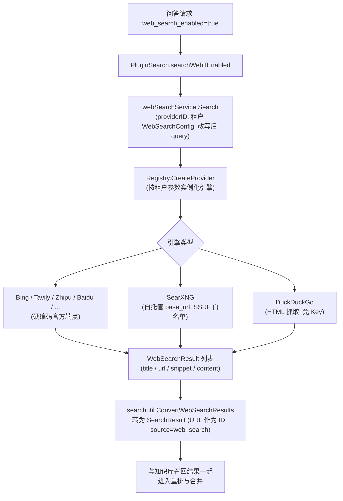
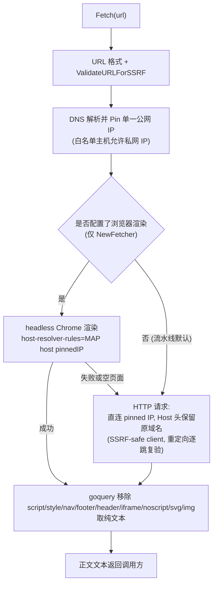

# 网络搜索与网页抓取

当知识库检索不足以回答问题时，Yuheng 的问答流水线可以借助联网搜索补充实时信息：搜索结果与知识库召回结果一起进入重排与生成。底层实现分布在 `internal/infrastructure/web_search`（12 个搜索引擎的适配层）与 `internal/infrastructure/web_fetch`（网页正文抓取器），并通过 `docker/searxng` 提供可选的自托管元搜索引擎。

## 怎么用

1. **配置搜索引擎**：在「设置 → 网络搜索」里点「添加搜索引擎」，选择引擎类型，填写名称、API 密钥（或 SearXNG 的实例地址）、可选的 HTTP 代理，可以先「测试连接」，再「设为默认」。一个工作空间可以有多个配置，问答时使用**默认**的那个；工作空间自己没有默认配置时，回退到系统管理员共享给全平台的默认配置。
2. **在问答请求里打开联网搜索**：Web 对话框的输入栏有一个地球图标的开关，只在当前空间能解析到默认搜索引擎（自己的默认配置，或平台共享的默认配置）时出现；打开后每次提问都带 `web_search_enabled: true`。开关状态随其他输入栏选项一起记住，打开旧会话时恢复为该会话上次提问时的状态。程序调用则在请求体里带这个字段：REST API（`POST /knowledge-chat/:session_id`）、Go SDK（`WebSearchEnabled`）或 MCP 工具 `chat` 的 `web_search_enabled` 参数；`yuheng` CLI 目前不发送它。
3. 不想申请 API Key 时，可以用 compose 自带的 SearXNG（见下文），实例地址填 `http://searxng:8080`。

配置接口在 `/web-search-providers` 下，写操作需要空间 Admin（开启集中管理基础设施时只有系统管理员可以写），API Key 调用需要 `manage_web_search` 能力或全量权限。

## 接口抽象

搜索能力由两层接口定义（`internal/types/interfaces/web_search.go`）：

```go
// WebSearchProvider defines the interface for web search providers
type WebSearchProvider interface {
    Name() string
    Search(ctx context.Context, query string, maxResults int, includeDate bool) ([]*types.WebSearchResult, error)
}

// WebSearchService defines the interface for web search services
type WebSearchService interface {
    Search(ctx context.Context, providerID string, config *types.WebSearchConfig, query string) ([]*types.WebSearchResult, error)
    CompressWithRAG(ctx context.Context, sessionID string, tempKBID string, questions []string, ...) (...)
}
```

`internal/infrastructure/web_search/registry.go` 维护 **provider 类型 -> 工厂函数** 的注册表，实例按租户参数在调用时创建：

```go
type ProviderFactory func(params types.WebSearchProviderParameters) (interfaces.WebSearchProvider, error)

func (r *Registry) Register(id string, factory ProviderFactory)
func (r *Registry) CreateProvider(providerType string, params types.WebSearchProviderParameters) (interfaces.WebSearchProvider, error)
```

## 支持的搜索引擎

引擎在 `internal/container/container.go` 中注册，共 12 个：

```go
registry.Register("duckduckgo", infra_web_search.NewDuckDuckGoProvider)
registry.Register("google", infra_web_search.NewGoogleProvider)
registry.Register("bing", infra_web_search.NewBingProvider)
registry.Register("tavily", infra_web_search.NewTavilyProvider)
registry.Register("ollama", infra_web_search.NewOllamaProvider)
registry.Register("baidu", infra_web_search.NewBaiduProvider)
registry.Register("searxng", infra_web_search.NewSearxngProvider)
registry.Register("keenable", infra_web_search.NewKeenableProvider)
registry.Register("zhipu", infra_web_search.NewZhipuProvider)
registry.Register("exa", infra_web_search.NewExaProvider)
registry.Register("metaso", infra_web_search.NewMetasoProvider)
registry.Register("firecrawl", infra_web_search.NewFirecrawlProvider)
```

| 引擎 | 源码文件 | 是否需要 API Key | 端点 | 备注 |
|------|---------|-----------------|------|------|
| DuckDuckGo | `duckduckgo.go` | 否 | HTML 抓取优先，API 兜底 | 免费；可配 `proxy_url` |
| Google | `google.go` | 是（还需 `engine_id`） | Google Custom Search API（官方 SDK `customsearch/v1`） | |
| Bing | `bing.go` | 是 | `https://api.bing.microsoft.com/v7.0/search`（硬编码） | |
| Tavily | `tavily.go` | 是 | `https://api.tavily.com/search`（硬编码） | |
| Ollama Web Search | `ollama.go` | 是 | `https://ollama.com/api/web_search`（硬编码） | 最多 10 条结果 |
| 百度千帆 AI 搜索 | `baidu.go` | 是 | `https://qianfan.baidubce.com/v2/ai_search/web_search`（硬编码） | |
| SearXNG | `searxng.go` | 否 | 租户自填 `base_url`（自托管实例） | 唯一允许自定义地址的引擎，需过 SSRF 校验 |
| Keenable | `keenable.go` | 可选 | `https://api.keenable.ai`（硬编码） | 无 Key 走公共限速端点，有 Key 解除限制 |
| 智谱搜索 | `zhipu.go` | 是 | `https://open.bigmodel.cn/api/paas/v4/web_search`（硬编码），默认引擎 `search_std` | |
| Exa | `exa.go` | 是 | `https://api.exa.ai/search`（硬编码） | `extra_config.include_text` 可开启返回正文 |
| 秘塔 AI 搜索 | `metaso.go` | 是 | `https://metaso.cn/api/v1/search`（硬编码） | `extra_config.scope` 选择搜索范围，默认 `webpage` |
| Firecrawl | `firecrawl.go` | 是 | `https://api.firecrawl.dev/v2/search`（硬编码） | `extra_config.scrape_content` 可开启抓取页面正文（markdown，较慢且多耗积分） |

除 SearXNG 外，所有引擎端点均硬编码、租户不可配置——这是防 SSRF 的第一道措施（源码注释：`Not configurable by tenants — prevents SSRF`）。

## 搜索引擎配置（Provider 实体）

每个工作空间可以创建多个搜索引擎配置实例（如 "Production Bing"、"Test Google"），存储为 `web_search_providers` 表的 `WebSearchProviderEntity`（`internal/types/web_search_provider.go`）。`is_default` 标记工作空间的默认配置；`is_builtin` 标记系统管理员共享给所有工作空间的平台级配置（`PUT /web-search-providers/:id/sharing`，只有系统管理员可调用）。参数结构 `WebSearchProviderParameters`：

| 名称 | 类型 | 默认值 | 说明 |
|------|------|--------|------|
| `api_key` | string | 空 | 搜索服务密钥，AES-GCM 加密落库；仅通过 `/credentials` 子资源修改，响应中从不返回 |
| `engine_id` | string | 空 | 仅 Google Custom Search 需要 |
| `base_url` | string | 空 | 仅 SearXNG：自托管实例地址；经 `utils.ValidateURLForSSRF` 校验，内网地址须加入 `SSRF_WHITELIST` |
| `proxy_url` | string | 空 | 可选出站 HTTP/HTTPS 代理（仅隧道流量，不替换 API 端点），同样过 SSRF 校验 |
| `extra_config` | map[string]string | nil | 引擎特有选项，如 Exa 的 `include_text`、秘塔的 `scope`、Firecrawl 的 `scrape_content` |

CRUD 路由（`RegisterWebSearchProviderRoutes`，`internal/router/routes_infra.go`）：`/web-search-providers` 下的 `GET /types`（引擎类型元数据）、增删改查、`POST /test`（用未保存的凭据测试连接）、`POST /:id/test`（用已保存的凭据测试）、`PUT /:id/credentials` 与 `DELETE /:id/credentials/:field`、`PUT /:id/sharing`；读操作 Viewer+，写操作走 `PlatformManaged` 守卫（集中管理关闭时 Admin+，开启后仅系统管理员）。另有 `GET /web-search/providers` 返回可用引擎类型目录。

工作空间级的 `WebSearchConfig`（租户字段）另外提供 `max_results`（默认 10）、`include_date` 与 `blacklist`（按规则过滤结果 URL）。

## 出站请求的 SSRF 防护

`internal/infrastructure/web_search/proxy.go` 的 `NewSearchHTTPClient` 为所有引擎构造统一的安全 HTTP 客户端：

- `DialContext` 使用 `utils.SSRFSafeDialContext`（拨号时校验目标 IP，防 DNS rebinding）；
- 重定向逐跳复验 `ValidateURLForSSRF`（与 `utils.NewSSRFSafeHTTPClient` 同一套规则），超过最大跳数直接失败；
- 显式 `proxy_url` 需通过 SSRF 校验，未配置时回落 `ProxyFromEnvironment`。

## 联网搜索的调用流程

聊天请求带 `web_search_enabled=true` 时，`PluginSearch`（`chat_pipeline/search.go` 的 SEARCH 阶段）在知识库并行召回后调用 `searchWebIfEnabled`：



要点（均见 `search.go` 与 `session_knowledge_qa.go` 的解析函数）：

- **provider 取默认配置**：`resolveWebSearchProviderID` 先选本工作空间 `is_default=true` 的配置，没有则选平台共享（`is_builtin`）且为默认的配置；都没有时记一条 pipeline 警告后跳过联网搜索，不影响知识库检索。`max_results` 取工作空间 `WebSearchConfig` 的值（默认 10），结果再按 `blacklist` 过滤。
- 结果 URL 作为结果 ID，下游 `PluginWebFetch` 可按 ID 取回完整页面正文。
- `CompressWithRAG`（搜索结果写入会话级临时 KB 再向量压缩）在当前管线中未启用，保留在 `WebSearchService` 接口上供后续使用。

## 网页抓取（web_fetch）

### 问答流水线内联抓取：PluginWebFetch

`PluginWebFetch`（`chat_pipeline/web_fetch.go`）挂在 WEB_FETCH 阶段（重排之后、合并之前）：从 rerank 结果中挑出 `source=web_search` 的前 N 条（默认 3），并行抓取完整页面正文并替换 snippet，再进入合并与生成。当前 `resolveWebFetchEnabled` 固定返回 false，所以**这一阶段默认跳过**，搜索结果只以引擎返回的摘要进入回答；插件保留在流水线中供后续开启。

### 抓取器：`internal/infrastructure/web_fetch`

`fetcher.go` 提供两种构造：

- `NewPipelineFetcher()`：问答流水线使用的版本（`FetchURLContent`），只走 HTTP，超时 15s（`pipelineFetchTimeout`）；
- `NewFetcher()`：在 HTTP 之前先用 headless Chrome（chromedp）渲染页面，失败或空页面时回退 HTTP，超时 60s（`fetchTimeout`）。目前没有调用方。



结构化失败语义：

- 每个 URL 单独返回状态，**部分失败不会拖垮整批**——成功页面的内容照常可用；
- 失败带稳定的机器可读错误码与可重试标记（`web_fetch.FetchError`）：`invalid_url`、`dns_failed`、`connection_timeout`、`tls_failed`、`http_403`、`http_429`、`http_5xx`、`http_status`、`ssrf_rejected`、`redirect_rejected`、`read_failed`、`html_parse_failed`、`empty_content`、`connection_failed`；`ErrorDetails(err)` 把内部错误映射成这张表，调用方据此决定是否重试。

安全设计要点：

- **DNS pinning**：校验时解析并固定一个安全 IP；HTTP 路径直连该 IP 并保留原始 `Host`/SNI，浏览器路径用 `--host-resolver-rules="MAP host ip"` 强制 Chrome 复用该 IP——两条路径都不会二次解析，杜绝 DNS rebinding；
- 单页读取上限 100KB（`maxBodySize`），重定向最多 10 跳，请求带浏览器仿真请求头。

> 关于 readability：`codeberg.org/readeck/go-readability/v2`（go.mod）用于 RSS 数据源连接器（`internal/datasource/connector/rss/client.go` 的 `extractArticle`，对文章页做正文净化），`web_fetch` 使用 goquery 做正文抽取。

## docker/searxng 的角色

SearXNG 是自托管的元搜索引擎（聚合上游多个引擎），Yuheng 把它作为**免 API Key 的默认可选搜索后端**打包在 `docker-compose.yml` 的 `searxng` / `full` profile 中：

- `docker/searxng/settings.yml`：关键定制包括 `search.formats` 开启 `json`（Yuheng 后端走 `/search?format=json`）、`server.limiter: false`（关闭 IP 限流，否则后端会被节流；若公开部署需重新开启并配置放行名单）、`secret_key` 由入口脚本以 `SEARXNG_SECRET` 环境变量替换。
- `searxng-init` 辅助容器先把模板复制进独立 volume，避免 SearXNG 入口脚本原地 sed 修改把解析后的密钥写回仓库工作区。
- 应用容器默认把 `searxng` 主机名并入 SSRF 白名单：`SSRF_WHITELIST_EXTRA=searxng,rustfs`，因此配置 `base_url: http://searxng:8080` 开箱即用。
- 宿主机端口默认只绑定 `127.0.0.1`（`SEARXNG_BIND`、`SEARXNG_PORT`，默认 8888），`SEARXNG_SECRET` 有一个默认值，对外暴露前务必替换。启动方式：`docker compose --profile searxng up -d`。
- 客户端超时 12s（`defaultSearxngTimeout`），略高于 SearXNG 的 `outgoing.max_request_timeout: 10.0`，让上游慢引擎表现为 SearXNG 侧错误而非客户端取消。`ValidateSearxngBaseURL` 在"保存"与"使用"两处共享，保证配置校验一致。

## 如何新增一个搜索引擎

1. 在 `internal/infrastructure/web_search/` 新建 `<engine>.go`，实现 `interfaces.WebSearchProvider`（`Name()` + `Search()`），并提供工厂函数 `func New<Engine>Provider(params types.WebSearchProviderParameters) (interfaces.WebSearchProvider, error)`；官方端点应硬编码为常量，HTTP 客户端用 `NewSearchHTTPClient(timeout, params.ProxyURL)` 构造。
2. 在 `internal/types/web_search_provider.go` 增加 `WebSearchProviderType` 常量。
3. 在 `internal/container/container.go` 的注册处追加 `registry.Register("<engine>", infra_web_search.New<Engine>Provider)`。
4. 如需密钥/额外参数校验，在 web search provider service 的参数校验分支中补充（参考 `ValidateSearxngBaseURL` 的共享校验模式），并为前端 `GET /web-search/providers` 目录补充展示信息。
5. 参考 `searxng_test.go` / `zhipu_test.go` 用 `httptest` 模拟上游编写单测。

## 实现参考

| 路径 | 内容 |
|---|---|
| `internal/types/interfaces/web_search.go` | `WebSearchProvider` / `WebSearchService` 接口 |
| `internal/infrastructure/web_search/` | 12 个引擎实现、`registry.go`、`proxy.go`（出站客户端） |
| `internal/infrastructure/web_fetch/fetcher.go` | 网页正文抓取器 |
| `internal/application/service/web_search.go` | 搜索服务、黑名单过滤 |
| `internal/application/service/chat_pipeline/search.go`、`web_fetch.go` | 问答流水线中的联网搜索与抓取阶段 |
| `internal/application/service/session_knowledge_qa.go` | `resolveWebSearchProviderID` 等请求级解析 |
| `internal/application/repository/web_search_provider.go` | 默认配置查找（工作空间优先，平台共享兜底） |
| `internal/types/web_search_provider.go`、`internal/types/web_search.go` | 配置实体、参数与工作空间级配置 |
| `internal/router/routes_infra.go` | `RegisterWebSearchRoutes`、`RegisterWebSearchProviderRoutes` |
| `frontend/src/views/settings/WebSearchSettings.vue` | 「设置 → 网络搜索」页 |
| `docker/searxng/settings.yml`、`docker-compose.yml` 的 `searxng` / `searxng-init` 服务 | 自托管 SearXNG |
