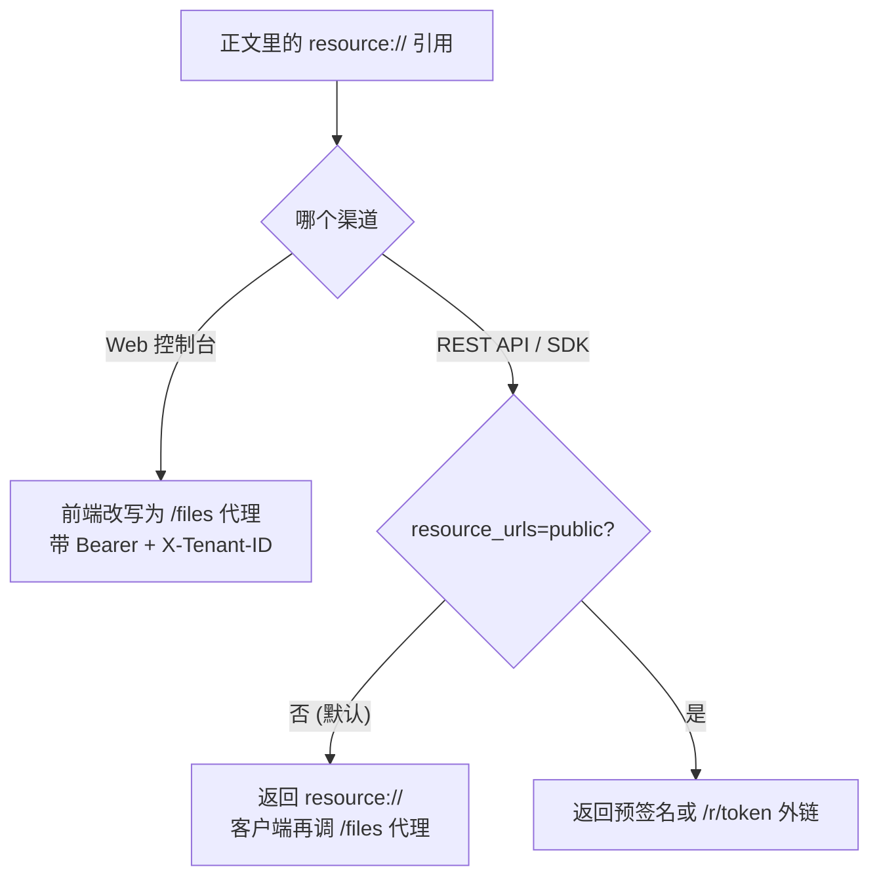

# 图片与文件的对外访问

「回答里的图片在网页上能看，用 API 拿到的引用却是 `resource://xxx`，前端加载不了」——这是最常见的一类问题。原因不是图挂了，而是**不同客户端能拿到的 URL 形式不一样**，需要按渠道配对。

这一篇把四种形式和每个渠道的取法讲清，末尾是按症状排查的对照表。

## 1. 四种形式

知识库里的图片和附件都存在某个存储后端上，正文里不直接写存储路径，而是写一个内部引用 `resource://<handle>`。引用对应一条资源记录，记录里写着文件在哪个后端、后端内的哪个位置；服务端解析引用时只看这条记录，不看调用者的空间或知识库当前绑定的后端。存储自己的位置（`local://…`、`s3://…`）从不出现在接口里，所有文件代理也只接受 `resource://`。对外交付时引用会被换成下面某一种：

| 形式 | 样子 | 谁能访问 | 有效期 |
| --- | --- | --- | --- |
| **内部引用** | `resource://<handle>` | 谁都不能直接访问，这是给服务端用的稳定句柄 | — |
| **鉴权代理** | `/files`、`/api/v1/knowledge-bases/:id/files` | 带对应凭证的客户端（登录态 / KB 访问权） | 随凭证 |
| **能力短链** | `<APP_EXTERNAL_URL>/r/<token>` | 任何拿到链接的人（**匿名可读**） | Yuheng 签发的 grant，2 小时 |
| **存储预签名** | S3 兼容存储直接给的 http(s) 链接 | 任何拿到链接的人（**匿名可读**） | 24 小时 |

配置了 `APP_EXTERNAL_URL` 时，外链一律是能力短链，对任何后端都有效（本机目录、部署存储、空间注册的 S3 都一样），也不暴露桶的地址；没配时只有 S3 兼容后端能给出预签名，本机目录后端给不出外链。

后两种是「拿到即可加载」的外链，代价是在有效期内**任何人**都能读到那个文件——不要写进日志或转给不该看的人。

::: tip 为什么不统一发外链
外链要么依赖存储后端本身公网可达，要么要签发匿名 grant。默认的自带 RustFS 部署（`rustfs:9000` 是内网地址）两者都不满足，而网页端本来就有登录态，走鉴权代理更安全也更简单。所以默认形式是内部引用 + 鉴权代理，外链是按需开启的。
:::

## 2. 各渠道分别怎么取

### Web 控制台

前端把 `resource://` 引用改写成鉴权代理地址（`frontend/src/utils/protectedFileAccess.ts`），按上下文选路径：普通场景走 `/files`（Bearer + `X-Tenant-ID`，只能读本空间的资源）；知识库正文里的图片走 `/api/v1/knowledge-bases/:id/files`（经 KB 访问守卫，只给本空间 `exports/` 区域里的正文图片，不给原始上传文件）；会话回复里引用的资源走 `/api/v1/sessions/:id/messages/:mid/files`。这条路径不需要任何额外配置。

### REST API 与 SDK

默认返回 `resource://`，客户端需要再调一次 `/files` 代理。第三方 App 想直接渲染，可以要求外链：

- 单次请求：`?resource_urls=public`
- 整个部署：`RESOURCE_URL_MODE=public`

单次参数优先于环境变量，因此把部署默认设成 `public` 之后仍可用 `?resource_urls=handle` 单独退回。支持该参数的接口、覆盖范围与安全边界见 [API 总览](../04-api/01-api-overview.md)的「文件引用形式」。

两个限制值得记住：**限定知识库范围的 API Key 在 `public` 模式下会返回 403**——无论 `public` 来自请求参数还是部署默认 `RESOURCE_URL_MODE=public`，这类 Key 需要显式带 `?resource_urls=handle`（这类 Key 本身就被禁止访问 `/files` 代理，能拿匿名外链等于绕过同一道限制）；**外链能力不具备时该引用保持 `resource://` 原样**，客户端仍可回退到代理。

## 3. 按症状排查

| 症状 | 最可能的原因 | 怎么处理 |
| --- | --- | --- |
| API 返回的图片地址是 `resource://` | 默认就是内部引用 | 加 `?resource_urls=public`，或调 `/files` 代理 |
| 加了 `resource_urls=public` 仍返回 `resource://` | 部署不具备外链能力（本机目录后端且未配 `APP_EXTERNAL_URL`） | 配 `APP_EXTERNAL_URL`（并让反向代理转发 `/r/`），或改用 `/files` 代理 |
| `/files` 返回 400 `file_path must be a resource:// reference` | 传的是存储位置（`local://`、`s3://`）而不是引用 | 只用接口返回的 `resource://` 引用 |
| 加了 `resource_urls=public`（或部署设了 `RESOURCE_URL_MODE=public`）后返回 403 | 用的是限定知识库的 API Key | 请求带 `?resource_urls=handle`，或换一把不限定知识库的 Key |
| 外链过一段时间失效 | 外链是限时的（`/r/<token>` grant 2 小时 / S3 预签名 24 小时） | 不要缓存外链本身，需要时重新取；配置了 `SYSTEM_AES_KEY` 时同一文件在有效期内会复用同一链接 |

## 4. 相关配置

| 配置 | 作用 |
| --- | --- |
| `APP_EXTERNAL_URL` | 部署的外部可达地址；`resource://` 改写成 `<APP_EXTERNAL_URL>/r/<token>` 的前提 |
| `RESOURCE_URL_MODE` | API 响应里文件引用的默认形式（`handle` / `public`） |
| `S3_ENDPOINT` 等存储 endpoint | 未配 `APP_EXTERNAL_URL` 时，S3 兼容后端的端点对客户端可达，外链才能由存储预签名提供；本机目录后端只能走 `APP_EXTERNAL_URL` |
| `SYSTEM_AES_KEY` | 建议配置：可复用 grant 行、稳定直链 URL，并降低读接口的写入压力 |

## 5. 相关章节

- [API 总览](../04-api/01-api-overview.md)：`resource_urls` 的完整语义
- [文件服务 API](../04-api/02-api-files.md)：`/files`、外链预览与 `/r/:token` 接口
- [配置详解](../01-getting-started/04-configuration.md)：上述环境变量
- [Web 前端](../05-clients/01-frontend.md)：nginx 的 `/files` 与 `/r/` 代理
- [存储后端](19-storage-backends.md)：local / S3 兼容存储与自带的 RustFS

## 实现参考

| 路径 | 内容 |
|---|---|
| `internal/storageurl/mode.go` | `resource_urls` / `RESOURCE_URL_MODE` 的解析与两条硬限制 |
| `internal/storageurl/storageurl.go` | 把响应里的 `resource://` 改写为外链 |
| `internal/application/service/storage_store.go` | `FileStore.URL`：按资源记录给出 `/r/<token>` 或预签名 URL |
| `internal/application/service/resource.go` | 资源登记与能力短链 grant（2 小时） |
| `internal/application/service/file/s3.go` | S3 预签名（24 小时） |
| `internal/router/files.go` | `/files`、`/knowledge-bases/:id/files`、`/r/:token` 路由 |
| `internal/handler/session/resource_urls.go`、`internal/handler/message.go` | 问答与消息接口上的改写 |
| `frontend/src/utils/protectedFileAccess.ts` | 前端把引用改写成鉴权代理地址 |
