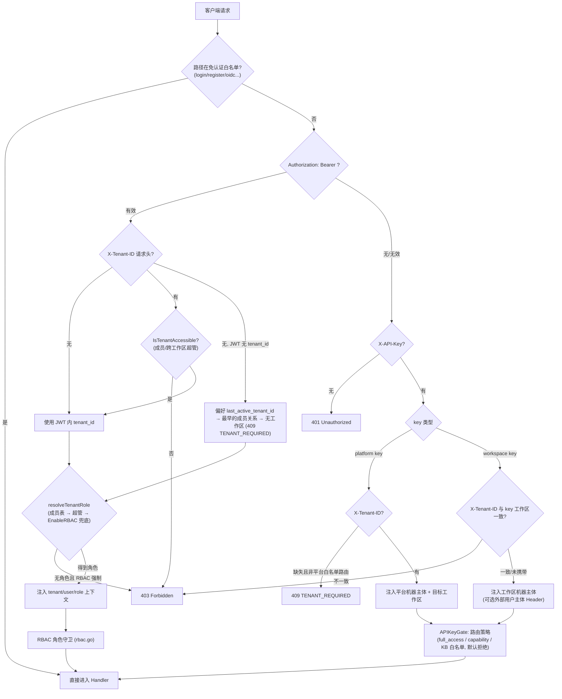

# API 总览

本节介绍 Yuheng HTTP API 的通用约定：Base URL、认证方式、响应结构、错误码、分页、SSE 与限流。

Yuheng 是给 AI Agent 用的知识层，本身不是 Agent 框架：它负责知识的入库、治理、检索与基于知识的问答，由调用方（你的 Agent、脚本或业务系统）决定何时调用。对接方式有四种，底层都是同一套 `/api/v1`：

| 方式 | 适用场景 | 文档 |
| --- | --- | --- |
| REST API | 任意语言直接调用 | 本章 |
| MCP Server（`mcp-server/`，22 个工具） | 让支持 MCP 的 Agent / IDE 直接检索、问答、入库 | [MCP 集成](../03-features/08-mcp.md) |
| Go SDK（`client/`） | Go 服务集成 | [Go SDK](../05-clients/03-go-sdk.md) |
| `yuheng` CLI（`cli/`） | 运维脚本、CI、终端里的 Agent | [命令行工具](../05-clients/02-cli.md) |

> **稳定性**：Yuheng 处于 0.x 预览阶段，`/api/v1` 在 0.x 各版本之间仍可能变化，升级前请对照更新日志；MCP 工具名是稳定的，不会改名。

## Base URL 与版本前缀

- 所有业务 API 挂载在 `/api/v1` 前缀下（`router.go` 中 `r.Group("/api/v1")`）。
- 健康检查：`GET /health`（无需认证，存活探针），返回 `{"status":"ok"}`。
- 就绪检查：`GET /ready`（无需认证，就绪探针），检查数据库、Redis（未配置时为 `disabled`）与启动时的迁移结果，全部正常返回 200 `{"status":"ok","checks":{...}}`，否则 503 `{"status":"unavailable","checks":{...}}`。
- Swagger UI：`GET /swagger/index.html`（路由 `/swagger/*any`），仅在非 `release` 模式（`GIN_MODE != release`）下注册，生产部署默认没有。它由 handler 注释生成（`docs/swagger.json`），列出全部端点的参数与 schema，可在浏览器里直接试调；本章与 swagger 不一致时以 swagger 为准。
- 认证之外的特殊路径：`GET|HEAD /r/:token`（短时效资源授权 URL）、`GET /files`（认证后文件代理，只接受 `resource://` 引用）、`GET /api/v1/files/presigned-preview`（Admin 诊断）、`/api/v1/docs/public/*` 与 `/api/v1/docs/public-spaces/*`（在线文档的公开分享链接，无需认证，见[在线文档](../03-features/07-docs.md)）。

```
BASE=http://localhost:8080
```

两个通用请求头：

- `X-Request-ID`：可选。带上时服务端沿用该值，不带时生成一个 UUID；它会原样写回响应头，并出现在该请求的每条日志里，排查问题时按它检索。
- `Accept-Language`：取第一个语言标签（如 `zh-CN`）决定错误信息、提示词模板等的语言；部署设置了 `YUHENG_LANGUAGE` 时以它为准。

## 认证方式

认证由 `internal/middleware/auth.go` 的 `Auth` 中间件统一处理，按以下顺序尝试：

### 1. JWT Bearer（Web 用户）

```
Authorization: Bearer <access_token>
```

- 通过 `POST /api/v1/auth/login`（或 register / OIDC）获得 `token` 与 `refresh_token`；`POST /api/v1/auth/refresh` 换发新 token。
- 可选请求头 `X-Tenant-ID: <tenant_id>`：在 JWT 指向的工作区之外切换目标工作区（须为该工作区活跃成员，或具备 `CanAccessAllTenants` 跨工作区超管属性）。畸形或 `0` 值直接返回 400。
- 没带 `X-Tenant-ID`、JWT 里也没有 `tenant_id` 时，按用户偏好 `last_active_tenant_id`（仍须是活跃成员）→ 最早的活跃成员关系解析；都没有则是「无工作区」：只放行身份级白名单（`/auth/me`、`/auth/validate`、`/auth/switch-tenant`、`/me/invitations/*`、`POST /tenants` 等），其余返回 409 `{"code":"TENANT_REQUIRED"}`。

### 2. API Key（机器主体）

```
X-API-Key: <api_key>
```

- 工作区级（workspace）key：在 `POST /api/v1/tenants/:id/api-keys` 创建，绑定到单一工作区；携带 `X-Tenant-ID` 指向其它工作区会得到 403。
- 平台级（platform）key：由系统管理员在 `POST /api/v1/system/admin/api-keys` 创建，不绑定单一工作区，也没有 `full_access`，每个操作都要有对应 capability。调用工作区内接口时必须携带 `X-Tenant-ID` 选择目标工作区（`/system/admin/*`、`/tenants/all|search`、`POST /tenants` 除外），否则返回 409 `TENANT_REQUIRED`；此后照常走该工作区的路由 capability 与 KB 白名单检查。平台 key 除 `system_*` 外也可以带工作区 capability（如 `retrieve`、`ingest`、`manage_kbs`），作用于 `X-Tenant-ID` 指定的工作区。

  ```bash
  curl $BASE/api/v1/knowledge-bases -H "X-API-Key: $PLATFORM_KEY" -H 'X-Tenant-ID: 10000'
  ```
- 授权模型（`internal/middleware/api_key_gate.go`，默认拒绝）：每个 `/api/v1` 路由必须显式声明 API key 策略，未声明的路由对任何 key 一律 403。
  - `full_access` key：工作区内全权（等效 Owner 的机器形态）。
  - 受限（scoped）key：按 capability 放行，并受 `knowledge_base_ids` 白名单约束。Capability 常量见 `internal/types/tenant_api_key.go`：`retrieve`、`ingest`、`chat`、`manage_kbs`、`message_history`、`manage_models`、`manage_datasources`、`manage_vector_stores`、`manage_storage_backends`、`manage_web_search`、`run_evaluations`、`manage_members`（成员、邀请与工作区组）、`manage_tenant_settings`，在线文档模块另有 `docs_read`、`docs_write`、`docs_admin`；平台能力：`system_tenants_read/manage`、`system_settings_read/manage`、`system_runtime_read/manage`、`system_audit_read`。
- 外部用户主体（可选，按工作区 `api-principal-config` 配置，见[租户与成员](./02-api-tenant.md)）：把一个 API key 请求映射到你系统里的某个终端用户，用来按用户隔离会话（会话的创建、列表与读取按外部用户分开）。它**不会**缩小 key 的路由权限，权限仍只由 capability 与 KB 白名单决定。
  - `tenant` 模式（默认）：全工作区共用一个工作区级主体。
  - `direct_header` 模式：`X-External-User-ID: <外部用户ID>`（≤128 字符）。这个 ID 由调用方自报，任何持有 key 的调用方都能冒充别的外部用户，只适合可信的服务端到服务端调用。缺少该 Header 时，`require_direct_header=false` 回落为工作区级主体，`true` 返回 401。
  - `signed_token` 模式（面向终端用户时推荐）：`X-External-User-Token: <HS256 JWT>`，由你的后端用工作区配置的 `hmac_secret` 签发，要求 `aud=yuheng`、`exp`（生存期 ≤24h）、`tenant_id` claim 与目标工作区一致、`sub` 为外部用户 ID。缺失或无效返回 401，不回落为工作区级主体。

### 认证流程图



## 角色与权限模型（RBAC）

`internal/middleware/rbac.go` + `internal/middleware/access.go`：

| 角色 | 说明 |
| --- | --- |
| `owner` | 工作区所有者：工作区生命周期、API key、成员管理 |
| `admin` | 工作区管理员：模型、基础设施、数据源等工作区级配置，审计日志 |
| `contributor` | 贡献者：可创建 KB，可修改**自己创建**的资源 |
| `viewer` | 只读成员：读取与会话使用 |
| SystemAdmin | 平台级管理员（`User.IsSystemAdmin`），独立于工作区角色，守卫 `/system/admin/*`，始终强制 |

- 文档中“Viewer+ / Contributor+ / Admin+ / Owner”表示最低角色要求；“创建者 OR Admin+”对应 `RequireOwnershipOrRole`（Contributor 只能改自己创建的 KB/内容）。
- “PlatformManaged”用于共享基础设施（模型、Web 搜索引擎、向量存储、存储后端、解析引擎、Ollama）的写操作：系统设置 `governance.centralized_infra` 关闭时为 Admin+，开启后只允许 SystemAdmin；对应的读接口保持 Viewer+，建库时仍能选用平台资源。
- `cfg.Tenant.EnableRBAC=false` 时角色守卫只记录日志不拦截（rollout fail-open）；SystemAdmin 守卫不受此开关影响。
- KB 级访问守卫 `KBAccess`（`internal/middleware/kb_access.go`）：知识库只能从拥有它的工作区访问，别的工作区的知识库与不存在的 ID 一样返回 404；守卫同时执行 API key 的 KB 白名单。
- API key 主体会短路 JWT 角色守卫，其真实权限完全由 APIKeyGate（capability + KB 白名单）决定。
- 被拒绝的请求会写入审计日志（`middleware.AuditServiceProvider`，1 分钟滑动窗口去重）。

## 通用响应格式与错误码

多数 handler 返回：

```json
{ "success": true, "data": { ... } }
```

列表类接口常见附加字段：`total`、`page`、`page_size`。少数例外：`/system/admin/*` 的部分读取接口直接返回原始行/数组（不含包装），`/system/info` 等使用 `{"code":0,"msg":"success","data":...}`。

错误统一由 `internal/middleware/error_handler.go` 输出（`internal/errors/errors.go` 的 `AppError`）：

```json
{ "success": false, "error": { "code": 1003, "message": "...", "details": null } }
```

中间件层（认证/RBAC）直接返回 `{"error": "..."}`（部分带 `"code"` 字符串，如 `TENANT_REQUIRED`）。

| 错误码 | 含义 | HTTP |
| --- | --- | --- |
| 1000 | ErrBadRequest 请求错误 | 400 |
| 1001 | ErrUnauthorized 未认证 | 401 |
| 1002 | ErrForbidden 无权限 | 403 |
| 1003 | ErrNotFound 资源不存在 | 404 |
| 1004 | ErrMethodNotAllowed | 405 |
| 1005 | ErrConflict 冲突 | 409 |
| 1006 | ErrTooManyRequests 限流/配额 | 429 |
| 1007 | ErrInternalServer 内部错误 | 500 |
| 1008 | ErrServiceUnavailable 暂不可用 | 503 |
| 1009 | ErrTimeout 超时 | — |
| 1010 | ErrValidation 参数校验失败 | 400 |
| 2000-2004 | 工作区类：不存在/已存在/停用/名称必填/状态非法 | 404/409/… |
| 2006 | 建工作区没有 Owner（平台 key 未给 `owner_email`） | 400 |
| 2007 / 2008 | 删工作区被拒：还有其他成员 / 部署最后一个工作区 | 409 |
| 2200-2201 | VectorStore 绑定非法 / 当前不可用 | 400 |

另有非编码错误：`types.StorageQuotaExceededError`（存储配额超限）、`types.DuplicateKnowledgeError`（重复文件/URL，上传接口返回 409 且 `data` 携带已存在的 Knowledge）。

## 分页规范

`internal/handler/list_pagination.go`：

| 参数 | 类型 | 必填 | 说明 |
| --- | --- | --- | --- |
| `page` | int | 否 | 页码，默认 1，必须 ≥1 |
| `page_size` | int | 否 | 每页条数，默认 20，范围 1-100 |

超范围或非法值返回校验错误（code 1010）。列表响应携带 `total/page/page_size`。部分接口使用游标分页：审计日志（`after_id`+`limit`，响应带 `next_cursor`）、系统运行时任务（`cursor`+`page_size`，响应带 `next_cursor/has_more`）、Wiki index/log（`cursor`+`limit`）。

## 流式接口协议（SSE）

聊天类接口（`POST /api/v1/knowledge-chat/:session_id`、`GET /api/v1/sessions/continue-stream/:session_id`）返回 Server-Sent Events：

```
Content-Type: text/event-stream
Cache-Control: no-cache
Connection: keep-alive
X-Accel-Buffering: no
```

每个事件为 `event: message`，`data:` 为 `types.StreamResponse` JSON：

| 字段 | 类型 | 说明 |
| --- | --- | --- |
| `id` | string | 请求 ID |
| `response_type` | string | `answer` / `references` / `thinking` / `tool_call` / `tool_result` / `session_title` / `agent_query` / `error` / `complete` |
| `content` | string | 增量文本 |
| `done` | bool | 该类型事件是否结束 |
| `knowledge_references` | []SearchResult | `references` 事件携带的引用 |
| `tool_calls` | []LLMToolCall | 工具调用事件 |
| `session_id` / `assistant_message_id` | string | `agent_query` 事件携带 |
| `data` | object | 附加数据，如 `agent_query` 事件里的 `user_message_id` 与消息创建时间 |
| `usage` | TokenUsage | `prompt_tokens/completion_tokens/total_tokens/cache_*` |
| `finish_reason` | string | 结束原因 |

`agent_query` 是每次问答的第一个事件（名称沿用上游，与 Agent 无关），用来告诉客户端本轮用户消息与助手消息的 ID；`tool_call` / `tool_result` 承载检索流水线的进度步骤（检索、重排等），不是 Agent 工具调用。流以 `response_type:"complete"`（`done:true`）终止；出错时以 `response_type:"error"`（`done:true`）终止。`continue-stream` 采用重放 + 100ms 轮询追增量的续传语义（`?message_id=` 必填）。

## 文件引用形式（resource_urls）

回答与检索结果里引用到的图片/附件，默认以内部句柄 `resource://<handle>` 返回，客户端要再调一次带鉴权的 `/files` 代理才能拿到内容。第三方 App 想拿到「拿来即可渲染」的链接时，可以切换成直链模式：

| 作用范围 | 用法 |
| --- | --- |
| 单次请求 | 在 URL 上加 `?resource_urls=public` |
| 整个部署 | 环境变量 `RESOURCE_URL_MODE=public` |

取值只有 `handle`（默认）与 `public`，传其它值返回 400。单次请求参数优先于环境变量，所以把部署默认设成 `public` 之后，仍可以用 `?resource_urls=handle` 单独退回。

支持该参数的接口：`POST /knowledge-chat/{session_id}`、`GET /sessions/continue-stream/{session_id}`、`GET /messages/{session_id}/load`、`POST /knowledge-search`。改写覆盖答案正文、`knowledge_references`（含 `image_info`）、工具调用与结果，以及消息上的图片附件；流式回答里跨 chunk 截断的引用会先缓冲再改写，客户端拿到的始终是完整链接。

使用前需要知道的几件事：

- **需要具备外链能力**：设了 `APP_EXTERNAL_URL` 时直链一律是 `<APP_EXTERNAL_URL>/r/<token>`，对任何存储后端都有效；没设时只有 S3 兼容后端能给出预签名直链。都不具备时（如本机目录后端且未设 `APP_EXTERNAL_URL`），该引用保持 `resource://` 原样，客户端仍可回退到 `/files`；
- **直链是限时匿名可读的**（Yuheng 签发的 grant 2 小时，存储后端预签名时长由存储决定），任何拿到链接的人在过期前都能读取，不要写进日志或转发给不该看的人；
- **限定知识库的 API Key 用 `public` 会返回 403**：这类 Key 本身就被禁止访问 `/files` 代理，能拿到匿名直链等于绕过同一道限制；
- **同一文件的直链在有效期内复用**，重复请求不会反复签发凭证，客户端与 CDN 缓存因此能命中。

各渠道（Web / API）分别拿到哪种形式、以及图片加载不出来时怎么排查，见[图片与文件的对外访问](../03-features/21-file-access.md)。

## 限流说明

| 面 | 限制 | 来源 |
| --- | --- | --- |
| 公开分享链接接口（`/auth/invitations/lookup`、`/auth/register-by-invite`） | 每 IP 30 次/分钟（两个端点共享额度），超限 429（code 1006） | `internal/middleware/auth_public_ratelimit.go` |
| 凭据接口 | 每 IP 每分钟：`/auth/login` 30 次、`/auth/register` 10 次、`/auth/switch-tenant` 60 次；有 Redis 时多实例共享计数。登录另有按账号的失败锁定 | `internal/middleware/auth_ip_ratelimit.go` |
| 在线文档加密分享解锁（`POST /docs/public/:key/unlock`） | 每 IP 10 次/分钟 | 同上 |
| 反代信任 | 仅信任 `YUHENG_TRUSTED_PROXIES`（默认回环+内网段）的 `X-Forwarded-For`，防止伪造 IP 绕过限流 | `router.go` `trustedProxies()` |

其余业务接口无全局限流；配额类拒绝（存储配额等）同样使用 429（code 1006）。

## API 分组导航

| 分组 | 文档 | 主要前缀 |
| --- | --- | --- |
| 认证与用户 | [02-api-auth.md](./02-api-auth.md) | `/auth`、`/me/invitations`、`/user/favorites` |
| 租户（工作区）与成员 | [02-api-tenant.md](./02-api-tenant.md) | `/tenants`、`/system/admin/tenants/:id/members` |
| 知识库与知识 | [02-api-knowledge.md](./02-api-knowledge.md) | `/knowledge-bases`、`/knowledge`、知识库文件夹 |
| 知识健康 | [02-api-knowledge.md](./02-api-knowledge.md)，概念见[知识健康](../03-features/22-knowledge-health.md) | `/knowledge-bases/:id/findings`、`/findings/assigned`、`/knowledge/:id/stewardship` |
| 分块与标签 | [02-api-chunks.md](./02-api-chunks.md) | `/chunks`、`/knowledge-bases/:id/tags`、`/chunker/preview` |
| FAQ 与 Wiki | [02-api-faq-wiki.md](./02-api-faq-wiki.md) | `/knowledge-bases/:id/faq`、`/faq`、`/knowledgebase/:kb_id/wiki` |
| 会话、消息与聊天 | [02-api-chat.md](./02-api-chat.md) | `/sessions`、`/messages`、`/knowledge-chat`、`/knowledge-search`，回答反馈 `/sessions/:id/feedback` |
| 模型与初始化 | [02-api-model-system.md](./02-api-model-system.md) | `/models`、`/initialization`、`/evaluation` |
| 系统与平台管理 | [02-api-system.md](./02-api-system.md) | `/system`、`/system/admin` |
| 基础设施与数据源 | [02-api-infra.md](./02-api-infra.md) | `/vector-stores`、`/storage-backends`、`/web-search-providers`、`/datasource` |
| 文件服务 | [02-api-files.md](./02-api-files.md) | `/files`、`/r/:token`、外链预览 |
| 在线文档 | [02-api-docs.md](./02-api-docs.md)，概念见[在线文档](../03-features/07-docs.md) | `/docs`，匿名的 `/docs/public`、`/docs/public-spaces`；工作区组 `/groups`（工作区级能力，文档暂放在这一页） |
