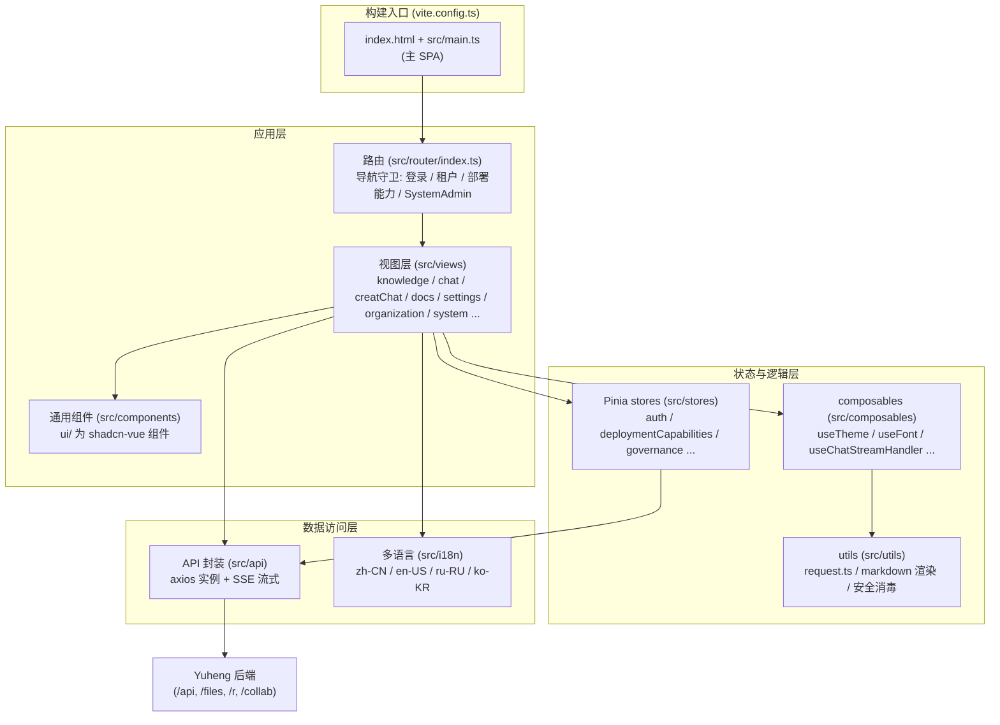

# Web 前端（frontend/）

Yuheng 的 Web 前端是一个基于 **Vue 3 + TypeScript + Vite** 的单页应用（SPA），承载知识库管理、知识健康、对话问答、在线文档、组织协作与系统设置等全部交互界面。构建产物由 nginx 容器托管，`/api`、`/files`、`/r/` 与 `/collab` 反向代理到后端服务。

## 技术栈总览

依据 `frontend/package.json`（版本 0.1.0）：

| 类别 | 选型 | 版本 | 说明 |
| --- | --- | --- | --- |
| 框架 | Vue | ^3.5.34 | Composition API，`<script setup>` 风格 |
| 语言 | TypeScript | ~6.0.3 | `vue-tsc --build` 做类型检查（`npm run type-check`） |
| 构建工具 | Vite | ^7.3.5 | 插件：`@vitejs/plugin-vue`、`@vitejs/plugin-vue-jsx`、`@tailwindcss/vite`，以及自有的 `tdesignInLayer` |
| 样式 | Tailwind CSS | ^4.3.3 | 入口 `frontend/src/assets/tailwind.css`，不启用 preflight |
| 组件 | shadcn-vue（Reka UI） | reka-ui ^2.10.5 | 组件源码复制在 `frontend/src/components/ui/`，由本仓库维护 |
| 图标 | @lucide/vue | ^1.48.0 | `XIcon` 形式命名 |
| 提示与对话框 | TDesign (tdesign-vue-next) | ^1.19.2 | 只剩 `MessagePlugin` / `DialogPlugin` / `NotifyPlugin` 与 `<t-config-provider>`，见下文「样式栈」；`tdesign-icons-vue-next` 被 overrides 锁定在 0.4.4 |
| 状态管理 | Pinia | ^3.0.4 | 全部 store 位于 `frontend/src/stores/` |
| 路由 | Vue Router | ^4.5.0 | `createWebHistory(import.meta.env.BASE_URL)`，见 `frontend/src/router/index.ts` |
| 多语言 | vue-i18n | ^11.4.2 | zh-CN / en-US / ru-RU / ko-KR |
| 表单校验 | vee-validate + zod | ^4.15.1 / ^3.25.76 | 新组件的表单 |
| HTTP | axios | ^1.16.0 | 统一实例封装于 `frontend/src/utils/request.ts` |
| SSE 流式 | @microsoft/fetch-event-source | ^2.0.1 | 聊天流式回复（`frontend/src/api/chat/streame.ts`）与在线文档事件流 |
| 在线文档编辑器 | Tiptap 3 + Yjs + @hocuspocus/provider | ^3.31.3 | 协同编辑、离线缓存（`y-indexeddb`）；绘图用 `@excalidraw/excalidraw`（依赖 React 19） |
| Markdown 渲染 | marked / marked-katex-extension / katex / highlight.js / mermaid | — | 聊天答案富文本渲染（公式、代码高亮、图表） |
| 安全 | dompurify | ^3.4.11 | v-html 内容统一消毒（`frontend/src/utils/markdownDomPurify.ts`） |
| 文档预览 | docx-preview / @vue-office/pptx / xlsx / papaparse | — | 站内预览 Word / PPT / Excel / CSV |
| 长列表 | vue-virtual-scroller | ^2.0.0-beta.8 | 消息列表虚拟滚动 |
| 测试 | Vitest + happy-dom + @vue/test-utils | vitest ^5.0.1 | 断言使用 `node:assert/strict` |

值得注意的依赖细节：

- `xlsx` 不走 npm registry，而是安装本地 tarball：`"xlsx": "file:./packages/xlsx-0.20.2.tgz"`（即 `frontend/packages/` 目录的用途，锁定版本、离线可装）；
- `frontend/pnpm-workspace.yaml` 并非声明子包 workspace，只包含 `allowBuilds` 白名单（允许 `@vue-office/pptx`、`esbuild`、`vue-demi` 执行构建脚本）；
- `overrides` / `resolutions` 统一了 `esbuild`、`serialize-javascript`、`tdesign-icons-vue-next` 的版本，并为 Excalidraw 的依赖钉住 `nanoid`。

## 样式栈

界面由 Tailwind v4 + shadcn-vue 构成：Tailwind 工具类、`src/components/ui/` 下的 shadcn-vue 组件、`@lucide/vue` 图标。从 TDesign + Less 的迁移在模板层面已经完成：项目里没有 Less，模板里剩下的 TDesign 组件只有 `App.vue` 中的 `<t-config-provider>`。新代码不再引入 `<t-*>` 或 Less。TDesign 有意保留在三处：

- **JS API**：提示与对话框仍走 `MessagePlugin`、`DialogPlugin`、`NotifyPlugin`（`tdesign-vue-next`），它们是函数调用而不是模板组件，会单独替换；
- **设计 token**：`main.ts` 只引入 `tdesign-vue-next/es/style/index.css`（`--td-*` 变量），加上 `frontend/src/assets/theme/theme.css` 的品牌主题；
- **全局安装**：`app.use(TDesign)` 仍在，`src/types/tdesign-global.d.ts` 让类型检查器认识全局的 `<t-*>` 组件。

TDesign 剩下的样式与 Tailwind 如何共存，由 `frontend/src/assets/tailwind.css` 和 `vite.config.ts` 中的 `tdesignInLayer` 插件决定：

- 级联层顺序声明为 `theme, base, tdesign, components, utilities`。`tdesignInLayer` 把 `node_modules/tdesign-*` 的每个 CSS 文件包进 `@layer tdesign`，所以 Tailwind 工具类能覆盖 TDesign 样式，而 `base` 层的元素重置碰不到 TDesign 组件；
- 不启用 Tailwind preflight：聊天与文档视图渲染的 Markdown 依赖浏览器默认样式。新组件需要的元素重置只作用于带 `data-slot` 属性的元素，给一个裸元素加上 `data-slot="…"` 即可纳入；
- 每个语义 token（`bg-primary`、`text-muted-foreground`、`text-placeholder`、`text-warning`、`rounded-md` 等）都桥接到对应的 TDesign `--td-*` 变量，提示与对话框因此和界面共享同一套配色与暗色模式；
- 暗色模式跟随应用自己的开关：`useTheme` 在 `<html>` 上设置 `theme-mode="dark"`，`dark:` 变体通过 `@custom-variant dark (&:where([theme-mode="dark"], [theme-mode="dark"] *))` 与之同步。

新增 shadcn-vue 组件使用 `npx shadcn-vue@latest add <name>`（配置见 `frontend/components.json`，style 为 `reka-nova`，图标库 lucide）。命令行工具不在依赖里；组件依赖的 shadcn-vue Tailwind 层（动画关键帧、`data-open:` 变体、滚动渐隐等工具类）以源码形式放在 `frontend/src/assets/shadcn-vue.css`，新组件需要更多内容时从对应版本重新复制。

## 模块结构

### 目录速览

| 目录 | 职责 |
| --- | --- |
| `frontend/src/main.ts` | 主 SPA 入口：最先引入 `tailwind.css`（它声明级联层顺序），再安装 TDesign / Pinia / Router / i18n，初始化主题与字体，注册 TDesign 图标离线保护（`installTDesignIconOfflineGuard`，避免运行时请求 `tdesign.gtimg.com`），有登录 token 时先 `refreshFromAuthMe()`，等待 `router.isReady()` 后再挂载以避免首屏闪烁 |
| `frontend/src/views/` | 页面级组件，按业务域分目录（见下方路由表） |
| `frontend/src/components/` | 跨页面通用组件；`ui/` 为 shadcn-vue 组件，`findings/` 为知识健康相关组件 |
| `frontend/src/lib/utils.ts` | shadcn-vue 的 `cn()` 等辅助函数 |
| `frontend/src/stores/` | Pinia 状态（见下方 store 表） |
| `frontend/src/api/` | 后端 API 封装（见下方 API 模块表） |
| `frontend/src/composables/` | 组合式函数：主题、字体、聊天流处理、引用弹层、列表 URL 状态等 |
| `frontend/src/hooks/` | 业务 hook |
| `frontend/src/utils/` | 工具集：axios 实例、markdown 渲染管线、DOMPurify 消毒等 |
| `frontend/src/i18n/` | vue-i18n 配置、语言包与审计脚本 |
| `frontend/src/config/` | 设置分区权限（`settingsAccess.ts`）、部署能力键（`deploymentCapabilities.ts`）、API Key 能力（`apiKeyCapabilities.ts`）等 |
| `frontend/src/assets/` | `tailwind.css`（新栈入口与两栈接缝）、`theme/theme.css`（TDesign 主题变量） |
| `frontend/src/directives/`、`frontend/src/types/` | 自定义指令、类型定义 |
| `frontend/public/` | `config.js`（运行时配置占位，容器启动时覆盖）、离线 TDesign 图标 |
| `frontend/packages/` | 本地依赖 tarball（`xlsx-0.20.2.tgz`） |

## 页面路由清单

路由定义在 `frontend/src/router/index.ts`，所有页面组件均为动态 import（按路由分包懒加载）。

### 顶层路由

| 路径 | 名称 | 组件 | 功能 |
| --- | --- | --- | --- |
| `/` | — | 重定向 | 重定向到 `/platform/knowledge-bases` |
| `/login` | `login` | `src/views/auth/Login.vue` | 登录页（含 OIDC、语言切换） |
| `/register` | `registerByInvite` | `src/views/auth/Login.vue` | 邀请注册落地页：复用 Login 组件，挂载时检测 `?token=xxx` 切换到邀请注册模式 |
| `/d/:key` | `docsPublicLink` | `src/views/docs/public/PublicDoc.vue` | 在线文档的公开分享链接，匿名访问 |
| `/s/:spaceId`、`/s/:spaceId/:short` | `docsPublicSpace` / `docsPublicSpacePage` | `src/views/docs/public/PublicSpace.vue`、`PublicDoc.vue` | 公开空间及其页面，匿名访问 |
| `/onboarding/workspace` | `workspaceOnboarding` | `src/views/auth/WorkspaceOnboarding.vue` | 无租户用户的工作空间引导页（创建或等待被邀请），需要登录但不要求已有租户 |
| `/join` | `joinOrganization` | 重定向 | 加入组织邀请链接，把 `?code=` 转成 `invite_code` 参数并跳到 `/platform/organizations` |
| `/platform` | `Platform` | `src/views/platform/index.vue` | 平台主布局（左侧菜单 + 路由出口 + 全局设置模态 + 拖拽上传遮罩），默认重定向到知识库列表 |
| `/platform/dev/markdown` | `markdownTest` | `src/views/dev/MarkdownTestPage.vue` | 仅开发模式（`import.meta.env.DEV`）注册的 Markdown 渲染测试页 |

### `/platform` 子路由

| 路径 | 名称 | 组件 | 功能 |
| --- | --- | --- | --- |
| `/platform/knowledge-bases` | `knowledgeBaseList` | `src/views/knowledge/KnowledgeBaseList.vue` | 知识库列表：空间侧栏、卡片列表、创建入口 |
| `/platform/knowledge-bases/:kbId` | `knowledgeBaseDetail` | `src/views/knowledge/KnowledgeBase.vue` | 知识库详情，`?tab=` 在 `documents`、`wiki`、`graph`、`health` 之间切换（`health` 即知识健康视图） |
| `/platform/creatChat` | `globalCreatChat` | `src/views/creatChat/creatChat.vue` | 新建对话页：选择知识库/模型后发起会话 |
| `/platform/knowledge-bases/:kbId/creatChat` | `kbCreatChat` | `src/views/creatChat/creatChat.vue` | 从某个知识库上下文发起新对话（同一组件） |
| `/platform/chat/:chatid` | `chat` | `src/views/chat/index.vue` | 会话页：消息流（SSE 流式渲染、虚拟滚动）、引用面板、附件预览、答案反馈 |
| `/platform/docs` | `docsSpaceList` | `src/views/docs/SpaceList.vue` | 在线文档空间列表（需部署能力 `docs`） |
| `/platform/docs/spaces/:slug/:pageSlug?` | `docsSpace` | `src/views/docs/SpaceHome.vue` | 空间首页与页面（同一路由记录，切换页面时页面树保持状态） |
| `/platform/docs/spaces/:slug/settings` | `docsSpaceSettings` | `src/views/docs/SpaceSettings.vue` | 空间设置 |
| `/platform/organizations` | `organizationList` | `src/views/organization/OrganizationList.vue` | 组织列表：创建/加入组织、成员与共享资源管理（需部署能力 `organizations`） |
| `/platform/settings` | `settings` | `src/views/settings/Settings.vue` | 设置中心（全屏模态形态），分区见下方「设置中心的分区与可见性」 |

在线文档模块的功能说明见[在线文档](../03-features/07-docs.md)。

### 设置中心的分区与可见性

`Settings.vue` 把分区按六组呈现，用 `?section=` 定位：

| 分组 | 分区（`section` 值） |
| --- | --- |
| 账户 | `general`（个人偏好）、`userprofile` |
| 空间 | `tenant`（空间信息）、`members`（成员）、`groups`（用户组，属于在线文档的权限模型）、`chathistory` |
| 模型与运行 | `models`、`ollama` |
| 数据与扩展 | `vectorstore`、`parser`、`storage`、`websearch` |
| 系统管理 | `system-global`、`runtime-queues`、`platform-api-keys`、`system-audit-log` |
| 平台 | `system`（版本信息）、`enterprise`（企业版说明，只读） |

可见性由以下规则共同决定，**前端只做收敛展示，后端路由守卫才是权威**：

- **空间角色门槛**：`frontend/src/config/settingsAccess.ts` 的 `SETTINGS_SECTION_MIN_ROLE` 给每个分区规定最低角色。`general`、`models`、`system`、`userprofile`、`tenant`、`members`、`groups`、`enterprise` 从 `viewer` 起可见；`ollama`、`websearch`、`chathistory`、`vectorstore`、`parser`、`storage` 要求 `admin`。`SETTINGS_MANAGEMENT_SHORTCUT_MIN_ROLE` 给头像菜单里标着「管理」的快捷入口更高的门槛（成员管理要 `owner`，模型管理要 `admin`）。跨空间超管（`canAccessAllTenants`）不受角色门槛限制。
- **系统管理员白名单**：`SYSTEM_ADMIN_SETTINGS_SECTIONS`（`system-global`、`runtime-queues`、`platform-api-keys`、`system-audit-log`）只对系统管理员显示，与空间角色无关，详见[平台管理与系统管理员](../03-features/20-platform-admin.md)。
- **集中管控模式**：系统设置 `governance.centralized_infra` 打开时，`PLATFORM_MANAGED_SETTINGS_SECTIONS`（`models`、`ollama`、`websearch`、`vectorstore`、`parser`、`storage`）只对系统管理员与跨空间超管显示。建库时的选择器走各自的 Viewer+ 读接口，所以隐藏入口不影响普通成员挑选平台资源。该开关由 `stores/governance.ts` 通过 `GET /api/v1/system/governance` 读取。
- **部署能力**：`SETTINGS_SECTION_CAPABILITY` 把 `websearch`、`vectorstore`、`storage` 分别对应到部署能力 `settings.websearch`、`settings.vectorstore`、`settings.storage`，`groups` 对应 `docs`。后端明确返回 `supported: false` 时入口隐藏；探测失败时保持可见。
- **推广分区**：`enterprise` 在运行时配置 `HIDE_ENTERPRISE_PROMOTION` 为 true 时对所有人隐藏。

### 知识库编辑弹窗的分区

不少配置**不在设置中心，而在知识库编辑弹窗里**（`src/views/knowledge/KnowledgeBaseEditorModal.vue`），因为它们按库生效。侧栏分区按五组组织：

| 分组 | 分区（`key`） | 备注 |
| --- | --- | --- |
| 基础 | `basic`、`models`、`vectorStore`、`faq` | 名称、类型、复审周期（`review_interval_days`）、对话/向量/摘要模型；`faq` 仅 FAQ 类型库；`vectorStore` 绑定后不可改 |
| 处理 | `parser`、`chunking`、`multimodal`、`asr`、`graph`、`advanced` | 仅文档类型库：解析引擎、分块参数、图片理解、语音转写、知识图谱、高级项 |
| 数据 | `storage`、`datasource` | `datasource` 仅编辑模式，飞书 / Notion / 语雀 / RSS 同步配在这里 |
| 集成 | `share` | 仅编辑模式，共享到组织 |
| 管理 | `activity` | 知识库活动流，按权限显示 |

### 知识健康相关界面

知识健康的后端机制见[知识健康](../03-features/22-knowledge-health.md)。前端的入口有四处：

- **知识库详情的「健康」标签页**（`src/views/knowledge/health/KnowledgeHealthView.vue`、`FindingItem.vue`）：列出该库的检测结果与摘要，可忽略/重新打开、指派处理人、标记被取代、发起全库重新检测；
- **文档详情里的维护信息**（`src/components/findings/KnowledgeStewardship.vue`，嵌在 `doc-content.vue`）：显示负责人与上次确认时间，可更换负责人、确认文档仍然正确；
- **右上角的待办**（`src/components/findings/KnowledgeTodo.vue`，挂在 `GlobalCornerActions.vue`）：当前用户被指派的检测结果及计数；
- **聊天答案下的「有帮助 / 没帮助」**（`src/views/chat/components/AnswerFeedback.vue` + `stores/answerFeedback.ts`）：一次请求读取整个会话的反馈，被标为没帮助的答案会作为争议进入被引用文档的知识健康。

在线文档页面上另有 `src/views/docs/findings/` 下的 `PageFindingsNotice`、`PageOwner`、`SupersededBanner`，分别显示页面的检测提示、负责人与「已被取代」横幅。

### 全局命令面板（⌘K / Ctrl+K）

`components/GlobalCommandPalette.vue` 是除侧栏之外的第二条主要导航通路：

- 搜索知识库、文档与会话，可把范围收窄到某个知识库后再搜；
- 空状态下展示最近搜索与快捷动作；
- 面板内的入口打开**检索设置抽屉**（`views/settings/RetrievalSettings.vue`），这是调 TopK、向量/关键词阈值、重排参数的地方，它**不在设置中心里**。

### 导航守卫

`router.beforeEach` 实现了一条鉴权链（`frontend/src/router/index.ts`）：

1. **OIDC 回调放行**：URL hash 含 `oidc_result=` / `oidc_error=` 时直接放行，交由 `App.vue` 消费；
2. **公开路由放行**：`requiresAuth: false` 或 `requiresInit: false` 的路由（登录、注册、在线文档公开链接）直接放行；已登录用户访问 `/login` 被送回知识库列表或工作空间引导页；
3. **会话恢复**：未登录时先用 `localStorage` 中的 `yuheng_token` 调 `getCurrentUser()` 恢复会话（同时刷新 memberships 与 `can_create_tenant` 等能力）；
4. **租户门槛**：已登录但无有效租户 → 跳 `/onboarding/workspace`；
5. **部署能力门槛**：并行等待 `deploymentCapabilities` 与 `governance` 两个 store 加载，路由声明了 `requiredCapability`（`docs`、`organizations`）而后端不支持时提示并跳回知识库列表；首次通过时顺带刷新上传上限（`GET /api/v1/system/upload-limits`）；
6. **SystemAdmin 门槛**：`requiresSystemAdmin` 路由对非系统管理员跳回知识库列表（仅 UI 层拦截，服务端另有校验）。

## 状态管理（Pinia）

`frontend/src/stores/` 下的 store 与辅助模块：

| 文件 | Store ID / 类型 | 职责 |
| --- | --- | --- |
| `stores/auth.ts` | `useAuthStore` | 认证核心：user / token / refreshToken / tenant / memberships / 角色判断（`hasRole`、`isSystemAdmin`、`canAccessAllTenants`）；登出时级联清理其他 store 的空间级缓存并按用户重载偏好（主题/字体） |
| `stores/deploymentCapabilities.ts` | `useDeploymentCapabilitiesStore` | 读取 `GET /api/v1/system/capabilities`，决定菜单、路由与设置分区是否显示；探测失败时 fail-open |
| `stores/governance.ts` | `useGovernanceStore` | 读取集中管控开关（`centralizedInfra`） |
| `stores/answerFeedback.ts` | `useAnswerFeedbackStore` | 当前会话各条答案的反馈，整个会话共用一次请求 |
| `stores/chatResources.ts` | `useChatResourcesStore` | 空间级资源缓存（TTL 60s）：知识库、模型列表，供聊天/新建对话选择器复用 |
| `stores/editorResources.ts` | `useEditorResourcesStore` | 编辑器/设置相关资源缓存（TTL 60s） |
| `stores/commandPalette.ts` | `useCommandPaletteStore` | 全局命令面板开关与查询；最近搜索按 (user, tenant) 作用域存储 |
| `stores/organization.ts` | `useOrganizationStore` | 组织协作：组织列表、成员、共享知识库、加入申请与审核、角色升级 |
| `stores/organizationState.ts` | 纯函数模块 | 组织列表 upsert / merge 等纯逻辑（配套单测 `organizationState.test.ts`） |
| `stores/settings.ts` | `useSettingsStore` | 对话输入栏配置：选中的知识库/文件/标签、当前对话模型、Ollama 地址、Web 搜索开关，以及进入历史会话时的快照/还原 |
| `stores/settingsStorage.ts` | 纯函数模块 | `loadSettings`：从 `localStorage` 读取设置并铺在默认值之上，损坏时回退到默认值（配套 `settingsStorage.test.ts`） |
| `stores/menu.ts` | `useMenuStore` | 左侧导航菜单：新建对话、知识库、在线文档（需 `docs` 能力）、组织、设置、退出 |
| `stores/knowledge.ts` | `knowledgeStore` | 知识卡片列表与总数（轻量） |
| `stores/ui.ts` | `useUIStore` | 全局 UI 状态：设置模态、知识库编辑模态、手工文档编辑器、侧栏折叠等 |
| `stores/uploadConfirm.ts` | `useUploadConfirmStore` | 上传/URL 导入/手工录入/重新解析前的处理参数确认对话框状态 |
| `stores/versionedRequest.ts` | 纯函数模块 | `createVersionedRequestCoordinator`：带版本号的请求协调器，防止旧响应覆盖新写入 |

## API 封装（frontend/src/api/）

### 请求基座

- **axios 实例**：`frontend/src/utils/request.ts` 创建统一实例（`baseURL` 来自 `frontend/src/utils/api-base.ts` 的 `getApiBaseUrl()`，尊重 Vite `BASE_URL` 以支持子路径反代部署；超时 30s）。
- **请求拦截器**：附加 `Authorization: Bearer <yuheng_token>`、`Accept-Language`（当前 i18n 语言）、`X-Request-ID`、`X-Tenant-ID`（始终携带激活空间 id，避免切空间后 header 丢失）。
- **响应拦截器**：2xx 解包返回 `data`；401 触发单飞（single-flight）refresh token 刷新并重放排队请求；公开认证端点（`PUBLIC_AUTH_PATHS`，如 `/auth/login`、`/auth/register`、`/auth/oidc/`、`/auth/invitations/lookup`）的 401 直接抛给页面而不跳登录。
- **SSE 流式**：`frontend/src/api/chat/streame.ts` 基于 `@microsoft/fetch-event-source` 封装 `useStream()`；上层由 `frontend/src/composables/useChatStreamHandler.ts` 组织为聊天消息流。在线文档的事件流由 `src/views/docs/useDocsEvents.ts` 订阅 `GET /api/v1/docs/events`。

### 模块清单

| 模块 | 职责 |
| --- | --- |
| `api/auth/` | 登录、注册、OIDC、`getCurrentUser` 会话恢复 |
| `api/tenant/`（`index` / `members` / `invitations` / `audit-log`） | 租户（工作空间）信息、成员管理、邀请、审计日志 |
| `api/organization/` | 组织 CRUD、成员、共享知识库、加入申请 |
| `api/knowledge-base/` | 知识库 CRUD 与文件/知识条目管理 |
| `api/findings/` | 知识健康：检测结果列表与摘要、忽略/重开、指派、取代、重新检测、我的待办 |
| `api/stewardship/` | 文档负责人与复审确认（`/knowledge/:id/stewardship`、`/owner`、`/review`） |
| `api/feedback/` | 答案反馈（`/sessions/:id/feedback`、`/sessions/:id/messages/:message_id/feedback`） |
| `api/docs/` | 在线文档模块（`/api/v1/docs/...`） |
| `api/chat/`（`index` / `streame` / `temporary-attachments`） | 会话 CRUD、标题生成、SSE 流式问答、会话内临时附件 |
| `api/chat-history.ts` | 聊天历史 |
| `api/model/` | 模型配置管理 |
| `api/retrieval.ts` | 租户检索配置 |
| `api/vector-store.ts` / `api/storage-backend.ts` / `api/chunker/` | 向量库、存储后端、分块预览 |
| `api/datasource/` | 数据源接入 |
| `api/initialization/` | 知识库初始化与模型检测 |
| `api/system/` | 系统信息、部署能力、上传上限、解析引擎、系统管理接口 |
| `api/web-search-provider.ts` | Web 搜索 provider 配置 |
| `api/wiki/` | 知识库 Wiki |
| `api/message-suggestion.ts` | 推荐问题 |
| `api/user-favorites.ts` | 用户收藏（知识库） |

## 对话时间线的等待态

RAG 流水线的进度展示（`views/chat/components/RagPipelineProgress.vue`）在「所有可见步骤都完成」到「模型吐出第一个字」之间会有一段静默期，由 `utils/rag-pipeline-state.ts` 描述：

- `getRagPipelineWaitKind()` 判定等待类型：检索步骤确实完成过才叫 `model`（正在生成回答）；没有检索步骤的轮次（如纯附件问答）给中性的 `preparing`；
- `createRagWaitController()` 负责呈现：延迟 `RAG_WAIT_REVEAL_DELAY_MS`（250ms）才显示，避免模型很快回答时闪一下；超过 `RAG_WAIT_STALL_DELAY_MS`（60s）转为「停滞」态，因为 SSE 断连时后端不会再发 `is_completed`；
- 状态变化通过常驻的 `aria-live` 区域播报。

## 多语言（i18n）

实现于 `frontend/src/i18n/index.ts`，基于 `vue-i18n`（`legacy: false` 的 Composition 模式，`globalInjection: true`）：

- **支持语言**（`frontend/src/i18n/locales/`）：`zh-CN`（默认与 fallback）、`en-US`、`ru-RU`、`ko-KR`。四个语言包必须携带相同的键，新增文案要同时补齐四种语言。
- 语言选择持久化在 `localStorage` 的 `locale` key；axios 拦截器把当前语言写入 `Accept-Language` 请求头。
- 部分翻译内嵌 `<strong>` 标记（经 DOMPurify 消毒后 v-html 渲染），因此配置了 `warnHtmlMessage: false`。
- **审计与裁剪脚本**（`frontend/package.json`）：

  | 命令 | 作用 |
  | --- | --- |
  | `npm run check-i18n` | 用 Vitest 跑 `src/i18n/localeKeyAudit.test.ts`，校验四个语言包键集一致 |
  | `npm run scan-i18n-gaps` | `tsx src/i18n/localeGapScan.ts`：对比源码实际用到的 key 与语言包，报告未定义与未使用的键 |
  | `npm run regenerate-i18n-locales` | `tsx src/i18n/regeneratePrunedLocales.ts`：按扫描结果重新生成裁剪后的语言包 |

  审计日志的动作名走单独的注册表（`i18n/auditActionRegistry.ts` + `auditActionLocaleDefaults.ts`），避免裁剪工具把它们当成未引用的键删掉。在线文档的斜杠菜单另有 `src/views/docs/editor/commands.test.ts` 守卫：任何语言下两个菜单项不能读起来一样。

## 主题与外观

- **主题模式**：`frontend/src/composables/useTheme.ts` 提供 `light | dark | system` 三态，在 `document.documentElement` 上设置 `theme-mode` 属性；`system` 模式跟随 `prefers-color-scheme`。
- **CSS 变量**：`frontend/src/assets/theme/theme.css` 以 TDesign token 体系（`--td-brand-color-*`、`--td-bg-color-*`、`--td-text-color-*` 等）分别定义 `:root[theme-mode="light"]` 与 `:root[theme-mode="dark"]` 两套变量；Tailwind 的语义 token 桥接到这些变量，所以两套样式栈同步换肤。
- **偏好持久化**：主题与字体偏好通过 `frontend/src/composables/preferenceStorage.ts` 按用户 id 命名空间存入 `localStorage`；登录前写下的偏好（`anon` 命名空间）在登录时并入该用户并清除。登录/登出/切换账号时由 `stores/auth.ts` 触发重载。
- **字体**：`frontend/src/composables/useFont.ts` 管理界面字体，`main.ts` 启动时 `initTheme()` + `initFont()`。

## 开发、测试与质量门槛

命令均在 `frontend/` 下运行：

| 命令 | 作用 |
| --- | --- |
| `npm run dev` | Vite 开发服务器（端口 5173） |
| `npm test` / `npm run test:watch` | Vitest 单次运行 / 监听 |
| `npm run lint` / `npm run lint:fix` | ESLint，不允许任何 warning |
| `npm run format` / `npm run format:check` | Prettier（`printWidth: 120`，含 Tailwind 类名排序插件） |
| `npm run type-check` | `vue-tsc --build` |
| `npm run build` | 生产构建；内存小的机器需要 `NODE_OPTIONS=--max-old-space-size=4096` |
| `npm run preview` | 用构建产物在 4173 端口起服务 |
| `npm run check-i18n` | 语言包键集一致性 |

CI（`.github/workflows/frontend.yml`）依次执行 format → lint → test → type-check → build。几条约束值得知道：

- 模板里使用未导入的组件是类型错误（`vueCompilerOptions.checkUnknownComponents`）；
- `@ts-ignore` 被禁用，`@ts-expect-error` 需要写明原因；
- `src/views/docs/**` 由 ESLint 额外禁止 `any`；
- 组件测试用 `@vue/test-utils` 挂载；仓库里另有少量继承来的「把组件源码当文本做正则匹配」的测试（文件头带 `// @vitest-environment node`），不要再新增这类测试。

## 构建与部署

### vite.config.ts

- **单入口构建**：`rollupOptions.input` 只有 `index.html`。
- **代码分包**：`manualChunks` 把 Excalidraw 及其依赖的 React 运行时拆为 `vendor-excalidraw`（只有打开绘图编辑时才加载），mermaid/dagre/cytoscape、marked/katex、highlight.js 分别拆为 `vendor-mermaid`、`vendor-markdown`、`vendor-highlight`。
- **版本注入**：`__FRONTEND_VERSION__`（package.json version）与 `__FRONTEND_COMMIT__`（`VITE_FRONTEND_COMMIT` / `GITHUB_SHA` / `git rev-parse`）编译期注入。
- **开发代理**：dev server（5173）与 preview（4173）都把 `/api`、`/files` 代理到 `VITE_DEV_PROXY_TARGET`（或 `FRONTEND_BACKEND_URL`，默认 `http://localhost:8080`）。
- **别名**：`@` → `frontend/src`；并对 `@vue-office/pptx` 做入口文件探测修正。

### 生产镜像（Dockerfile + nginx）

`frontend/Dockerfile`：

- 基础镜像为 digest 锁定的 `nginx:1.30.3-alpine`（注释说明不要改回浮动 tag：更新的 Alpine 3.24+ 在 CentOS 7 这类旧内核主机上无法启动）；
- 静态产物需先在宿主机构建（`./scripts/build_frontend_dist.sh`），镜像只 `COPY dist`；
- `nginx.conf` 作为模板放入 `/etc/nginx/templates/default.conf.template`，暴露 80 端口，入口为 `docker-entrypoint.sh`。

`frontend/docker-entrypoint.sh`（运行时配置注入）：

1. 生成 `/usr/share/nginx/html/config.js`，把 `MAX_FILE_SIZE_MB`（默认 50）、`DEFAULT_LOCALE`（仅允许 `zh-CN|en-US|ru-RU|ko-KR`，非法值丢弃）与 `HIDE_ENTERPRISE_PROMOTION` 写入 `window.__RUNTIME_CONFIG__`；
2. 计算请求体上限：取 `MAX_FILE_SIZE_MB` 与 `MAX_VIDEO_FILE_SIZE_MB`（默认 2048）中较大者；
3. 用 `envsubst` 渲染 nginx 模板，变量包括 `APP_HOST`（默认 `app`）、`APP_PORT`（默认 `8080`）、`APP_SCHEME`（默认 `http`）、`COLLAB_HOST`（默认 `collab`）、`COLLAB_PORT`（默认 `1234`）、`DNS_RESOLVER`（默认取容器 `/etc/resolv.conf` 的第一个 nameserver）；
4. 前台启动 nginx。

`frontend/nginx.conf` 关键行为：

- **SPA fallback**：`/` 下 `try_files ... /index.html`，`index.html` 设置 `no-cache`；带 hash 的 `/assets/*` 设置一年 immutable 缓存；
- **API 代理**：`/api/` 与 `/files` 反代到 `${APP_SCHEME}://${APP_HOST}:${APP_PORT}`；`/api/` 为 SSE 关闭缓冲，读超时放宽到 3600s；
- **资源短链 `/r/`**：`location ^~ /r/` 反代到后端。后端把 `resource://` 资源改写成 `<APP_EXTERNAL_URL>/r/<token>` 能力短链，缺这段配置时请求会落进 SPA fallback，图片显示为空白（见[图片与文件的对外访问](../03-features/21-file-access.md)）；
- **协同编辑 `/collab`**：`location ^~ /collab` 以 WebSocket 反代到协同服务，上游地址放在变量里并配 `resolver`，所以协同服务没启动时只有这一路径返回 502（前端据此退回独占编辑），不会让整个前端容器起不来；协同服务的 `/internal/collab/…` 回调接口经这里访问一律 404；
- 启用 gzip，以及一组安全响应头（`X-Frame-Options`、`X-Content-Type-Options`、`Referrer-Policy` 等，在各 location 内重复声明以规避 `add_header` 不继承的问题）。
