# 数据库与迁移

本章梳理 Yuheng 的数据库要求、`migrations/` 目录与迁移史、全部迁移叠加后的表结构、表间关系（ER 图）、golang-migrate 迁移机制，以及新增迁移与常见问题排查。

## 1. 数据库：只有 PostgreSQL

PostgreSQL 是 Yuheng **唯一**的数据库，生产与测试都是：

- `internal/container/container.go` 的 `initDatabase()` 只接受 `DB_DRIVER=postgres`，其它值直接报错 `unsupported database driver`；代码里没有方言分支，也没有 SQLite 或 MySQL 支持；
- 服务需要 `vector`（pgvector）与 `pg_search`（ParadeDB BM25）两个扩展，内置检索引擎启用时（`RETRIEVE_DRIVER` 含 `postgres`，即默认情况）启动前会检查，缺一则拒绝启动（`internal/container/pgextensions.go`）。compose 默认镜像 **ParadeDB**（`paradedb/paradedb:v0.22.2-pg17`）已内置二者；多数托管 PostgreSQL 装不了 `pg_search`；
- GORM DSN 由 `DB_HOST/DB_PORT/DB_USER/DB_PASSWORD/DB_NAME` 拼装，固定 `sslmode=disable`、`TimeZone=UTC`；
- 检索索引（`embeddings` 表）与业务表在同一个库里。若 `RETRIEVE_DRIVER` 不含 `postgres`（该机制为可能重新加入的其他引擎保留），迁移 DSN 会带上 `options=-c app.skip_embedding=true`，`embeddings` 相关迁移通过该 GUC 条件跳过；
- 测试用 `internal/testutil/pgtest`：每个测试包启动一个与 compose 相同镜像的 ParadeDB 容器，用服务端同一套迁移器把 `migrations/versioned` 迁到模板库，`pgtest.New(t)` 为每个测试复制出独立数据库（见《开发指南》第 4 节）。

## 2. 迁移目录结构

```text
migrations/
├── embed.go       # //go:embed versioned/*.sql，把核心迁移编进二进制（migrations.Core()）
├── versioned/     # 版本化迁移：000000–000089 与 000120–000132（.up.sql / .down.sql 成对）
└── paradedb/      # 00-init-db.sql（扩展与基础表初始化）、01-migrate-to-paradedb.sql（存量库切换）
```

- `versioned/` 是唯一的增量历史，当前最新版本为 **000132**（`000132_api_key_hint`）；
- 000090–000119 **没有文件**：在线文档模块为了能独立合入，预留了 000120–000139 这段编号（见 `000120_docs_module.up.sql` 头部注释），后续的知识健康迁移也接在这段之后。golang-migrate 只要求版本号递增，不要求连续；
- BM25 索引建在 `embeddings.content` 上，使用 `chinese_lindera` 分词器（`000002_embeddings`）。

### 2.1 versioned/ 迁移史概览（按主题）

| 版本段 | 主题 | 引入的关键表/列 |
| --- | --- | --- |
| 000000 | 核心初始化 | `tenants`、`models`、`knowledge_bases`、`knowledges`、`chunks`、`sessions`、`messages` |
| 000001 | 用户认证与上游 Agent/MCP | `users`、`auth_tokens`、`knowledge_tags`，以及上游的 `custom_agents`、`mcp_services`（前者 000089 删除） |
| 000002–000011 | 向量/检索 | `embeddings`（HNSW + BM25，受 `app.skip_embedding` 门控）、`chunks.flags`、`seq_id`、ParadeDB BM25 索引 |
| 000012–000018 | 跨租户协作 | `organizations`、`organization_members`、`kb_shares`、`organization_join_requests` |
| 000019–000028 | 消息增强 | `messages` 扩列（images、rendered_content、channel 等）；同期的 IM 渠道表已于 000089 删除 |
| 000029–000036 | 数据源与向量库抽象 | `data_sources`、`sync_logs`、`web_search_providers`、`vector_stores`、KB 的 `asr_config` / `vector_store_id` |
| 000037–000041 | Wiki 与任务队列 | `wiki_pages`、`wiki_folders`、`task_pending_ops`、`task_dead_letters`（`wiki_log_entries` 已于 000077 删除，`wiki_page_issues` 已于 000130 删除） |
| 000042–000054 | RBAC / 审计 / 邀请 / 系统设置 | `tenant_members`、`audit_logs`、`organization_tenant_members`、`user_resource_favorites`、`tenant_invitations`（000054 增加邀请链接 `token`）、`user_kb_pins`、`users.is_system_admin` 与 `system_settings`（000053） |
| 000055–000060 | 处理管道 | `knowledge_processing_spans`、`knowledges.pending_subtasks_count`（000056）、HNSW 1024 维索引 |
| 000061–000067 | Wiki 层级 / 文档多标签 / API Key / 建议问题 | `wiki_pages` 层级列、`knowledge_tag_relations`、`tenant_api_keys`、`message_suggestion_sets`、`message_suggestion_events`；同期的 `mcp_oauth_clients` / `mcp_oauth_tokens` 为上游遗留 |
| 000068–000074 | 存储/资源/临时文档 | `storage_backends`、`resources`、`resource_bindings`、`resource_access_grants`、`temporary_documents`、平台级 API Key（`scope_type`）、认证时间戳改 TIMESTAMPTZ |
| 000075–000079 | Wiki 版本、分块编辑、文件夹 | `wiki_page_revisions`、`chunks` 的 `source_content`/`content_revision`/`index_status`/`context_header`、`chunk_revisions`、`knowledges.custom_metadata`（000078）、`knowledges.folder_path`（000079） |
| 000080–000088 | 自动打标与上游遗留 | `knowledge_bases.auto_tag_config`（000080）、`messages.usage`（000085）、`is_builtin` 列（000088）；同段的沙箱、记忆、技能等为上游功能，大部分在 000089 删除 |
| 000089 | 移除 Agent 基础设施 | DROP `custom_agents`、`agent_shares`、`tenant_disabled_shared_agents`、`mcp_tool_approvals`、`tenant_skills`（+快照）、`memory_*`（6 张）、`im_channels`、`im_channel_sessions`、`embed_channels`；`sessions.agent_config`→`last_request_state`、`messages.agent_steps`→`turn_steps`，并删除若干 `agent_*` 列 |
| 000120 | 在线文档模块 | `tenant_groups`、`tenant_group_members` 与全部 `docs_*` 表（见 3.8） |
| 000121 | 清理存储配置 | 把 `knowledge_bases.cos_config` 中的 provider 迁入 `storage_provider_config`，删除 `cos_config` |
| 000122 | 文档索引队列 | `docs_index_state` |
| 000123 | 页面排除出知识库 | `docs_pages.exclude_from_knowledge` 取代 `status`（草稿即排除） |
| 000124 | 知识健康 | `knowledge_findings`、`knowledge_finding_scans`，以及 `knowledges` 上删除问题记录的触发器 |
| 000125 | 负责人与复核 | `knowledges.owner_id` / `reviewed_at` / `reviewed_by`、`knowledge_bases.review_interval_days`、`docs_pages.owner_id`；按页面创建者与审计日志回填负责人 |
| 000126 | 问题派发 | `knowledge_findings.assignee_id` / `assigned_by` / `resolution` |
| 000127 | 页面被取代 | `docs_pages.superseded_by` |
| 000128 | 回答反馈 | `message_feedback` |
| 000129 | 分块重叠「未设置」与 0 分开 | 删除 `knowledge_bases.chunking_config` 与单篇解析覆盖中存量的 `chunk_overlap: 0` |
| 000130 | 删除无写入方的页面问题表 | DROP `wiki_page_issues` |
| 000131 | 清理智能体收藏 | 删除 `user_resource_favorites` 中 `resource_type = 'agent'` 的行 |
| 000132 | API Key 不再可还原 | 新增 `tenant_api_keys.key_hint`，删除 `api_key` 列；000065 留下的占位 Key（从未能认证）一并删除 |

## 3. 最终表结构

以下为全部 up 迁移叠加后的**最终生效结构**（后续迁移对早期表的 ALTER 已合并）。多数业务表带 `created_at` / `updated_at`，许多带 `deleted_at`（GORM 软删除），不再逐一列出。

### 3.1 租户与用户

| 表 | 用途 | 关键字段 |
| --- | --- | --- |
| `tenants` | 租户（工作空间），多租户体系根 | `id`（SERIAL，起始 10000）、`name`、`retriever_engines`（JSONB）、`status`、`storage_quota`/`storage_used`、`context_config`/`conversation_config`/`web_search_config`/`credentials`（JSONB）、`default_storage_backend_id`（`agent_config` 为上游遗留的空列） |
| `users` | 登录用户 | `id`（UUID）、`username`（唯一）、`email`（唯一）、`password_hash`、`tenant_id`（FK→tenants，ON DELETE SET NULL）、`is_active`、`is_system_admin`、`can_access_all_tenants`、`preferences`（JSON） |
| `auth_tokens` | 登录令牌 | `user_id`（FK→users，CASCADE）、`token`、`token_type`（access/refresh）、`expires_at`（TIMESTAMPTZ）、`is_revoked` |
| `tenant_members` | 租户级 RBAC 成员关系 | `user_id`+`tenant_id`（软删除下唯一）、`role`（owner/admin/contributor/viewer）、`status`、`invited_by`、`joined_at` |
| `tenant_invitations` | 站内邀请与邀请链接 | `tenant_id`、`invitee_user_id`、`role`、`status`（pending/accepted/rejected）、`token`、`accepted_count`、`expires_at` |
| `tenant_api_keys` | 租户/平台 API Key | `tenant_id`（平台作用域时为 NULL）、`scope_type`（tenant/platform）、`key_hash`（唯一，认证用）、`key_hint`（掩码提示）、`full_access`、`knowledge_base_ids`、`capabilities`、`expires_at`/`revoked_at` |
| `tenant_groups` / `tenant_group_members` | 租户内用户组（000120，在线文档的空间成员与页面授权可以授给组） | 组：`name`、`is_default`、`source`/`external_id`；成员：PK（`group_id`,`user_id`） |
| `user_kb_pins` | 用户级知识库置顶 | PK（`tenant_id`,`user_id`,`kb_id`）+ `pinned_at` |
| `user_resource_favorites` | 用户收藏（知识库、在线文档页面与空间等） | PK（`user_id`,`tenant_id`,`resource_type`,`resource_id`） |
| `audit_logs` | 审计日志（000044） | `tenant_id`、`actor_user_id`/`actor_role`、`action`、`target_type`/`target_id`/`target_user_id`、`request_path`/`request_method`、`outcome`（success/denied）、`scope_type`/`scope_id`、`details`（JSONB） |
| `system_settings` | 运行时系统设置（000053） | `key`（唯一）、`value`（JSONB）、`value_type`；变更经 Redis Pub/Sub 通知其它实例 |

### 3.2 模型与知识库

| 表 | 用途 | 关键字段 |
| --- | --- | --- |
| `models` | AI 模型配置 | `tenant_id`（FK→tenants，CASCADE）、`name`/`display_name`、`type`（Embedding/Rerank/KnowledgeQA/VLLM/ASR）、`source`、`parameters`（JSONB，密钥加密）、`is_default`、`is_builtin`、`managed_by`、`status` |
| `knowledge_bases` | 知识库 | `id`（UUID）、`tenant_id`、`name`、`type`（document/faq/wiki）、`chunking_config`/`image_processing_config`/`vlm_config`/`faq_config`/`asr_config`/`wiki_config`/`indexing_strategy`/`auto_tag_config`/`storage_provider_config`（JSONB）、`embedding_model_id`/`summary_model_id`、`vector_store_id`、`storage_backend_id`、`creator_id`、`is_temporary`、`activity_scope`、`review_interval_days`（0–3650，0 = 不复核） |
| `knowledges` | 知识条目（文档/网页/手工/FAQ 容器/文档镜像） | `id`、`tenant_id`、`knowledge_base_id`、`type`、`title`、`source`（VARCHAR(2048)）、`parse_status`（pending/processing/finalizing/completed/failed/deleting/cancelled）、`pending_subtasks_count`、`enable_status`、`file_name`/`file_type`/`file_size`/`file_path`/`file_hash`、`metadata`（内部入库状态，数据源条目含 `datasource_id` / `external_id`）、`custom_metadata`（用户元数据）、`folder_path`、`summary_status`、`channel`（web/api/feishu/notion/yuque/rss/ima/docs…）、`owner_id`、`reviewed_at`/`reviewed_by`、`processed_at`/`error_message`。没有 `tag_id` 列——标签走 `knowledge_tag_relations` |
| `chunks` | 分块（检索最小单元） | `knowledge_base_id`、`knowledge_id`、`content`、`source_content`（解析器原始输出）、`content_revision`、`index_status`（ready/processing/failed）、`last_editor_id`、`context_header`、`chunk_index`、`start_at`/`end_at`、`pre_chunk_id`/`next_chunk_id`、`parent_chunk_id`、`chunk_type`（text/parent_text/image_ocr/image_caption/summary/faq/table_summary/wiki_page…）、`image_info`/`video_info`、`metadata`、`is_enabled`、`flags`、`status`、`content_hash`、`seq_id`、`tag_id`（FAQ 条目的单标签） |
| `chunk_revisions` | 分块历史版本（000078） | `chunk_id`+`revision`（唯一）、`content`、`is_enabled`、`editor_id`、`edit_source`、`edited_at` |
| `embeddings` | 向量 + BM25 索引（受 `app.skip_embedding` 门控） | `source_id`+`source_type`（唯一）、`chunk_id`/`knowledge_id`/`knowledge_base_id`、`content`（BM25 全文）、`dimension`、`embedding`（halfvec，HNSW 按维度分建）、`is_enabled`、`tag_id` |
| `knowledge_tags` | 知识标签 | `knowledge_base_id`、`name`、`seq_id` |
| `knowledge_tag_relations` | 文档 ↔ 标签多对多（000063） | 复合主键（`knowledge_id`,`tag_id`） |
| `vector_stores` | 向量库实例（000032） | `tenant_id`、`name`（租户内唯一）、`engine_type`（社区版只有 postgres）、`connection_config`/`index_config`（JSONB）、`is_builtin` |

### 3.3 知识健康

见 [知识健康](../03-features/22-knowledge-health.md)。

| 表 | 用途 | 关键字段 |
| --- | --- | --- |
| `knowledge_findings` | 检测出的问题（000124、000126） | `id`、`tenant_id`、`knowledge_base_id`、`type`（duplicate/divergent/stale/disputed…）、`detector`、`severity`（info/warning/error，CHECK）、`status`（open/dismissed/resolved，CHECK）、`fingerprint`（`(tenant_id, fingerprint)` 唯一，与方向无关）、`subject_knowledge_id`、`related_knowledge_id`（可空）、`score`、`details`（JSONB：证据段落对、`overlap_ratio`、`evidence_hash`、检测器自己的 `extra`）、`assignee_id`/`assigned_by`（有值即手动指派）、`resolution`（distinct_scope/intentional/cleared）、`resolved_at`/`resolved_by`（用户 ID 或 `system`） |
| `knowledge_finding_scans` | 每篇文档最近一次检测的时间 | `knowledge_id`（主键）、`tenant_id`、`knowledge_base_id`、`scanned_at` |
| `message_feedback` | 对回答的「有帮助 / 没帮助」（000128） | `tenant_id`、`session_id`、`message_id`（FK→messages，CASCADE）、`user_id`（`(message_id, user_id)` 唯一）、`rating`（up/down，CHECK）、`comment`、`share_question`；`rating='down'` 上有部分索引供争议检测扫描 |

负责人信息不单独建表，放在 `knowledges.owner_id` / `reviewed_at` / `reviewed_by` 与 `knowledge_bases.review_interval_days` 上（000125），`idx_knowledges_owner` 是 `(tenant_id, owner_id)` 上的部分索引。`knowledges` 上的两个触发器（`trg_knowledges_forget_findings_on_update` / `_on_delete`）在文档软删除、硬删除或换知识库时删除相关的 `knowledge_findings` 与 `knowledge_finding_scans` 行。

### 3.4 会话与消息

| 表 | 用途 | 关键字段 |
| --- | --- | --- |
| `sessions` | 会话 | `tenant_id`、`title`、`knowledge_base_id`、`user_id`、`max_rounds`、`enable_rewrite`、`fallback_strategy`/`fallback_response`、`keyword_threshold`/`vector_threshold`、`embedding_top_k`/`rerank_top_k`/`rerank_threshold`、`rerank_model_id`/`summary_model_id`、`last_request_state`/`context_config`（JSONB） |
| `messages` | 消息 | `request_id`、`session_id`（FK）、`role`、`content`/`rendered_content`、`knowledge_references`（JSONB 引用）、`turn_steps`（JSONB）、`mentioned_items`/`images`（JSONB）、`is_completed`/`is_fallback`、`channel`、`model_id`、`knowledge_id`、`usage`（JSONB token 用量）、`execution_context` |
| `message_suggestion_sets` | 建议问题集（000067） | `session_id`、`assistant_message_id`、`placement`（starter/follow_up）、`config_hash`+`locale`（缓存键，唯一）、`status`、`questions`（JSONB）、`lease_until` |
| `message_suggestion_events` | 建议问题曝光/点击 | `suggestion_set_id`（FK，CASCADE）、`question_id`、`event_type`、`actor_id` |
| `temporary_documents` | 会话内临时附件（000070） | `session_id`、`resource_ref`、`file_name`/`file_type`/`file_size`、`status`（uploaded/processing/ready/expired）、`content`、`chunks`（JSONB）、`expires_at` |

### 3.5 跨租户协作（组织）

| 表 | 用途 | 关键字段 |
| --- | --- | --- |
| `organizations` | 组织（跨租户协作单元） | `name`、`owner_id`（FK→users）、`owner_tenant_id`、`invite_code`（唯一）+ 过期控制、`require_approval`、`searchable`、`member_limit` |
| `organization_members` | 组织的用户成员 | `organization_id`（FK，CASCADE）、`user_id`、`tenant_id`、`role` |
| `organization_tenant_members` | 组织的租户成员（000045） | (`organization_id`,`tenant_id`) 唯一、`role`（admin/editor/viewer）、`representative_user_id` |
| `organization_join_requests` | 加入/升级申请 | `organization_id`、`user_id`、`status`、`requested_role`、`request_type`（join/upgrade） |
| `kb_shares` | 知识库共享到组织 | (`knowledge_base_id`,`organization_id`) 软删除下唯一、`source_tenant_id`、`permission` |

### 3.6 Wiki

| 表 | 用途 | 关键字段 |
| --- | --- | --- |
| `wiki_pages` | 生成的 Wiki 页面（000037） | `knowledge_base_id`、`slug`（KB 内唯一）、`title`、`page_type`、`status`、`content`/`summary`、层级列（`parent_slug`、`folder_id`、`category_path`、`wiki_path`、`depth`、`sort_order`）、`source_refs`/`chunk_refs`/`in_links`/`out_links`（JSONB）、`version`、`last_edit_source`/`last_editor_id` |
| `wiki_folders` | Wiki 文件夹树 | `knowledge_base_id`、`parent_id`、`name`（同父下唯一）、`path`、`depth`、`sort_order` |
| `wiki_page_revisions` | Wiki 页面历史版本（000075） | `page_id`+`version`（唯一）、内容快照、`edit_source`、`editor_id`、`edited_at` |

### 3.7 数据源 / 搜索 / 存储 / 任务

| 表 | 用途 | 关键字段 |
| --- | --- | --- |
| `data_sources` | 外部数据源连接（000029） | `tenant_id`、`knowledge_base_id`、`type`（feishu/lark/feishu_drive/lark_drive/notion/yuque/rss/gitlab/ima）、`config`（JSONB 凭据，加密）、`sync_schedule`（cron）、`sync_mode`（incremental/full）、`conflict_strategy`、`sync_deletions`、`last_sync_at`/`last_sync_cursor`/`last_sync_result` |
| `sync_logs` | 每次同步的执行记录 | `data_source_id`（FK，CASCADE）、`status`、`started_at`/`finished_at`、各类计数、`error_message` |
| `web_search_providers` | 联网搜索服务商配置（000030） | `tenant_id`、`name`、`provider`、`parameters`（JSONB）、`is_default`、`is_builtin` |
| `storage_backends` | 对象存储后端（000068） | `tenant_id`、`name`（租户内唯一）、`provider`（local/s3）、`config`（JSONB）、`source`（user/system）、`legacy_alias`、`is_builtin` |
| `resources` | 统一资源注册表（000069） | `handle`（短句柄，唯一）、`tenant_id`、`storage_backend_id`、`provider`、`physical_path`、`location_hash`、`mime_type`/`original_name`/`size`/`content_hash`、`lifecycle`（persistent/temporary）+`expires_at`、`state` |
| `resource_bindings` | 资源 ↔ 属主（消息/知识/会话）多态绑定 | (`resource_id`,`owner_type`,`owner_id`,`relation`) 唯一 |
| `resource_access_grants` | 资源临时访问令牌（`/r/:token`） | `token_hash`（唯一）、`resource_id`、`access_scope`、`expires_at`/`revoked_at` |
| `task_pending_ops` | 通用持久待处理队列（000041，目前用于 Wiki） | `task_type`、`scope`+`scope_id`、`op`、`dedup_key`、`payload`、`fail_count`、`enqueued_at`/`claimed_at` |
| `task_dead_letters` | 失败任务死信 | `task_type`、`scope`/`scope_id`/`related_id`、`payload`、`last_error`、`fail_count`、`failed_at` |
| `knowledge_processing_spans` | 文档处理进度树（000055） | (`knowledge_id`,`attempt`,`span_id`) 唯一、`parent_span_id`、`name`、`kind`、`status`、`input`/`output`/`metadata`、`error_code`/`error_message`、`duration_ms` |
| `schema_migrations` | golang-migrate 状态表 | `version`、`dirty`；扩展的迁移源各有自己的版本表 |

### 3.8 在线文档（000120 起）

所有 `docs_*` 表都带 `tenant_id`（不对 `tenants` 建外键，与其余 schema 一致），主键为应用生成的 VARCHAR(36) UUID，`docs_*` 之间以 `ON DELETE CASCADE` 级联。

| 表 | 用途 | 关键字段 |
| --- | --- | --- |
| `docs_spaces` | 空间 | `slug`（租户内唯一）、`name`、`visibility`（private/open/public）、`default_role`（none/reader/writer）、`knowledge_base_id`（绑定的知识库）、`storage_backend_id`、`settings`、`quota_bytes`（0 = 不限，只有工作空间管理员可设） |
| `docs_space_members` | 空间成员 | `space_id`、`principal_type`/`principal_id`（用户或组）、`role` |
| `docs_pages` | 页面 | `short_id`（URL 标识，租户内唯一）、`space_id`、`parent_id`、`position`（分数索引，`COLLATE "C"`）、`title`、`content`（ProseMirror JSON，`ydoc` 的投影）、`ydoc`（Yjs 全量状态，协同的事实来源）、`ydoc_version`（乐观并发）、`text_content`、`tsv`（生成列，全文检索）、`is_locked`、`exclude_from_knowledge`、`knowledge_id`（镜像条目，NULL 表示未进入知识库）、`owner_id`、`superseded_by`（JSONB，被取代时的去向）、`source_refs`、`contributor_ids`、`creator_id`/`last_editor_id`、`content_updated_at` |
| `docs_page_revisions` | 页面历史版本 | `page_id`、`version`、`title`、`content`、`text_content`、`editor_ids`、`reason` |
| `docs_page_access` / `docs_page_grants` | 页面级限制与授权 | 限制：`page_id` + `mode`；授权：`principal_type`/`principal_id` + `role` |
| `docs_comments` | 评论（可回复、可锚定到正文） | `page_id`、`parent_id`、`body`、`anchor`、`quoted_text`、`resolved_at`/`resolved_by` |
| `docs_attachments` | 附件 | `page_id`、`file_path`、`mime`、`size_bytes`、`width`/`height`、`kind`、`uploader_id` |
| `docs_shares` | 公开分享链接 | `page_id`、`key`、`include_children`、`allow_search_index`、`password_hash`、`expires_at`、`view_count`、`revoked_at` |
| `docs_watchers` / `docs_notifications` | 关注与通知 | 关注：`user_id` + 空间/页面 + `muted_at`；通知：`kind`、`actor_id`、`payload`、`read_at`/`archived_at` |
| `docs_links` / `docs_transclusion_blocks` | 页面间链接与块引用 | 链接：`source_page_id` → `target_page_id` + `kind`；块：`page_id` + `block_id` 的内容快照 |
| `docs_templates`、`docs_labels`、`docs_page_labels` | 模板、标签 | — |
| `docs_import_jobs` / `docs_export_jobs` | 导入 / 导出任务 | `kind`/`format`、`status`、`stats`、`error`；导出有 `result_path` 与 `expires_at` |
| `docs_edit_leases` | 独占编辑租约（未配置协同服务时使用） | `page_id`（主键）、`user_id`、`session_id`、`expires_at` |
| `docs_index_state` | 页面 → 知识库镜像的持久队列（000122） | `page_id`（主键，FK→docs_pages，CASCADE）、`due_at`（待同步时间，NULL 表示无待办）、`seq`（每次请求自增）、`claimed_until`（租约）、`attempts`、`last_error`、`indexed_hash`（上次送入知识库的标题+Markdown 哈希）、`indexed_at`；`due_at` 上有部分索引 |

### 3.9 上游遗留、代码不再使用的表与列

以下对象由早期迁移创建、000089 未删除，当前 Go 代码不读写它们：`mcp_services`、`mcp_oauth_clients`、`mcp_oauth_tokens`、`tenant_sandbox_configs` 表，`tenants.agent_config`、`sessions.sandbox_config_id`、`messages.artifacts` 列。新代码不要依赖它们。

## 4. ER 图（核心表）

```mermaid
erDiagram
    tenants ||--o{ users : "tenant_id (SET NULL)"
    tenants ||--o{ tenant_members : "租户成员"
    users ||--o{ tenant_members : "user_id"
    users ||--o{ auth_tokens : "登录令牌"
    tenants ||--o{ models : "模型配置"
    tenants ||--o{ knowledge_bases : "知识库"
    tenants ||--o{ tenant_api_keys : "API Key"
    tenants ||--o{ audit_logs : "审计"
    tenants ||--o{ tenant_groups : "用户组"

    knowledge_bases ||--o{ knowledges : "文档"
    knowledge_bases }o--|| models : "embedding_model_id"
    knowledge_bases }o--o| vector_stores : "vector_store_id"
    knowledge_bases }o--o| storage_backends : "storage_backend_id"
    knowledges ||--o{ chunks : "分块"
    chunks ||--o| chunks : "parent_chunk_id (父子分块)"
    chunks ||--o| embeddings : "source_id (向量/BM25)"
    knowledge_bases ||--o{ knowledge_tags : "标签"
    knowledges ||--o{ knowledge_tag_relations : "knowledge_id"
    knowledge_tags ||--o{ knowledge_tag_relations : "tag_id"

    knowledge_bases ||--o{ knowledge_findings : "健康问题"
    knowledges ||--o{ knowledge_findings : "subject / related (触发器清理)"
    knowledges ||--o| knowledge_finding_scans : "最近检测"

    tenants ||--o{ sessions : "会话"
    sessions ||--o{ messages : "消息"
    messages ||--o{ message_feedback : "反馈 (CASCADE)"
    messages ||--o{ message_suggestion_sets : "建议问题"
    message_suggestion_sets ||--o{ message_suggestion_events : "事件"
    sessions ||--o{ temporary_documents : "临时附件"

    organizations ||--o{ organization_tenant_members : "租户成员"
    organizations ||--o{ kb_shares : "知识库共享"
    knowledge_bases ||--o{ kb_shares : "被共享"

    knowledge_bases ||--o{ wiki_pages : "Wiki 页面"
    wiki_folders ||--o{ wiki_folders : "parent_id (树)"
    knowledge_bases ||--o{ data_sources : "数据源"
    data_sources ||--o{ sync_logs : "同步日志"

    docs_spaces ||--o{ docs_pages : "页面树"
    docs_spaces }o--o| knowledge_bases : "knowledge_base_id"
    docs_pages ||--o| docs_index_state : "镜像队列"
    docs_pages |o--o| knowledges : "knowledge_id (镜像)"
    docs_pages ||--o{ docs_page_revisions : "历史版本"
    docs_pages ||--o{ docs_comments : "评论"

    tenants ||--o{ storage_backends : "存储后端"
    resources ||--o{ resource_bindings : "多态绑定"
    resources ||--o{ resource_access_grants : "访问授权"
    knowledges ||--o{ knowledge_processing_spans : "处理进度"
```



## 5. 迁移机制（golang-migrate）

迁移工具是 **golang-migrate/migrate v4**（`go.mod`：`v4.19.1`），状态记录在 `schema_migrations` 表（`version` + `dirty`）。有两条执行路径。

### 5.1 应用启动时自动迁移（默认）

`internal/container/container.go` 的 `initDatabase()` → `database.RunMigrationsWithOptions(migrateDSN, opts)`（`internal/database/migration.go`）：

- 核心迁移从 `migrations.Core()`（编进二进制的 `embed.FS`）经 golang-migrate 的 `iofs` 源读取，与工作目录无关——以前按相对路径 `file://migrations/versioned` 读取，从仓库根以外启动的二进制会找不到迁移；
- `AUTO_MIGRATE=false` 关闭自动迁移（改用 `scripts/migrate.sh` 在外部迁移）；
- 迁移失败默认**终止启动**（`MIGRATION_FAIL_FAST`，默认 `true`）。设为 `false` 时只告警并继续启动，但 `/ready` 在失败被记录期间保持 503，编排器不会把流量导过来；
- `AUTO_RECOVER_DIRTY=true` 时对 dirty 版本自动 force 到上一版本后重试（**默认关闭**：迁移不一定幂等，自动重跑可能把半改的 schema 再改一次）。关闭时遇到 dirty 直接报错，错误信息里写明如何手工修复；
- 核心迁移之后，按注册顺序运行扩展通过 `database.RegisterMigrationSource(name, fsys, table)` 注册的迁移源：每个源有自己的版本表（不得是 `schema_migrations`，也不得与其他源重名），编号与核心互不相干；任一源失败即停止，后续源不再执行；
- 迁移 DSN 带 `options=-c app.skip_embedding=<true|false>`，取决于 `RETRIEVE_DRIVER` 是否包含 `postgres`。

### 5.2 手工执行：scripts/migrate.sh

`scripts/migrate.sh` 是 `migrate` CLI 的包装（Makefile 的 `migrate-*` 目标调用它），操作的是磁盘上的 `migrations/versioned/` 目录：

- 自动加载根目录 `.env`；
- DSN 优先取 `DB_URL`（缺 `sslmode` 时补 `disable`，`require`/`prefer` 替换为 `disable`），否则由 `DB_HOST/DB_PORT/DB_USER/DB_PASSWORD/DB_NAME` 拼装（默认 `localhost:5432`、`postgres/postgres`、库名 `Yuheng`），密码用 Python `urllib.parse.quote` 编码；
- 迁移目录默认 `MIGRATIONS_DIR=migrations/versioned`；
- 未安装 `migrate` 时提示：`go install -tags 'postgres' github.com/golang-migrate/migrate/v4/cmd/migrate@latest`。

```bash
make migrate-up                    # 应用全部待执行迁移
make migrate-down                  # 回滚
make migrate-version               # 查看当前版本与 dirty 标志
make migrate-create name=add_xxx   # migrate create -seq：生成下一个版本号的 .up.sql / .down.sql
make migrate-force version=127     # 强制标记版本（恢复 dirty）
make migrate-goto version=120      # 迁移/回滚到指定版本
```

## 6. 如何新增一个迁移

1. **创建文件**：`make migrate-create name=add_my_feature`，在 `migrations/versioned/` 下生成下一个版本号（当前最大为 `000132`，新迁移将是 `000133_add_my_feature.up.sql` / `.down.sql`）。由于 `embed.go` 用 `versioned/*.sql` 通配，新文件会自动编进二进制；
2. **编写 up SQL**：PostgreSQL 方言（JSONB、部分索引、TIMESTAMPTZ）。惯例：`IF NOT EXISTS` / `IF EXISTS` 保证可重入，开头结尾用 `RAISE NOTICE` 标记，文件头注释说明为什么这样设计；涉及 `embeddings` 表时参考既有迁移用 `current_setting('app.skip_embedding', true)` 门控；
3. **编写 down SQL**：必须可逆，否则回滚链会断；
4. **同步 GORM 模型**：在 `internal/types/`（或在线文档的 `internal/docs/model/`）对应 struct 增加字段。GORM 只做映射，**不使用 AutoMigrate**，schema 完全由 SQL 迁移驱动；
5. **验证**：`go test ./...` 会用 `pgtest` 把全部迁移应用到一个新库上（pgtest 自己的测试断言最后一个迁移的表存在、版本干净），再跑 `make migrate-up` → `make migrate-down` → `make migrate-up` 确认可逆；
6. **扩展自带 schema**：不要往 `migrations/versioned` 里加，改用 `database.RegisterMigrationSource`（见《扩展点指南》第 8 节）。

## 7. 常见迁移问题排查

### 7.1 dirty state

迁移中途失败或进程被杀后，`schema_migrations.dirty = true`，后续迁移拒绝执行，服务启动失败并在错误信息里给出版本号。

```bash
# 1. 确认状态
make migrate-version            # 输出形如 "127 (dirty)"
# 或直接查表：SELECT version, dirty FROM schema_migrations;

# 2. 人工检查该版本的 up SQL 实际执行到哪，把残留补齐或清理

# 3. 强制回到上一个干净版本后重试
make migrate-force version=126
make migrate-up
```

force 的目标必须是**存在的**上一个版本号：golang-migrate 从一个源里没有的版本找不到下一个迁移。编号有空段，所以 000120 dirty 时要 `force 89`，而不是 119；启动报错里给出的版本号已经是正确的那个。确认该迁移可以安全重跑时，也可以临时设 `AUTO_RECOVER_DIRTY=true` 让启动时自动处理。扩展迁移源的 dirty 状态记录在它自己的版本表里。

### 7.2 服务启动了但表不对

先看是否设置了 `MIGRATION_FAIL_FAST=false`：这时迁移失败只打 Warn（`Database migration failed ... Continuing with application startup`），`/ready` 返回 503 并给出原因。另外 `embeddings` 相关对象受 `app.skip_embedding` 门控——`RETRIEVE_DRIVER` 不含 `postgres` 时不建属预期行为。

### 7.3 密码特殊字符导致连接失败

`migrate` 要求 URL 形式 DSN，密码含 `@ # !` 等字符必须 URL 编码。`scripts/migrate.sh` 与 `container.go` 都已处理（分别用 Python `quote` 与 Go `url.QueryEscape`）；自己手拼 `DB_URL` 时需自行编码。

### 7.4 ParadeDB / 原生 Postgres 差异

BM25 索引（`USING bm25`、`chinese_lindera` 分词）依赖 `pg_search`，只在 ParadeDB 或自行安装了该扩展的 PostgreSQL 上可用；缺扩展时服务在迁移之前就拒绝启动。`pg_trgm` 是可选的：在线文档的标题模糊搜索在没有它时跳过 trigram 索引、退回 `ILIKE`。存量原生 Postgres 库切到 ParadeDB 可参考 `migrations/paradedb/01-migrate-to-paradedb.sql`。

### 7.5 版本号冲突

两处工作同时新增同一个版本号会冲突：golang-migrate 按数字排序且版本号唯一。后合入者把自己的迁移改成下一个空闲版本号（up/down 两个文件都要改名）。独立演进的模块可以像在线文档那样预留一段编号。

## 实现参考

| 主题 | 源码 |
| --- | --- |
| 迁移文件与嵌入 | `migrations/versioned/`、`migrations/embed.go` |
| 迁移执行、dirty 处理、扩展迁移源 | `internal/database/migration.go` |
| 启动时的数据库初始化 | `internal/container/container.go`（`initDatabase`）、`pgextensions.go` |
| 就绪探针中的迁移状态 | `internal/router/ready.go`、`database.MigrationReady()` |
| 测试数据库 | `internal/testutil/pgtest/pgtest.go` |
| 手工迁移脚本 | `scripts/migrate.sh`、`Makefile`（`migrate-*`） |
