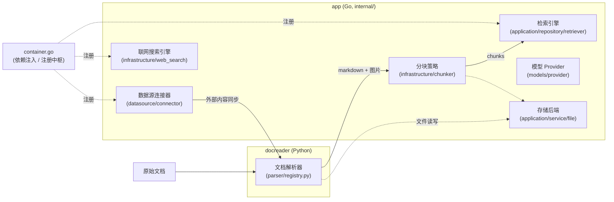
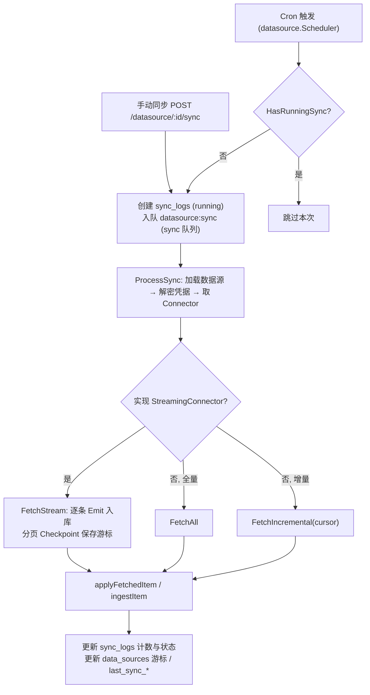

# 扩展点指南

Yuheng 在文档解析、分块、检索、模型接入、联网搜索、数据源、对象存储七个层面都预留了清晰的扩展点，并为独立扩展包提供 `internal/extension` 接缝（第 8 节）；知识健康的检测器同样可以由扩展接入（第 9 节）。本章逐个给出：**核心接口定义（真实源码）→ 现有实现列表 → 新增实现步骤（含注册点文件）**。所有接口代码均摘自当前仓库源码。

## 0. 扩展点总览



Go 侧绝大多数扩展点的**注册中枢**是 `internal/container/container.go`（依赖注入容器）：检索引擎 `EngineDescriptor`（经 `retrieve_engines` 值组）与 `initRetrieveEngineRegistry()`、联网搜索 `registerWebSearchProviders()`、数据源连接器 `initConnectorRegistry()`。

---

## 1. 新增文档解析器（docreader，Python）

### 接口定义

基类在 `docreader/parser/base_parser.py`。轻量化重构后 BaseParser 只负责把文档转成 markdown 文本 + 原始图片引用（分块、图片存储、OCR、VLM caption 均在 Go 侧完成）：

```python
# docreader/parser/base_parser.py
class BaseParser(ABC):
    """Base parser interface."""

    def __init__(self, file_name: str = "", file_type: Optional[str] = None, **kwargs):
        self.file_name = file_name
        self.file_type = file_type or os.path.splitext(file_name)[1].lstrip(".")

    @abstractmethod
    def parse_into_text(self, content: bytes) -> Document:
        """Parse document content into markdown text.

        Returns:
            Document with ``content`` (markdown string) and optional
            ``images`` dict mapping storage-relative paths to base64 data.
        """
```

返回值 `Document`（`docreader/models/document.py`，pydantic 模型）核心字段是 `content: str`（markdown）与 `images: Dict[str, str]`（路径 → base64）。

### 注册机制

`docreader/parser/registry.py` 的 `ParserEngineRegistry` 以"引擎名 → {文件扩展名 → Parser 类}"两级映射管理解析器；当请求的引擎不支持该文件类型时自动回落到 `builtin` 引擎。默认注册表由 `_build_default_registry()` 构建，模块级单例 `registry = _build_default_registry()`。

```python
# docreader/parser/registry.py（节选）
class ParserEngineRegistry:
    def register(self, name: str, file_types: Dict[str, Type[BaseParser]],
                 description: str = "", check_available: Callable = None,
                 unavailable_hint: str = ""): ...
    def get_parser_class(self, engine: str, file_type: str) -> Type[BaseParser]: ...
```

### 现有实现

| 引擎 | Parser | 文件 |
| --- | --- | --- |
| `builtin` | `Docx2Parser` / `DocParser` / `PDFParser` / `MarkdownParser` / `ExcelParser` / `EPUBParser` / `HTMLParser` / `MHTMLParser` / `XMindParser` / `ImageParser`（jpg/png/gif/bmp/tiff/webp 等）/ `VideoParser`（仅在检测到 ffmpeg 时注册）；pptx/ppt 在 builtin 下也交给 `MarkitdownParser` | `docreader/parser/docx2_parser.py`、`doc_parser.py`、`pdf_parser.py`、`markdown_parser.py`、`excel_parser.py`、`epub_parser.py`、`html_parser.py`、`mhtml_parser.py`、`xmind_parser.py`、`image_parser.py`、`video_parser.py` |
| `markitdown` | `MarkitdownParser`（微软 MarkItDown，多格式） | `docreader/parser/markitdown_parser.py` |
| `opendataloader` | `OpenDataLoaderParser`（PDF 版面分析，需 Java 11+，带 `check_available` 探测） | `docreader/parser/opendataloader_parser.py` |

### 新增步骤

1. 在 `docreader/parser/` 新建 `my_parser.py`，继承 `BaseParser`，实现 `parse_into_text(content: bytes) -> Document`；
2. **注册点：`docreader/parser/registry.py`** — 在 `_build_default_registry()` 中追加：

```python
reg.register(
    "my_engine",
    {"myext": MyParser},
    description="我的解析引擎",
    check_available=lambda overrides: (True, ""),   # 可选：依赖可用性探测
    unavailable_hint="缺依赖时给用户的提示",          # 可选
)
```

3. 若是给已有扩展名换实现，也可只往 `builtin` 的映射里加一行 `"ext": MyParser`；
4. 在 `docreader/tests/` 增加 unittest（参考 `test_parser_routing.py`），`uv run python -m unittest` 验证。

---

## 2. 新增分块策略（internal/infrastructure/chunker）

### 接口定义

分块没有 interface，而是**策略分层（tier）+ 包级函数变量覆盖**的模式。公共入口在 `internal/infrastructure/chunker/strategy.go`：

```go
// internal/infrastructure/chunker/strategy.go
// Strategy values for SplitterConfig.Strategy.
const (
    StrategyAuto      = "auto"
    StrategyHeading   = "heading"
    StrategyHeuristic = "heuristic"
    StrategyRecursive = "recursive"
    StrategyLegacy    = "legacy"
)

func Split(text string, cfg SplitterConfig) []Chunk
func SplitWithDiagnostics(text string, cfg SplitterConfig) ([]Chunk, *Diagnostics)
func SplitParentChild(text string, parentCfg, childCfg SplitterConfig) ParentChildResult
```

配置与结果类型在 `internal/infrastructure/chunker/splitter.go`：

```go
// internal/infrastructure/chunker/splitter.go
type Chunk struct {
    Content       string
    ContextHeader string
    Seq           int
    Start         int
    End           int
}

type SplitterConfig struct {
    ChunkSize    int
    ChunkOverlap int
    Separators   []string
    Strategy     string   // 空 = legacy（向后兼容）
    TokenLimit   int      // 以近似 token 数限制块大小，0 = 用 ChunkSize 字符数
    Languages    []string // 多语言启发式提示，空 = 自动检测
}
```

策略分发在 `runTier()`；heading / heuristic 两个实现通过包级函数变量在各自文件的 `init()` 中覆盖：

```go
// internal/infrastructure/chunker/strategy.go
func runTier(tier StrategyTier, text string, cfg SplitterConfig, profile *DocProfile) []Chunk {
    switch tier {
    case TierHeading:
        return splitByHeadings(text, cfg, profile)
    case TierHeuristic:
        return splitByHeuristics(text, cfg, profile)
    case TierLegacy:
        return SplitText(text, cfg)
    }
    return SplitText(text, cfg)
}

var splitByHeadings = func(text string, cfg SplitterConfig, _ *DocProfile) []Chunk {
    return SplitText(text, cfg) // 被 heading_splitter.go 的 init() 覆盖
}
var splitByHeuristics = func(text string, cfg SplitterConfig, _ *DocProfile) []Chunk {
    return SplitText(text, cfg) // 被 heuristic_splitter.go 的 init() 覆盖
}
```

### 现有实现

| 策略 tier | 说明 | 文件 |
| --- | --- | --- |
| `TierHeading` | 按 Markdown 标题层级分块 | `internal/infrastructure/chunker/heading_hierarchy.go` 等 |
| `TierHeuristic` | 多语言启发式分块 | `internal/infrastructure/chunker/heuristic_splitter.go` |
| `TierLegacy`（=`recursive`） | 递归分隔符分块（原始实现） | `internal/infrastructure/chunker/splitter.go` 的 `SplitText()` |
| 校验器 | 每个 tier 输出经 `ValidateChunks` 验收，失败则沿链回落 | `internal/infrastructure/chunker/validator.go` |

### 新增步骤

1. 在 `internal/infrastructure/chunker/` 新建 `my_splitter.go`，实现 `func(text string, cfg SplitterConfig, profile *DocProfile) []Chunk`；
2. **注册点：`internal/infrastructure/chunker/strategy.go`** —
   - 增加策略常量（如 `StrategyMine = "mine"`）与新的 `StrategyTier`；
   - 在 `resolveChain`/`resolveChainWithProfile` 的 switch 中为新策略返回 tier 链（建议以 `TierLegacy` 兜底）；
   - 在 `runTier()` 中新增 case；
3. 调用方无需改动：知识库的 `chunking_config.strategy`（JSONB）经 `internal/application/service/knowledge_process.go` 的 `buildSplitterConfig` / `buildSplitterConfigFromChunking` 传入；
4. 用 `SplitWithDiagnostics` 写单测验证 tier 选择与 `ValidateChunks` 验收行为。

---

## 3. 新增检索引擎（Retriever Engine）

### 接口定义

接口在 `internal/types/interfaces/retriever.go`（三层：引擎 → 仓储 → 服务 + 注册表）：

```go
// internal/types/interfaces/retriever.go
type RetrieveEngine interface {
    EngineType() types.RetrieverEngineType
    Retrieve(ctx context.Context, params types.RetrieveParams) ([]*types.RetrieveResult, error)
    Support() []types.RetrieverType // 支持的检索类型（向量/关键词）
}

type RetrieveEngineRepository interface {
    Save(ctx context.Context, indexInfo *types.IndexInfo, params map[string]any) error
    BatchSave(ctx context.Context, indexInfoList []*types.IndexInfo, params map[string]any) error
    EstimateStorageSize(ctx context.Context, indexInfoList []*types.IndexInfo, params map[string]any) int64
    DeleteByChunkIDList(ctx context.Context, indexIDList []string, dimension int, knowledgeType string) error
    DeleteBySourceIDList(ctx context.Context, sourceIDList []string, dimension int, knowledgeType string) error
    CopyIndices(ctx context.Context, sourceKnowledgeBaseID string,
        sourceToTargetKBIDMap map[string]string,
        sourceToTargetChunkIDMap map[string]string,
        targetKnowledgeBaseID string, dimension int, knowledgeType string) error
    DeleteByKnowledgeIDList(ctx context.Context, knowledgeIDList []string, dimension int, knowledgeType string) error
    BatchUpdateChunkEnabledStatus(ctx context.Context, chunkStatusMap map[string]bool) error
    BatchUpdateChunkTagID(ctx context.Context, chunkTagMap map[string]string) error
    RetrieveEngine
}

type RetrieveEngineRegistry interface {
    Register(indexService RetrieveEngineService) error
    GetRetrieveEngineService(engineType types.RetrieverEngineType) (RetrieveEngineService, error)
    GetAllRetrieveEngineServices() []RetrieveEngineService
    GetByStoreID(storeID string) (RetrieveEngineService, error)
}
```

引擎类型在 `internal/types/retriever.go` 中声明。社区版只内置一个：

```go
// internal/types/retriever.go
const PostgresRetrieverEngineType RetrieverEngineType = "postgres"
```

### 现有实现

社区版只有 `internal/application/repository/retriever/postgres/`（pgvector + ParadeDB `pg_search` BM25），以及知识图谱用的 `neo4j/`。Elasticsearch、OpenSearch、Milvus、Weaviate、Qdrant、Doris、腾讯云 VectorDB 的实现已从社区版移除。服务启动时若 `RETRIEVE_DRIVER` 含 `postgres`，会检查数据库是否装有 `vector` 与 `pg_search` 扩展，缺失则拒绝启动。

### 新增步骤

引擎的全部信息收拢在一个 `EngineDescriptor` 里（`internal/application/service/retriever/catalog.go`）：构造函数、连接测试、SSRF 地址策略、分数量纲、设置页表单字段、`RETRIEVE_DRIVER` 里的驱动名等。这样加引擎不必再去改十几处 `switch`，漏改一处也不会静默失败。

1. 在 `internal/types/retriever.go` 增加 `RetrieverEngineType` 常量；
2. 新建包实现 `RetrieveEngineRepository` 接口，并用 `retriever.NewKVHybridRetrieveEngine(repo, 引擎类型)` 包装；
3. 写一个 `EngineDescriptor`，把它提供进 dig 值组 `retriever.EngineGroup`（`"retrieve_engines"`）。描述符在 `NewEngineCatalog` 构建目录时被收集；描述符不合格（缺类型、缺驱动名、可注册却没有连接测试等）会在注册时报错。目录必须在扩展钩子（`internal/extension`）执行之后才能构建，所以由扩展提供的引擎也会进入目录；
4. 若引擎允许工作空间自行注册（`Registrable: true`），需提供 `ConnectionFields` / `IndexFields`、`DialAddresses` 与 `TestConnection`；它才会出现在 `GET /vector-stores/types` 与设置页。社区版没有可注册的引擎，该列表为空；
5. 若引擎需要独立部署，在 `docker-compose.dev.yml` 加一个带 profile 的服务，并在 `.env.example` 补连接变量。
6. 可选：实现 `interfaces.SimilarChunkFinder`（比较已存储的向量，见第 9 节），知识健康的重复检测才能在使用该引擎的知识库上运行。仓储实现它即可，`KVHybridRetrieveEngine` 会把能力透传出去；不实现的引擎在健康概览里显示为「不支持」。

---

## 4. 新增模型 Provider（internal/models/provider）

### 接口定义

Provider 元数据接口 + 全局注册表在 `internal/models/provider/provider.go`：

```go
// internal/models/provider/provider.go
type ProviderName string // "openai" / "anthropic" / "aliyun" / "zhipu" / "deepseek" / ...

type Provider interface {
    // Info 返回服务商的元数据
    Info() ProviderInfo
    // ValidateConfig 验证服务商的配置
    ValidateConfig(config *Config) error
}

// Register 添加一个提供者到全局注册表
func Register(p Provider)
```

`ProviderInfo` 描述展示名、各模型类型（chat/embedding/rerank）的默认 BaseURL、是否需要鉴权、额外配置字段等。Chat 请求的差异化适配（endpoint 拼接、thinking 参数、鉴权头、工具调用元数据）由 `internal/models/chat/provider.go` 的内部适配器接口承担：

```go
// internal/models/chat/provider.go
type providerAdapter interface {
    Name() provider.ProviderName
    Matches(model string) bool
    Thinking() ThinkingStrategy
    ShapeRequest(req *openai.ChatCompletionRequest, opts *ChatOptions, isStream bool)
    TransformMessages(msgs []openai.ChatCompletionMessage) []openai.ChatCompletionMessage
    Endpoint(baseURL, modelID string, isStream bool) string
    Auth(req *http.Request, creds authCreds, body []byte)
    ForceRawHTTP() bool
    ExtractToolCallMetadata(raw json.RawMessage) types.ToolCallMetadata
    InjectToolCallMetadata(toolCall map[string]any, metadata types.ToolCallMetadata)
}
```

Embedding 与 Rerank 各自有独立接口：

```go
// internal/models/embedding/embedder.go
type Embedder interface {
    Embed(ctx context.Context, text string) ([]float32, error)
    BatchEmbed(ctx context.Context, texts []string) ([][]float32, error)
    GetModelName() string
    GetDimensions() int
    GetModelID() string
    EmbedderPooler
}

// internal/models/rerank/reranker.go
type Reranker interface {
    Rerank(ctx context.Context, query string, documents []string) ([]RankResult, error)
    GetModelName() string
    GetModelID() string
}
```

### 现有实现

`internal/models/provider/provider.go` 中已定义 25 个 `ProviderName` 常量：openai、anthropic、aliyun、zhipu、openrouter、requesty、siliconflow、jina、generic、deepseek、gemini、volcengine、hunyuan、minimax、mimo、gpustack、moonshot、modelscope、qianfan、qiniu、longcat、lkeap、nvidia 等。具体 Provider 实现分布在 `internal/models/provider/` 下的各文件（如 `zhipu.go`、`gemini.go`、`hunyuan.go`、`generic.go`）；特殊 embedding 实现如 `internal/models/embedding/jina.go`、`volcengine.go`、`nvidia.go`。

### 新增步骤

1. **注册点一：`internal/models/provider/provider.go`** — 增加 `ProviderName` 常量；
2. 在 `internal/models/provider/` 新建 `myprovider.go`，实现 `Provider` 接口（`Info()` 给出默认 URL/支持的模型类型），并通过 `provider.Register(...)`（通常在 `init()` 或集中初始化处）挂入全局注册表——OpenAI 兼容协议的服务商到这一步即可用，chat 侧默认走通用 OpenAI 适配；
3. **注册点二（可选）：`internal/models/chat/provider.go`** — 若 API 协议有差异（非标 endpoint、特殊鉴权、thinking 字段），实现并注册一个 `providerAdapter`；
4. **注册点三（可选）**：需要专有 Embedding/Rerank 协议时，在 `internal/models/embedding/`、`internal/models/rerank/` 各加实现并接入其构造工厂；
5. 如需开箱即用的内置模型，补充 `config/builtin_models.yaml` 声明（启动时会同步进 `models` 表）。

---

## 5. 新增联网搜索引擎（internal/infrastructure/web_search）

### 接口定义

```go
// internal/types/interfaces/web_search.go
type WebSearchProvider interface {
    // Name returns the name of the provider
    Name() string
    // Search performs a web search
    Search(ctx context.Context, query string, maxResults int, includeDate bool) ([]*types.WebSearchResult, error)
}
```

注册表是工厂映射（按需用租户参数实例化）：

```go
// internal/infrastructure/web_search/registry.go
type ProviderFactory func(params types.WebSearchProviderParameters) (interfaces.WebSearchProvider, error)

type Registry struct {
    factories map[string]ProviderFactory
    mu        sync.RWMutex
}

func (r *Registry) Register(id string, factory ProviderFactory)
func (r *Registry) CreateProvider(providerType string, params types.WebSearchProviderParameters) (interfaces.WebSearchProvider, error)
```

### 现有实现

`internal/infrastructure/web_search/` 目录：`duckduckgo.go`、`google.go`、`bing.go`、`tavily.go`、`ollama.go`、`baidu.go`、`searxng.go`、`keenable.go`、`zhipu.go`、`exa.go`、`metaso.go`、`firecrawl.go`（另有 `proxy.go` 出站代理支持），共 12 个。类型常量在 `internal/types/web_search_provider.go`（`WebSearchProviderTypeBing/Google/DuckDuckGo/Tavily/Ollama/Baidu/Searxng/Keenable/Zhipu/Exa/Metaso/Firecrawl`）。

### 设计约束

- **端点写死在代码里**：服务商的 API 地址是 Provider 实现里的常量，不向用户暴露 BaseURL，从源头消除 SSRF。唯一的例外是自托管的 SearxNG（`RequiresBaseURL`），它的地址经 `ValidateSearxngBaseURL` 校验并受 `SSRF_WHITELIST` 约束；
- **出站 HTTP 用 `NewSearchHTTPClient`**（`proxy.go`）：SSRF 安全的拨号、可选代理（`SupportsProxy` 时由 `ProxyURL` 或环境代理提供）、重定向校验；
- **工厂只读参数**：构造函数签名固定为 `func(types.WebSearchProviderParameters) (interfaces.WebSearchProvider, error)`，凭据来自租户在 `web_search_providers` 表里的配置（`APIKey`、`EngineID`、`BaseURL`、`ProxyURL`、`ExtraConfig`），不读环境变量。实例按需创建。

### 新增步骤

1. **类型常量**：在 `internal/types/web_search_provider.go` 增加 `WebSearchProviderType` 常量（值即存进数据库的 `provider`，之后不可更改）；
2. **类型元数据**：在同文件的 `GetWebSearchProviderTypes()` 追加一条 `WebSearchProviderTypeInfo`，前端的添加对话框由它渲染（经 `GET /api/v1/web-search-providers/types`）：

| 字段 | 说明 |
| --- | --- |
| `ID` / `Name` / `Description` / `DocsURL` | 标识、展示名、描述、官方文档链接 |
| `RequiresAPIKey` / `SupportsOptionalAPIKey` | 是否必须 / 可选 API Key |
| `RequiresEngineID` | 是否需要额外 ID（如 Google CSE） |
| `RequiresBaseURL` | 是否需要用户提供地址（只应用于自托管服务） |
| `SupportsProxy` | 是否允许配置出站代理 |
| `ConfigFields` | 额外参数的表单定义（`Key`、`Label`/`LabelKey`、`Type`、`Required`、`Default`、`Options`），值存入 `ExtraConfig`，参见 `metaso` 的 `scope` |

3. **实现**：新建 `internal/infrastructure/web_search/mysearch.go`，实现 `WebSearchProvider`（`Name()`、`Search()`），导出工厂 `NewMySearchProvider`；额外参数从 `params.ExtraConfig` 读取，需要校验时导出 `ValidateMySearchParameters`；
4. **参数校验**：在 `internal/application/service/web_search_provider.go` 的 `isValidProviderType` 加入新类型，并在 `validateProviderParameters` 的 switch 中加 case；
5. **注册点：`internal/container/container.go` 的 `registerWebSearchProviders()`**：

```go
func registerWebSearchProviders(registry *infra_web_search.Registry) {
    registry.Register("duckduckgo", infra_web_search.NewDuckDuckGoProvider)
    registry.Register("google", infra_web_search.NewGoogleProvider)
    // ... 在此追加：
    registry.Register("mysearch", infra_web_search.NewMySearchProvider)
}
```

6. **前端**：设置页 `frontend/src/views/settings/WebSearchSettings.vue` 按类型元数据渲染表单；新引擎的图标与文案按需补充，文案要同时加到四个语言包；
7. **验证**：`go build ./...` 后调用 `GET /api/v1/web-search-providers/types` 确认新类型出现，再 `POST /api/v1/web-search-providers`（`{"name":…,"provider":"mysearch","parameters":{"api_key":…},"is_default":true}`）创建实例，或用 `POST /api/v1/web-search-providers/test` 在不落库的情况下测试凭据。

---

## 6. 新增数据源连接器（internal/datasource/connector）

### 接口定义

```go
// internal/datasource/connector.go
type Connector interface {
    // Type returns the connector type identifier (e.g., "feishu", "notion")
    Type() string

    // Validate verifies that the provided configuration is valid by testing
    // connectivity and checking credentials.
    Validate(ctx context.Context, config *types.DataSourceConfig) error

    // ListResources lists available resources that can be synced.
    // parentID 支持层级资源的懒加载："" 返回顶层，非空返回该资源的直接子节点。
    ListResources(ctx context.Context, config *types.DataSourceConfig, parentID string) ([]types.Resource, error)

    // ResolveResourceAncestors 为懒加载树的既有选中项解析祖先链（O(depth)）。
    ResolveResourceAncestors(
        ctx context.Context, config *types.DataSourceConfig, resourceIDs []string,
    ) ([]string, error)

    // FetchAll performs a full sync of the specified resources.
    FetchAll(ctx context.Context, config *types.DataSourceConfig, resourceIDs []string) ([]types.FetchedItem, error)

    // FetchIncremental performs an incremental sync based on the provided cursor.
    FetchIncremental(ctx context.Context, config *types.DataSourceConfig, cursor *types.SyncCursor) ([]types.FetchedItem, *types.SyncCursor, error)
}
```

可选的流式接口（大数据量分页 checkpoint，内存只驻留单条 item）：

```go
// internal/datasource/connector.go
type StreamHandler interface {
    Emit(ctx context.Context, item types.FetchedItem) error
    Checkpoint(ctx context.Context, cursor *types.SyncCursor) error
}

type StreamingConnector interface {
    Connector
    FetchStream(ctx context.Context, config *types.DataSourceConfig,
        cursor *types.SyncCursor, h StreamHandler) (*types.SyncCursor, error)
}
```

注册表同文件：`ConnectorRegistry`（`NewConnectorRegistry()` / `Register(connector)` / `Get(type)` / `List()` / `Available()` / `VerifyMetadata()`）；连接器的 UI 元数据（名称、AuthType、capabilities）在同文件的 `ConnectorMetadataRegistry` map 中，必须与注册的连接器一一对应。

### 现有实现

| 类型 | 目录 | 说明 |
| --- | --- | --- |
| `feishu` / `lark` | `internal/datasource/connector/feishu/wiki/` | 知识库；同一实现，`wiki.NewConnector(core.RegionFeishu / core.RegionLark)` 区分区域 |
| `feishu_drive` / `lark_drive` | `internal/datasource/connector/feishu/drive/` | 云盘；`drive.NewDriveConnector(core.RegionFeishuDrive / core.RegionLarkDrive)`，公共部分在 `feishu/core/` |
| `notion` | `internal/datasource/connector/notion/` | 页面与数据库 |
| `yuque` | `internal/datasource/connector/yuque/` | 语雀 |
| `rss` | `internal/datasource/connector/rss/` | RSS 订阅 |
| `gitlab` | `internal/datasource/connector/gitlab/` | GitLab |
| `ima` | `internal/datasource/connector/ima/` | 腾讯 ima |

### 同步是怎么运行的

连接器只负责"从外部拉东西"；数据源的增删改、调度、入库、日志都由 `DataSourceService`（`internal/application/service/datasource_service.go`）统一处理，新增连接器不需要改它。



- **调度**（`internal/datasource/scheduler.go`）：`robfig/cron/v3` 的 6 段表达式（含秒，如 `0 */30 * * * *`），启动时从库里加载 `active` 且有 `sync_schedule` 的数据源；创建、改调度、暂停、恢复、删除时增删对应的 cron 条目。去重两层：`HasRunningSync` 防止上一次还没跑完又触发；确定性任务 ID `dssync:<数据源ID>:<UTC 分钟>` 让多实例同一分钟只有一个入队成功，其余的 sync log 记为 `canceled`；
- **任务**：手动与定时同步都进 `sync` 队列（maintenance 池），`MaxRetry(5)`、超时 6 小时。`ProcessSync` 会丢弃重启后重投的过期副本：同一数据源已有另一条 `running` 的 sync log 时让路；
- **入库**（`ingestItem`）：`IsDeleted` 的条目在开启 `sync_deletions` 时删除本数据源下对应 `external_id` 的知识；有 `Content` 的走 `CreateKnowledgeFromFile`，只有 `URL` 的走 `CreateKnowledgeFromURL`。已存在同一 `external_id`（按数据源限定，不同数据源不会互相覆盖）时，冲突策略 `overwrite`（默认）先删后建，`skip` 保持原样。写入的 `metadata` 带 `external_id`、`source_resource_id`、`datasource_id`，`channel` 取连接器给的 `metadata["channel"]`，缺省为数据源类型；每个数据源自动建一个标签打在它同步的条目上；
- **失败**：单条拉取或入库失败只计入 `items_failed`、不中断整次同步，错误样本有上限；可重试的失败（大小限制、服务不可用、超时、限流）通过可选的 `RetryableIngestTracker` 让流式连接器不推进该节点的游标，下次同步重拉；内容完全相同的重复文档计入 `items_skipped`；
- **状态**：数据源 `active` / `paused` / `error` / `deleted`；`ValidateConnection` 失败置 `error`，恢复后回到 `active`。sync log `running` / `success` / `partial` / `failed` / `canceled`。

核心类型在 `internal/types/datasource.go`：`DataSourceConfig`（解密后的 `credentials`、`resource_ids`、`settings`）、`Resource`（可选资源，`ParentID` 构成树）、`FetchedItem`（`ExternalID`、`Title`、`Content`、`ContentType`、`FileName`、`URL`、`UpdatedAt`、`Metadata`、`IsDeleted`、`SourceResourceID`）、`SyncCursor`（`LastSyncTime`、连接器自定义的 `ConnectorCursor`、`LastSchemaHash`）。

### 新增步骤

1. **实现**：在 `internal/datasource/connector/mysource/` 新建包，实现 `Connector`，提供 `NewConnector()`。建议的文件划分是 `types.go`（平台 API 类型）、`client.go`（API 客户端与 token 管理，出站请求用 `internal/datasource/httpclient.go` 的 `NewConnectorHTTPClient`，用户可配置的 API 地址先过 `ValidateConnectorBaseURL`）、`connector.go`（接口实现）。要点：
   - `Validate` 真正调用一次平台 API（如换取 token），`POST /api/v1/datasource/validate-credentials` 在创建前用它测试凭据；
   - `ListResources` 支持按 `parentID` 懒加载；一次返回整棵树或平铺列表的连接器，非空 `parentID` 返回空即可，`ResolveResourceAncestors` 也可返回空；
   - `FetchIncremental` 可以复用 `FetchAll` 加编辑时间比较，把每个节点的编辑时间存进 `ConnectorCursor`；
   - 数据量大时实现 `StreamingConnector`：边拉边 `Emit`，按页 `Checkpoint`，游标必须是可完整恢复的快照；
   - 不支持的文档类型静默跳过，单条失败不要返回错误，而是作为错误条目放进 item 的 `Metadata`（`error_reason`，以及前端可本地化的 `error_reason_code`）；
2. **类型常量**：在 `internal/types/datasource.go` 增加 `ConnectorTypeMySource`；
3. **注册点一：`internal/container/container.go` 的 `initConnectorRegistry()`**：

```go
if err := registry.Register(mysourceConnector.NewConnector()); err != nil {
    errs = errors.Join(errs, fmt.Errorf("register mysource connector: %w", err))
}
```

4. **注册点二：`internal/datasource/connector.go` 的 `ConnectorMetadataRegistry`** — 增加元数据条目（`Type`、`Name`、`Description`、`Icon`、`Priority`（越小越靠前）、`AuthType`（`oauth2` / `api_key` / `token` 等）、`Capabilities`（`incremental`、`deletion_sync` 等）），`GET /api/v1/datasource/types` 返回的是已注册连接器的这些条目（`ConnectorRegistry.Available()`）。漏了这一步或多写一条，`initConnectorRegistry()` 里的 `VerifyMetadata()` 都会让启动失败；
5. **前端**：在 `frontend/src/views/knowledge/settings/DataSourceEditorDialog.vue` 加类型选项与凭据表单字段，图标放 `datasourceIcons.ts`，文案加到四个语言包；
6. 凭据随 `DataSourceConfig` 以 `SYSTEM_AES_KEY` 加密存储，不要另存明文。更细的逐步说明见包内的 `internal/datasource/CONNECTOR_IMPLEMENTATION_GUIDE.md`，飞书连接器（`connector/feishu/`）是最完整的参考实现。

---

## 7. 新增存储后端（对象存储）

### 接口定义

文件服务接口在 `internal/types/interfaces/file.go`：

```go
// internal/types/interfaces/file.go
type FileService interface {
    CheckConnectivity(ctx context.Context) error
    SaveFile(ctx context.Context, file *multipart.FileHeader, tenantID uint64, knowledgeID string) (string, error)
    SaveBytes(ctx context.Context, data []byte, tenantID uint64, fileName string, temp bool) (string, error)
    GetFile(ctx context.Context, filePath string) (io.ReadCloser, error)
    GetFileURL(ctx context.Context, filePath string) (string, error)
    DeleteFile(ctx context.Context, filePath string) error
    CopyFile(ctx context.Context, srcPath string, tenantID uint64, knowledgeID string) (string, error)
}
```

多后端解析（租户级 `storage_backends` 表配置 → FileService 实例）经 `internal/types/interfaces/storagebackend.go`：

```go
// internal/types/interfaces/storagebackend.go
type StorageBackendService interface {
    Create(ctx context.Context, backend *types.StorageBackend) error
    Update(ctx context.Context, backend *types.StorageBackend) error
    Delete(ctx context.Context, tenantID uint64, id string) error
    SetDefault(ctx context.Context, tenantID uint64, id string) error
    Test(ctx context.Context, backend *types.StorageBackend) error
}

type StorageBackendResolver interface {
    ResolveFileService(ctx context.Context, tenant *types.Tenant, backendID, provider, localBaseDir string) (FileService, string, error)
    ResolveBackend(ctx context.Context, tenant *types.Tenant, backendID, provider string) (*types.StorageBackend, error)
}
```

### 现有实现

均在 `internal/application/service/file/`：

| provider | 文件 | 说明 |
| --- | --- | --- |
| `local` | `local.go` | 本地文件系统 |
| `s3` | `s3.go` | 任何 S3 兼容服务（RustFS、MinIO、AWS S3，以及各云的 S3 端点） |

MinIO、腾讯云 COS、火山引擎 TOS、阿里云 OSS、华为云 OBS、金山云 KS3 不再有专用 provider，统一走 `s3`（见[安装部署](../01-getting-started/02-installation.md)）。

### 新增步骤

1. 在 `internal/application/service/file/` 新建 `mystore.go`，实现 `FileService` 全部方法（`CheckConnectivity` 用于前端"测试连接"按钮，即 `StorageBackendService.Test`）；
2. **注册点：`internal/application/service/file/factory.go` 的 `NewFileServiceFromStorageConfig()`** — 在 provider switch 中加 case：

```go
switch p {
case "local":  // NewLocalFileService(...)
case "s3":     // NewS3FileService(...)
// ... 在此追加：
case "mystore":
    return NewMyStoreFileService(cfg), p, nil
default:
    return nil, p, fmt.Errorf("unsupported storage provider: %s", p)
}
```

3. 若新 provider 需要新的配置字段（endpoint/bucket/region 等），扩展 `internal/types` 中的 `StorageEngineConfig` / `StorageBackend.config`（JSONB）；
4. 前端存储后端管理页增加对应 provider 的表单项；租户配置落在 `storage_backends` 表（`provider` 列即 switch 的 key）。

---

## 8. 扩展包（internal/extension）：特性、路由与迁移

前面几节是「往核心里加一个实现」。`internal/extension` 解决另一件事：一个**独立的扩展包**如何在不修改核心的前提下挂进服务。核心只定义接缝，绝不按名字判断某个扩展是否存在——没注册的特性就是不存在。

### 接入方式

扩展在自己包的 `init()` 里注册一个钩子，再由某个 `main` 包空导入（`import _ "…/acme"`）。钩子在核心注册完所有 provider 之后、任何值被解析之前运行，因此既能新增 provider，也能 `Decorate` 核心提供的默认值：

```go
// internal/extension/extension.go
func RegisterHook(name string, h Hook) // 名称为空、hook 为 nil、重名都会 panic（启动即失败）
type Hook func(c *dig.Container) error
```

### 现有接缝

| 接缝 | 作用 | 位置 |
| --- | --- | --- |
| 特性注册表 `Features` | 扩展声明自己带来的特性及其当前状态（`Enabled` + 机器可读的 `Reason`）；核心只转发给客户端。状态可在运行期变化，调用方每次重新查询 | `internal/extension/extension.go`；默认实现 `NewFeatures()` 无任何特性，扩展用 `Decorate` 替换；`StaticFeatures` 供固定集合与测试 |
| 检索引擎 | 提供 `EngineDescriptor` 进值组 `retrieve_engines`（见第 3 节） | `internal/application/service/retriever/catalog.go` |
| 路由注册器 `RouteRegistrar` | 在核心路由**之后**向 `/api/v1` 增加路由；值组 `route_registrars` | `internal/extension/routes.go`，装配点 `internal/router/routes_extension.go` |
| `RequireFeature(features, f)` | 路由中间件：特性未启用时返回 403，且不调用处理函数 | `internal/extension/routes.go` |
| 迁移源 | `database.RegisterMigrationSource(name, fsys, table)`：扩展自带一套迁移和独立的版本表（不得与核心的 `schema_migrations` 或其他扩展重名），无需改 `migrations/versioned` | `internal/database/migration.go` |
| 知识健康检测器 `findings.Detector` | 提供检测器进值组 `finding_detectors`，文档变化后与核心的重复检测一起运行（见第 9 节） | `internal/application/service/findings/detector.go` |
| 检索主体 `RetrieveParams.Subjects` | 调用者的权限主体，供支持 ACL 的引擎过滤（见下方「尚未强制」） | `internal/types/retriever.go` |

### 路由注册器

```go
// internal/extension/routes.go
type RouteRegistrar interface {
    Register(r Routes) error // 返回错误则服务拒绝启动
}

type Routes interface {
    Group() *gin.RouterGroup                  // 已认证的 /api/v1；API Key 一律 403
    APIKeys(policy APIKeyPolicy) APIKeyRoutes // 同一分组，但为每条路由声明 API Key 策略
    Viewer() / Contributor() / Admin() / Owner() gin.HandlerFunc // 与核心相同的角色守卫
}
```

注册方式与其他值组一致：

```go
c.Provide(newAcmeRoutes, dig.Group(extension.RouteRegistrarGroup)) // newAcmeRoutes 返回 extension.RouteRegistrar
```

语义与核心路由完全一致，扩展**无法**绕开：

- 路由挂在认证中间件之后，未登录返回 401；
- API Key 网关对未声明的路由默认拒绝（403）。通过 `Group()` 注册的路由对 API Key 关闭；需要开放的走 `APIKeys(...)`，策略只有三种：`APIKeyAnyKey()`（任何有效 Key，只用于无害的只读路由）、`APIKeyFullAccess()`（仅完全访问 Key）、`APIKeyCapabilities(...)`（完全访问 Key 或带其中任一 capability 的 Key）。零值 `APIKeyPolicy{}` 什么都不声明，等同关闭；
- 路由在核心之后注册，与核心路径冲突时 gin 直接 panic，启动失败，扩展**不能覆盖**核心路由；
- 启动自检 `assertAPIKeyPoliciesMatchRoutes` 同样覆盖扩展声明的策略；
- 扩展不能在 `/api/v1` 之外、认证之前注册路由，也无法声明平台级（`PlatformOnly`）策略。

特性开关这样接入，未启用时响应体稳定（客户端可按 `error.code` 匹配，`details.reason` 即 `FeatureStatus.Reason`）：

```go
r.APIKeys(extension.APIKeyFullAccess()).GET("/acme/report", extension.RequireFeature(features, "acme"), r.Viewer(), h)
// 403  {"success":false,"error":{"code":"feature_disabled","message":"…","details":{"feature":"acme","reason":"license_expired"}}}
```

建议把 `RequireFeature` 放在认证与角色守卫之后，避免匿名调用者探测部署内容。

### 尚未强制：条目级权限

`RetrieveParams.Subjects` 已存在并随检索请求传递；nil 或空表示调用者只能看到不受限制的条目。内置 PostgreSQL 引擎在 `EngineCapabilities.SupportsACL` 上声明了支持，但 `embeddings` 表没有存储条目主体、检索也不读取该字段——**目前不会过滤任何结果**（有测试固定了这一点）。在某个引擎真正实现过滤之前，不要把 `SupportsACL` 当作访问控制依据。

### 目前扩展做不到的事（路线图缺口）

以下能力还没有接缝，扩展要实现只能改核心代码：

- **认证提供方**：登录方式（LDAP、SAML、自定义 OIDC 之外的来源）无法插入；
- **审计输出**：审计日志只写数据库，无法增加外部汇（SIEM、Kafka 等）；
- **配额与计量**：没有用量上报与限额的钩子；
- **异步任务处理器**：无法向任务队列注册新的任务类型与处理器；
- **前端注册表**：前端没有让扩展新增页面、菜单、设置项的机制，服务端返回的特性状态只能由前端已有代码消费；
- 条目级权限的强制（见上）；
- 分块策略、模型 Provider、联网搜索、数据源连接器、存储后端仍按第 2、4～7 节的方式在核心内注册，尚未接入 `internal/extension`。

---

## 9. 知识健康检测器（internal/application/service/findings）

知识健康（见 [功能说明](../03-features/22-knowledge-health.md)）在文档索引完成后运行一组**检测器**，把它们报告的问题存为 `knowledge_findings` 记录。核心自带三个：内容比对（`DuplicateDetector`，比较已存储的向量并逐字比对，报告 `duplicate` 与 `divergent`）、定期复核（`ReviewDetector`，`stale`）、回答反馈（`DisputeDetector`，`disputed`）。新的检测——用大模型判断矛盾、跨库比较等——以检测器的形式接入，**不需要修改任何核心文件**。

### 接口定义

```go
// internal/application/service/findings/detector.go
const DetectorGroup = "finding_detectors"

type Detector interface {
    Name() string // 存进 detector 列，必须唯一且跨版本稳定
    Detect(ctx context.Context, scope Scope) ([]Candidate, error)
}

type Scope struct {
    TenantID      uint64
    KnowledgeBase *types.KnowledgeBase // 调用方已加载，只读
    Knowledge     *types.Knowledge     // 发生变化的文档
}

type Candidate struct {
    Type               string // 问题类型，如 "duplicate"；1-32 字符
    Severity           string // info / warning / error
    SubjectKnowledgeID string
    RelatedKnowledgeID string // 只涉及一篇文档的问题留空
    Score              float64
    Fingerprint        string // 留空 = PairFingerprint(Type, 知识库, 主体, 相关)，与方向无关
    Details            types.FindingDetails // Evidence / OverlapRatio / EvidenceHash / Extra
    Assign             AssignRule // 派给谁，零值 = 主体文档的负责人
}

type AssignRule int

const (
    AssignSubjectOwner AssignRule = iota // 主体文档的负责人（→ 最近经手人 → 知识库创建者）
    AssignLatestHand                     // 两篇中最近被经手那篇的经手人（适合「副本」类问题）
    AssignStalestOwner                   // 两篇中最久没人经手那篇的负责人（适合「过时 / 矛盾」类问题）
)

var ErrUnsupported = errors.New("detector does not apply here")

// 可选：不运行也能回答「这个知识库能不能检测」，用于健康概览的 supported
type SupportChecker interface {
    Supports(ctx context.Context, kb *types.KnowledgeBase) (bool, error)
}
```

引擎能力（重复检测依赖它，其它检测器也可以用）：

```go
// internal/types/interfaces/knowledge_finding.go
type SimilarChunkFinder interface {
    // 该文档每个启用分块，在同一知识库其它文档、同一维度内的最近邻，相似度 >= minScore
    SimilarChunks(ctx context.Context, kbID, knowledgeID string, minScore float64, perChunk int) ([]types.ChunkSimilarity, error)
}
```

检测器通过 `findings.NewFinderResolver` 提供的 `FinderResolver` 拿到知识库对应引擎的 `SimilarChunkFinder`，不必自己解析向量库绑定。

### 运行语义

`Runner` 对每次变化依次运行所有检测器（按名字排序），再与已存储的记录对账：

- 报告的问题按 `(tenant_id, fingerprint)` 插入或更新；
- 本次**运行过的**检测器不再报告、且涉及这篇文档的 `open` 问题，自动变为 `resolved`（`resolved_by = "system"`）；
- 返回 `ErrUnsupported`（可包装）表示「不适用」：不算失败、不重试，它以前的问题保持原样；
- 返回其它错误表示失败：其它检测器的结果照常记录，任务按队列策略重试，失败的检测器以前的问题保持原样；
- `dismissed` 的问题在 `EvidenceHash` 不变时保持忽略，变了就重新打开。所以 `EvidenceHash` 应当只取决于证据的**内容**（重复检测对匹配段落的文字取哈希，重新解析不会改变它），不要放分块 ID、时间或分数；
- 每次运行都按 `Assign` 重新派发，找人时跳过已离开空间或被停用的人；被人手动指派过的问题保持原处理人；
- 问题记录不会比文档活得久：文档软删除、硬删除或移到其它知识库时，数据库触发器删除相关记录，所有读取也只返回两侧文档都还在的记录。检测器不需要自己清理。

`Details.Extra` 放检测器自己的字段（键名建议带检测器前缀），核心原样存储、原样返回给 API。

### 注册步骤

核心注册自己的检测器与扩展注册的方式完全相同（`internal/container/container.go`）：

```go
must(container.Provide(newDuplicateDetector, dig.Group(findings.DetectorGroup)))
```

扩展在钩子里做同样的事：

```go
func init() {
    extension.RegisterHook("acme-findings", func(c *dig.Container) error {
        // newContradictionDetector 可以依赖容器里的任何服务（模型服务、分块仓储、FinderResolver……）
        return c.Provide(newContradictionDetector, dig.Group(findings.DetectorGroup))
    })
}
```

`Runner` 在扩展钩子执行之后才构建（`findings.NewRunnerFromContainer` 用 `extension.RequireApplied` 保证），因此扩展提供的检测器一定会被收进来；重名或空名在启动时报错。检测结果自动出现在现有的列表、概览、忽略/重新打开和在线文档页面接口里；新的 `type` 值由前端按原样显示，需要专门展示时再在前端补文案。

检测任务 `knowledge:findings` 由核心调度（按文档 30 秒防抖，走维护队列），检测器不需要、也不能注册自己的任务类型。耗时的检测器（例如调用大模型）应在 `Detect` 内自行限流，并尊重 `ctx` 的取消。

---

## 附：扩展点速查表

| 扩展点 | 核心接口 | 接口文件 | 注册点 |
| --- | --- | --- | --- |
| 文档解析器 | `BaseParser.parse_into_text` | `docreader/parser/base_parser.py` | `docreader/parser/registry.py` `_build_default_registry()` |
| 分块策略 | tier 函数 `func(text, cfg, profile) []Chunk` | `internal/infrastructure/chunker/strategy.go` | 同文件 `runTier()` + 策略常量 |
| 检索引擎 | `RetrieveEngineRepository` | `internal/types/interfaces/retriever.go` | `EngineDescriptor` → `retrieve_engines` 值组；`engine_factory.go` `initRetrieveEngineRegistry()`（`RETRIEVE_DRIVER` 门控） |
| 模型 Provider | `Provider` / `providerAdapter` / `Embedder` / `Reranker` | `internal/models/provider/provider.go` 等 | `provider.Register()` + `internal/models/chat/provider.go` |
| 联网搜索 | `WebSearchProvider` | `internal/types/interfaces/web_search.go` | `container.go` `registerWebSearchProviders()` |
| 数据源连接器 | `Connector` / `StreamingConnector` | `internal/datasource/connector.go` | `container.go` `initConnectorRegistry()` + `ConnectorMetadataRegistry` |
| 存储后端 | `FileService` | `internal/types/interfaces/file.go` | `internal/application/service/file/factory.go` switch |
| 扩展包路由 | `extension.RouteRegistrar` | `internal/extension/routes.go` | 值组 `route_registrars`（`extension.RouteRegistrarGroup`） |
| 特性注册表 | `extension.Features` | `internal/extension/extension.go` | `extension.RegisterHook` + `Decorate` |
| 扩展迁移 | `fs.FS` + 独立版本表 | `internal/database/migration.go` | `database.RegisterMigrationSource()` |
| 知识健康检测器 | `findings.Detector`（可选 `SupportChecker`） | `internal/application/service/findings/detector.go` | 值组 `finding_detectors`（`findings.DetectorGroup`） |
