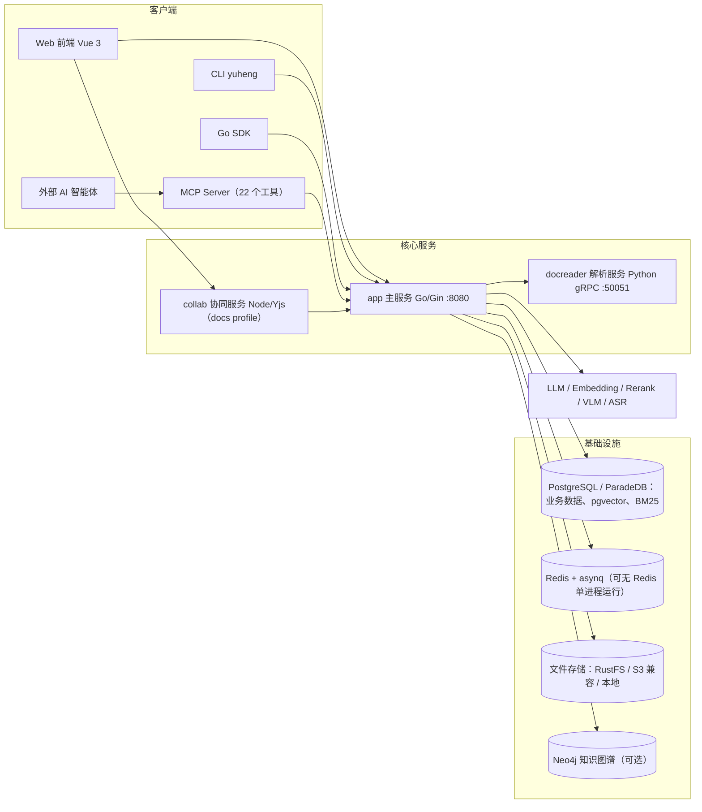

# Yuheng 文档

Yuheng（玉衡）是一个开源的、AI 智能体时代的知识平台：把文件、网页、飞书 / Notion / 语雀等数据源和在线协同文档里的资料接进来，组织成可检索的知识（分块、FAQ、自动 Wiki、可选知识图谱），用带出处的混合检索问答回答人的问题，由知识健康持续发现重复、过时与被质疑的内容并交给负责人处理，再通过 REST API 与 MCP 把同样的能力交给外部 AI 智能体。它不是智能体框架，只做好知识层。技术上是 Go 单体后端 + Vue 3 前端 + Python 文档解析服务（docreader），在线文档另有 Node 协同服务（collab）。

本目录是 Yuheng 的官方文档，按「入门 → 架构 → 功能 → API → 客户端 → 开发」六个部分组织。

## 文档站点

本目录同时是一个 VitePress 站点，Markdown 即页面，新增文件会自动进入侧边栏（标题取正文一级标题，目录顺序按文件名数字前缀）。

```bash
npm install
npm run dev      # 本地预览
npm run build    # 产物输出到 .vitepress/dist
npm run preview  # 预览构建产物
```

主题位于 `.vitepress/theme/`：`style.css` 是排版与配色的单一来源，`Landing.vue` 是首页。

## 写作约定

- **先讲怎么用，再讲怎么实现。** 每篇功能文档开头回答「这东西解决什么问题、在界面上怎么用」，之后才展开数据模型、流程与源码细节；源码索引统一放在文末的「实现参考」小节。
- **面向用户的章节**（01 快速开始、03 功能模块、05 客户端）以任务为主线；**面向开发者的章节**（02 架构、04 API、06 开发指南）以结构为主线，可以直接深入细节。
- 涉及界面操作的地方配截图，用 `<Screenshot>` 组件引用（见下节）。

## 截图

截图用全局组件 `<Screenshot>` 引用，图片放在 `public/screenshots/` 下：

```md
<Screenshot
  src="/screenshots/kb-document-list.png"
  caption="知识库文档列表：解析状态、标签与批量操作"
  hint="展示文档列表页，包含解析状态列、标签列、顶部筛选栏与勾选后出现的批量操作栏。" />
```

目前文档里没有引用任何截图：原有截图来自上游项目，带有上游品牌标识和已移除功能的界面，公开前已全部删除。重新截图时请在 Yuheng 自己的界面上截取，使用不含真实邮箱、令牌的演示数据；图片文件不存在时，组件会渲染成一个带说明的虚线占位框，所以不要在没有图片时提前写入 `<Screenshot>`。

## 阅读路径建议

- **初次使用**：01 快速开始 前三篇按顺序读完即可完成部署与首次问答。
- **评估选型 / 了解原理**：02 架构 五篇给出系统全貌与两条核心流水线（文档入库、检索问答）。
- **使用某项具体功能**：直接查 03 功能模块 对应章节。
- **对接 API / 写集成**：04 API 参考 + 05 客户端（CLI / Go SDK）。
- **二次开发 / 贡献代码**：06 开发指南，尤其是扩展点指南。

## 目录

### 01 快速开始

| 文档 | 内容 |
| --- | --- |
| [产品介绍](01-getting-started/01-introduction.md) | Yuheng 是什么（接入 → 组织 → 问答 → 维护 → 开放）、核心概念（租户、知识库、在线文档、负责人与知识健康等）、功能总览与组件图 |
| [安装部署](01-getting-started/02-installation.md) | Docker Compose（含 docs / full 等可选 profile）、在线文档部署、开发模式、Helm |
| [快速上手](01-getting-started/03-quickstart.md) | 注册 → 配置模型 → 建库 → 上传 → 问答的完整路径，含可直接执行的 curl 链路 |
| [配置详解](01-getting-started/04-configuration.md) | 环境变量与 config.yaml、端口与网络、知识健康与在线文档配置、内置模型 |
| [备份与升级](01-getting-started/05-backup-and-upgrade.md) | 哪些状态存在哪里、备份与恢复、升级步骤、迁移失败的处理 |

### 02 架构

| 文档 | 内容 |
| --- | --- |
| [总体架构](02-architecture/01-overview.md) | 组件构成、各子系统、进程间通信（含 collab）、顶层目录导览 |
| [Go 后端设计](02-architecture/02-backend-design.md) | 分层、dig 依赖注入与扩展钩子、启动顺序、路由与中间件、在线文档模块、知识健康子系统、领域模型 |
| [文档入库流程](02-architecture/03-document-pipeline.md) | 上传 / URL / 手工 / 数据源同步 / 在线文档镜像 → 解析 → 分块 → 向量化 → 索引 → 后处理（含知识健康检测） |
| [检索问答流程](02-architecture/04-rag-pipeline.md) | chat_pipeline 插件流水线、跨库检索与融合、重排、SSE 流式输出与引用、回答反馈 |
| [异步任务系统](02-architecture/05-async-tasks.md) | asynq 队列与 worker pool、无 Redis 模式、防抖与去重、容量规划、不走队列的后台任务 |

### 03 功能模块

| 文档 | 内容 |
| --- | --- |
| [工作区、用户与认证授权](03-features/01-tenant-auth.md) | 工作区模型（用户是全局身份、一个企业一个工作区）、注册与 bootstrap、JWT / API Key / OIDC、登录限流与锁定、RBAC、工作区组、CORS |
| [知识库与知识管理](03-features/02-knowledge-base.md) | 知识库配置、文件夹与标签、分块编辑与版本、文档负责人与复核周期、预览安全、复制与移动、活动流、配额 |
| [文档解析服务 docreader](03-features/03-document-parsing.md) | gRPC 接口、解析引擎（builtin / MinerU / PaddleOCR-VL 等）、支持格式（含视频）、部署与扩容 |
| [分块机制](03-features/04-chunking.md) | 自适应分块、父子分块、重叠与边界、调试端点 |
| [检索引擎与向量存储](03-features/05-retrieval-engines.md) | 引擎目录与 PostgreSQL（pgvector + ParadeDB）、按维度建 HNSW、打分归一化 |
| [模型管理](03-features/06-models.md) | 5 类模型、25 个厂商、内置模型、Ollama、并发限制、权限 |
| [在线文档](03-features/07-docs.md) | 空间与页面权限、协同编辑、评论与通知、历史与分享、导入导出、同步到知识库、页面负责人 |
| [MCP 集成](03-features/08-mcp.md) | `yuheng-mcp`（22 个工具，stdio / SSE / HTTP）与 CLI 内置的 `yuheng mcp serve` |
| [知识图谱](03-features/09-knowledge-graph.md) | 开启方式、LLM 实体关系抽取、Neo4j 存储、图谱增强检索 |
| [数据源导入](03-features/10-datasource.md) | 9 类连接器（飞书 / Lark 知识库与云盘、Notion、语雀、RSS、GitLab、ima）、同步调度、删除同步与冲突策略 |
| [网络搜索与网页抓取](03-features/11-web-search.md) | 12 个搜索提供商、SSRF 防护、web_fetch、SearXNG 自托管 |
| [Wiki 能力](03-features/14-wiki.md) | 知识库生成 Wiki、流水线、人工编辑与版本、lint |
| [评估能力](03-features/15-evaluation.md) | 评估任务、数据集、检索与生成指标 |
| [可观测性与审计](03-features/16-observability.md) | 日志、Langfuse、审计日志、限流、`/health` 与 `/ready` |
| [FAQ 能力](03-features/17-faq.md) | FAQ 条目、导入导出与去重、检索命中方式 |
| [会话与对话体验](03-features/18-chat-experience.md) | 进度与引用、导出对话、临时附件、历史搜索、回答反馈 |
| [存储后端](03-features/19-storage-backends.md) | local 与 S3 兼容存储、默认 RustFS、按库绑定、连通性测试 |
| [平台管理与系统管理员](03-features/20-platform-admin.md) | 首个管理员、控制台分区、用户与工作区（建工作区、建账号、任意工作区的成员）、运行时系统设置、集中管控 |
| [图片与文件的对外访问](03-features/21-file-access.md) | 四种 URL 形式、各客户端怎么取、排查表 |
| [知识健康](03-features/22-knowledge-health.md) | 重复与内容有出入、定期复核、回答反馈、负责人与派发、我的待办、取代与确认 |

### 04 API 参考

约 400 个端点，每个端点含权限要求与参数；Swagger UI（`/swagger/index.html`，非 release 模式）与本文不一致时以 Swagger 为准。

| 文档 | 内容 |
| --- | --- |
| [API 总览](04-api/01-api-overview.md) | Base URL、认证方式与 API Key 能力域、通用响应与错误码、分页、SSE、限流、各资源导航 |
| [认证与用户](04-api/02-api-auth.md) | 注册登录、OIDC、token 刷新、邀请、个人收藏 |
| [租户与成员](04-api/02-api-tenant.md) | 租户、成员（含系统管理员的成员接口）、邀请、API Key、身份映射、KV 配置 |
| [知识库与知识](04-api/02-api-knowledge.md) | 知识库、知识、文件夹、搜索、知识健康与负责人 |
| [分块与标签](04-api/02-api-chunks.md) | 分块读写与版本、生成问题、标签 |
| [FAQ 与 Wiki](04-api/02-api-faq-wiki.md) | FAQ 管理与导入、Wiki 读写 |
| [会话与聊天](04-api/02-api-chat.md) | 会话、消息、知识问答（SSE）、知识搜索、回答反馈 |
| [模型与初始化](04-api/02-api-model-system.md) | 模型、评估 |
| [系统与平台管理](04-api/02-api-system.md) | 系统信息与能力、全局设置、运行时队列、平台 API Key、用户管理、系统审计 |
| [基础设施与数据源](04-api/02-api-infra.md) | 向量存储、存储后端、Web 搜索、数据源 |
| [文件服务](04-api/02-api-files.md) | 文件代理、预签名 URL、匿名短链 `/r/:token` |

在线文档的接口列在 [在线文档](03-features/07-docs.md) 一文中。

### 05 客户端

| 文档 | 内容 |
| --- | --- |
| [Web 前端](05-clients/01-frontend.md) | Vue 3.5 + TypeScript、Tailwind v4 + shadcn-vue（TDesign 退役中）、路由、状态管理、i18n、测试 |
| [命令行工具 CLI](05-clients/02-cli.md) | 12 个命令组与 8 个单命令、多 profile、输出格式与退出码、内置 MCP |
| [Go SDK](05-clients/03-go-sdk.md) | 约 160 个方法、流式对话、错误处理、未覆盖的接口走 `Raw` |

### 06 开发指南

| 文档 | 内容 |
| --- | --- |
| [开发指南](06-development/01-dev-guide.md) | 环境要求、开发模式与热重载、测试（Go 测试用真实 PostgreSQL）、CI 与代码规范、调试 |
| [数据库与迁移](06-development/02-database-schema.md) | 表结构与 ER 图、内嵌的版本化迁移、新增迁移、故障排查 |
| [扩展点指南](06-development/03-extension-points.md) | 解析器、分块、模型、搜索引擎、数据源连接器、存储、检索引擎目录、知识健康检测器与扩展钩子 |

## 系统组件速览



## 文档约定

- 文中源码路径均相对仓库根目录，如 `internal/handler/session/`。
- API 路径默认带 `/api/v1` 前缀；认证方式见 [API 总览](04-api/01-api-overview.md)。
- 配置示例中的密钥均为占位符，生产环境务必替换（尤其 `JWT_SECRET`、`SYSTEM_AES_KEY`、数据库口令）。
- 文档基于仓库根目录 `VERSION` 文件对应版本源码整理（VitePress 构建时自动读取），随代码变更同步维护。
