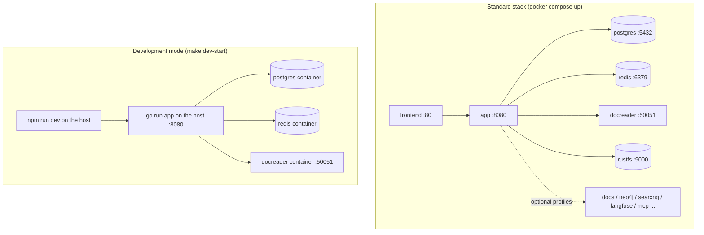
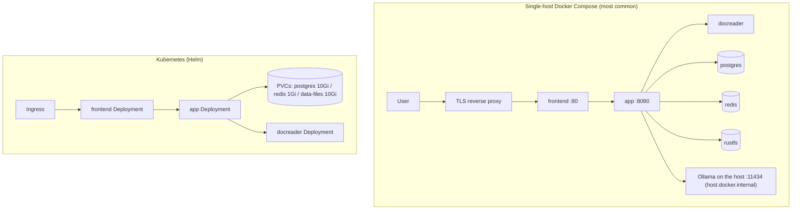

# Installation

> This is an English translation of the Chinese page [安装部署](../../01-getting-started/02-installation.md).
> The Chinese page is the primary version; if the two differ, the Chinese one is right.

Yuheng runs anywhere from a laptop to a Kubernetes cluster. This page covers the standard Docker Compose stack (with its optional components), the one-command deploy script, development mode, building the images, the Makefile and scripts, Helm, and running from source.

**This release does not publish Docker images.** Every option below builds the images on your machine from source. `docker compose pull` cannot fetch `magicyuan876/yuheng-*` images; do not use it.

## Deployment options

| Option | Entry point | Database | Queue / streams | When to use it |
| --- | --- | --- | --- | --- |
| Docker Compose (standard) | `docker-compose.yml` | ParadeDB (PostgreSQL) | Redis + Asynq | Self-hosting for a team; recommended |
| One-command deploy | `scripts/deploy.sh` | Same | Same | Build from source and start on a fresh server, with settings tuned to the machine |
| Docker Compose (development) | `docker-compose.dev.yml` + `scripts/dev.sh` | Same (only the infrastructure runs in containers) | Same | Local development: app and frontend run on the host |
| Helm | `helm/` | ParadeDB (bundled in the chart) | Redis (bundled in the chart) | Kubernetes >= 1.25. You build the images and push them to your own registry. |



## Requirements

- **Docker deployment:** Docker 20.10+ and Docker Compose v2. Start with 4 CPU cores and 8 GB of RAM. docreader bundles LibreOffice, ffmpeg and a headless browser, and Compose caps it at 4 GB of memory (`DOCREADER_MEM_LIMIT`; raise it for very large PDFs or long videos). Size the disk for your knowledge bases (the Postgres volume plus the object-storage volume). Optional components such as Langfuse need more memory.
- **Tools on the host:** `git` and Node.js 20 or newer (the frontend assets are built on the host; CI uses Node 24).
- **Model service:** a local [Ollama](https://ollama.com) (from inside the containers the default address is `http://host.docker.internal:11434`; with `OLLAMA_OPTIONAL=true` an unreachable Ollama only logs a warning), or any OpenAI-compatible API.
- **Building from source:** Go 1.26, CGO (the DuckDB binding needs a C toolchain), Python 3.10 + uv (docreader).
- **Kubernetes:** >= 1.25.0 (`helm/Chart.yaml`).

## 1. Docker Compose, standard stack

### 1. Prepare `.env`

```bash
git clone https://github.com/magicyuan876/Yuheng.git && cd Yuheng
cp .env.example .env
```

Edit `.env`. You **must** fill in `JWT_SECRET` and `SYSTEM_AES_KEY`: they are empty in `.env.example`, and the server refuses to start while either is empty, too short or an old published example value. The log names the variable and the command that generates it.

```bash
openssl rand -hex 32     # -> JWT_SECRET: at least 32 characters
openssl rand -hex 16     # -> SYSTEM_AES_KEY: exactly 32 bytes; 32 hex characters is enough
```

`SYSTEM_AES_KEY` encrypts the API keys, model keys and data-source credentials stored in the database. If you lose it, that data cannot be decrypted, so keep it safe and apart from your data backups. Also change the example values of `DB_PASSWORD` and `REDIS_PASSWORD`.

`.env.example` sets `TZ=UTC`; change it to your time zone if you like. When building the images inside mainland China, `APK_MIRROR_ARG=mirrors.tencent.com` (the Debian mirror for the app image), `APT_MIRROR` (for the docreader image), `GOPROXY_ARG` and `PIP_INDEX_URL` speed things up. They are empty by default, which uses the official sources.

`.env.example` documents every setting in commented groups; see [Configuration](../../01-getting-started/04-configuration.md) (Chinese) for their meaning.

### 2. Build and start

```bash
./scripts/build_frontend_dist.sh  # produces frontend/dist, which the frontend image needs
docker compose up -d --build      # builds the app / docreader / frontend images and starts the stack
docker compose ps                 # wait until every service is healthy or running
```

The first build takes ten minutes or more. Stop with `docker compose down` (adding `-v` also deletes the data volumes; be careful).

> The `app` service uses `env_file: [.env]`, so Compose fails to parse the file when `.env` is missing.

### 3. Open it and check it

- Frontend: open `http://localhost` (the port is `FRONTEND_PORT`, 80 by default). The frontend's Nginx proxies `/api/` to the backend, so API calls also work at `http://localhost/api/v1`.
- Backend: `APP_PORT` (8080 by default) is published on the host's `127.0.0.1` only. `curl http://localhost:8080/health` returning `{"status":"ok"}` means the process is alive; `curl http://localhost:8080/ready` returning 200 means the database and Redis are reachable and the migration state is clean. The Compose health check uses `/ready`.
- **A fresh deployment has no default account:** the first account you register becomes the system administrator, and public registration closes after that (`DISABLE_REGISTRATION` overrides this; see the [quick start](./03-quickstart.md)).

Before the first question can be answered you must also configure at least one chat model and one embedding model under Settings, Model Management; see the [quick start](./03-quickstart.md).

### 4. Serving other machines

By default every published port except the frontend's is bound to `127.0.0.1`. Browsers reach the backend (`/api`, `/files`, `/r`) and the collaboration service (`/collab`) through the frontend's Nginx, and containers talk over the Compose network. Each port has a `*_BIND` variable (`APP_BIND`, `COLLAB_BIND`, `DRAWIO_BIND`, `MCP_BIND`, `NEO4J_BIND`, `RUSTFS_BIND`, `SEARXNG_BIND` and others); set one to `0.0.0.0` only when something on another machine really has to connect directly.

To serve a network or the internet: put a reverse proxy with TLS in front of the frontend; first replace the default passwords in `.env` and RustFS's default account; and set `APP_EXTERNAL_URL` if links to images and files must work outside (see [Configuration](../../01-getting-started/04-configuration.md), Chinese).

### Core services (started by default)

| Service | Image | Host port | Depends on | Notes |
| --- | --- | --- | --- | --- |
| `frontend` | built locally, tagged `magicyuan876/yuheng-ui:${YUHENG_VERSION:-latest}` | `${FRONTEND_PORT:-80}`, all interfaces | app (healthy) | Nginx serves the frontend and proxies to app and collab; `APP_HOST` / `APP_BACKEND_PORT` / `APP_SCHEME` can point at a remote backend |
| `app` | built locally, `magicyuan876/yuheng-app` | `127.0.0.1:${APP_PORT:-8080}` | postgres, redis, docreader, rustfs (all healthy) | Go backend; mounts `./config/config.yaml` and the `data-files` volume; health check `GET /ready` |
| `docreader` | built locally, `magicyuan876/yuheng-docreader` | not published (50051 on the Compose network) | none | Document-parsing gRPC service, runs as non-root; health check via `grpc_health_probe`; shares the `docreader-tmp` volume with app for images |
| `postgres` | `paradedb/paradedb:v0.22.2-pg17` | not published | none | PostgreSQL 17 + `pg_search` (BM25) + pgvector: the only database and the only retrieval engine |
| `redis` | `redis:7.0-alpine` | not published | none | `--appendonly yes`; data in the `redis-data` volume |
| `rustfs` | `rustfs/rustfs` (pinned by digest) | `127.0.0.1:9000` (S3) / `127.0.0.1:9001` (console) | none | The default file storage (S3-compatible object store); see "File storage" below. It starts even if `STORAGE_TYPE` points elsewhere. |

### Optional services and profiles

The retrieval engine is PostgreSQL itself; there is no separate vector database or search cluster. At start-up the server checks that the PostgreSQL it connects to has both the `vector` and `pg_search` extensions and refuses to start, with an explanation, if either is missing. So either use the ParadeDB image from `docker-compose.yml`, or install both extensions on your own PostgreSQL. Managed PostgreSQL from cloud vendors usually cannot install `pg_search` and does not work.

Enable a profile with `docker compose --profile <name> up -d --build`:

| Profile | Services | Host ports | Purpose |
| --- | --- | --- | --- |
| `docs` | `collab` + `drawio` | `127.0.0.1:${COLLAB_PORT:-1234}` / `127.0.0.1:${DRAWIO_PORT:-8087}` | Real-time collaboration and the draw.io editor for online documents; see the next section |
| `neo4j` (part of `full`) | `neo4j` | `127.0.0.1:7474` / `127.0.0.1:7687` | Knowledge graph; also needs `NEO4J_ENABLE=true`. Default login `neo4j/password`; change `NEO4J_PASSWORD` before real use |
| `searxng` (part of `full`) | `searxng-init` + `searxng` | `127.0.0.1:8888` (`SEARXNG_BIND` / `SEARXNG_PORT`) | Self-hosted web search; set `SEARXNG_SECRET` before exposing it |
| `langfuse` (part of `full`) | `langfuse-db-init`, `langfuse-clickhouse`, `langfuse-minio`, `langfuse-worker`, `langfuse-web` | `127.0.0.1:3000` (UI) / `127.0.0.1:9100`, `9101` (its own MinIO) | A self-hosted Langfuse that reuses Yuheng's postgres (a new `langfuse` database) and redis (DB 1) |
| `dex` (part of `full`) | `dex` | `127.0.0.1:5556` | An OIDC identity provider for testing (`misc/dex-config.yaml`, static passwords; not for production) |
| `odl-hybrid` | `odl-hybrid` | not published (5002 on the Compose network) | OpenDataLoader / Docling hybrid PDF parsing backend; use with `DOCREADER_ODL_HYBRID` |
| `full` | `mcp` plus every service marked "part of `full`" | mcp: `127.0.0.1:${MCP_PORT:-8082}` | `mcp` is the MCP server over HTTP / SSE (`mcp-server/`); needs `YUHENG_API_KEY` and `MCP_SERVER_AUTH_TOKEN` |

Every environment variable of each service is in its `environment` section of `docker-compose.yml` and in `.env.example`; see [Configuration](../../01-getting-started/04-configuration.md) (Chinese).

### Online documents (optional)

Online documents are off by default and controlled by two independent switches:

1. **Turn the module on:** set `YUHENG_DOCS_ENABLED=true` in `.env` and run `docker compose up -d app` to apply it. No extra container is needed, and the frontend shows a Docs entry. One person at a time can edit a page (exclusive editing: entering edit mode takes a five-minute lease that renews while you type; everyone else reads).
2. **Real-time collaboration** (optional): also set

   ```bash
   YUHENG_COLLAB_SHARED_SECRET=<output of openssl rand -base64 32>   # at least 16 characters, shared by app and collab
   YUHENG_COLLAB_URL=ws://localhost/collab                           # the address browsers use; wss://<domain>/collab on HTTPS
   ```

   and start with the profile: `docker compose --profile docs up -d --build`. The frontend's Nginx already proxies `/collab` to the collab container, so no extra port is needed. collab has no database and stores nothing; it calls back to app for authentication and saving.

draw.io diagrams need `YUHENG_DOCS_DRAWIO_URL`, set to an address the **browser** can open: `http://localhost:8087/` on a single machine; for remote users set `DRAWIO_BIND=0.0.0.0` or put it behind the reverse proxy, and use the address they actually reach. Without it, existing diagrams are view-only.

The other online-document settings (attachment limits, trash retention, public sharing, embed allow-lists) are in section K of `.env.example` and in the [online documents](../../03-features/07-docs.md) guide (Chinese).

### File storage (S3-compatible)

File storage has two backends: `s3` (the Compose default; any S3-compatible service, and the bundled RustFS works out of the box) and `local` (the container directory `/data/files`, i.e. the `data-files` volume). RustFS, MinIO, AWS S3, and Alibaba Cloud OSS, Tencent Cloud COS, Volcano Engine TOS and Huawei Cloud OBS all connect through `s3` and their S3-compatible endpoints; there are no vendor-specific providers.

**Using the bundled RustFS (default):** `docker compose up -d --build` also starts RustFS and the app connects to it by default: endpoint `http://rustfs:9000`, region `us-east-1`, bucket `yuheng` (created on first use), credentials from `RUSTFS_ACCESS_KEY` / `RUSTFS_SECRET_KEY` (both `rustfsadmin` by default). You do not need to configure storage in `.env`.

The default login is only for a first trial; change it with `RUSTFS_ACCESS_KEY` / `RUSTFS_SECRET_KEY` before real use, and always when `RUSTFS_BIND` is not `127.0.0.1`.

> RustFS is still pre-1.0, so the Compose image is pinned by digest. Take that into account for production: back up the data before upgrading the image, or switch to MinIO, AWS S3 or a cloud vendor's S3-compatible service.

**Using an external S3-compatible service:** set in `.env`

```bash
STORAGE_TYPE=s3
S3_ENDPOINT=<S3-compatible endpoint; may be empty for AWS S3>
S3_REGION=<region, required>
S3_BUCKET_NAME=<bucket, required; created on first use if it does not exist>
S3_ACCESS_KEY=<access key>          # set both S3_ACCESS_KEY and S3_SECRET_KEY, or neither;
S3_SECRET_KEY=<secret key>          # with neither, the AWS default credential chain is used
S3_PATH_PREFIX=yuheng/              # optional object prefix
S3_USE_SSL=true                     # only applies when the endpoint has no scheme
S3_ADDRESSING_STYLE=auto            # auto | path | virtual
```

With `S3_ADDRESSING_STYLE=auto`, an empty endpoint or an `amazonaws.com` endpoint uses virtual-hosted addressing and every other endpoint uses path style. Common values:

| Service | Example `S3_ENDPOINT` | `S3_ADDRESSING_STYLE` |
| --- | --- | --- |
| RustFS (bundled in Compose) | `http://rustfs:9000` | `path` (`auto` also works) |
| MinIO (self-hosted) | `http://minio:9000` | `path` (`auto` also works) |
| AWS S3 | empty, or `https://s3.us-east-1.amazonaws.com` | `auto` |
| Alibaba Cloud OSS | `https://oss-cn-hangzhou.aliyuncs.com` | `virtual` (required) |
| Tencent Cloud COS | `https://cos.ap-guangzhou.myqcloud.com` | `virtual` (required) |
| Volcano Engine TOS | `https://tos-s3-cn-beijing.volces.com` | `virtual` (required) |
| Huawei Cloud OBS | `https://obs.cn-north-4.myhuaweicloud.com` | `virtual` (required) |

OSS, COS, TOS and OBS reject path-style requests, so set `virtual` explicitly.

Endpoints on private networks (such as `rustfs:9000` or an internal MinIO) are blocked by the SSRF check; add them to `SSRF_WHITELIST`, or to `SSRF_WHITELIST_EXTRA` (the Compose default is `searxng,rustfs`; keep both when you override it).

To use a directory instead, set `STORAGE_TYPE=local`. A deployment with several app replicas cannot use `local`; see [Backup and upgrade](../../01-getting-started/05-backup-and-upgrade.md) (Chinese).

File paths that start with `s3://` in existing knowledge bases stay valid; the old `minio://`, `cos://`, `tos://`, `oss://`, `ks3://` and `obs://` prefixes are no longer recognized.

### Upgrading

Upgrading is also a local rebuild. **Back up first:** database migrations run automatically at start-up, and some of them are destructive and cannot be rolled back. For the full procedure see [Backup and upgrade](../../01-getting-started/05-backup-and-upgrade.md) (Chinese).

```bash
git pull
./scripts/build_frontend_dist.sh
docker compose up -d --build        # include the profiles you use, for example --profile docs
```

## 2. One-command deploy (scripts/deploy.sh)

On a fresh server, `scripts/deploy.sh` chains the steps above together:

```bash
cp .env.example .env              # create .env first and fill in JWT_SECRET and SYSTEM_AES_KEY
./scripts/deploy.sh us            # servers outside China: official sources (same as ./scripts/deploy_us.sh)
./scripts/deploy.sh cn            # servers in mainland China: apt / Go / pip / npm mirrors (same as ./scripts/deploy_cn.sh)
```

In order, it: checks docker and compose; creates `.env` from `.env.example` if it does not exist, with the ports changed to `8088` for the frontend and `9527` for the API (an existing `.env` is kept as it is); fills in docreader concurrency, the embedding worker pool and PostgreSQL capacity settings from the machine's CPU and memory (only settings that are missing or commented out; by default it budgets 60% of CPU and 50% of memory, adjustable with `TUNE_CPU_PERCENT` and `TUNE_MEM_PERCENT`); asks for `APP_EXTERNAL_URL`; builds the frontend (in a `node:20` container if the host has no Node.js 20+); runs `docker compose build`; recreates the network if `DOCKER_NETWORK_MTU` changed; and finally runs `docker compose up -d`.

The script does **not** generate `JWT_SECRET` or `SYSTEM_AES_KEY`, so fill them in first as described above, or app will refuse to start. It is safe to run again: each run rebuilds the images and updates the containers in place, leaving the data volumes alone. It starts the core services only, without any profile.

## 3. Development mode (docker-compose.dev.yml + scripts/dev.sh)

The development stack puts only the infrastructure in containers and runs app and frontend on the host with hot reload:

```bash
make dev-start          # ./scripts/dev.sh start; add DEV_ARGS="--neo4j --docs" and so on
make dev-app            # start the Go backend on the host (points DB_HOST / REDIS_ADDR at localhost)
make dev-frontend       # start the frontend dev server on the host (Vite, proxies /api to localhost:8080)
make dev-logs / dev-status / dev-stop / dev-restart
```

`dev-start` starts postgres, redis, docreader, rustfs and the Langfuse stack by default. `DEV_ARGS` accepts `--neo4j`, `--dex`, `--docs`, `--odl-hybrid` and `--full`; `--no-langfuse` leaves Langfuse out.

Differences from the standard stack:

- postgres (`5432`), redis (`6379`) and docreader (`50051`) are published to host ports so local processes can reach them directly;
- `dev.sh` loads `.env` and `.env.local` (the latter overrides the former); with `DEV_REMOTE_HOST` set it starts no local containers and uses remote infrastructure instead.

For the development workflow, tests and code conventions see the [development guide](../../06-development/01-dev-guide.md) (Chinese).

## 4. Building images (the docker/ directory)

| Dockerfile | Image | Notes |
| --- | --- | --- |
| `docker/Dockerfile.app` | `magicyuan876/yuheng-app` | Two stages: compile in `golang:1.26-bookworm` (`make build-prod`; `WITH_ANYDOC=1` by default links the in-process anydoc parser, which needs a Rust toolchain, and `WITH_ANYDOC=0` skips it; injects version info; pre-downloads the DuckDB extensions), then a `debian:12.12-slim` runtime layer (with the `migrate` tool, ffmpeg, gosu and more). The entry point `scripts/docker-entrypoint.sh` fixes mount ownership and runs `./Yuheng` as `appuser`. Database migrations are embedded in the binary and run at start-up. |
| `docker/Dockerfile.docreader` | `magicyuan876/yuheng-docreader` | Python 3.10 with locked uv dependencies; the runtime layer installs LibreOffice, OpenJDK 17, antiword, Playwright (WebKit) and `grpc_health_probe`, without PaddleOCR; runs as non-root. Supports `APT_MIRROR` and `PIP_INDEX_URL` build arguments. |
| `collab/Dockerfile` | `magicyuan876/yuheng-collab` | The online-documents collaboration service (Node 24). The build context is the repository root, because it bundles `packages/docs-schema`. |
| `docker/Dockerfile.odl-hybrid` | `yuheng-odl-hybrid:local` | Installs `opendataloader-pdf[hybrid]` (Docling), listens on 5002, `--no-ocr` by default. |
| `frontend/Dockerfile` | `magicyuan876/yuheng-ui` | Run `./scripts/build_frontend_dist.sh` on the host first to produce `dist/`; the base is `nginx:1.30.3-alpine` pinned by digest. |

`docker compose up -d --build` builds every image the enabled services need. To build them separately:

```bash
make build-images           # ./scripts/build_images.sh: app, docreader, frontend
make build-images-collab    # the collaboration service image (not included above)
make docker-build-app / docker-build-docreader / docker-build-frontend
```

## 5. Makefile targets for deployment

| Target | What it does |
| --- | --- |
| `make build-images*` / `clean-images` | Build / remove images from source |
| `make dev-*` | Development mode (see above) |
| `make start-all` / `stop-all` | Start or stop through `scripts/start_all.sh` (with an Ollama check). Without arguments it pulls images first, which this release cannot do; to build locally run `./scripts/start_all.sh --no-pull` directly |
| `make docker-run` / `docker-stop` / `docker-restart` | Run `docker-compose up` / `down` / `restart` in the foreground (needs the v1 `docker-compose` command; copies `.env.example` to `.env` if `.env` is missing) |
| `make check-env` / `list-containers` / `show-platform` | Environment check / list containers / build platform (amd64 or arm64, detected automatically) |
| `make migrate-up` / `migrate-down` / `migrate-version` / `migrate-create name=x` / `migrate-force version=n` / `migrate-goto version=n` | Manage database migrations by hand (`scripts/migrate.sh`); normally not needed, because app migrates at start-up (`AUTO_MIGRATE=true`) |
| `make build` / `run` / `build-prod` | Build and run `cmd/server` locally (`build-prod` needs CGO and injects the version) |
| `make docs` / `install-swagger` | Generate the Swagger docs (served at `http://localhost:8080/swagger/index.html` when `GIN_MODE=debug`) |
| `make clean-db` | Delete the postgres and rustfs data volumes (dangerous; matches volume names by the `yuheng_` project prefix) |

`make pull-images` tries to pull images, and this release has none to pull.

## 6. Deployment scripts in scripts/

| Script | Purpose |
| --- | --- |
| `scripts/deploy.sh` (`deploy_us.sh` / `deploy_cn.sh`) | One-command deploy from source; see section 2 |
| `scripts/build_frontend_dist.sh` | Builds the static frontend assets in `frontend/dist` (a prerequisite of the frontend image) |
| `scripts/build_images.sh` | Builds the images and injects the version (git tag / commit / build time); options `--app` / `--docreader` / `--frontend` / `--collab` / `--clean` |
| `scripts/start_all.sh` | Start/stop script: `-o` (Ollama only), `-d` (Docker only), `-a` (all, default), `-s` (stop), `-c` (check environment), `-l` (list containers), `-r <container>` (rebuild and restart one container), `-p` (pull images), `--no-pull` (build locally and start) |
| `scripts/dev.sh` | Development orchestration; subcommands `start` / `stop` / `restart` / `logs` / `status` / `app` / `frontend` |
| `scripts/check-env.sh` | Validates the required `.env` variables and the Go / npm / Docker toolchain |
| `scripts/migrate.sh` | A wrapper around golang-migrate (`version`, `force` and so on, for troubleshooting) |
| `scripts/probe-mtu.sh` | Measures the path MTU to a host; put the result in `DOCKER_NETWORK_MTU` |
| `scripts/docker-entrypoint.sh` | The app container entry point (mount ownership fix plus gosu) |

## 7. Helm (helm/)

`helm/Chart.yaml`: chart name `yuheng`, `appVersion` `v0.1.0`, Kubernetes >= 1.25.0 required.

The chart has `app`, `frontend`, `docreader`, `postgresql` (the ParadeDB image) and `redis`, and can optionally enable `neo4j`, online documents (`docs.enabled`) and the collaboration service (`collab.enabled`). Because this release publishes no images, build them yourself, push them to your own registry, and override each component's `image.repository` / `image.tag`.

Key settings in `helm/values.yaml`:

```yaml
app:
  replicaCount: 1
  env:
    GIN_MODE: release
    RETRIEVE_DRIVER: postgres      # postgres only (ParadeDB + pgvector)
    STORAGE_TYPE: local            # local / s3 (any S3-compatible service)
    STREAM_MANAGER_TYPE: redis
postgresql:
  enabled: true
  persistence: { enabled: true, size: 10Gi }
redis:
  enabled: true
  persistence: { enabled: true, size: 1Gi }
dataFiles:
  persistence: { enabled: true, size: 10Gi }
docs:
  enabled: false
collab:
  enabled: false                    # requires docs.enabled
secrets:                            # or reference an existing Secret with existingSecret
  dbPassword: ""                    # required
  redisPassword: ""                 # required
  jwtSecret: ""                     # required, at least 32 characters
  systemAesKey: ""                  # 32 bytes; if empty, generated on first install and reused on upgrade
  collabSharedSecret: ""            # required when collab.enabled, at least 16 characters
```

```bash
helm install yuheng ./helm -n yuheng --create-namespace \
  --set secrets.dbPassword=xxx --set secrets.redisPassword=xxx \
  --set secrets.jwtSecret=$(openssl rand -hex 32) --set secrets.systemAesKey=$(openssl rand -hex 16)
```

Set `systemAesKey` explicitly: a generated value lives only in the Secret the chart creates, and if that Secret is ever deleted and recreated the old data can no longer be decrypted. The app's `startupProbe` and `livenessProbe` use `/health`; its `readinessProbe` uses `/ready`.

The chart's default ParadeDB image tag (`postgresql.image.tag`) differs from the one in `docker-compose.yml`; check it before deploying and align them if needed.

## 8. Running from source

```bash
# backend (needs postgres / redis / docreader; make dev-start runs them in containers)
go mod download
make build && ./Yuheng                       # or make build-prod

# frontend
cd frontend && npm ci && npm run dev          # development; npm run build produces dist/

# docreader (usually the development-mode container; on the host you need LibreOffice and the other tools yourself)
cd docreader && uv sync --locked && cd ..
docreader/.venv/bin/python -m docreader.main  # run from the repository root
```

Configuration file lookup order (`LoadConfig` in `internal/config/config.go`): the current directory, `./config`, `$HOME/.appname`, `/etc/appname/`; the file name is `config.yaml`.

## Common topologies



## Next

When the stack is up, follow the [quick start](./03-quickstart.md) to register the first account, configure models and ask your first question.
