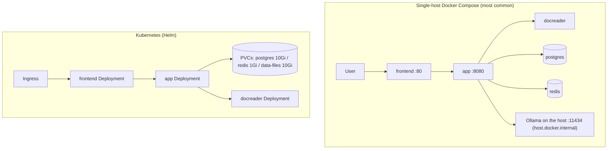

# Installation

> This is an English translation of the Chinese page [安装部署](../../01-getting-started/02-installation.md).
> The Chinese page is the primary version; if the two differ, the Chinese one is right.

Yuheng runs anywhere from a laptop to a Kubernetes cluster. This page covers Docker Compose (the standard stack and a development stack), building the images, the Makefile and scripts, and Helm.

## Deployment options

| Option | Entry point | Database | Queue / streams | When to use it |
| --- | --- | --- | --- | --- |
| Docker Compose (standard) | `docker-compose.yml` | ParadeDB (PostgreSQL) | Redis + Asynq | Self-hosting for a team; recommended. Images are built locally. |
| Docker Compose (development) | `docker-compose.dev.yml` | Same (only the infrastructure runs in containers) | Same | Local development: app and frontend run on the host |
| Helm | `helm/` | ParadeDB (bundled in the chart) | Redis (bundled in the chart) | Kubernetes >= 1.25. You build the images and push them to your own registry. |


## Requirements

- **Standard Docker deployment:** Docker 20.10+ and Docker Compose v2. Start with 4 CPU cores and 8 GB of RAM (docreader bundles LibreOffice and Playwright and is memory-hungry). Size the disk for your knowledge bases (the Postgres volume plus the `/data/files` volume). Optional components such as Langfuse need more memory.
- **Model service:** a local [Ollama](https://ollama.com) (default address `http://host.docker.internal:11434`; with `OLLAMA_OPTIONAL=true` an unreachable Ollama only logs a warning), or any OpenAI-compatible API.
- **Building from source:** Go 1.26, CGO (the DuckDB binding needs a C toolchain), Node.js + npm (frontend), Python 3.10 + uv (docreader).
- **Kubernetes:** >= 1.25.0 (`helm/Chart.yaml`).

## 1. Docker Compose, standard stack (docker-compose.yml)

> **This release does not publish Docker images.** Everything below builds the images on your machine. `docker compose pull` cannot fetch `magicyuan876/yuheng-*` images; do not use it.

Prerequisites: Docker with Compose v2, Node.js + npm (the frontend assets are built on the host first) and `git`.

```bash
git clone https://github.com/magicyuan876/Yuheng.git && cd Yuheng
cp .env.example .env
```

Edit `.env`. You must fill in `JWT_SECRET` and `SYSTEM_AES_KEY`: they are empty, and the server refuses to start while either is empty, too short or an old published example value. Also change `DB_PASSWORD` and `REDIS_PASSWORD`.

```bash
openssl rand -hex 32     # -> JWT_SECRET
openssl rand -hex 16     # -> SYSTEM_AES_KEY: exactly 32 bytes; 32 hex characters is enough
```

`SYSTEM_AES_KEY` encrypts API keys and other credentials stored in the database. If you lose it, that data cannot be recovered, so keep it safe.

Inside mainland China, set `APK_MIRROR_ARG=mirrors.tencent.com` in `.env` for faster image builds. `TZ` defaults to UTC.

Then build the frontend, build the images and start everything:

```bash
./scripts/build_frontend_dist.sh  # produces frontend/dist, which the frontend image needs
docker compose up -d --build      # builds the app / docreader / frontend images and starts the stack
docker compose ps                 # wait until every service is healthy or running
```

For collaborative documents (collab + draw.io) add the `docs` profile: `docker compose --profile docs up -d --build`, and fill in `YUHENG_COLLAB_URL`, `YUHENG_COLLAB_SHARED_SECRET` and the related settings from section K of `.env.example`.

Stop with `docker compose down` (adding `-v` also deletes the data volumes; be careful). `make start-all` (`scripts/start_all.sh`) is another entry point that also checks Ollama and creates a fallback `.env`, but by default it pulls images, so for this release use the commands above.

Once it is up, open `http://localhost` in a browser. That is the frontend (the port is `FRONTEND_PORT`, 80 by default). **A fresh deployment has no default account: the first account you register becomes the system administrator, and public registration closes after that** (set `DISABLE_REGISTRATION=false` to keep it open; see the [quick start](./03-quickstart.md)). The frontend's Nginx proxies `/api/` to the backend, so API calls also work at `http://localhost/api/v1`. The backend port (`APP_PORT`, 8080 by default) is published on 127.0.0.1 only; `curl http://localhost:8080/ready` confirms the backend, its database and migrations are ready.

By default, every published port except the frontend's is bound to the loopback address only. To serve anyone beyond the local machine, put a reverse proxy with TLS in front of the frontend, and first replace the default passwords in `.env` and RustFS's default account.

Before the first question can be answered you must also configure at least one chat model and one embedding model under Settings, Model Management; see the [quick start](./03-quickstart.md).

> Note: the `app` service uses `env_file: [.env]`, so a missing `.env` makes Compose fail to parse the file. `make docker-run` and `start_all.sh` create one from `.env.example` (or an empty file) as a fallback.

### Upgrading

Upgrading is also a local rebuild: update the source, rebuild the frontend and the images, then start. **Back up first.** Database migrations run automatically at start-up, and some of them are destructive and cannot be rolled back. For backup, restore and upgrade steps see [Backup and upgrade](../../01-getting-started/05-backup-and-upgrade.md) (Chinese).

```bash
git pull
./scripts/build_frontend_dist.sh
docker compose up -d --build
```

### Core services (started by default)

| Service | Image | Ports (host:container) | Depends on | Notes |
| --- | --- | --- | --- | --- |
| `frontend` | built locally, tagged `magicyuan876/yuheng-ui:${YUHENG_VERSION:-latest}` | `${FRONTEND_PORT:-80}:80` | app (healthy) | Nginx serves the SPA and proxies to app; `APP_HOST` / `APP_BACKEND_PORT` / `APP_SCHEME` can point at a remote backend |
| `app` | built locally, `magicyuan876/yuheng-app` | `${APP_PORT:-8080}:8080` | postgres (healthy), redis, docreader (healthy) | Go backend; mounts `./config/config.yaml` and the `data-files` volume; health check `GET /health` |
| `docreader` | built locally, `magicyuan876/yuheng-docreader` | `expose: 50051` only (not published to the host) | none | Document-parsing gRPC service; health check via `grpc_health_probe`; shares the `docreader-tmp` volume with app for images |
| `postgres` | `paradedb/paradedb:v0.22.2-pg17` | not published | none | ParadeDB = PostgreSQL 17 + BM25 and vector extensions; the retrieval engine |
| `redis` | `redis:7.0-alpine` | not published | none | `--appendonly yes --requirepass ${REDIS_PASSWORD}` |
| `rustfs` | `rustfs/rustfs` (pinned by digest) | `127.0.0.1:9000` (S3) / `127.0.0.1:9001` (console) | none | The default file storage (S3-compatible object store); see "Object storage" below. It starts even if `STORAGE_TYPE` points elsewhere. |

### Optional services and profiles

The retrieval engine is PostgreSQL itself (ParadeDB's `pg_search` for BM25, pgvector for vectors); there is no separate vector-database service. At start-up the server checks that the PostgreSQL it connects to has both the `vector` and `pg_search` extensions and refuses to start, with an explanation, if either is missing. So either use the ParadeDB image from `docker-compose.yml`, or install both extensions on your own PostgreSQL. Managed PostgreSQL from cloud vendors usually cannot install `pg_search` and does not work.

Enable a profile with `docker compose --profile <name> up -d --build`:

| Profile | Services | Ports | Purpose |
| --- | --- | --- | --- |
| `searxng` (part of `full`) | `searxng-init` + `searxng` | `127.0.0.1:8888` (`SEARXNG_BIND` / `SEARXNG_PORT`) | Self-hosted web search. Bound to loopback by default; rotate `SEARXNG_SECRET` before exposing it. |
| `docs` | `collab` + `drawio` | `${COLLAB_PORT:-1234}` / `${DRAWIO_PORT:-8087}` | Collaborative documents and draw.io. Needs the `YUHENG_COLLAB_*` settings in `.env` (section K of `.env.example`). |
| `neo4j` (part of `full`) | `neo4j` | 7474 / 7687 | Knowledge graph (`NEO4J_ENABLE=true`); default login `neo4j/password` |
| `dex` (part of `full`) | `dex` | 5556 | An OIDC identity provider for testing (config in `misc/dex-config.yaml`) |
| `langfuse` (part of `full`) | `langfuse-db-init`, `langfuse-clickhouse`, `langfuse-minio`, `langfuse-worker`, `langfuse-web` | 3000 (UI) / 9100, 9101 (its own MinIO) | A self-hosted Langfuse stack that reuses Yuheng's postgres (a new `langfuse` database) and redis (DB 1) |
| `odl-hybrid` | `odl-hybrid` | expose 5002 | OpenDataLoader/Docling hybrid PDF parsing backend (built locally only; use with `DOCREADER_ODL_HYBRID`) |
| `full` | `mcp` plus every service marked `full` above | mcp: `${MCP_PORT:-8082}:8000` | `mcp` is the standalone MCP server (`mcp-server/`) |

The `environment` section of the app container is the complete list of environment variables (database, object storage, docreader tuning, tenant policy, OIDC and more); see [Configuration](../../01-getting-started/04-configuration.md).

### Object storage (S3-compatible)

File storage has two backends: `s3` (the default; any S3-compatible service, and the RustFS bundled in Compose works out of the box) and `local` (a local directory). MinIO, RustFS, AWS S3, and Alibaba Cloud OSS, Tencent Cloud COS, Volcano Engine TOS and Huawei Cloud OBS all connect through `s3` and their S3-compatible endpoints; there are no vendor-specific providers.

There is one procedure. Set in `.env`:

```bash
STORAGE_TYPE=s3
S3_ENDPOINT=<S3-compatible endpoint; may be empty for AWS S3>
S3_REGION=<region, required>
S3_BUCKET_NAME=<bucket, required; created on first use if it does not exist>
S3_ACCESS_KEY=<access key>          # set both S3_ACCESS_KEY and S3_SECRET_KEY, or neither;
S3_SECRET_KEY=<secret key>          # with neither, the AWS default credential chain is used
S3_PATH_PREFIX=yuheng/              # optional object prefix
S3_USE_SSL=true                     # default true; only applies when the endpoint has no scheme
S3_ADDRESSING_STYLE=auto            # auto | path | virtual
```

With `S3_ADDRESSING_STYLE=auto`, an empty endpoint or an `amazonaws.com` endpoint uses virtual-hosted addressing and every other endpoint uses path style. Values per service:

| Service | Example `S3_ENDPOINT` | `S3_ADDRESSING_STYLE` |
| --- | --- | --- |
| RustFS (self-hosted, bundled in Compose) | `http://rustfs:9000` | `path` (`auto` also works) |
| MinIO (self-hosted) | `http://minio:9000` | `path` (`auto` also works) |
| AWS S3 | empty, or `https://s3.us-east-1.amazonaws.com` | `auto` |
| Alibaba Cloud OSS | `https://oss-cn-hangzhou.aliyuncs.com` | `virtual` (required) |
| Tencent Cloud COS | `https://cos.ap-guangzhou.myqcloud.com` | `virtual` (required) |
| Volcano Engine TOS | `https://tos-s3-cn-beijing.volces.com` | `virtual` (required) |
| Huawei Cloud OBS | `https://obs.cn-north-4.myhuaweicloud.com` | `virtual` (required) |
| Kingsoft Cloud KS3 | not verified; try its S3-compatible endpoint | not verified |

OSS, COS, TOS and OBS reject path-style requests, so set `virtual` explicitly. KS3 has not been tested and is not guaranteed.

Endpoints on private networks (such as `rustfs:9000` or an internal MinIO) are blocked by the SSRF check; add them to `SSRF_WHITELIST` or `SSRF_WHITELIST_EXTRA`. Compose already allows the `rustfs` service name.

**Using the bundled RustFS (default)**

`docker compose up -d --build` also starts RustFS and the app connects to it by default: endpoint `http://rustfs:9000`, region `us-east-1`, bucket `yuheng` (created on first use), credentials from `RUSTFS_ACCESS_KEY` / `RUSTFS_SECRET_KEY`. You do not need to configure storage in `.env`. To use a directory on the host instead, set `STORAGE_TYPE=local`; to use an external service, set the `S3_*` variables.

RustFS ports are bound to `127.0.0.1` only (adjust with `RUSTFS_BIND`, `RUSTFS_PORT` and `RUSTFS_CONSOLE_PORT`). The default login `rustfsadmin/rustfsadmin` is only for a first trial; change it with `RUSTFS_ACCESS_KEY` / `RUSTFS_SECRET_KEY` before real use.

> RustFS is still pre-1.0 (1.0.0-rc.5 at the time of writing), so the Compose image is pinned by digest. Take that into account for production: back up the data before upgrading the image, or switch to MinIO, AWS S3 or a cloud vendor's S3-compatible service.

File paths that start with `s3://` in existing knowledge bases stay valid; the old `minio://`, `cos://`, `tos://`, `oss://`, `ks3://` and `obs://` prefixes are no longer recognized.

## 2. Development mode (docker-compose.dev.yml + scripts/dev.sh)

The development stack puts only the **infrastructure** in containers (postgres, redis and docreader ports are all published to the host), and runs app and frontend on the host with hot reload:

```bash
make dev-start          # ./scripts/dev.sh start; add DEV_ARGS=--odl-hybrid / --neo4j / --dex / --full
make dev-app            # start the Go backend on the host (points DB_HOST / REDIS_ADDR at localhost)
make dev-frontend       # start the Vue dev server on the host
make dev-logs / dev-status / dev-stop / dev-restart
```

Differences from the standard stack:

- postgres (`5432`), redis (`6379`) and docreader (`50051`) are published to host ports so local processes can reach them directly;
- `dev.sh` loads `.env` and `.env.local` (the latter overrides the former) and supports `DEV_REMOTE_HOST` to point at remote infrastructure.

## 3. Building images (the docker/ directory)

| Dockerfile | Image | Notes |
| --- | --- | --- |
| `docker/Dockerfile.app` | `magicyuan876/yuheng-app` | Two stages: compile in `golang:1.26-bookworm` (`make build-prod`; `WITH_ANYDOC=1` by default links the in-process office parser, injects version info and pre-downloads the DuckDB extensions), then a `debian:12.12-slim` runtime layer (with the `migrate` tool, python3/node/uvx for stdio MCP, ffmpeg for ASR, and gosu to drop privileges). Entry point `scripts/docker-entrypoint.sh` fixes mount ownership and runs `./Yuheng` as `appuser`. `EXPOSE 8080`. |
| `docker/Dockerfile.docreader` | `magicyuan876/yuheng-docreader` | Python 3.10 with locked uv dependencies; generates protobuf; the runtime layer installs LibreOffice, OpenJDK 17, antiword, Playwright (webkit) and `grpc_health_probe`. The light build has no PaddleOCR. `EXPOSE 50051`. Supports an `APT_MIRROR` build argument. |
| `docker/Dockerfile.odl-hybrid` | `yuheng-odl-hybrid:local` | Installs `opendataloader-pdf[hybrid]` (Docling), listens on 5002, `--no-ocr` by default. Built locally only. |
| `frontend/Dockerfile` | `magicyuan876/yuheng-ui` | Run `./scripts/build_frontend_dist.sh` on the host first to produce `dist/`; the base is `nginx:1.30.3-alpine` pinned by digest. |

Build every image from source:

```bash
make build-images        # ./scripts/build_images.sh, options --app/--docreader/--frontend/--clean
# or one at a time:
make docker-build-app
make docker-build-docreader
make docker-build-frontend
```

## 4. Makefile targets for deployment

| Target | What it does |
| --- | --- |
| `make start-all` / `stop-all` | Start or stop the whole stack through `scripts/start_all.sh` (with an Ollama check and a `.env` fallback) |
| `make start-ollama` / `start-docker` | Start only Ollama / only the Docker services |
| `make docker-run` / `docker-stop` / `docker-restart` | Classic `docker-compose up/down/restart` (with the `.env` fallback) |
| `make build-images*` / `clean-images` | Build / remove images from source (`pull-images` tries to pull images, and this release has none to pull) |
| `make check-env` / `list-containers` / `show-platform` | Environment check (`scripts/check-env.sh` validates the required `.env` variables and the toolchain) / list containers / build platform (amd64/arm64 detected automatically) |
| `make migrate-up` / `migrate-down` / `migrate-version` / `migrate-create name=x` / `migrate-force version=n` / `migrate-goto version=n` | Database migrations (`scripts/migrate.sh`; inside the container `AUTO_MIGRATE=true` migrates at start-up) |
| `make dev-*` | Development mode (see above) |
| `make build` / `run` / `build-prod` | Build and run `cmd/server` locally (`build-prod` needs CGO and injects the version) |
| `make docs` / `install-swagger` | Generate Swagger docs (`http://localhost:8080/swagger/index.html`, disabled in release mode) |
| `make clean-db` | Delete the postgres / rustfs / redis data volumes (dangerous) |

## 5. Scripts in scripts/

| Script | Purpose |
| --- | --- |
| `scripts/start_all.sh` | One-shot start: `-o` (Ollama only), `-d` (Docker only), `-a` (all, default), `-s` (stop), `-c` (check environment), `-l` (list containers), `-p` (pull images). Detects Compose v1/v2 and sets `PLATFORM` from `uname -m`. |
| `scripts/dev.sh` | Development orchestration (see above); subcommands `start/stop/restart/logs/status/app/frontend` |
| `scripts/check-env.sh` | Validates the required `.env` variables (DB_*, STORAGE_TYPE, REDIS_ADDR, OLLAMA_BASE_URL and so on) and the Go/npm/Docker/Air toolchain |
| `scripts/build_images.sh` | Builds the images and injects the version (git tag / commit / build time); supports cross-architecture builds |
| `scripts/build_frontend_dist.sh` | Builds the static frontend assets in `frontend/dist` (a prerequisite of the frontend image) |
| `scripts/migrate.sh` | A wrapper around golang-migrate |
| `scripts/docker-entrypoint.sh` | The app container entry point (mount ownership fix plus gosu) |

## 6. Helm (helm/)

`helm/Chart.yaml`: apiVersion v2, chart name `yuheng`, `appVersion` follows the release (for example v0.1.0), Kubernetes >= 1.25.0 required.

The chart has five components: `app` (`magicyuan876/yuheng-app`), `frontend` (`magicyuan876/yuheng-ui`), `docreader`, `postgresql` (the ParadeDB image) and `redis` (`redis:7-alpine`), and can optionally enable `neo4j`. Because this release publishes no images, build them yourself, push them to your own registry, and override the `image.repository` values.

Key settings in `helm/values.yaml`:

```yaml
app:
  replicaCount: 1
  env:
    GIN_MODE: release
    RETRIEVE_DRIVER: postgres      # postgres only (ParadeDB + pgvector)
    STORAGE_TYPE: local            # local / s3 (any S3-compatible service)
    STREAM_MANAGER_TYPE: redis
postgresql:
  enabled: true
  persistence: { enabled: true, size: 10Gi }
redis:
  enabled: true
  persistence: { enabled: true, size: 1Gi }
dataFiles:
  persistence: { enabled: true, size: 10Gi }
secrets:                            # required, or reference an existing Secret with existingSecret
  dbPassword: ""
  redisPassword: ""
  jwtSecret: ""
  systemAesKey: ""                  # the 32-byte AES-256 master key
```

```bash
helm install yuheng ./helm -n yuheng --create-namespace \
  --set secrets.dbPassword=xxx --set secrets.redisPassword=xxx \
  --set secrets.jwtSecret=$(openssl rand -hex 32) --set secrets.systemAesKey=$(openssl rand -hex 16)
```

## 7. Running from source

```bash
# backend (needs local postgres/redis/docreader; see development mode)
go mod download
make build && ./Yuheng                       # or make build-prod

# frontend
cd frontend && npm ci && npm run dev          # development; npm run build produces dist/

# docreader
cd docreader && uv sync --locked && bash scripts/generate_proto.sh && python -m docreader.server  # see docreader/ for the exact entry point
```

Configuration file lookup order (`LoadConfig` in `internal/config/config.go`): the current directory, `./config`, `$HOME/.appname`, `/etc/appname/`; the file name is `config.yaml`.

## Common topologies



## Next

When the stack is up, read the [quick start](./03-quickstart.md) to configure models and ask your first question.
