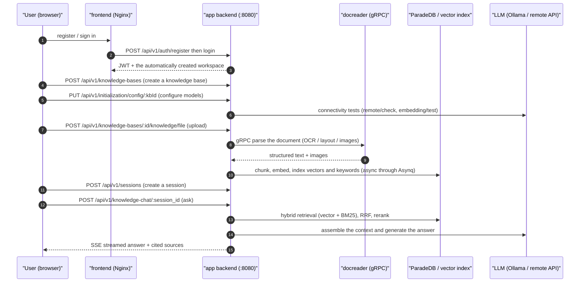

# Quick start

> This is an English translation of the Chinese page [快速上手](../../01-getting-started/03-quickstart.md).
> The Chinese page is the primary version; if the two differ, the Chinese one is right.

By the end of this page you will have a knowledge base that answers questions about your own documents: register an account, configure models, create a knowledge base, upload documents, ask a question and see an answer with its sources. Everything happens in the web UI. It takes ten to fifteen minutes if things go well, most of it spent waiting for documents to be parsed.

If you want to integrate through the API, skip to section 7, which has a chain of curl commands you can run as they are.

## 1. Before you start

- The stack is running: after following [Installation](./02-installation.md), the frontend is at `http://localhost` and the backend at `http://localhost:8080` (loopback only; a `.env` freshly created by `scripts/deploy.sh` uses `8088` for the frontend and `9527` for the backend).
- You have models to use: a local Ollama (from inside the containers, the default address is `http://host.docker.internal:11434`) or any OpenAI-compatible service, meaning a `base_url` and an `api_key`. You need at least one chat model and one embedding model.
- The backend is ready: `curl http://localhost:8080/ready` returns 200 (`/health` only says the process is alive; `/ready` also checks the database, Redis and the migration state).

## 2. Register and sign in

The first visit lands on the sign-in page. Registration is a tab on the same page, and it is only shown while registration is open (the frontend decides from `/auth/config`). There is no built-in default account:

- **On a fresh deployment, the first account you register becomes the system administrator of the whole deployment** and creates the deployment's default workspace (the registration page shows an extra "workspace name" field at that point, defaulting to "Default Workspace"; you are its Owner). After that, public registration closes automatically and other people join by invitation, or you create their accounts under Settings, Users & workspaces, placing them in the workspace as you do.
- To keep registration open, set `DISABLE_REGISTRATION=false`. To close it from the start (accounts are created some other way), set `DISABLE_REGISTRATION=true`. When it is not set, the default `auto` mode applies: registration is open only until the first user exists. A system administrator can also change the registration mode after signing in, under Settings, System Settings (key `auth.registration_mode`; it takes effect immediately, no restart, and the database value takes precedence over the environment variable).

Worth knowing:

- Usernames are 2 to 50 characters. The registration page requires a password of 8 to 32 characters with letters and digits (a direct call to `POST /auth/register` only checks for at least 6, but use 8 or more anyway).
- To invite members, sign in and send invitations under Settings, Member Management (an in-app invitation, or an invitation link). Invited people register through the invitation and are not affected by the registration switch above.
- Registration only creates an account, never a workspace: anyone who registers after the first account (for example with `DISABLE_REGISTRATION=false`) signs in to a "your account is not in any workspace yet" page and needs a workspace administrator's invitation, or a system administrator to add them, before they can continue. One company normally needs just this one default workspace with any number of knowledge bases in it; only a system administrator can create further workspaces.

::: tip Workspace Owner is not the same as System Administrator
These are two different kinds of identity and are easy to confuse:

- **Workspace Owner:** the highest role inside one workspace. It manages that workspace's members, models and knowledge bases.
- **System Administrator:** a platform-level identity that manages the whole deployment: global system settings, the task queue, platform API keys, the cross-workspace audit log and resetting user passwords. It belongs to no workspace.

The first account to register has both. Add further system administrators under Settings, Users & workspaces. If a deployment already has users but no system administrator (for example after upgrading from an older version), set `YUHENG_BOOTSTRAP_SYSTEM_ADMIN_EMAIL=<email of a registered account>` on the app service and restart. On start-up that user is promoted to system administrator; the variable has no effect once a system administrator exists. See [Tenants, users and authorization](../../03-features/01-tenant-auth.md) (Chinese).
:::

## 3. Configure models and create a knowledge base

Q&A needs models first: **at least one chat model (LLM) and one embedding model**. Models are configured at the workspace level, and each knowledge base then picks from them.

1. Open Settings, Model Management, and click Add model. Choose the model type (chat / Embedding / ReRank / vision / speech) and the source (a remote API or a local Ollama), enter the model name, Base URL and API key, and use Test connection to confirm it works before saving.
2. Go back to the Knowledge Bases page and create one. Give it a name and choose the type: Document (`document`, a normal document library) or Q&A (`faq`, a question-and-answer library).
3. Under Model Configuration, pick the models for this knowledge base:
   - **Chat model (LLM):** used for summaries and for generating answers.
   - **Embedding model:** turns documents into vectors. **Do not change it after the knowledge base is created**; changing it means rebuilding the index.
   - Everything else (Rerank, image understanding VLM, speech recognition ASR, knowledge-graph extraction, question pre-generation) can stay off for now and be added later.

::: tip The most common trap with a local Ollama
The backend runs in a container, so `http://localhost:11434` cannot reach Ollama on the host. Use `http://host.docker.internal:11434`.
:::

## 4. Upload documents

Open the knowledge base, drag files into the upload area or paste a web URL. The upload confirmation dialog lets you set tags and parsing options for the batch.

Supported formats include PDF, Word, Excel, PPT, Markdown, HTML, EPUB, images, audio and video; see [Document parsing](../../03-features/03-document-parsing.md) (Chinese) for the full list.

After upload, documents are parsed asynchronously. The status goes `pending → processing → finalizing → completed`. Scanned PDFs and large files are slower, and the list refreshes progress live.

You are the owner of the documents you upload. When knowledge health later finds that one duplicates another document, is due for review, or is cited by an answer someone marked not helpful, the problem comes to you. The owner can be transferred from the document's detail view.

## 5. Ask a question

Open the chat page, pick the knowledge base and ask. Yuheng retrieves relevant passages and hands them to the language model; the answer streams in with its sources, and a click on a citation jumps back to the original text. Below the answer you can mark it helpful or not helpful; "not helpful" is collected on the cited documents and taken to their owners to check.

That completes the smallest working loop.

## 6. Where to go next

- **Keep the knowledge right:** knowledge health finds duplicate and divergent documents on its own; set a review period under the knowledge base's Basic Info settings and documents nobody has confirmed in that time are brought to their owners. Problems assigned to you appear in the to-do button at the top right. See [Knowledge health](../../03-features/22-knowledge-health.md) (Chinese).
- **Write in Yuheng itself:** with online documents enabled, bind a document space to a knowledge base and pages flow into it as you write. See [Online documents](../../03-features/07-docs.md) (Chinese).
- **Turn a knowledge base into a Wiki:** let the LLM generate linked Wiki pages from the knowledge base, with human revision and version history. See [Wiki](../../03-features/14-wiki.md) (Chinese).
- **Improve answers:** turn on Rerank and tune chunk sizes. See [Chunking](../../03-features/04-chunking.md) and [Retrieval engines](../../03-features/05-retrieval-engines.md) (Chinese).
- **Bring knowledge in automatically:** connect Feishu / Lark, Notion, Yuque, RSS, GitLab or Tencent ima and sync on a schedule. See [Data sources](../../03-features/10-datasource.md) (Chinese).
- **Let agents use it:** connect retrieval, Q&A and writing knowledge to Claude Desktop, Cursor and other clients through MCP, or integrate with the `yuheng` CLI or the Go SDK. See [MCP](../../03-features/08-mcp.md) and [CLI](../../05-clients/02-cli.md) (Chinese).

## 7. The same chain through the API

Every step above has an endpoint under the common prefix `/api/v1`. The following can be run as it is:

```bash
BASE=http://localhost:8080/api/v1

# 1) Register (on a fresh deployment the first account becomes the system
#    administrator and registration then closes; username >= 2 chars, password >= 6 chars)
curl -s -X POST $BASE/auth/register -H "Content-Type: application/json" \
  -d '{"username":"admin","email":"admin@example.com","password":"pass123456"}'

# 2) Sign in; keep the JWT and the current workspace ID
LOGIN=$(curl -s -X POST $BASE/auth/login -H "Content-Type: application/json" \
  -d '{"email":"admin@example.com","password":"pass123456"}')
TOKEN=$(echo "$LOGIN" | jq -r '.token')
TENANT_ID=$(echo "$LOGIN" | jq -r '.active_tenant.id')
AUTH="Authorization: Bearer $TOKEN"

# 3) Create a knowledge base
KB_ID=$(curl -s -X POST $BASE/knowledge-bases -H "$AUTH" -H "Content-Type: application/json" \
  -d '{"name":"My knowledge base","description":"demo","type":"document"}' | jq -r '.data.id')

# 4) Register the models (local Ollama as the example; for a remote model change source and put base_url / api_key in parameters)
LLM_ID=$(curl -s -X POST $BASE/models -H "$AUTH" -H "Content-Type: application/json" \
  -d '{"name":"qwen3:8b","type":"KnowledgeQA","source":"local","parameters":{}}' | jq -r '.data.id')
EMB_ID=$(curl -s -X POST $BASE/models -H "$AUTH" -H "Content-Type: application/json" \
  -d '{"name":"bge-m3","type":"Embedding","source":"local","parameters":{"embedding_parameters":{"dimension":1024}}}' | jq -r '.data.id')

# 5) Point the knowledge base at those models and set chunking
curl -s -X PUT $BASE/initialization/config/$KB_ID -H "$AUTH" -H "Content-Type: application/json" -d '{
  "llmModelId":"'$LLM_ID'","embeddingModelId":"'$EMB_ID'",
  "documentSplitting":{"chunkSize":512,"chunkOverlap":50,"separators":["\n\n","\n","。"]}}'

# 6) Upload a document (multipart, field name "file")
curl -s -X POST $BASE/knowledge-bases/$KB_ID/knowledge/file -H "$AUTH" \
  -F "file=@./demo.pdf"
# Poll the parse status: GET /knowledge-bases/$KB_ID/knowledge until parse_status=completed

# 7) Create a session
SESSION_ID=$(curl -s -X POST $BASE/sessions -H "$AUTH" -H "Content-Type: application/json" \
  -d '{"title":"First conversation"}' | jq -r '.data.id')

# 8) Ask a question (streamed over SSE)
curl -N -X POST $BASE/knowledge-chat/$SESSION_ID -H "$AUTH" -H "Content-Type: application/json" \
  -d '{"query":"What is this document about?","knowledge_base_ids":["'$KB_ID'"]}'

# 9) Retrieve only, without generating an answer (structured JSON)
curl -s -X POST $BASE/knowledge-search -H "$AUTH" -H "Content-Type: application/json" \
  -d '{"query":"keyword","knowledge_base_ids":["'$KB_ID'"]}'
```

The chat request body also accepts `knowledge_ids` (restrict to specific documents), `web_search_enabled`, `summary_model_id`, and `images` / `attachment_uploads` (multimodal attachments). See [API reference: sessions and chat](../../04-api/02-api-chat.md) (Chinese) for the details.

The `/api/v1` API may still change between 0.x releases.

### Three ways to authenticate

| Method | Header | Use |
| --- | --- | --- |
| JWT | `Authorization: Bearer <token>` | Browsers and interactive calls; issued by the sign-in endpoint |
| API key | `X-API-Key: <key>` | Server-side integrations and agents; created in workspace settings or with `POST /api/v1/tenants/:id/api-keys`; supports fine-grained capabilities (`retrieve`, `chat`, `ingest`, `manage_kbs` and so on) and a knowledge-base allow-list |
| Target workspace | `X-Tenant-ID: <id>` | A user with several workspaces selects the current one |

For server-side integrations prefer an API key over a JWT:

```bash
# Create an API key as the Owner (TENANT_ID from the sign-in response above)
curl -s -X POST $BASE/tenants/$TENANT_ID/api-keys -H "$AUTH" -H "Content-Type: application/json" \
  -d '{"name":"ci-bot","full_access":true}'
# Afterwards use it on every request:
curl -s $BASE/knowledge-bases -H "X-API-Key: <the key returned at creation>"
```

### Endpoints behind the setup steps

Each step of the setup in the UI has its own endpoint, which you can reuse when building your own admin console:

| Step | Endpoint | Notes |
| --- | --- | --- |
| Read the current configuration | `GET /api/v1/initialization/config/:kbId` | Returns the llm / embedding / rerank / multimodal / documentSplitting / nodeExtract / questionGeneration sections and `hasFiles` (once a knowledge base has files, the embedding model cannot be changed) |
| Detect Ollama | `GET /api/v1/initialization/ollama/status`, `GET /api/v1/initialization/ollama/models` | Checks Ollama availability and installed models |
| Download an Ollama model | `POST /api/v1/initialization/ollama/models/download` then `GET /api/v1/initialization/ollama/download/progress/:taskId` | Asynchronous download; poll for progress |
| Test a remote model | `POST /api/v1/initialization/remote/check`, `/initialization/embedding/test`, `/initialization/rerank/check`, `/initialization/asr/check`, `/initialization/multimodal/test` | Connectivity checks before saving |
| Trial knowledge-graph extraction | `POST /api/v1/initialization/extract/text-relation` (with `fabri-text` / `fabri-tag` to generate samples) | Previews entity and relation extraction |
| Save the configuration | `POST /api/v1/models` (register the models), then `PUT /api/v1/initialization/config/:kbId` | Creates the Model records first, then writes their IDs and the chunking settings into the knowledge base |

A model's `source` is `local` (Ollama) or a remote vendor identifier (`openai`, `deepseek`, `aliyun`, `zhipu`, `siliconflow` and so on).

### What happens along the chain



## 8. If you are stuck

| Symptom | What to check |
| --- | --- |
| The app container keeps restarting and the frontend keeps waiting | `docker compose logs app`. Most often `JWT_SECRET` or `SYSTEM_AES_KEY` is empty, too short or an example value; the log names the variable and the command to generate it. Next most likely is a failed database migration; see [Backup and upgrade](../../01-getting-started/05-backup-and-upgrade.md) (Chinese). |
| A document stays in `processing` after upload | `docker logs Yuheng-docreader`. Large files are limited by the upload limit (`MAX_FILE_SIZE_MB`, default 50, adjustable by a system administrator in the system settings) and `YUHENG_DOCUMENT_PROCESS_TIMEOUT` (default 2h). |
| Ollama detection fails during setup | Inside the containers the default address is `http://host.docker.internal:11434` (`OLLAMA_BASE_URL`). On Linux make sure `extra_hosts: host.docker.internal:host-gateway` took effect. |
| Answers have no citations or retrieval returns nothing | Make sure the knowledge is `completed`; lower `vector_threshold`; check that the embedding model is the one the knowledge base was created with. |
| The registration tab is gone | The default `auto` mode only opens registration until the first user exists, so the tab hides after the first account. Check `registration_open` in `GET /api/v1/auth/config`. The value can also come from the database setting under Settings, System Settings, not only from `DISABLE_REGISTRATION`. Invitation links and first OIDC sign-in are separate routes and are not affected. |
| API key requests return 403 | The key's capabilities do not include the one needed, or its `knowledge_base_ids` allow-list does not contain the target knowledge base. |

Next: for details see [Configuration](../../01-getting-started/04-configuration.md) (Chinese), and for how the system works see the [overall architecture](../../02-architecture/01-overview.md) (Chinese).
